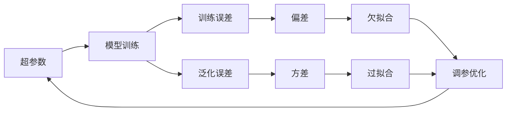

# 一切皆是映射：深度学习的调参艺术与实践窍门

关键词：深度学习, 调参, 超参数优化, 数学模型, 实践经验

## 1. 背景介绍
### 1.1  问题的由来
深度学习作为人工智能领域最前沿、最热门的技术之一,其强大的特征学习和表示能力使其在计算机视觉、自然语言处理、语音识别等诸多领域取得了突破性进展。然而,训练一个高性能的深度学习模型往往需要精细的调参过程,面对众多的超参数和训练技巧,即便是有经验的研究者也常常感到无从下手。如何在茫茫参数空间中找到最优的超参数组合,成为一个亟待解决的关键问题。

### 1.2  研究现状
目前针对深度学习调参优化的研究大致可分为以下几类:

1. 启发式搜索:通过人工设计的搜索策略来遍历参数空间,代表性方法有网格搜索、随机搜索等。
2. 贝叶斯优化:通过构建目标函数的概率模型,不断地选择最有希望的参数进行评估,逐步逼近全局最优。
3. 进化算法:借鉴生物进化论思想,通过对参数种群迭代进行选择、交叉、变异等操作来寻找最优解。
4. 强化学习:将调参问题建模为一个序贯决策过程,通过学习最优策略来自动搜索参数空间。
5. 元学习:从历史任务中学习并迁移知识,快速适应新任务,实现参数的自动配置。

尽管上述方法在一定程度上提高了调参效率,但在实践中仍面临诸多挑战,如计算开销大、泛化能力不足、先验知识缺乏等,离终极目标还有很大差距。

### 1.3  研究意义
深入研究深度学习的调参艺术具有重要意义:

1. 提升模型性能。精细的参数调优是深度学习模型达到极致性能的关键。
2. 加速开发流程。高效的调参方法可大幅减少反复试错的时间,加快模型迭代。  
3. 降低使用门槛。自动化、智能化的调参工具让非专家用户也能轻松上手深度学习。
4. 理论价值。调参优化研究有助于加深对深度学习本质的理解,促进理论创新。

总之,深度学习调参研究事关深度学习技术的落地普及,其重要性不言而喻。

### 1.4  本文结构
本文将系统阐述深度学习调参的核心概念、优化算法、数学原理和实战经验,内容组织如下:

- 第2节介绍深度学习调参的核心概念及其内在联系
- 第3节重点讲解几种主流的调参优化算法原理和操作步骤
- 第4节从数学角度对调参问题进行建模分析,并辅以案例讲解
- 第5节通过代码实例演示调参算法的具体实现和使用方法
- 第6节讨论调参技术在实际场景中的应用情况
- 第7节推荐一些调参相关的学习资源、开发工具等
- 第8节总结全文,展望调参优化技术的未来发展趋势和挑战
- 第9节附录,解答一些常见问题

## 2. 核心概念与联系
在深入探讨深度学习调参之前,我们有必要厘清其中的一些核心概念:

- 超参数:控制模型学习过程的参数,如学习率、批量大小、正则化系数等,需要人工设定。
- 训练误差:模型在训练集上的损失函数值,反映模型对已知样本的拟合程度。
- 泛化误差:模型在测试集上的损失函数值,反映模型对未知样本的预测能力。
- 过拟合:模型过度拟合训练数据,泛化性能较差,在测试集上表现不佳。
- 欠拟合:模型对训练数据的拟合程度不够,无法很好地捕捉数据的内在模式。  
- 偏差:模型输出与真实值之间的差异,反映模型本身的拟合能力。
- 方差:模型输出对训练集变化的敏感程度,反映数据扰动下模型的稳定性。

这些概念之间存在着错综复杂的联系,例如:

- 超参数的选择直接影响模型的训练误差和泛化误差。
- 过拟合对应高方差低偏差,欠拟合对应高偏差低方差,二者需要权衡。
- 减小训练误差(如增大模型复杂度)可能导致过拟合,泛化误差反而升高。
- 交叉验证有助于在减小泛化误差(提高泛化能力)和减小训练误差(提高拟合能力)之间取得平衡。

总之,深度学习调参的终极目标就是找到超参数的最优组合,在满足训练误差和泛化误差最小化的同时,权衡偏差和方差,避免过拟合和欠拟合。这需要对各种因素进行整体考虑和系统权衡。



## 3. 核心算法原理 & 具体操作步骤
### 3.1  算法原理概述
常见的深度学习调参算法可分为以下几大类:

1. 网格搜索(Grid Search):穷举搜索参数所有可能的组合,对每个组合训练评估模型,返回性能最佳的参数组合。
2. 随机搜索(Random Search):随机采样参数组合进行评估,通过大量随机实验找到最优参数。
3. 贝叶斯优化(Bayesian Optimization):通过构建参数与性能的概率模型,基于后验分布选择下一组最有潜力的参数进行评估,不断更新先验,逐步逼近全局最优。
4. 进化算法(Evolutionary Algorithm):从初始参数种群出发,迭代进行选择、交叉、变异,优胜劣汰,最终收敛到最优参数。
5. 强化学习(Reinforcement Learning):将调参看作一个序贯决策过程,通过学习最优搜索策略实现自动调参。
6. 元学习(Meta-Learning):通过学习历史任务获得先验知识,指导新任务的参数优化,实现快速自适应。

### 3.2  算法步骤详解
以贝叶斯优化为例,其基本步骤如下:

1. 定义搜索空间:确定待优化的超参数及其取值范围。
2. 选择概率模型:一般采用高斯过程等概率模型来拟合目标函数(如验证集误差)。
3. 选择采集函数:如改进的期望提升(EI)准则,权衡探索和利用,选择下一个最有潜力的参数点。
4. 更新先验:将新评估的参数点加入训练集,更新概率模型。
5. 迭代优化:重复步骤3、4,直到满足停止条件(如达到预算或无显著提升)。
6. 返回结果:输出找到的最优参数组合及其性能评估结果。

```python
def bayes_opt(f, pbounds, init_points=3, n_iter=50, acq='ei', kappa=2.576):
    """贝叶斯优化
    
    Args:
        f: 待优化的目标函数
        pbounds: 参数的取值范围
        init_points: 初始随机采样点数
        n_iter: 迭代次数
        acq: 采集函数类型
        kappa: 探索因子
        
    Returns:
        dict: 最优参数及其目标函数值
    """
    optimizer = BayesianOptimization(f=f, pbounds=pbounds, verbose=2, random_state=1)
    
    optimizer.maximize(init_points=init_points, n_iter=n_iter, acq=acq, kappa=kappa)
    
    print(optimizer.max)
    
    return optimizer.max
```

### 3.3  算法优缺点
各类调参算法的优缺点对比如下:

| 算法 | 优点 | 缺点 |
|:----:|:----:|:----:|
| 网格搜索 | 简单易用,易于并行 | 计算开销大,维度灾难 |
| 随机搜索 | 实现简单,相对高效 | 收敛速度慢,需要大量实验 |
| 贝叶斯优化 | sample efficient,可处理黑盒目标函数和非凸问题 | 计算复杂度高,对先验和采集函数敏感 |
| 进化算法 | 通用性强,鲁棒性好,易于并行  | 迭代次数多,计算量大 |
| 强化学习 | 端到端,适应动态环境 | 训练不稳定,样本效率低 |
| 元学习 | 泛化能力强,少样本学习 | 计算开销大,元知识获取困难 |

### 3.4  算法应用领域
调参优化算法在深度学习的各个领域都有广泛应用,例如:

- 计算机视觉:如何选择CNN的层数、卷积核大小、池化方式等超参数。
- 自然语言处理:如何选择RNN的隐藏层维度、Attention的类型、Dropout概率等。
- 语音识别:如何选择声学模型的帧长、跳数、频谱类型等。
- 推荐系统:如何选择Embedding的维度、负采样的数量、L2正则化系数等。

此外,调参技术在强化学习、对抗生成等前沿领域也有重要应用。总之,调参优化已成为深度学习研究和应用不可或缺的重要环节。

## 4. 数学模型和公式 & 详细讲解 & 举例说明
### 4.1  数学模型构建
我们可以将深度学习调参问题抽象为一个数学优化问题。记深度学习模型为$f(x;\theta)$,其中$x$为输入,$\theta$为模型参数。记训练集为$D={(\mathbf{x}_i,y_i)}_{i=1}^N$,训练误差为$\mathcal{L}(\theta;D)$。引入正则化项$\mathcal{R}(\theta)$控制模型复杂度。记验证集为$D'$,泛化误差为$\mathcal{L}'(\theta;D')$。则调参的目标就是求解以下优化问题:

$$
\theta^*,\lambda^* = \arg\min_{\theta,\lambda} \mathcal{L}(\theta;D) + \lambda\mathcal{R}(\theta) \\
\mathrm{s.t.}  \mathcal{L}'(\theta^*;D') \leq \epsilon
$$

其中$\lambda$为正则化系数,$\epsilon$为泛化误差容忍度。上式表示在满足泛化误差约束的条件下,求训练误差和正则化项加权和的最小值,以得到最优模型参数$\theta^*$和正则化系数$\lambda^*$。这是一个带约束的优化问题。

若改用贝叶斯优化求解,则相当于最大化采集函数$\alpha$:

$$
\theta^* = \arg\max_{\theta} \alpha(\theta|\mathcal{D}_t)
$$

其中$\mathcal{D}_t=\{(\theta_i,y_i)\}_{i=1}^t$为前$t$轮迭代得到的参数-性能数据。常见的采集函数如改进的期望提升(EI):

$$
\alpha_{EI}(\theta) = (\mu(\theta)-y^*-\xi) \Phi(Z) + \sigma(\theta)\phi(Z)
$$

其中$\mu(\theta)$和$\sigma(\theta)$分别为高斯过程给出的均值和标准差,$y^*$为当前最优性能,$\xi$为探索因子,$Z=\frac{\mu(\theta)-y^*-\xi}{\sigma(\theta)}$,$\Phi$和$\phi$分别为标准正态分布的CDF和PDF。

### 4.2  公式推导过程
以下推导贝叶斯优化中EI采集函数的数学形式。

首先,我们希望选择使改进$I(\theta)=\max\{0,y(\theta)-y^*\}$最大化的$\theta$。改进的期望值为:

$$
\begin{aligned}
\alpha_{EI}(\theta) &= \mathbb{E}[I(\theta)] \\
&= \int_{-\infty}^{\infty} \max\{0,y-y^*\} p(y|\