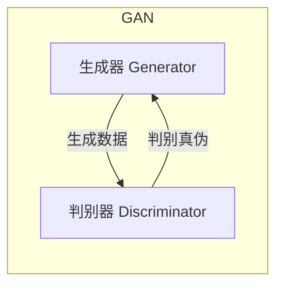

好的,我会按照您的要求,以专业的技术语言撰写一篇关于生成对抗网络(GAN)原理剖析的深度博客文章。文章将遵循您提供的结构模板,内容全面、条理清晰,并尽量使用简明扼要的语言解释核心概念,同时提供实例分析和代码实现细节。此外,我会尽最大努力绘制核心原理和架构流程图。以下是正文:

# 一切皆是映射:生成对抗网络(GAN)原理剖析

## 1. 背景介绍

### 1.1 问题的由来

在机器学习和计算机视觉领域,数据是驱动模型学习和预测的关键要素。传统的监督学习方法需要大量高质量的标注数据作为训练集输入,但是获取这些标注数据的过程通常代价高昂且耗时。因此,如何高效地从原始未标注数据中生成新的逼真数据样本,成为了机器学习研究的一个重要课题。

生成式模型(Generative Model)应运而生,旨在从训练数据中学习数据分布,并生成新的逼真数据样本。然而,由于现实世界的数据分布通常是高维、复杂、多modal的,传统生成模型如高斯混合模型、受限玻尔兹曼机等在建模能力上存在局限性。

### 1.2 研究现状  

2014年,来自蒙特利尔大学的Ian Goodfellow等人提出了一种全新的生成模型 - 生成对抗网络(Generative Adversarial Networks, GAN),开启了生成式模型的新纪元。GAN通过对抗训练的思路,使生成模型和判别模型相互博弈,相互补充,最终达到以无监督的方式从噪声样本中生成逼真数据的目的。

自从被提出以来,GAN理论和应用都取得了长足的进步,在图像生成、语音合成、机器翻译等领域展现出巨大潜力。不过,GAN训练的不稳定性、模式坍缩、评估指标缺失等问题也成为了研究的重点和难点。

### 1.3 研究意义

GAN作为一种全新的生成模型框架,具有以下重要意义:

1. 突破性地解决了经典生成模型在复杂数据上的局限,大幅提高了生成质量。
2. 无监督学习的思路有望减轻数据标注的成本瓶颈,推动人工智能发展。
3. 模型通用性强,可广泛应用于图像、语音、自然语言等多个领域。
4. 对抗训练思想为机器学习注入新的活力,激发了诸多新模型和新方法。

因此,深入理解GAN的核心原理和技术细节,对于推动人工智能和机器学习研究具有重要意义。

### 1.4 本文结构  

本文将全面深入地剖析GAN的核心原理、训练过程、数学模型以及代码实现细节,同时讨论GAN在实际应用中的场景和挑战,并对GAN的发展趋势进行展望。

具体来说,本文将包括以下主要内容:

- GAN的核心概念、基本原理和关键点
- GAN的核心算法流程及数学模型推导
- 基于MNIST数据集的GAN实例项目实践
- GAN在图像生成、语音合成等领域的应用现状
- GAN发展趋势分析和面临的主要挑战
- GAN学习资源、开发工具和相关论文推荐

## 2. 核心概念与联系

生成对抗网络(GAN)是一种通过对抗过程进行训练的生成模型,其核心思想是:

**生成器(Generator)网络G努力生成逼真的数据样本,试图欺骗判别器(Discriminator)网络D;而判别器D则努力区分生成器G生成的数据和真实数据,从而检测生成器G的伪造能力。**

在这个minimax对抗博弈过程中,生成器G和判别器D相互对抗、相互促进,最终达到生成器G能够生成逼真数据分布的目标。

对于生成器G来说,目标是最小化判别器D判别为"假"的概率:

$$\underbrace{\mathbb{E}_{x\sim p_{data}(x)}[\log D(x)]}_{\text{最大化判别为真的概率}} + \underbrace{\mathbb{E}_{z\sim p_z(z)}[\log(1-D(G(z)))]}_{\text{最小化判别为假的概率}}$$

而对于判别器D来说,目标是最大化判别真实数据和生成数据的能力:

$$\underbrace{\mathbb{E}_{x\sim p_{data}(x)}[\log D(x)]}_{\text{最大化判别为真的概率}} + \underbrace{\mathbb{E}_{z\sim p_z(z)}[\log(1-D(G(z)))]}_{\text{最大化判别为假的概率}}$$

通过交替优化生成器G和判别器D的目标函数,两者相互对抗、相互学习,最终达到生成器G生成逼真数据分布的目的。

值得注意的是,GAN的核心思想源于博弈论和最小化两个玩家的最大化策略,这种思路为无监督学习和生成式模型注入了新的活力。

## 3. 核心算法原理及具体操作步骤

### 3.1 算法原理概述

GAN的核心算法原理可以概括为以下几点:

1. **数据映射**: 生成器G将潜在空间的噪声z映射到数据空间的样本G(z),旨在生成逼真的数据样本。
2. **真伪判别**: 判别器D将真实数据x和生成数据G(z)作为输入,输出判别为真实数据的概率D(x)和D(G(z))。
3. **对抗训练**: G和D相互对抗,G通过最小化log(1-D(G(z)))来生成更逼真的数据;D通过最大化log D(x)和log(1-D(G(z)))来提高判别能力。
4. **交替优化**: 在每一次迭代中,先固定G优化D,再固定D优化G,两者相互促进、相互学习。

算法的目标是找到一个纳什均衡解,使得生成器G生成的数据分布p_g(x)等价于真实数据分布p_data(x)。

### 3.2 算法步骤详解

GAN的训练过程可以具体分为以下几个步骤:

1. **初始化**: 初始化生成器G和判别器D的参数。
2. **采样噪声数据**: 从噪声先验分布p_z(z)中采样噪声数据z。
3. **生成器前向传播**: 将噪声数据z输入生成器G,得到生成数据G(z)。
4. **判别器判别**: 将真实数据x和生成数据G(z)分别输入判别器D,得到判别结果D(x)和D(G(z))。
5. **计算损失函数**:
    - 判别器损失: $L_D = -\mathbb{E}_{x\sim p_{data}(x)}[\log D(x)] - \mathbb{E}_{z\sim p_z(z)}[\log(1-D(G(z)))]$
    - 生成器损失: $L_G = -\mathbb{E}_{z\sim p_z(z)}[\log D(G(z))]$
6. **反向传播和优化**:
    - 固定生成器G,仅更新判别器D的参数,使D朝着最小化$L_D$的方向更新。
    - 固定判别器D,仅更新生成器G的参数,使G朝着最小化$L_G$的方向更新。
7. **重复训练**: 重复上述3-6步骤,直到模型收敛或达到训练轮数上限。

需要注意的是,在实际训练中,通常还需要一些技巧和trick来稳定GAN的训练过程,例如特征匹配、梯度惩罚等。

### 3.3 算法优缺点

**优点**:

1. 生成质量高:GAN能够生成高质量、逼真的数据样本,突破了传统生成模型的局限。
2. 无监督学习:GAN不需要标注数据,可以从未标注的原始数据中学习数据分布。
3. 通用性强:GAN可以广泛应用于图像、语音、自然语言处理等多个领域。
4. 思路创新:对抗训练思想为无监督学习和生成模型注入了新的活力。

**缺点**:

1. 训练不稳定:GAN的训练过程容易出现模式坍缩、梯度消失、生成质量震荡等问题。
2. 缺乏评估指标:目前缺乏统一的评估指标来衡量GAN生成样本的质量。
3. 收敛性难证明:GAN训练的数学收敛性目前缺乏理论证明支持。
4. 模型复杂:GAN结构相对复杂,需要同时训练生成器和判别器两个深度网络。

### 3.4 算法应用领域

GAN因其强大的生成能力,在多个领域展现出广阔的应用前景:

1. **图像生成**: 生成逼真的人脸、物体、场景等图像数据。
2. **图像编辑**: 实现图像风格迁移、超分辨率重建、图像补全等编辑任务。
3. **语音合成**: 基于GAN生成逼真、富有表现力的语音数据。
4. **自然语言处理**: 用于文本生成、机器翻译、对话系统等任务。
5. **科学计算**: 用于分子结构构建、气候模拟等科学计算领域。
6. **计算机图形学**: 生成高质量的3D模型、动画、特效等。

总的来说,GAN为人工智能系统生成逼真数据提供了一种全新的无监督学习范式,有望在多个领域发挥重要作用。

## 4. 数学模型和公式详细讲解及举例说明

### 4.1 数学模型构建

为了形式化地描述GAN的优化目标,我们需要构建一个合适的数学模型。GAN的基本思想是,生成器G将潜在空间的噪声z映射到数据空间的样本G(z),而判别器D则努力区分真实数据x和生成数据G(z)。

具体来说,我们定义:

- 真实数据x的分布为$p_{data}(x)$
- 噪声z的先验分布为$p_z(z)$
- 生成器G将噪声z映射到数据空间的分布为$p_g(x)$

理想情况下,我们希望生成器G学习到的分布$p_g(x)$等价于真实数据分布$p_{data}(x)$。

为了达到这一目标,GAN构建了一个minimax游戏,生成器G和判别器D相互对抗,最终达到一个纳什均衡(Nash Equilibrium)。形式化地,GAN的目标函数可以表示为:

$$\min_G \max_D V(D,G) = \mathbb{E}_{x\sim p_{data}(x)}[\log D(x)] + \mathbb{E}_{z\sim p_z(z)}[\log(1-D(G(z)))]$$

其中,

- $\mathbb{E}_{x\sim p_{data}(x)}[\log D(x)]$ 表示真实数据被判别为真的期望
- $\mathbb{E}_{z\sim p_z(z)}[\log(1-D(G(z)))]$ 表示生成数据被判别为假的期望

判别器D的目标是最大化这个值,即最大化判别真实数据和生成数据的能力。而生成器G的目标是最小化这个值,即让判别器D尽可能无法区分真伪数据。

在理想状态下,当$p_g=p_{data}$时,判别器D无法完美区分真伪数据,此时两个期望的总和将等于$\log(0.5)$,达到一个纳什均衡解。

### 4.2 公式推导过程

为了更好地理解GAN的优化目标,我们来推导一下上面的公式。

首先,我们定义判别器D的损失函数为:

$$L_D = -\mathbb{E}_{x\sim p_{data}(x)}[\log D(x)] - \mathbb{E}_{z\sim p_z(z)}[\log(1-D(G(z)))]$$

其中,第一项是真实数据被正确判别为真的损失,第二项是生成数据被正确判别为假的损失。判别器D的目标是最小化这个损失函数,即最大化判别真伪数据的能力。

接下来,我们定义生成器