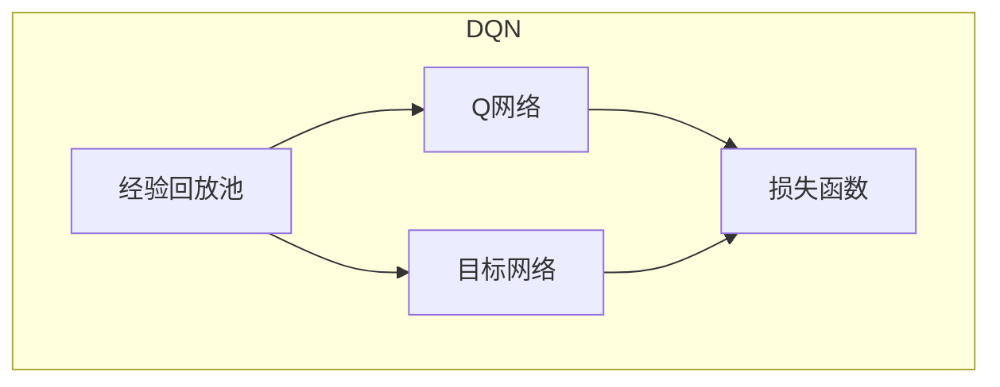

好的,我会严格按照要求,撰写一篇高质量的技术博客文章。

# 一切皆是映射：解析DQN的损失函数设计和影响因素

## 1. 背景介绍

### 1.1 问题的由来

强化学习(Reinforcement Learning)是机器学习中一个重要的研究领域,它关注智能体通过与环境交互来学习如何获取最大化的累积奖励。在强化学习中,智能体需要根据当前状态选择合适的行为,并从环境反馈的奖励中学习,最终形成一个优化的策略。

传统的强化学习算法如Q-Learning、Sarsa等,需要构建一个查表的价值函数,用于存储每个状态-行为对的期望回报值。然而,对于高维连续状态空间的问题,查表的方式就变得低效且不实用了。为了解决这个问题,DeepMind在2013年提出了Deep Q-Network(DQN),将深度神经网络引入到Q-Learning中,用神经网络来拟合Q函数,从而能够处理高维状态空间的问题。

### 1.2 研究现状

DQN的提出开启了将深度学习与强化学习相结合的新时代。自此,各种基于DQN的算法如Double DQN、Dueling DQN、Prioritized Experience Replay等相继被提出,不断改进DQN的性能和稳定性。同时,DQN也被成功应用于多个领域,如Atari游戏、机器人控制、对抗性博弈等。

然而,DQN的训练过程并不是一帆风顺的。由于Q-Learning的偏置更新(bias update)特性和DQN网络的不稳定性,训练时往往会遇到发散(divergence)的问题。因此,合理设计损失函数以确保训练的稳定性,是DQN算法研究的一个重点。

### 1.3 研究意义 

深入理解DQN损失函数的设计原理及影响因素,对于提高DQN的训练稳定性、加快收敛速度、提升最终性能都有重要意义。同时,这也将为设计新的基于DQN的算法提供理论指导。此外,DQN损失函数的研究不仅局限于强化学习领域,对于其他基于深度学习的序列决策问题,也具有一定的借鉴意义。

### 1.4 本文结构

本文将从以下几个方面深入剖析DQN损失函数:

1. DQN核心算法原理及其损失函数的作用
2. 影响DQN损失函数设计的关键因素
3. 常见DQN损失函数形式及其特点
4. 损失函数对DQN训练的影响分析
5. 改进DQN损失函数的一些思路和方法

## 2. 核心概念与联系

在深入探讨DQN损失函数之前,我们先回顾一下DQN算法的核心概念:

- **Q函数(Q-function)**: 在强化学习中,Q函数定义为在给定状态s下执行行为a后的期望累积奖励,即Q(s,a)=E[Rt|st=s,at=a]。Q函数是强化学习的核心,目标是找到一个最优的Q函数。

- **Q-Learning**: 一种基于价值迭代的强化学习算法,通过不断更新Q值表,从而逼近最优Q函数。传统Q-Learning使用查表的方式存储Q值。

- **深度Q网络(DQN)**: 将深度神经网络引入Q-Learning,使用神经网络拟合Q函数,从而能够处理高维连续状态空间。DQN的核心思想是最小化神经网络输出的Q值与真实Q值之间的差异(损失函数)。

- **经验回放(Experience Replay)**: 将探索过程中的状态转移存储在经验池中,在训练时随机采样数据进行训练,有助于提高数据利用效率和算法稳定性。

- **目标网络(Target Network)**: 为了增加训练稳定性,DQN使用了目标网络的概念。目标网络是主网络(评估网络)的拷贝,用于生成期望Q值,其参数会定期同步到主网络。



DQN的核心思想是使用神经网络拟合Q函数,通过最小化损失函数(网络输出Q值与目标Q值的差异)来更新网络参数。损失函数的设计直接影响了Q网络的训练效果,因此对于DQN算法来说,损失函数设计是一个非常关键的环节。

## 3. 核心算法原理与具体操作步骤

### 3.1 算法原理概述

DQN算法的核心思想是使用深度神经网络来拟合Q函数,并通过最小化损失函数(网络输出Q值与真实Q值的差异)来训练网络参数,从而获得一个近似最优的Q函数。

具体来说,DQN算法包含以下几个关键步骤:

1. **初始化网络参数**:初始化评估网络(Q网络)和目标网络(用于生成目标Q值)的参数。

2. **存储状态转移**:智能体与环境交互,将状态转移(st,at,rt,st+1)存储到经验回放池中。

3. **采样数据**:从经验回放池中随机采样一批数据。

4. **计算目标Q值**:使用目标网络基于下一状态st+1计算目标Q值yt。

5. **计算损失函数**:将评估网络在当前状态st输出的Q值与目标Q值yt进行比较,计算损失函数(如均方损失)。

6. **反向传播更新**:使用优化算法(如RMSProp)对评估网络的参数进行反向传播更新,以最小化损失函数。

7. **同步目标网络**:每隔一定步数,将评估网络的参数赋值给目标网络。

8. **重复训练**:重复上述步骤,直到评估网络收敛并得到一个近似最优的Q函数。

总的来说,DQN算法将强化学习问题转化为一个监督学习问题,通过不断最小化损失函数(网络输出Q值与目标Q值的差异)来更新网络参数,从而获得一个近似最优的Q函数。

### 3.2 算法步骤详解

我们用伪代码来详细说明DQN算法的具体实现步骤:

```python
初始化评估网络Q_eval和目标网络Q_target,两个网络参数相同
初始化经验回放池replay_buffer
初始化epsilon_greedy策略

for episode in num_episodes:
    初始化环境状态s
    while not terminal:
        根据epsilon_greedy策略选择行为a
        执行行为a,获得下一状态s'、奖励r和是否终止terminal
        将(s,a,r,s',terminal)存入replay_buffer
        采样一批数据(s_batch,a_batch,r_batch,s_batch',terminal_batch)
        
        # 计算目标Q值
        if terminal_batch:
            y_batch = r_batch
        else:
            y_batch = r_batch + gamma * Q_target(s_batch').max(1)[0].detach()
            
        # 计算损失函数并反向传播
        q_eval = Q_eval(s_batch).gather(1, a_batch)
        loss = criterion(q_eval, y_batch)
        optimizer.zero_grad()
        loss.backward()
        optimizer.step()
        
        # 更新目标网络
        if step % target_update_freq == 0:
            Q_target.load_state_dict(Q_eval.state_dict())
            
        s = s'
        
    # 更新epsilon_greedy策略
```

上述伪代码展示了DQN算法的主要流程,包括:

1. 初始化评估网络、目标网络、经验回放池和探索策略。
2. 在每个Episode中,与环境交互并存储状态转移到经验回放池。
3. 从经验回放池中采样一批数据。
4. 使用目标网络计算目标Q值。
5. 计算评估网络输出Q值与目标Q值的损失函数,并进行反向传播更新。
6. 定期同步目标网络的参数。
7. 更新探索策略。

需要注意的是,DQN算法中损失函数的计算是整个训练过程的核心环节,直接影响了Q网络的收敛性和最终性能。因此,合理设计损失函数对于DQN算法的成功至关重要。

### 3.3 算法优缺点

**优点:**

1. **处理高维状态空间**:通过使用深度神经网络拟合Q函数,DQN可以处理高维连续状态空间的问题,克服了传统Q-Learning查表方法的局限性。

2. **提高数据利用效率**:引入经验回放机制,可以充分重复利用之前的经验数据,提高数据利用效率,加快训练收敛。

3. **增强训练稳定性**:使用目标网络和经验回放等技术,一定程度上增强了DQN训练的稳定性。

4. **端到端学习**:DQN实现了从原始输入到最终动作的端到端学习,无需人工设计特征提取器。

**缺点:**

1. **训练不稳定**:由于Q-Learning的偏置更新特性和网络的不稳定性,DQN的训练过程容易出现发散,需要合理设计损失函数等措施来提高稳定性。

2. **过估计问题**:DQN存在Q值过度估计的问题,会导致子最优解的陷阱。后续的算法如Double DQN、Dueling DQN等提出了一些解决方案。

3. **样本相关性**:经验回放池中的样本存在时序相关性,可能影响训练效果。一些改进算法如随机编码经验回放等试图解决这个问题。

4. **超参数sensitives**:DQN算法对超参数(如学习率、折扣因子等)非常敏感,需要反复调试才能取得较好的性能。

总的来说,DQN算法为强化学习领域的发展做出了开创性贡献,但仍存在一些需要改进的地方,后续的各种改进算法都是在DQN的基础上不断优化而来。

### 3.4 算法应用领域

DQN作为将深度学习与强化学习相结合的开山之作,在多个领域展现出了强大的应用潜力:

1. **视频游戏AI**: DQN最初就是应用于Atari视频游戏环境,实现了人类水平的游戏AI。后来也被推广到其他复杂游戏如星际争霸等。

2. **机器人控制**: DQN可以应用于机器人在复杂环境中的导航、操作等控制任务。

3. **对抗性博弈**: DQN可用于训练AI在对抗性环境(如国际象棋、围棋等)中与人类对抗。

4. **自动驾驶**: 利用DQN可以训练出在复杂交通环境中稳健驾驶的自动驾驶AI系统。

5. **推荐系统**: DQN可用于建模用户行为序列,为用户推荐个性化的内容。

6. **自然语言处理**: 将自然语言处理任务建模为强化学习过程,DQN可用于生成对话、文本摘要等任务。

7. **金融决策**: 在金融交易等序列决策问题中,DQN可用于制定投资组合策略。

总的来说,DQN算法为各类序列决策问题提供了一种有效的解决方案,展现出了广阔的应用前景。随着DQN及其改进算法的不断发展,其应用领域也将进一步扩展。

## 4. 数学模型和公式详细讲解与举例说明

在前面的章节中,我们已经了解了DQN算法的核心思想和实现步骤。在这一章节中,我们将着重探讨DQN算法中损失函数的数学模型和公式推导过程。

### 4.1 数学模型构建

在DQN算法中,我们的目标是找到一个最优的Q函数Q*(s,a),使得在任意状态s下执行行为a,能够获得最大的期望累积奖励。具体来说,我们需要最小化以下损失函数:

$$J(\theta) = \mathbb{E}_{(s,a,r,s')\sim p(\cdot)}\left[(y_t^{Q} - Q(s,a;\theta))^2\right]$$

其中:
- $\theta$是Q网络的参数
- $y_t^Q$是目标Q值,用于估计真实的Q值
- $p(\cdot)$是状态转移的概率分布
- $\mathbb{E}$是期望算子

我们的目标是通过最小化上述损失函数,使得Q网