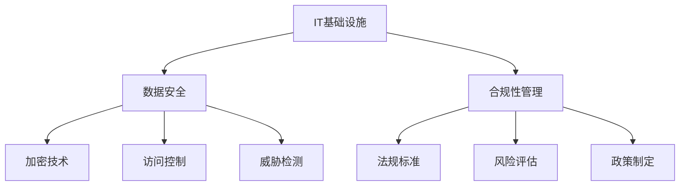

# 专业技术能力培养：深入了解IT基础设施、数据安全和合规要求

## 1. 背景介绍

### 1.1 问题的由来

在当今数字化时代，信息技术(IT)已经渗透到各行各业的方方面面。无论是大型企业还是小型公司,IT基础设施都扮演着至关重要的角色,为业务运营提供了必要的技术支持。然而,随着数字化转型的加速,IT基础设施也变得越来越复杂,涉及云计算、大数据、人工智能等前沿技术。与此同时,网络安全威胁和数据合规性要求也日益严峻。

企业需要确保其IT基础设施的安全性、可靠性和合规性,以保护关键数据资产,维护业务连续性,并遵守相关法规和行业标准。然而,这并非一蹴而就的简单任务。IT专业人员需要具备全面的技术知识和实践经验,才能有效管理和优化IT基础设施,并应对不断变化的安全和合规挑战。

### 1.2 研究现状

近年来,IT基础设施、数据安全和合规性管理已成为热门研究领域。学术界和业界都在积极探索新的理论模型、最佳实践和创新技术,以提高IT基础设施的效率、安全性和合规性。

一些主要研究领域包括:

- **云计算安全**:探索如何在云环境中保护数据隐私和系统安全。
- **大数据安全**:研究如何在海量数据处理过程中保护敏感信息。
- **人工智能安全**:探讨人工智能系统的安全性和可靠性问题。
- **合规性管理**:研究如何遵守各种法规和标准,如GDPR、HIPAA等。
- **风险管理**:评估和缓解IT基础设施中的潜在风险。
- **身份和访问管理**:确保只有授权用户能够访问关键系统和数据。

然而,尽管取得了一定进展,但IT基础设施、数据安全和合规性管理仍然面临着诸多挑战,需要持续的研究和创新。

### 1.3 研究意义

深入了解IT基础设施、数据安全和合规要求对于企业和组织至关重要,具有以下重要意义:

1. **保护关键数据资产**:企业拥有大量敏感数据,如客户信息、财务记录、知识产权等。确保这些数据的安全性和隐私性是企业的首要任务。

2. **维护业务连续性**:IT基础设施的故障或安全漏洞可能导致业务中断,造成巨大经济损失。有效的IT基础设施管理可以最大限度地减少这种风险。

3. **遵守法规和标准**:企业必须遵守各种法规和行业标准,如GDPR、HIPAA、PCI DSS等。违规可能会受到严重处罚。

4. **提高效率和生产力**:优化的IT基础设施可以提高系统性能、降低运营成本,从而提高员工的工作效率和生产力。

5. **增强竞争力**:拥有安全、可靠和高效的IT基础设施可以为企业带来竞争优势,吸引更多客户和合作伙伴。

6. **保护品牌形象**:数据泄露或安全事件可能会严重损害企业的声誉和品牌形象。

因此,培养IT专业人员的技术能力,深入了解IT基础设施、数据安全和合规要求,对于企业的长期发展至关重要。

### 1.4 本文结构

本文将全面探讨IT基础设施、数据安全和合规性管理的各个方面。文章结构如下:

1. 背景介绍
2. 核心概念与联系
3. 核心算法原理与具体操作步骤
4. 数学模型和公式详细讲解与举例说明
5. 项目实践:代码实例和详细解释说明
6. 实际应用场景
7. 工具和资源推荐
8. 总结:未来发展趋势与挑战
9. 附录:常见问题与解答

## 2. 核心概念与联系

在探讨IT基础设施、数据安全和合规性管理之前,我们需要先了解一些核心概念及它们之间的联系。



1. **IT基础设施**:指支持企业IT系统运行的硬件、软件、网络和服务等基础设施。它是数据安全和合规性管理的基础。

2. **数据安全**:确保数据的机密性、完整性和可用性,包括加密技术、访问控制、威胁检测等措施。

3. **合规性管理**:遵守相关法规标准(如GDPR、HIPAA等),进行风险评估,制定相应的政策和程序。

4. **加密技术**:通过加密算法将数据转换为密文,防止未经授权的访问。

5. **访问控制**:确保只有授权用户可以访问特定的系统、应用程序或数据。

6. **威胁检测**:识别和响应各种安全威胁,如病毒、恶意软件、网络攻击等。

7. **法规标准**:各行业和地区制定的法律法规和标准,如GDPR、HIPAA、PCI DSS等。

8. **风险评估**:评估IT基础设施中潜在的安全风险,并采取相应的缓解措施。

9. **政策制定**:根据法规要求和风险评估结果,制定相应的安全政策和程序。

这些核心概念相互关联、相辅相成,共同构建了IT基础设施的安全性和合规性管理体系。只有全面理解和掌握这些概念,才能有效地保护企业的数据资产,维护业务连续性,并确保遵守相关法规和标准。

## 3. 核心算法原理与具体操作步骤

### 3.1 算法原理概述

在IT基础设施、数据安全和合规性管理中,涉及多种核心算法和技术,如加密算法、访问控制模型、风险评估算法等。这些算法和技术是确保数据安全和合规性的关键。

1. **加密算法**:加密算法是数据安全的基石,它通过特定的数学函数将明文转换为密文,防止未经授权的访问。常见的加密算法包括对称加密算法(如AES、DES)和非对称加密算法(如RSA、ECC)。

2. **访问控制模型**:访问控制模型用于管理和控制对系统、应用程序和数据的访问。常见的访问控制模型包括基于角色的访问控制(RBAC)、基于属性的访问控制(ABAC)等。

3. **风险评估算法**:风险评估算法用于识别、分析和评估IT基础设施中的潜在风险。常见的风险评估算法包括故障模式和影响分析(FMEA)、事件树分析(ETA)等。

4. **威胁检测算法**:威胁检测算法用于识别和响应各种安全威胁,如病毒、恶意软件、网络攻击等。常见的威胁检测算法包括基于签名的检测、基于行为的检测、基于异常的检测等。

5. **合规性评估算法**:合规性评估算法用于评估企业是否符合相关法规和标准的要求。常见的合规性评估算法包括控制自我评估(CSA)、合规性风险评估(CRA)等。

这些核心算法和技术通常会结合使用,以提供全面的数据安全和合规性保障。下面,我们将详细介绍其中一些关键算法的原理和具体操作步骤。

### 3.2 算法步骤详解

#### 3.2.1 AES加密算法

AES(Advanced Encryption Standard)是一种广泛使用的对称加密算法,它具有高效、安全和可靠的特点。AES加密算法的工作原理如下:

1. **密钥扩展**:根据输入的密钥(128位、192位或256位),通过密钥扩展算法生成多个子密钥。

2. **初始化状态**:将明文分为多个16字节的块,并将每个块映射到一个4x4的状态矩阵中。

3. **加密轮次**:对每个状态矩阵执行多轮加密运算,每轮包括以下四个步骤:
   a. **字节代换**:使用预定义的S盒(Substitution Box)替换每个字节。
   b. **行移位**:对状态矩阵的每一行进行循环左移。
   c. **列混淆**:对状态矩阵的每一列进行线性变换。
   d. **加轮密钥**:将当前轮的子密钥与状态矩阵进行异或运算。

4. **最终轮**:执行最后一轮加密,略去列混淆步骤。

5. **输出密文**:将最终的状态矩阵转换为密文输出。

AES加密算法的具体操作步骤如下:

```python
def aes_encrypt(plaintext, key):
    # 密钥扩展
    key_schedule = key_expansion(key)

    # 初始化状态
    state = initialize_state(plaintext)

    # 加密轮次
    for round in range(NUM_ROUNDS):
        state = sub_bytes(state)
        state = shift_rows(state)
        state = mix_columns(state)
        state = add_round_key(state, key_schedule[round])

    # 最终轮
    state = sub_bytes(state)
    state = shift_rows(state)
    state = add_round_key(state, key_schedule[NUM_ROUNDS])

    # 输出密文
    ciphertext = state_to_ciphertext(state)
    return ciphertext
```

AES加密算法具有高度的安全性和效率,被广泛应用于各种领域,如文件加密、通信加密、数据库加密等。

#### 3.2.2 RBAC访问控制模型

RBAC(Role-Based Access Control)是一种基于角色的访问控制模型,它通过将用户与角色相关联,并将角色与权限相关联,来管理对系统、应用程序和数据的访问。RBAC模型的工作原理如下:

1. **定义角色**:根据组织的业务需求和职责,定义一系列角色,如管理员、经理、员工等。

2. **分配权限**:为每个角色分配相应的权限,如读取、写入、执行等。

3. **分配用户**:将用户分配给一个或多个角色。

4. **访问控制**:当用户尝试访问特定的资源时,系统会检查该用户所属的角色是否具有相应的权限。只有具有适当权限的角色才能访问该资源。

RBAC模型的具体实现步骤如下:

```python
def rbac_access_control(user, resource, operation):
    # 获取用户的角色
    roles = get_user_roles(user)

    # 检查角色是否具有相应权限
    for role in roles:
        permissions = get_role_permissions(role)
        if has_permission(permissions, resource, operation):
            return True

    # 没有合适的权限
    return False

def has_permission(permissions, resource, operation):
    for permission in permissions:
        if permission.resource == resource and permission.operation == operation:
            return True
    return False
```

RBAC模型具有简单、灵活和可扩展的优点,被广泛应用于企业系统、操作系统和数据库等领域。它可以有效地管理用户访问权限,提高安全性和合规性。

### 3.3 算法优缺点

#### 3.3.1 AES加密算法

**优点**:

- 高度安全性:AES算法经过了广泛的密码分析和攻击测试,被认为是目前最安全的对称加密算法之一。
- 高效性能:AES算法具有较高的计算效率,能够快速加密和解密大量数据。
- 可靠性:AES算法已经被广泛采用,并成为多个加密标准的核心部分。
- 灵活性:AES算法支持三种不同的密钥长度(128位、192位和256位),可以根据不同的安全需求进行选择。

**缺点**:

- 密钥管理:对称加密算法需要安全地共享和管理密钥,这可能会带来一定的挑战。
- 不支持数字签名:AES是一种对称加密算法,不能直接用于数字签名和身份验证。
- 潜在的侧信道攻击:虽然AES算法本身非常安全,但在实现和部署过程中可能存在