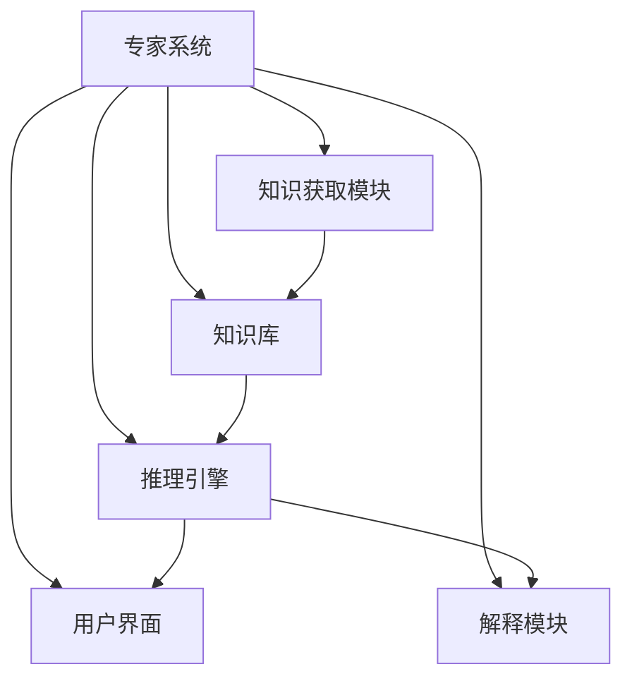
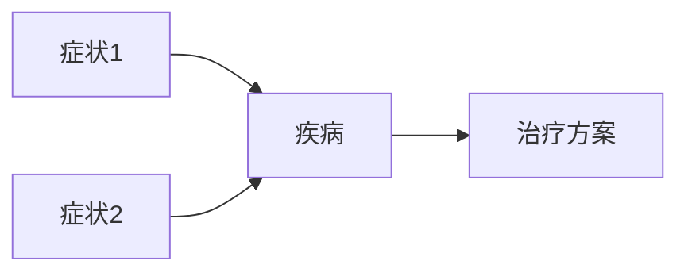

# 专家系统 (Expert System)

## 1. 背景介绍

### 1.1 问题的由来

在现代社会中,各个领域的知识和信息都在快速增长,导致了专业知识的分散和专家资源的稀缺。人类专家在某些特定领域拥有丰富的经验和知识,但是由于人力有限,无法满足日益增长的需求。因此,如何捕获和利用人类专家的知识成为了一个迫切的问题。

专家系统(Expert System)应运而生,旨在模拟人类专家的决策过程,将专家的知识和经验转化为可计算的形式,从而为用户提供智能决策支持。专家系统的出现为解决复杂问题提供了新的途径,并在诸多领域展现出巨大的应用潜力。

### 1.2 研究现状

专家系统的研究可以追溯到20世纪60年代,最初主要应用于医疗诊断、地质勘探等领域。随着人工智能技术的不断发展,专家系统也在不断演进和完善。目前,专家系统已经广泛应用于金融、制造、教育、军事等多个领域,为专业人士提供了有力的决策支持工具。

尽管专家系统取得了一定的成就,但仍然存在一些挑战和局限性,例如知识获取的困难、知识库维护的复杂性、推理效率的限制等。研究人员正在探索新的方法和技术来解决这些问题,如基于机器学习的知识发现、基于大数据的知识库构建、基于云计算的高性能推理等。

### 1.3 研究意义

专家系统的研究具有重要的理论和实践意义:

1. **理论意义**:专家系统研究涉及知识表示、推理机制、不确定性处理等人工智能核心问题,对于推动人工智能理论的发展具有重要作用。

2. **实践意义**:专家系统能够帮助人类专家解决复杂的决策问题,提高工作效率和决策质量,在各个领域都有广泛的应用前景。

3. **知识传承**:专家系统能够捕获和保存人类专家的宝贵经验和知识,实现知识的有效传承和共享。

4. **降低成本**:专家系统可以减少对人力资源的依赖,降低专家咨询的成本,提高资源利用效率。

### 1.4 本文结构

本文将全面介绍专家系统的相关概念、原理和应用。具体内容安排如下:

1. 阐述专家系统的核心概念及其与其他系统的联系。
2. 详细讲解专家系统的核心算法原理和具体操作步骤。
3. 介绍专家系统中常用的数学模型和公式,并通过案例进行详细说明。
4. 提供专家系统的代码实例,并对其进行详细解释和分析。
5. 探讨专家系统在各个领域的实际应用场景。
6. 推荐相关的学习资源、开发工具和论文等。
7. 总结专家系统的研究成果,并展望未来的发展趋势和挑战。
8. 附录部分回答一些常见的问题。

## 2. 核心概念与联系

专家系统是一种基于知识的系统,它模拟人类专家的决策过程,利用知识库中存储的知识和推理规则来解决特定领域的复杂问题。专家系统主要由以下几个核心组件组成:

1. **知识库(Knowledge Base)**: 存储专家的领域知识和经验,通常采用规则、框架或语义网络等形式表示。

2. **推理引擎(Inference Engine)**: 根据知识库中的规则和事实,进行逻辑推理并得出结论。

3. **知识获取模块(Knowledge Acquisition Module)**: 从人类专家那里获取知识,并将其转化为可计算的形式存储在知识库中。

4. **用户界面(User Interface)**: 提供友好的交互界面,方便用户输入问题并获取系统的建议。

5. **解释模块(Explanation Module)**: 解释系统的推理过程和结果,增加系统的透明度和可解释性。

专家系统与其他系统的关系如下:

- **数据库系统**: 专家系统通常需要与数据库系统集成,以存储和检索相关数据。

- **决策支持系统**: 专家系统可以作为决策支持系统的一个重要组成部分,为决策者提供智能建议。

- **机器学习系统**: 专家系统可以利用机器学习技术自动从数据中发现知识,并更新知识库。

- **自然语言处理系统**: 专家系统可以集成自然语言处理技术,实现更自然的人机交互。



## 3. 核心算法原理 & 具体操作步骤

### 3.1 算法原理概述

专家系统的核心算法原理是基于规则的推理。推理过程包括两个主要步骤:

1. **模式匹配(Pattern Matching)**: 将当前问题与知识库中的规则进行匹配,找到相关的规则。

2. **规则执行(Rule Execution)**: 根据匹配的规则,执行相应的操作,得出结论或建议。

根据推理的方向,可以分为两种主要推理策略:

1. **前向链接(Forward Chaining)**: 从已知事实出发,应用规则推导出新的事实,直到达到目标或无法继续推理为止。适用于监控和控制类问题。

2. **反向链接(Backward Chaining)**: 从目标出发,寻找支持目标的事实和规则,反向推理直到找到已知事实或无法继续推理为止。适用于诊断和解释类问题。

### 3.2 算法步骤详解

以下是基于规则的推理算法的具体步骤:

1. **初始化**: 将已知事实加载到工作存储区(Working Memory)中。

2. **模式匹配**:
   - 前向链接: 将工作存储区中的事实与规则的前提部分进行匹配,找到可以执行的规则。
   - 反向链接: 将目标与规则的结论部分进行匹配,找到可以执行的规则。

3. **规则执行**:
   - 前向链接: 执行匹配的规则,将新推导出的事实添加到工作存储区中。
   - 反向链接: 将匹配的规则的前提作为新的子目标,继续反向推理。

4. **重复步骤2和3**,直到达到目标或无法继续推理为止。

5. **结果输出**: 输出最终的结论或建议。

该算法可以通过不同的策略和优化技术来提高效率,如规则优先级排序、基于事实的规则过滤、基于模式的部分匹配等。

### 3.3 算法优缺点

**优点**:

1. **可解释性强**: 基于规则的推理过程具有很好的可解释性,方便人类理解和审查。

2. **知识分离**: 将知识与推理机制分离,便于知识的维护和更新。

3. **模块化**: 规则的模块化结构便于系统的扩展和重用。

4. **处理不确定性**: 可以通过附加置信度或模糊逻辑等方式处理不确定性知识。

**缺点**:

1. **知识获取困难**: 从人类专家那里获取知识并形式化表示是一个巨大的挑战。

2. **知识库维护复杂**: 随着知识库规模的增长,维护和更新知识库变得越来越困难。

3. **推理效率有限**: 当规则数量很大时,推理效率会显著降低。

4. **知识的脆弱性**: 知识库中的知识可能存在错误或遗漏,导致推理结果不准确。

### 3.4 算法应用领域

基于规则的推理算法在多个领域都有广泛的应用:

1. **医疗诊断**: 根据患者症状和医学知识库进行疾病诊断和治疗建议。

2. **金融决策**: 基于金融规则和数据进行投资组合管理、风险评估等决策。

3. **故障诊断**: 根据设备状态和故障规则进行故障诊断和维修建议。

4. **法律判决**: 根据法律法规和案例知识库进行法律判决和建议。

5. **教育辅导**: 根据学生知识水平和教学知识库提供个性化学习建议。

6. **配置设计**: 根据产品规格和约束条件进行产品配置和设计。

## 4. 数学模型和公式 & 详细讲解 & 举例说明

在专家系统中,数学模型和公式常用于表示不确定性知识、量化规则的置信度、评估推理结果的可信度等。以下是一些常见的数学模型和公式:

### 4.1 数学模型构建

#### 4.1.1 贝叶斯网络

贝叶斯网络是一种基于概率论的图形模型,用于表示变量之间的因果关系和条件概率分布。它可以用于专家系统中的不确定性推理。

贝叶斯网络由节点(表示变量)和有向边(表示变量之间的依赖关系)组成。每个节点都有一个条件概率表(CPT),描述了该节点在给定父节点取值时的条件概率分布。

在专家系统中,可以根据领域知识构建贝叶斯网络模型,然后根据观测到的证据进行概率推理,得到感兴趣变量的后验概率分布。



#### 4.1.2 模糊逻辑

模糊逻辑是一种处理不确定性和模糊性的数学理论。它允许变量取值在[0,1]的连续范围内,而不是传统的二值逻辑(0或1)。

在专家系统中,可以使用模糊逻辑来表示和处理模糊的规则和概念。例如,可以使用模糊集合来表示"高龄"或"低收入"等模糊概念,并使用模糊推理规则进行推理。

$$\mu_A(x) = \begin{cases}
1, & \text{if } x \text{ is totally a member of } A\\
0, & \text{if } x \text{ is not a member of } A\\
(0,1), & \text{otherwise}
\end{cases}$$

其中,$\mu_A(x)$表示x属于模糊集合A的membership度。

### 4.2 公式推导过程

#### 4.2.1 贝叶斯公式

贝叶斯公式是概率论中的一个重要公式,用于计算条件概率。在专家系统中,它可以用于更新观测到新证据后的后验概率。

设A和B是两个事件,则根据贝叶斯公式:

$$P(A|B) = \frac{P(B|A)P(A)}{P(B)}$$

其中,P(A|B)是已知B发生时A发生的条件概率(后验概率),P(B|A)是已知A发生时B发生的条件概率(似然概率),P(A)是A的先验概率,P(B)是B的边缘概率。

通过贝叶斯公式,可以将先验概率和似然概率相结合,得到更准确的后验概率估计。

#### 4.2.2 确信度因子模型

确信度因子模型(Certainty Factor Model)是一种常用于专家系统中的不确定性推理模型。它使用确信度因子(CF)来量化规则的置信度。

设R是一条规则,E是证据,H是假设,则:

- 规则的CF值定义为: CF(R) = CF(H,E)
- 组合多条规则的CF值:
  $$CF(H,E_1 \wedge E_2) = CF(H,E_1) + CF(H,E_2) \times (1 - CF(H,E_1))$$

通过不断组合规则的CF值,可以得到最终假设的CF值,用于评估推理结果的可信度。

### 4.3 案例分析与讲解

考虑一个医疗诊断专家系统的案例,需要根据患者的症状诊断可能的疾病。我们可以构建如下贝叶斯网络模型:

```mermaid
graph LR
    A[发烧] --> C[感冒]
    B[头痛] --> C
    C --> D[服药]
    C