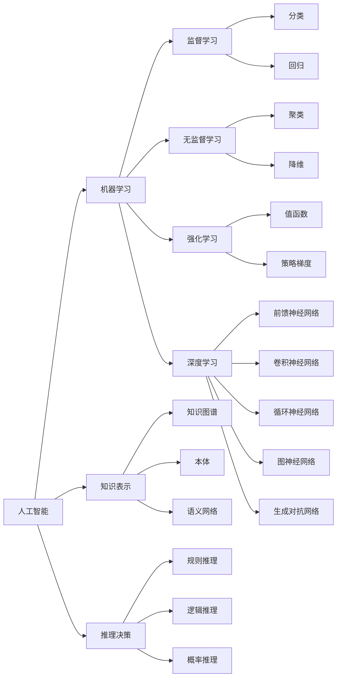

# 人工智能前沿研究热点与发展趋势原理与代码实战案例讲解

关键词：人工智能, 机器学习, 深度学习, 强化学习, 自然语言处理, 计算机视觉, 知识图谱, 图神经网络, 迁移学习, 元学习, 联邦学习, 可解释性, 鲁棒性, 公平性, 隐私保护, 人机交互, 自动机器学习, 神经架构搜索, 生成式对抗网络, 变分自编码器

## 1. 背景介绍
### 1.1  问题的由来
人工智能(Artificial Intelligence, AI)作为计算机科学的一个分支,旨在研究如何让机器模拟人类的智能行为。自1956年达特茅斯会议首次提出"人工智能"这一概念以来,AI经历了从早期的符号主义、专家系统到机器学习、深度学习的发展历程。近年来,得益于大数据、算力和算法的进步,AI迎来了新一轮的繁荣发展期,在语音识别、图像识别、自然语言处理、游戏对弈等领域取得了突破性进展,展现出广阔的应用前景。

### 1.2  研究现状 
当前,人工智能的研究主要集中在机器学习,尤其是深度学习领域。以卷积神经网络(CNN)、循环神经网络(RNN)、生成对抗网络(GAN)、图神经网络(GNN)等为代表的深度学习模型在计算机视觉、语音识别、自然语言处理等任务上取得了超越人类的性能。强化学习结合深度学习,在复杂决策问题如围棋、雅达利游戏、机器人控制中展现出卓越的策略学习能力。知识图谱、因果推理、迁移学习、元学习等方法让AI系统具备更强的常识性知识理解和快速学习新任务的能力。

### 1.3  研究意义
人工智能作为通用技术正在深刻影响和重塑各行各业,成为驱动数字经济发展的新引擎。把握AI前沿研究动态,对于开发更加智能、高效、安全、可信的AI系统,推动AI在教育、医疗、金融、制造、交通等重点领域的创新应用具有重要意义。同时AI的快速发展也带来了可解释性、安全性、隐私保护、伦理道德等挑战,需要学界和业界的共同努力来应对。

### 1.4  本文结构
本文将围绕人工智能前沿研究热点展开论述,内容涵盖机器学习、深度学习、强化学习、自然语言处理、计算机视觉、知识图谱、图神经网络、迁移学习、元学习、联邦学习、可解释性、鲁棒性、公平性、隐私保护等热点方向。文章将介绍各研究方向的核心概念、关键技术、代表性算法、数学原理,并通过案例分析和代码实践加深读者理解。同时探讨AI技术在实际应用场景中的价值,分享相关学习资源,展望未来发展趋势和挑战。

## 2. 核心概念与联系



人工智能的核心概念可以分为机器学习、知识表示、推理决策三大类。其中机器学习包括监督学习、无监督学习、强化学习和深度学习等范式。监督学习主要解决分类和回归问题,无监督学习解决聚类、降维等任务,强化学习通过值函数和策略梯度等方法进行序贯决策优化,深度学习利用多层神经网络进行端到端的特征学习和建模。知识表示涉及知识图谱、本体、语义网络等结构化知识的表示学习方法。推理决策则包括规则推理、逻辑推理、概率推理在内的知识推理和决策优化技术。

## 3. 核心算法原理 & 具体操作步骤
### 3.1  算法原理概述
本节重点介绍深度学习和强化学习两大类算法。

深度学习利用多层神经网络对输入数据进行层级抽象和表示学习。以卷积神经网络(CNN)为例,其利用卷积、池化等操作提取图像的局部特征,通过堆叠多个卷积层实现特征的层级提取,再经过全连接层完成分类或回归任务。CNN的参数通过误差反向传播算法进行端到端优化学习。

强化学习则聚焦于智能体与环境的交互过程,通过试错学习来优化策略函数,最大化累积奖励。以Q学习为例,其通过值迭代的方式学习状态-动作值函数(Q函数),根据贝尔曼最优方程迭代更新Q值,收敛后得到最优策略。深度强化学习将深度神经网络引入Q学习,用于拟合Q函数,提升了强化学习处理高维状态空间的能力。

### 3.2  算法步骤详解

以下是CNN和Q学习的具体算法步骤:

CNN:
1. 输入图像数据,通过卷积层提取局部特征
2. 使用ReLU等非线性激活函数增加网络的非线性表达能力 
3. 通过最大池化操作进行特征降维和平移不变性提取
4. 堆叠多个卷积层和池化层,实现特征的层级提取
5. 将提取到的特征通过全连接层映射到输出空间
6. 使用Softmax等分类器完成分类任务
7. 定义损失函数(如交叉熵),利用反向传播算法优化网络参数

Q学习:
1. 随机初始化Q表,存储各个状态-动作对的价值估计
2. 智能体与环境交互,根据当前状态选择一个动作(如ϵ-贪婪策略) 
3. 环境根据动作给出奖励和下一个状态
4. 根据贝尔曼方程更新Q表: $Q(s,a) \leftarrow Q(s,a) + \alpha [r + \gamma \max_{a'} Q(s',a') - Q(s,a)]$
5. 重复步骤2-4,直到Q表收敛或达到最大迭代次数
6. 根据收敛后的Q表选择最优动作策略

### 3.3  算法优缺点

CNN的优点是:
- 能够自动学习层级特征表示,减少了特征工程的需求
- 具有平移不变性,对图像位置变化具有鲁棒性
- 参数共享机制减少了网络参数数量

CNN的缺点包括:
- 需要大量标注数据进行训练,容易过拟合
- 计算复杂度高,训练时间长
- 可解释性差,难以解释网络学到的特征模式

Q学习的优点是:
- 简单易实现,通过值迭代的方式直接估计最优Q函数
- 能够在模型未知的情况下进行策略学习
- 异步更新,易于并行化实现

Q学习的不足有:
- 难以处理连续状态和动作空间
- 容易陷入局部最优,探索效率低
- 对奖励函数和折扣因子敏感,超参数调节困难

### 3.4  算法应用领域

CNN广泛应用于计算机视觉领域,如:
- 图像分类:物体识别、场景分类、细粒度分类等
- 目标检测:人脸检测、行人检测、车辆检测等
- 语义分割:像素级别的图像理解,如遥感图像分割、医学影像分割
- 人脸识别:人脸验证、人脸聚类、人脸属性识别等

强化学习在以下领域有重要应用:
- 游戏智能体:Atari游戏、围棋、星际争霸等
- 机器人控制:机械臂操纵、四足机器人运动规划、无人驾驶等 
- 推荐系统:基于用户反馈的交互式推荐
- 网络优化:动态路由、流量调度、缓存策略优化等

## 4. 数学模型和公式 & 详细讲解 & 举例说明
### 4.1  数学模型构建

以下是CNN和Q学习的数学模型:

CNN卷积层:
$$a^{l}_{i,j} = \sigma(\sum_{m=0}^{M-1} \sum_{n=0}^{N-1} w^{l}_{m,n} a^{l-1}_{i+m,j+n} + b^{l})$$

其中$a^{l}_{i,j}$为第$l$层第$(i,j)$个神经元的激活值,$w^{l}_{m,n}$为卷积核参数,$M,N$为卷积核尺寸,$\sigma$为激活函数,如ReLU: $\sigma(x)=max(0,x)$。

Q学习贝尔曼最优方程:
$$Q^{*}(s,a) = R(s,a) + \gamma \sum_{s' \in S} P(s'|s,a) \max_{a'} Q^{*}(s',a')$$

其中$Q^{*}(s,a)$为状态-动作对$(s,a)$的最优价值函数,$R(s,a)$为立即奖励,$\gamma$为折扣因子,$P(s'|s,a)$为状态转移概率。

### 4.2  公式推导过程

对于CNN前向传播,设输入为$a^{0}$,卷积核参数为$w^{l},b^{l}$,则第$l$层输出为:
$$z^{l} = a^{l-1} * w^{l} + b^{l}$$
$$a^{l} = \sigma(z^{l})$$

反向传播时,设损失函数为$L$,则第$l$层权重梯度为:
$$\frac{\partial L}{\partial w^{l}} = a^{l-1} * \delta^{l}$$
$$\delta^{l} = \frac{\partial L}{\partial z^{l}} = \frac{\partial L}{\partial a^{l}} \odot \sigma'(z^{l})$$

其中$\delta^{l}$为第$l$层的敏感度图,$\odot$为Hadamard乘积。

对于Q学习,我们从贝尔曼方程出发:
$$Q^{\pi}(s,a) = R(s,a) + \gamma \sum_{s'} P(s'|s,a) Q^{\pi}(s',\pi(s'))$$

当采取最优策略$\pi^{*}$时,有:
$$Q^{*}(s,a) = R(s,a) + \gamma \sum_{s'} P(s'|s,a) \max_{a'} Q^{*}(s',a')$$

定义时间差分误差:
$$\delta_t = R_{t+1} + \gamma \max_{a} Q(S_{t+1},a) - Q(S_t,A_t)$$

则Q学习的更新公式为:
$$Q(S_t,A_t) \leftarrow Q(S_t,A_t) + \alpha \delta_t$$

### 4.3  案例分析与讲解

下面以MNIST手写数字识别为例,讲解CNN的应用:

```python
import tensorflow as tf

# 加载MNIST数据集
(x_train, y_train), (x_test, y_test) = tf.keras.datasets.mnist.load_data()

# 数据预处理
x_train = x_train.reshape((60000, 28, 28, 1)) / 255.0
x_test = x_test.reshape((10000, 28, 28, 1)) / 255.0
y_train = tf.keras.utils.to_categorical(y_train)
y_test = tf.keras.utils.to_categorical(y_test)

# 构建CNN模型
model = tf.keras.models.Sequential([
    tf.keras.layers.Conv2D(32, (3,3), activation='relu', input_shape=(28, 28, 1)),
    tf.keras.layers.MaxPooling2D((2,2)),
    tf.keras.layers.Conv2D(64, (3,3), activation='relu'),
    tf.keras.layers.MaxPooling2D((2,2)),
    tf.keras.layers.Conv2D(64, (3,3), activation='relu'),
    tf.keras.layers.Flatten(),
    tf.keras