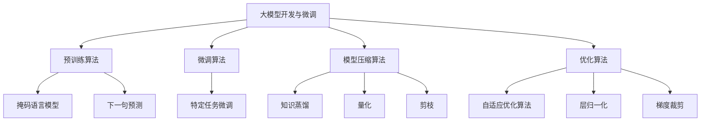

# 从零开始大模型开发与微调：单词的文本处理

## 1. 背景介绍

### 1.1 问题的由来

在自然语言处理(NLP)领域,大型语言模型已经成为主流技术。这些模型通过在大量文本数据上进行预训练,学习到丰富的语义和上下文信息,并可以在下游任务中进行微调,从而显著提高性能。然而,训练这些大模型需要消耗大量的计算资源,对于普通用户和中小企业来说,成本往往过高。

因此,如何以较低的成本开发和微调大型语言模型,成为一个亟待解决的问题。通过对现有模型进行微调和优化,我们可以在保持较高性能的同时,降低计算资源的需求,使大模型的应用更加民主化。

### 1.2 研究现状  

目前,一些知名的大型语言模型,如GPT-3、BERT和T5等,已经在各种NLP任务中取得了卓越的成绩。但是,训练这些模型需要耗费大量的计算资源,包括GPU集群、大量内存和存储空间等。对于普通用户和中小企业来说,获取这些资源的成本往往过高。

为了解决这个问题,研究人员提出了多种方法,包括模型压缩、知识蒸馏、量化等技术,旨在减小模型的大小和计算需求,同时保持较高的性能。另一种方法是利用迁移学习,在现有的大模型上进行微调,针对特定任务进行优化。

### 1.3 研究意义

通过本文介绍的方法,我们可以以较低的成本开发和微调大型语言模型,从而使NLP技术更加民主化,惠及更多的用户和企业。这不仅有助于推动NLP技术的发展,也可以促进人工智能在各个领域的应用,带来经济和社会效益。

此外,本文还将介绍一些实用的开发工具和学习资源,为读者提供更多的支持和指导。

### 1.4 本文结构

本文将从以下几个方面介绍大模型开发与微调的相关内容:

1. 核心概念与联系
2. 核心算法原理与具体操作步骤
3. 数学模型和公式详细讲解与案例分析
4. 项目实践:代码实例和详细解释说明
5. 实际应用场景和未来展望
6. 工具和资源推荐
7. 总结:未来发展趋势与挑战
8. 附录:常见问题与解答

## 2. 核心概念与联系

在介绍大模型开发与微调的核心算法之前,我们先来了解一些基本概念和它们之间的联系。

### 2.1 预训练与微调

预训练(Pre-training)是指在大量未标注数据上训练语言模型,使其学习到丰富的语义和上下文信息。这个过程通常耗费大量的计算资源,但可以产生一个通用的基础模型。

微调(Fine-tuning)是指在特定任务的标注数据上,基于预训练模型进行进一步训练,使模型适应该任务的特征。相比从头训练,微调可以显著减少所需的计算资源,同时保持较高的性能。

### 2.2 自监督学习与迁移学习

自监督学习(Self-supervised Learning)是指在无需人工标注的情况下,利用数据本身的某些属性(如邻近性、掩码等)作为监督信号进行训练。这种方法可以充分利用大量未标注数据,学习到有用的表示。

迁移学习(Transfer Learning)是指将在源领域学习到的知识迁移到目标领域,以提高目标任务的性能。在NLP中,我们可以将预训练模型视为源领域知识,通过微调将其应用到目标任务中。

### 2.3 注意力机制与Transformer

注意力机制(Attention Mechanism)是一种允许模型选择性地聚焦于输入的不同部分的机制。它可以捕捉输入序列中不同位置之间的长程依赖关系,对序列建模任务(如机器翻译、文本生成等)有重要作用。

Transformer是一种基于注意力机制的序列到序列模型,它完全放弃了循环神经网络(RNN)和卷积神经网络(CNN),使用自注意力(Self-Attention)机制来捕捉输入和输出序列之间的依赖关系。Transformer模型在多个NLP任务上表现出色,成为了当前主流的语言模型架构。

### 2.4 语言模型与下游任务

语言模型(Language Model)是指学习文本序列的概率分布,能够预测下一个单词或字符的模型。通过预训练得到的语言模型,可以作为基础模型,在下游任务(如文本分类、机器翻译、问答系统等)中进行微调,从而提高性能。

下游任务(Downstream Task)是指除了语言模型之外,需要语言理解和生成能力的任何NLP任务。通过在大量文本数据上预训练,语言模型可以学习到丰富的语义和上下文知识,为下游任务提供有力支持。

## 3. 核心算法原理与具体操作步骤

### 3.1 算法原理概述

大模型开发与微调的核心算法主要包括以下几个部分:

1. **预训练算法**: 通常采用自监督学习的方式,在大量未标注文本数据上训练语言模型,学习到丰富的语义和上下文知识。常用的预训练目标包括掩码语言模型(Masked Language Model)和下一句预测(Next Sentence Prediction)等。

2. **微调算法**: 基于预训练模型,在特定任务的标注数据上进行进一步训练,使模型适应该任务的特征。微调过程通常只需要少量的计算资源,但可以显著提高模型在该任务上的性能。

3. **模型压缩算法**: 为了减小模型的大小和计算需求,可以采用多种模型压缩技术,如知识蒸馏(Knowledge Distillation)、量化(Quantization)、剪枝(Pruning)等。

4. **优化算法**: 在训练过程中,通常需要采用一些优化算法来加速收敛和提高性能,如自适应优化算法(如Adam)、层归一化(Layer Normalization)、梯度裁剪(Gradient Clipping)等。

下面我们将详细介绍这些算法的具体操作步骤。

### 3.2 算法步骤详解

#### 3.2.1 预训练算法

预训练算法的目标是在大量未标注文本数据上训练一个通用的语言模型,学习到丰富的语义和上下文知识。常用的预训练目标包括:

1. **掩码语言模型(Masked Language Model, MLM)**: 随机掩码输入序列中的一些单词,要求模型预测这些被掩码的单词。这种方式可以让模型学习到双向的上下文信息。

2. **下一句预测(Next Sentence Prediction, NSP)**: 给定两个句子,要求模型判断第二个句子是否为第一个句子的下一句。这种方式可以让模型学习到更长范围的上下文依赖关系。

预训练算法的具体步骤如下:

1. 准备大量未标注的文本数据,如网页、书籍、新闻等。
2. 构建深度神经网络模型,通常采用Transformer架构。
3. 对输入序列进行掩码或下一句预测任务的标注。
4. 计算模型预测与标注之间的损失函数,如交叉熵损失。
5. 使用优化算法(如Adam)更新模型参数,最小化损失函数。
6. 重复3-5步,直到模型在验证集上的性能不再提高为止。

经过大规模预训练后,模型可以学习到丰富的语义和上下文知识,为后续的微调任务打下基础。

#### 3.2.2 微调算法

微调算法的目标是在特定任务的标注数据上,基于预训练模型进行进一步训练,使模型适应该任务的特征。微调过程通常只需要少量的计算资源,但可以显著提高模型在该任务上的性能。

微调算法的具体步骤如下:

1. 准备特定任务的标注数据集,如文本分类、机器翻译等。
2. 加载预训练模型的参数作为初始化。
3. 根据任务的特点,设计适当的输入表示和输出层。
4. 计算模型预测与标注之间的损失函数,如交叉熵损失。
5. 使用优化算法(如Adam)更新模型参数,最小化损失函数。
6. 重复4-5步,直到模型在验证集上的性能不再提高为止。

在微调过程中,通常只需要对模型的部分层进行训练,而保留大部分预训练参数不变。这种策略可以有效利用预训练模型学习到的知识,加快收敛速度。

#### 3.2.3 模型压缩算法

为了减小模型的大小和计算需求,我们可以采用多种模型压缩技术,如知识蒸馏、量化、剪枝等。

1. **知识蒸馏(Knowledge Distillation)**

知识蒸馏是一种将大型模型(教师模型)的知识迁移到小型模型(学生模型)的技术。具体步骤如下:

- 训练一个大型的教师模型,作为知识来源。
- 在相同的数据集上,训练一个小型的学生模型。
- 除了使用真实标签计算损失函数外,还需要最小化学生模型的预测与教师模型的预测之间的差异(如KL散度)。
- 通过上述方式,学生模型可以学习到教师模型的知识,同时大幅减小模型大小。

2. **量化(Quantization)**

量化是将模型参数从32位或16位浮点数压缩到8位或更低位宽的整数表示。这种技术可以显著减小模型大小和内存占用,同时保持较高的精度。常用的量化方法包括线性量化和对数量化等。

3. **剪枝(Pruning)**

剪枝是移除神经网络中的冗余连接和神经元,从而压缩模型大小。常用的剪枝策略包括基于权重的剪枝和基于神经元的剪枝等。剪枝后需要进行精细的重训练,以恢复模型性能。

通过上述模型压缩技术的组合使用,我们可以显著减小模型的大小和计算需求,使大模型的应用更加高效和经济。

### 3.3 算法优缺点

上述算法在开发和微调大型语言模型方面具有以下优缺点:

**优点:**

1. 预训练和微调策略可以充分利用大量未标注数据和少量标注数据,显著提高模型性能。
2. 模型压缩技术可以大幅减小模型大小和计算需求,使大模型更加高效和经济。
3. 自监督学习和迁移学习等方法可以有效地利用现有知识,加快训练过程。
4. 注意力机制和Transformer架构可以更好地捕捉长程依赖关系,提高序列建模能力。

**缺点:**

1. 预训练过程需要消耗大量的计算资源,对于普通用户和中小企业来说,成本可能过高。
2. 模型压缩技术虽然可以减小模型大小,但可能会导致一定程度的性能下降。
3. 自监督学习和迁移学习的效果在很大程度上依赖于预训练数据和任务的相似性。
4. 注意力机制的计算复杂度较高,在长序列输入时可能会导致性能下降。

### 3.4 算法应用领域

上述算法可以广泛应用于自然语言处理的各个领域,包括但不限于:

1. **文本分类**: 将文本归类到预定义的类别中,如新闻分类、情感分析等。
2. **机器翻译**: 将一种语言的文本翻译成另一