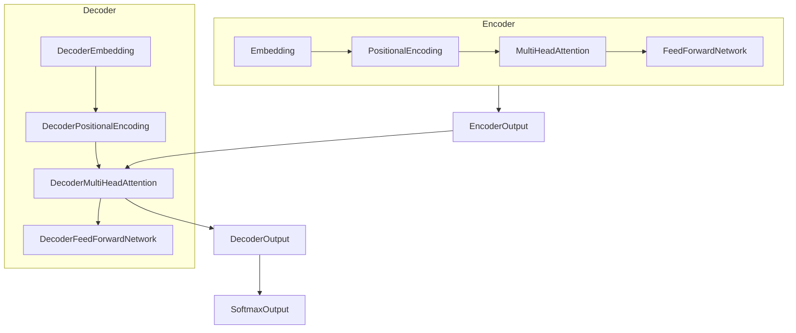

# 从零开始大模型开发与微调：实战编码器：拼音汉字转化模型

## 1. 背景介绍

### 1.1 问题的由来

在自然语言处理领域中,将汉字转换为拼音或将拼音转换为汉字是一项基础且重要的任务。这种转换不仅在语音识别、输入法等应用中扮演着关键角色,同时也是构建更高级自然语言处理系统的基础。然而,由于汉语拼音与汉字之间存在着一对多的映射关系,这使得该任务变得具有一定的挑战性。

### 1.2 研究现状  

传统的拼音与汉字转换方法主要基于规则或统计模型,如最大匹配法、隐马尔可夫模型等。尽管这些方法在一定程度上能够解决该问题,但它们往往受限于规则的覆盖范围和数据的局限性,难以处理复杂的语境信息。

随着深度学习技术的发展,基于神经网络的序列到序列(Sequence-to-Sequence,Seq2Seq)模型在机器翻译等任务中取得了卓越的成绩,并被引入到拼音与汉字转换任务中。这些模型能够自动学习拼音与汉字之间的映射关系,并利用注意力机制捕捉长距离依赖,从而显著提高了转换的准确性。

### 1.3 研究意义

拼音与汉字之间的高效转换不仅对于输入法、语音识别等应用程序具有重要意义,同时也是构建更高级自然语言处理系统的基础。通过开发高性能的拼音-汉字转换模型,我们可以为下游任务提供更准确的输入,从而提高整个系统的性能。此外,该任务也为探索序列到序列模型在其他领域的应用奠定了基础。

### 1.4 本文结构

本文将详细介绍如何从零开始开发和微调一个基于Transformer的拼音-汉字转换模型。我们将首先介绍模型的核心概念和算法原理,然后深入探讨数学模型和公式推导,并通过实际案例进行详细说明。接下来,我们将提供完整的代码实现和运行结果展示。最后,我们将讨论该模型的实际应用场景、未来发展趋势和面临的挑战。

## 2. 核心概念与联系

拼音-汉字转换任务可以被视为一个序列到序列(Seq2Seq)的问题,其中输入序列是拼音序列,输出序列是对应的汉字序列。为了解决这个问题,我们采用了基于Transformer的编码器-解码器(Encoder-Decoder)架构。

Transformer是一种全新的基于自注意力(Self-Attention)机制的神经网络架构,它不仅在机器翻译任务中表现出色,同时也被广泛应用于自然语言处理的各个领域。相比传统的基于RNN或CNN的序列模型,Transformer具有并行计算能力更强、能够更好地捕获长距离依赖等优势。

在我们的拼音-汉字转换模型中,编码器(Encoder)负责将输入的拼音序列编码为高维向量表示,而解码器(Decoder)则根据编码器的输出,一步步生成目标汉字序列。编码器和解码器都由多层Transformer模块组成,每一层都包含多头自注意力(Multi-Head Attention)和前馈神经网络(Feed-Forward Neural Network)子层。

除了基本的Transformer架构,我们还引入了一些特定于拼音-汉字转换任务的改进,如拼音嵌入(Pinyin Embedding)、位置编码(Positional Encoding)和拼音-汉字注意力(Pinyin-Char Attention)等机制,以提高模型的性能和鲁棒性。

## 3. 核心算法原理 & 具体操作步骤

### 3.1 算法原理概述

我们的拼音-汉字转换模型基于Transformer的编码器-解码器架构,其核心算法原理可以概括为以下几个关键步骤:

1. **拼音嵌入(Pinyin Embedding)**: 将输入的拼音序列转换为对应的嵌入向量表示。
2. **位置编码(Positional Encoding)**: 为每个位置添加位置信息,以捕获序列的顺序信息。
3. **编码器(Encoder)**: 使用多层Transformer编码器模块,对拼音嵌入序列进行编码,生成高维向量表示。
4. **解码器(Decoder)**: 使用多层Transformer解码器模块,基于编码器的输出和前一时刻生成的汉字,预测下一个汉字。
5. **拼音-汉字注意力(Pinyin-Char Attention)**: 在解码器中引入拼音-汉字注意力机制,让解码器能够更好地关注与当前生成的汉字相关的拼音信息。
6. **梯度更新**: 根据预测结果和真实标签计算损失,并使用优化算法(如Adam)更新模型参数。

### 3.2 算法步骤详解

1. **拼音嵌入(Pinyin Embedding)**

   首先,我们需要将输入的拼音序列转换为对应的嵌入向量表示。我们可以使用预训练的拼音嵌入矩阵,或者随机初始化一个嵌入矩阵,并在训练过程中学习适当的嵌入向量。

2. **位置编码(Positional Encoding)**

   由于Transformer没有像RNN那样的递归结构,因此我们需要为每个位置添加位置信息,以捕获序列的顺序信息。位置编码可以通过预定义的函数(如正弦和余弦函数)计算得到,并与拼音嵌入相加。

3. **编码器(Encoder)**

   编码器由多层Transformer编码器模块组成,每一层包含两个子层:多头自注意力(Multi-Head Attention)和前馈神经网络(Feed-Forward Neural Network)。

   - 多头自注意力子层: 计算输入序列中每个位置的向量表示,并根据其与其他位置的相关性对其进行更新。
   - 前馈神经网络子层: 对每个位置的向量表示进行非线性转换,以捕获更复杂的特征。

   经过多层编码器模块的处理,我们可以得到输入拼音序列的高维向量表示,作为解码器的输入。

4. **解码器(Decoder)**

   解码器也由多层Transformer解码器模块组成,每一层包含三个子层:掩蔽多头自注意力(Masked Multi-Head Attention)、拼音-汉字注意力(Pinyin-Char Attention)和前馈神经网络(Feed-Forward Neural Network)。

   - 掩蔽多头自注意力子层: 计算当前时刻生成的汉字与前面已生成汉字的相关性,并进行更新。由于我们不能利用未来的信息,因此需要对未来位置的注意力权重进行掩蔽。
   - 拼音-汉字注意力子层: 计算当前时刻生成的汉字与编码器输出(拼音表示)的相关性,并进行更新。这一步非常关键,因为它让解码器能够关注与当前生成的汉字相关的拼音信息。
   - 前馈神经网络子层: 对每个位置的向量表示进行非线性转换,以捕获更复杂的特征。

   经过多层解码器模块的处理,我们可以得到当前时刻生成的汉字的概率分布,并选择概率最大的汉字作为输出。

5. **梯度更新**

   在训练过程中,我们将预测的汉字序列与真实标签进行比较,计算损失函数(如交叉熵损失)。然后,我们使用优化算法(如Adam)根据损失函数的梯度,更新模型的参数。通过多次迭代,模型可以逐步学习拼音与汉字之间的映射关系。

### 3.3 算法优缺点

**优点**:

- 基于Transformer的架构,能够有效捕获长距离依赖,提高转换准确性。
- 引入拼音-汉字注意力机制,让解码器能够更好地关注与当前生成的汉字相关的拼音信息。
- 并行计算能力强,训练和推理速度较快。

**缺点**:

- 模型参数较多,对计算资源和内存的要求较高。
- 对于生僻字或未见过的拼音-汉字映射,模型的性能可能会受到影响。
- 需要大量的训练数据和计算资源进行预训练和微调。

### 3.4 算法应用领域

拼音-汉字转换模型可以应用于以下领域:

- **输入法**: 将用户输入的拼音转换为对应的汉字,提高输入效率和准确性。
- **语音识别**: 将语音转录为拼音序列,然后将拼音转换为汉字,实现语音到文本的转换。
- **机器翻译**: 作为预处理或后处理步骤,将源语言或目标语言的拼音转换为汉字。
- **自然语言处理**: 作为构建更高级自然语言处理系统(如问答系统、对话系统等)的基础模块。

## 4. 数学模型和公式 & 详细讲解 & 举例说明

### 4.1 数学模型构建

在拼音-汉字转换模型中,我们需要学习一个条件概率模型 $P(Y|X)$,其中 $X$ 表示输入的拼音序列,而 $Y$ 表示目标的汉字序列。根据贝叶斯公式,我们可以将其分解为:

$$P(Y|X) = \frac{P(X|Y)P(Y)}{P(X)}$$

由于分母 $P(X)$ 对于给定的输入 $X$ 是一个常数,因此我们只需要最大化分子部分 $P(X|Y)P(Y)$。

在序列到序列模型中,我们通常采用自回归(Auto-Regressive)的方式来建模 $P(Y)$,即:

$$P(Y) = \prod_{t=1}^{T}P(y_t|y_{<t}, X)$$

其中 $T$ 是目标序列的长度, $y_{<t}$ 表示时刻 $t$ 之前的汉字序列。

将上式代入 $P(X|Y)P(Y)$,我们得到:

$$P(X|Y)P(Y) = P(X|Y)\prod_{t=1}^{T}P(y_t|y_{<t}, X)$$

我们的目标是最大化该联合概率,即:

$$\max_{\theta} \log P(X|Y;\theta) + \sum_{t=1}^{T}\log P(y_t|y_{<t}, X;\theta)$$

其中 $\theta$ 表示模型的参数。

在实际建模中,我们使用基于Transformer的编码器-解码器架构来近似上述概率模型。编码器负责计算 $P(X|Y)$,而解码器则负责计算 $P(y_t|y_{<t}, X)$。

### 4.2 公式推导过程

**1. 多头自注意力(Multi-Head Attention)**

多头自注意力是Transformer中的核心机制,它允许模型捕获输入序列中任意两个位置之间的依赖关系。

给定一个查询向量 $Q$、键向量 $K$ 和值向量 $V$,单头自注意力的计算公式如下:

$$\text{Attention}(Q, K, V) = \text{softmax}(\frac{QK^T}{\sqrt{d_k}})V$$

其中 $d_k$ 是缩放因子,用于防止内积过大导致的梯度饱和问题。

为了捕获不同的子空间信息,我们将自注意力扩展为多头形式:

$$\text{MultiHead}(Q, K, V) = \text{Concat}(head_1, ..., head_h)W^O$$
$$\text{where } head_i = \text{Attention}(QW_i^Q, KW_i^K, VW_i^V)$$

其中 $W_i^Q$、$W_i^K$、$W_i^V$ 和 $W^O$ 是可学习的线性变换矩阵,用于将查询、键和值映射到不同的子空间。

**2. 前馈