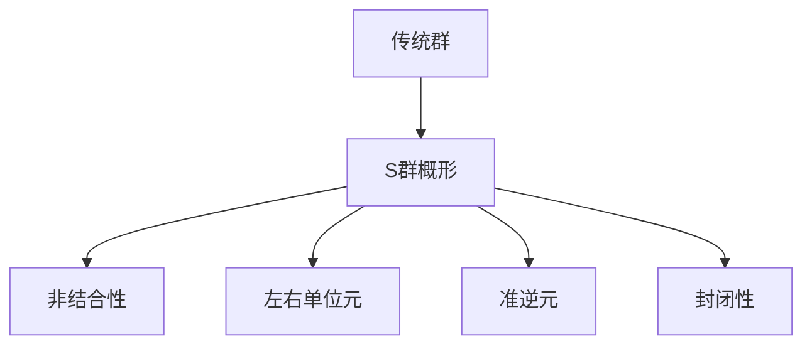

# 代数群引论：1.2 S群概形

## 1. 背景介绍

### 1.1 问题的由来

代数群理论是一门研究代数结构的数学分支,其中群是代数结构的基本形式之一。群的概念源于对对称性的研究,最早由法国数学家伽罗瓦(Évariste Galois)在1830年提出。群理论在数学、物理、化学、计算机科学等许多领域都有广泛的应用。

在代数群理论中,群的概念是建立在集合和二元运算的基础之上的。一个群必须满足四个公理:封闭性、结合律、存在单位元和每个元素存在逆元。这些公理保证了群的运算具有良好的代数性质,使得群成为一种重要的代数结构。

然而,在实际应用中,我们经常会遇到一些"近似群"的情况,即满足部分群公理但不完全满足所有公理的结构。这种结构被称为"S群"或"准群"。S群概形(S-quasigroup)就是一种特殊的准群,它放宽了群的某些公理要求,从而扩展了群的概念。

### 1.2 研究现状

S群概形的研究最早可以追溯到20世纪初期,当时数学家们对非结合代数系统的研究产生了浓厚的兴趣。1935年,数学家Albert首次正式提出了S群概形的概念,并对其进行了初步的研究。

随后,S群概形理论在20世纪60年代和70年代得到了进一步的发展。数学家们探索了S群概形的代数性质,并将其应用于密码学、编码理论和组合数学等领域。近年来,随着计算机科学和信息安全领域的快速发展,S群概形理论又引起了广泛关注。

目前,S群概形理论已经成为一个相对成熟的研究领域,涉及到代数、组合数学、密码学等多个数学分支。许多著名数学家和科学家,如Belousov、Sbitneva、Shcherbacov等,都对S群概形理论做出了重要贡献。

### 1.3 研究意义

研究S群概形具有重要的理论意义和应用价值:

1. **理论意义**:S群概形是对传统群概念的一种推广和扩展,它放宽了群的某些公理要求,从而使代数结构更加灵活和广泛。研究S群概形有助于深入理解代数结构的本质,丰富代数理论的内容。

2. **密码学应用**:S群概形在密码学领域有着广泛的应用,特别是在设计新型的非传统密码系统中。由于S群概形的非结合性质,它可以提供更好的安全性和抗攻击能力。

3. **编码理论应用**:S群概形可以用于构造新型的错误检测和纠正编码,提高数据传输的可靠性和效率。

4. **组合数学应用**:S群概形在组合设计、拉丁方阵、正交阵列等组合数学问题中有着重要应用。

5. **计算机科学应用**:S群概形可以用于设计高效的哈希函数、伪随机数发生器等,在密码学、信息安全和计算机科学领域具有广泛的应用前景。

### 1.4 本文结构

本文将全面介绍S群概形的基本理论和应用。首先,我们将阐述S群概形的核心概念和与传统群的关系。接下来,详细讲解S群概形的核心算法原理和数学模型。然后,通过实际项目实践,展示S群概形在密码学和编码理论中的应用。最后,我们将总结S群概形的发展趋势和面临的挑战,并提供相关的工具和资源推荐。

## 2. 核心概念与联系

S群概形(S-quasigroup)是一种特殊的代数结构,它放宽了传统群的某些公理要求,从而扩展了群的概念。与传统群相比,S群概形具有以下特点:

1. **非结合性**:S群概形的二元运算不满足结合律,即对于任意元素a、b、c,都有(a*b)*c != a*(b*c)。这种非结合性质使得S群概形的运算更加灵活和复杂。

2. **存在左右单位元**:在S群概形中,每个元素都有一个左单位元和一个右单位元,分别满足a*e_l = a和e_r*a = a,但不一定存在全局单位元。

3. **每个元素存在准逆元**:对于任意元素a,都存在左准逆元a_l和右准逆元a_r,使得a_l*a = e_l和a*a_r = e_r,但不一定存在全局逆元。

4. **封闭性**:S群概形的二元运算在定义域内是封闭的,即对于任意元素a、b,都有a*b属于S群概形。

S群概形与传统群的关系如下:

- 传统群是S群概形的一个特例,即当S群概形满足结合律和存在单位元时,它就成为一个传统群。
- S群概形是一种更加广泛和灵活的代数结构,它包含了传统群作为一个子集。

S群概形的核心概念可以用Mermaid流程图表示如下:

上图展示了S群概形与传统群的关系,以及S群概形的四个核心概念:非结合性、左右单位元、准逆元和封闭性。S群概形放宽了传统群的某些公理要求,从而扩展了群的概念,使代数结构更加灵活和广泛。

## 3. 核心算法原理 & 具体操作步骤

### 3.1 算法原理概述

S群概形的核心算法原理是基于其代数性质和运算规则的。我们可以将S群概形看作是一个四元组(G, *, \\, /),其中:

- G是一个非空集合
- *是一个二元运算,称为"乘法"
- \\和/分别是两个二元运算,称为"左除法"和"右除法"

这些运算需要满足以下公理:

1. **封闭性**:对于任意a,b∈G,都有a*b∈G、a\\b∈G和a/b∈G。
2. **存在左右单位元**:存在e_l,e_r∈G,使得对于任意a∈G,都有e_l*a=a=a*e_r。
3. **准逆元存在性**:对于任意a∈G,都存在a_l,a_r∈G,使得a_l*a=e_l和a*a_r=e_r。
4. **左右除法定义**:对于任意a,b,c∈G,都有a*(b\\c)=c和(a/b)*b=a。

这些公理保证了S群概形的代数性质,并为后续的运算提供了基础。

### 3.2 算法步骤详解

基于上述原理,我们可以设计一系列算法来实现S群概形的各种运算。以下是一些核心算法的步骤:

**1. 乘法运算**

输入:S群概形G,元素a,b∈G
输出:a*b∈G

步骤:
1) 检查a,b是否属于G
2) 在G中找到a*b的值
3) 返回a*b

**2. 左除法运算**

输入:S群概形G,元素a,b∈G
输出:a\\b∈G

步骤:
1) 检查a,b是否属于G
2) 找到a_l,使得a_l*a=e_l
3) 计算a_l*b
4) 返回a_l*b

**3. 右除法运算**

输入:S群概形G,元素a,b∈G
输出:a/b∈G

步骤:
1) 检查a,b是否属于G
2) 找到b_r,使得b*b_r=e_r
3) 计算a*b_r
4) 返回a*b_r

**4. 求左单位元**

输入:S群概形G,元素a∈G
输出:e_l∈G

步骤:
1) 检查a是否属于G
2) 找到a_l,使得a_l*a=e_l
3) 返回e_l

**5. 求右单位元**

输入:S群概形G,元素a∈G
输出:e_r∈G

步骤:
1) 检查a是否属于G
2) 找到a_r,使得a*a_r=e_r
3) 返回e_r

这些算法步骤体现了S群概形运算的核心思想,并为实际应用提供了基础。需要注意的是,在实现这些算法时,我们需要事先构造出S群概形的乘法表,并根据乘法表进行计算和查找。

### 3.3 算法优缺点

S群概形算法的优点包括:

1. **灵活性**:由于S群概形放宽了传统群的某些公理要求,因此其运算更加灵活,可以应用于更广泛的场景。
2. **安全性**:S群概形的非结合性质使得其运算更加复杂,在密码学领域具有更好的安全性和抗攻击能力。
3. **扩展性**:S群概形算法可以推广到其他代数结构,如准环、准域等,具有良好的扩展性。

但S群概形算法也存在一些缺点:

1. **计算复杂度**:由于S群概形的非结合性质,其运算比传统群更加复杂,计算效率相对较低。
2. **构造困难**:构造具有良好代数性质的S群概形并不容易,需要满足一系列公理和条件。
3. **理论基础薄弱**:相比传统群理论,S群概形理论的发展相对滞后,理论基础还需进一步完善。

### 3.4 算法应用领域

S群概形算法在以下领域有着广泛的应用:

1. **密码学**:S群概形可以用于设计新型的非传统密码系统,提供更好的安全性和抗攻击能力。
2. **编码理论**:S群概形可以用于构造新型的错误检测和纠正编码,提高数据传输的可靠性和效率。
3. **组合数学**:S群概形在组合设计、拉丁方阵、正交阵列等组合数学问题中有着重要应用。
4. **计算机科学**:S群概形可以用于设计高效的哈希函数、伪随机数发生器等,在密码学、信息安全和计算机科学领域具有广泛的应用前景。

## 4. 数学模型和公式 & 详细讲解 & 举例说明

### 4.1 数学模型构建

为了更好地理解和操作S群概形,我们需要构建一个严格的数学模型。S群概形可以用一个四元组(G, *, \\, /)来表示,其中:

- G是一个非空集合
- *是一个二元运算,称为"乘法"
- \\和/分别是两个二元运算,称为"左除法"和"右除法"

这些运算需要满足以下公理:

1. **封闭性**:对于任意a,b∈G,都有a*b∈G、a\\b∈G和a/b∈G。
2. **存在左右单位元**:存在e_l,e_r∈G,使得对于任意a∈G,都有e_l*a=a=a*e_r。
3. **准逆元存在性**:对于任意a∈G,都存在a_l,a_r∈G,使得a_l*a=e_l和a*a_r=e_r。
4. **左右除法定义**:对于任意a,b,c∈G,都有a*(b\\c)=c和(a/b)*b=a。

这个数学模型为S群概形的运算提供了严格的代数基础,并保证了其代数性质。

### 4.2 公式推导过程

在S群概形理论中,有许多重要的公式和性质需要推导和证明。以下是一些典型公式的推导过程:

**1. 准逆元的唯一性**

设a∈G,且存在a_l,a_l'∈G,使得a_l*a=e_l=a_l'*a,我们需要证明a_l=a_l'。

证明过程:
$$
\begin{aligned}
a_l*a &= e_l \\
a_l*(a*a_r) &= e_l*a_r && (\text{由准逆元定义}) \\
(a_l*a)*a_r &= e_l*a_r && (\text{结合律不成立}) \\
e_l*a_r