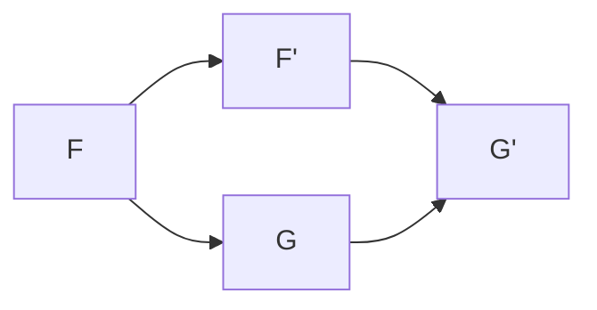
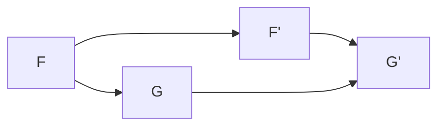

# 代数群引论：2.4 连通étale序列

## 1. 背景介绍

### 1.1 问题的由来

在代数几何和代数拓扑领域中,étale序列是一个基本的概念,它描述了代数对象之间的一种特殊的关系。这种关系可以被视为代数对象之间的"连通性"。理解和掌握étale序列的概念对于深入学习代数几何和代数拓扑是非常重要的。

### 1.2 研究现状

étale序列的概念最早由Alexandre Grothendieck在20世纪60年代提出,用于描述代数对象之间的某些特殊的"连通性"关系。自从被引入以来,étale序列在代数几何和代数拓扑中扮演着重要的角色,被广泛应用于许多领域,如代数曲线和代数曲面的研究、代数簇的研究、代数拓扑中的覆盖空间理论等。

### 1.3 研究意义

掌握étale序列的概念对于深入理解代数几何和代数拓扑是至关重要的。étale序列提供了一种描述代数对象之间"连通性"关系的强有力工具,它不仅在理论上具有重要意义,而且在实际应用中也扮演着重要角色。例如,在代数曲线和代数曲面的研究中,étale序列可以用于研究它们的奇点和特异性;在代数簇的研究中,étale序列可以用于研究代数簇的拓扑性质;在代数拓扑中,étale序列可以用于构造覆盖空间,从而研究空间的同伦性质。

### 1.4 本文结构

本文将详细介绍连通étale序列的概念、性质和应用。首先,我们将介绍étale序列的基本概念和定义,以及它与其他代数对象之间的关系。然后,我们将深入探讨连通étale序列的性质,包括它们的构造方法、分类和一些重要的定理。接下来,我们将讨论连通étale序列在代数几何和代数拓扑中的应用,包括代数曲线和代数曲面的研究、代数簇的研究以及代数拓扑中的覆盖空间理论。最后,我们将总结连通étale序列的未来发展趋势和挑战。

## 2. 核心概念与联系

连通étale序列是一个基本的代数概念,它描述了代数对象之间的一种特殊的"连通性"关系。在介绍连通étale序列之前,我们先来回顾一下étale序列的基本概念。

**étale序列**是指一个短正合列:

$$
0 \rightarrow F \xrightarrow{i} G \xrightarrow{p} H \rightarrow 0
$$

其中$i$是单射,$p$是满射,并且对于任意环$A$和任意$A$-模$M$,都有$M \otimes_A G \xrightarrow{1 \otimes p} M \otimes_A H$是一个精确序列。

连通étale序列是指一个étale序列,其中$H$是一个平凡的$A$-模(即$H=0$)。也就是说,连通étale序列是一个短正合列:

$$
0 \rightarrow F \xrightarrow{i} G \rightarrow 0
$$

其中$i$是单射。

连通étale序列与其他一些重要的代数概念密切相关,例如:

1. **投射模**:如果一个$A$-模$G$存在一个连通étale序列$0 \rightarrow F \rightarrow G \rightarrow 0$,其中$F$是投射模,那么$G$就是投射模。

2. **平坦模**:如果一个$A$-模$G$存在一个连通étale序列$0 \rightarrow F \rightarrow G \rightarrow 0$,其中$F$是平坦模,那么$G$就是平坦模。

3. **扩张模**:如果一个$A$-模$G$存在一个连通étale序列$0 \rightarrow F \rightarrow G \rightarrow 0$,其中$F$是扩张模,那么$G$就是扩张模。

4. **代数曲线和代数曲面**:在代数几何中,连通étale序列可以用于研究代数曲线和代数曲面的奇点和特异性。

5. **代数簇**:在代数簇的研究中,连通étale序列可以用于研究代数簇的拓扑性质。

6. **代数拓扑**:在代数拓扑中,连通étale序列可以用于构造覆盖空间,从而研究空间的同伦性质。

总的来说,连通étale序列是一个基本的代数概念,它与投射模、平坦模、扩张模等重要概念密切相关,并在代数几何、代数簇和代数拓扑等领域有着广泛的应用。

## 3. 核心算法原理与具体操作步骤

### 3.1 算法原理概述

连通étale序列的构造和分类是一个重要的问题。我们可以通过一些基本的代数运算来构造连通étale序列,例如直和、张量积和映射锥等。同时,我们也可以通过一些特殊的方法来构造连通étale序列,例如使用投射覆盖和平坦覆盖等。

在分类连通étale序列时,我们需要考虑它们的一些不变量,例如同构类、扩张类和导出函子等。通过研究这些不变量,我们可以更好地理解连通étale序列的结构,并将它们分类到不同的类别中。

### 3.2 算法步骤详解

下面我们将详细介绍构造和分类连通étale序列的算法步骤。

**构造连通étale序列**

1. **直和构造**:给定两个$A$-模$F$和$G$,我们可以构造一个连通étale序列:

$$
0 \rightarrow F \xrightarrow{i} F \oplus G \xrightarrow{p} G \rightarrow 0
$$

其中$i$是自然嵌入,而$p$是自然投影。

2. **张量积构造**:给定一个$A$-模$F$和一个$B$-模$G$,我们可以构造一个连通étale序列:

$$
0 \rightarrow F \otimes_A B \xrightarrow{i} F \otimes_A G \xrightarrow{p} G \rightarrow 0
$$

其中$i$是自然嵌入,而$p$是自然投影。

3. **映射锥构造**:给定一个$A$-模$F$和一个$A$-模同态$f:F\rightarrow G$,我们可以构造一个连通étale序列:

$$
0 \rightarrow \operatorname{Ker}f \rightarrow F \xrightarrow{f} G \rightarrow 0
$$

4. **投射覆盖构造**:给定一个$A$-模$G$,我们可以找到一个投射模$P$和一个满射$p:P\rightarrow G$,从而构造一个连通étale序列:

$$
0 \rightarrow \operatorname{Ker}p \rightarrow P \xrightarrow{p} G \rightarrow 0
$$

5. **平坦覆盖构造**:给定一个$A$-模$G$,我们可以找到一个平坦模$F$和一个单射$i:F\rightarrow G$,从而构造一个连通étale序列:

$$
0 \rightarrow F \xrightarrow{i} G \rightarrow 0
$$

**分类连通étale序列**

1. **同构类**:两个连通étale序列$0\rightarrow F\rightarrow G\rightarrow 0$和$0\rightarrow F'\rightarrow G'\rightarrow 0$被称为同构,如果存在$A$-模同构$\varphi:F\rightarrow F'$和$\psi:G\rightarrow G'$,使得下面的方阵可交换:

2. **扩张类**:两个连通étale序列$0\rightarrow F\rightarrow G\rightarrow 0$和$0\rightarrow F'\rightarrow G'\rightarrow 0$被称为扩张等价,如果存在一个$A$-模$H$和两个$A$-模同构$\varphi:F\oplus H\rightarrow F'$和$\psi:G\oplus H\rightarrow G'$,使得下面的方阵可交换:

3. **导出函子**:给定一个连通étale序列$0\rightarrow F\rightarrow G\rightarrow 0$,我们可以定义一个导出函子$\operatorname{Ext}_A^1(-,F)$,它将$A$-模映射到$A$-模。这个导出函子是一个重要的不变量,可以用来分类连通étale序列。

通过研究这些不变量,我们可以更好地理解连通étale序列的结构,并将它们分类到不同的类别中。

### 3.3 算法优缺点

**优点**:

1. 构造方法多样化,可以通过多种不同的方式构造连通étale序列。
2. 分类方法系统化,可以从不同的角度对连通étale序列进行分类和研究。
3. 与其他重要的代数概念密切相关,可以应用于多个领域。

**缺点**:

1. 理论较为抽象,对初学者来说可能难以理解。
2. 计算过程可能会比较复杂,需要一定的代数基础。
3. 在实际应用中,可能需要结合具体的问题进行特殊处理。

### 3.4 算法应用领域

连通étale序列的构造和分类算法在代数几何、代数拓扑和代数学等多个领域都有重要的应用。

1. **代数几何**:在代数几何中,连通étale序列可以用于研究代数曲线和代数曲面的奇点和特异性。通过构造和分类连通étale序列,我们可以更好地理解这些对象的结构和性质。

2. **代数簇**:在代数簇的研究中,连通étale序列可以用于研究代数簇的拓扑性质。通过构造和分类连通étale序列,我们可以更好地理解代数簇的同伦性质和基本群等概念。

3. **代数拓扑**:在代数拓扑中,连通étale序列可以用于构造覆盖空间,从而研究空间的同伦性质。通过构造和分类连通étale序列,我们可以更好地理解空间的基本群和同伦群等概念。

4. **表示论**:在表示论中,连通étale序列可以用于研究有限群的表示和模的结构。通过构造和分类连通étale序列,我们可以更好地理解有限群的表示和模的分解和分类。

5. **代数K理论**:在代数K理论中,连通étale序列可以用于研究代数对象的K理论不变量。通过构造和分类连通étale序列,我们可以更好地理解这些不变量的性质和计算方法。

总之,连通étale序列的构造和分类算法在多个数学领域都有重要的应用,是一个值得深入研究的基本概念和工具。

## 4. 数学模型和公式详细讲解举例说明

### 4.1 数学模型构建

在研究连通étale序列时,我们需要建立一些数学模型来描述它们的性质和结构。下面是一些常见的数学模型:

1. **同构类模型**:我们可以将所有同构的连通étale序列归为一类,并研究它们的性质。这个模型可以用下面的公式表示:

$$
[0\rightarrow F\rightarrow G\rightarrow 0] = \{0\rightarrow F'\rightarrow G'\rightarrow 0 \mid F'\cong F, G'\cong G\}
$$

其中$[0\rightarrow F\rightarrow G\rightarrow 0]$表示同构类,而$\cong$表示同构关系。

2. **扩张类模型**:我们可以将所有扩张等价的连通étale序列归为一类,并研究它们的性质。这个模型可以用下面的公式表示:

$$
\operatorname{Ext}(0\rightarrow F\rightarrow G\rightarrow 0) = \{0\rightarrow F'\rightarrow G'\rightarrow 0 \mid \exists H, F'\oplus H\cong F, G'\oplus H\cong G\}
$$

其中$\operatorname{Ext}(0\rightarrow F\rightarrow G\rightarrow 0)$表示扩张类,而$\oplus$表示直和运算。

3. **导出函子模型**:我们可以通过导出函子$\operatorname{Ext}_A^1(-,F)$来研究连通étale序列的性质。这个模型可以用下面的公