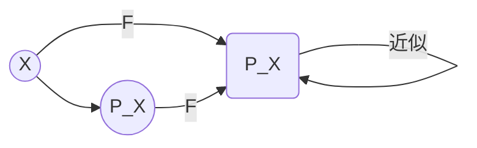

# 代数群引论：A.5 导出函子

## 1. 背景介绍

### 1.1 问题的由来

在范畴论中,函子(Functor)是一种将一个范畴映射到另一个范畴的结构保存映射。函子在数学和计算机科学中扮演着重要角色,特别是在代数抽象和范畴论的研究中。然而,在实践中,我们经常需要从一个已知的函子构造出一个新的函子,这就引出了导出函子(Derived Functor)的概念。

### 1.2 研究现状

导出函子的理论由亚历山大·格罗滕迪克(Alexander Grothendieck)和他的学生在20世纪60年代发展起来。它为解决同伦代数中的一些基本问题提供了强有力的工具。近年来,导出函子在代数几何、代数拓扑和表示论等领域都有广泛的应用。

### 1.3 研究意义

导出函子为我们提供了一种系统地研究和构造新函子的方法。它不仅在纯数学领域有重要应用,在计算机科学中也扮演着关键角色,特别是在函数式编程和类型论方面。理解导出函子的概念和性质,有助于我们更好地掌握范畴论的思想,并将其应用于实际问题中。

### 1.4 本文结构

本文将首先介绍导出函子的核心概念和与其他概念的联系。然后,我们将详细探讨导出函子的算法原理和具体操作步骤,包括数学模型、公式推导和案例分析。接下来,我们将通过一个实际项目实践,展示如何使用导出函子进行编程。最后,我们将讨论导出函子在实际应用中的场景,以及未来的发展趋势和挑战。

## 2. 核心概念与联系

导出函子(Derived Functor)是从一个已知的函子出发,通过特定的构造方法得到的新函子。它的核心思想是保留原函子的某些性质,同时增强或改变其他性质。

导出函子与以下概念密切相关:

1. **左导出函子(Left Derived Functor)**: 通过计算原函子在某些对象上的"左可约余"(left approximation)而得到的新函子。
2. **右导出函子(Right Derived Functor)**: 通过计算原函子在某些对象上的"右可约余"(right approximation)而得到的新函子。
3. **同伦代数(Homological Algebra)**: 导出函子在同伦代数中扮演着核心角色,用于计算同伦群(Homology groups)和导同伦群(Cohomology groups)。
4. **射影分解(Projective Resolution)**: 构造左导出函子时,需要使用射影分解来近似原函子。
5. **内射分解(Injective Resolution)**: 构造右导出函子时,需要使用内射分解来近似原函子。

导出函子的概念不仅在抽象代数和代数几何中有重要应用,在函数式编程和类型论中也扮演着关键角色。例如,在Haskell等函数式编程语言中,`Functor`是一个重要的类型类,而`Applicative`和`Monad`等概念可以看作是对`Functor`的导出。

## 3. 核心算法原理 & 具体操作步骤

### 3.1 算法原理概述

导出函子的构造过程可以概括为以下几个步骤:

1. 选择一个合适的原函子 $F: \mathcal{C} \rightarrow \mathcal{D}$,其中 $\mathcal{C}$ 和 $\mathcal{D}$ 是范畴。
2. 确定要保留或改变原函子的哪些性质。
3. 对于每个对象 $X \in \mathcal{C}$,构造一个"好"的近似对象 $P_X$,使得 $F(P_X)$ 具有所需的性质。
4. 定义新的函子 $L_F: \mathcal{C} \rightarrow \mathcal{D}$,使得 $L_F(X) = F(P_X)$。

这个过程可以用以下的交换图来表示:

其中,箭头 $X \rightarrow P_X$ 表示将对象 $X$ 近似为 "好" 的对象 $P_X$,而箭头 $F(X) \rightarrow F(P_X)$ 则表示原函子 $F$ 在这个近似过程中的作用。

根据选择不同的 "好" 对象 $P_X$ 的方式,我们可以得到不同的导出函子,例如左导出函子和右导出函子。

### 3.2 算法步骤详解

构造左导出函子的具体步骤如下:

1. 选择一个左恰函子(Left Exact Functor) $F: \mathcal{C} \rightarrow \mathcal{D}$,即对任意的满射(Surjective Morphism) $f: X \rightarrow Y$ 在 $\mathcal{C}$ 中,都有 $F(f)$ 是满射在 $\mathcal{D}$ 中。
2. 对于每个对象 $X \in \mathcal{C}$,构造一个射影分解(Projective Resolution):

$$
\cdots \rightarrow P_2 \xrightarrow{d_2} P_1 \xrightarrow{d_1} P_0 \xrightarrow{\epsilon} X \rightarrow 0
$$

其中,每个 $P_i$ 都是射影对象(Projective Object),且序列是恰当的(Exact Sequence),即 $\operatorname{Ker}(d_i) = \operatorname{Im}(d_{i+1})$。

3. 对于每个 $n \geq 0$,定义 $L_nF(X) = H_n(F(P_\bullet))$,其中 $H_n$ 表示第 $n$ 个同伦群(Homology Group),而 $F(P_\bullet)$ 是将函子 $F$ 应用于射影分解 $P_\bullet$ 得到的链复形(Chain Complex)。
4. 对于每个态射 $f: X \rightarrow Y$ 在 $\mathcal{C}$ 中,由于 $F$ 是左恰函子,因此 $F(f)$ 将诱导出一个链映射(Chain Map) $F(P_\bullet^X) \rightarrow F(P_\bullet^Y)$,进而诱导出一个同伦群之间的映射 $L_nF(X) \rightarrow L_nF(Y)$。这样,我们就得到了一个新的函子 $L_nF: \mathcal{C} \rightarrow \mathcal{D}$,称为 $F$ 的第 $n$ 个左导出函子。

构造右导出函子的步骤类似,只是需要使用内射分解(Injective Resolution)来近似对象,并计算导同伦群(Cohomology Group)。

### 3.3 算法优缺点

导出函子算法的优点包括:

1. 提供了一种系统的方法来构造新的函子,扩展了范畴论的表达能力。
2. 在同伦代数中具有重要应用,可以用于计算同伦群和导同伦群。
3. 在函数式编程和类型论中也有应用,例如 Haskell 中的 Applicative 和 Monad 可以看作是对 Functor 的导出。

然而,导出函子算法也存在一些缺点:

1. 构造过程相对复杂,需要掌握射影分解、内射分解和同伦代数等概念。
2. 计算同伦群和导同伦群可能会涉及大量的代数运算,效率较低。
3. 在一般的范畴中,射影对象和内射对象可能不存在,从而无法构造导出函子。

### 3.4 算法应用领域

导出函子在以下领域有广泛应用:

1. **同伦代数**: 用于计算同伦群和导同伦群,是同伦代数的核心工具。
2. **代数几何**: 在研究代数多样体的同伦性质时,导出函子扮演着关键角色。
3. **代数拓扑**: 用于计算拓扑空间的同伦群和导同伦群,是代数拓扑的基础。
4. **表示论**: 在研究李代数和李群的表示时,导出函子提供了有力的工具。
5. **函数式编程**: 在 Haskell 等函数式语言中,Applicative 和 Monad 可以看作是对 Functor 的导出。
6. **类型论**: 导出函子在研究依赖类型(Dependent Type)和证明相关类型(Proof-Relevant Type)时有重要应用。

## 4. 数学模型和公式 & 详细讲解 & 举例说明

### 4.1 数学模型构建

在构造导出函子时,我们需要建立一个数学模型来描述整个过程。这个模型包括以下几个关键部分:

1. **范畴 $\mathcal{C}$ 和 $\mathcal{D}$**: 分别表示原函子的定义域和值域范畴。
2. **原函子 $F: \mathcal{C} \rightarrow \mathcal{D}$**: 我们要从这个函子出发构造新的导出函子。
3. **射影对象(Projective Object)和内射对象(Injective Object)**: 用于构造射影分解和内射分解,是导出函子算法的关键。
4. **射影分解(Projective Resolution)和内射分解(Injective Resolution)**: 分别用于构造左导出函子和右导出函子。
5. **同伦群(Homology Group)和导同伦群(Cohomology Group)**: 导出函子的值域对象,通过计算这些群来定义新的函子。

在这个模型中,我们需要确保范畴 $\mathcal{C}$ 和 $\mathcal{D}$ 满足一定的条件,例如 $\mathcal{C}$ 中存在足够多的射影对象和内射对象,以便进行分解。同时,原函子 $F$ 也需要满足一定的条件,例如左恰或右恰,以确保导出函子的合理性。

### 4.2 公式推导过程

在构造左导出函子时,我们需要计算同伦群 $H_n(F(P_\bullet))$。这个过程可以用以下公式来描述:

对于一个链复形(Chain Complex) $C_\bullet$,其第 $n$ 个同伦群定义为:

$$
H_n(C_\bullet) = \frac{\operatorname{Ker}(d_n)}{\operatorname{Im}(d_{n+1})}
$$

其中,

- $d_n: C_n \rightarrow C_{n-1}$ 是链复形的边界映射(Boundary Map)。
- $\operatorname{Ker}(d_n) = \{x \in C_n \mid d_n(x) = 0\}$ 是 $d_n$ 的核(Kernel)。
- $\operatorname{Im}(d_{n+1}) = \{d_{n+1}(y) \mid y \in C_{n+1}\}$ 是 $d_{n+1}$ 的像(Image)。

在构造左导出函子时,我们将原函子 $F$ 应用于射影分解 $P_\bullet$,得到一个新的链复形 $F(P_\bullet)$。然后,我们计算这个链复形的同伦群 $H_n(F(P_\bullet))$,并将其定义为左导出函子 $L_nF$ 在对象 $X$ 上的值。

对于任意态射 $f: X \rightarrow Y$ 在 $\mathcal{C}$ 中,由于 $F$ 是左恰函子,因此 $F(f)$ 将诱导出一个链映射 $F(P_\bullet^X) \rightarrow F(P_\bullet^Y)$,进而诱导出一个同伦群之间的映射 $L_nF(X) \rightarrow L_nF(Y)$。这样,我们就得到了一个新的函子 $L_nF: \mathcal{C} \rightarrow \mathcal{D}$,称为 $F$ 的第 $n$ 个左导出函子。

构造右导出函子的过程类似,只是需要使用内射分解,并计算导同伦群 $H^n(F(I_\bullet))$。

### 4.3 案例分析与讲解

为了更好地理解导出函子的概念和构造过程,让我们来看一个具体的例子。

考虑范畴 $\mathcal{C} = R\text{-}\\mathbf{Mod}$,其对象是 $R$ 上的左模,态射是 $R$ 模之间的 $R$ 线性映射。我们定义一个函子 $F: R\text{-}\mathbf{Mod} \rightarrow \mathbf{Ab}$,