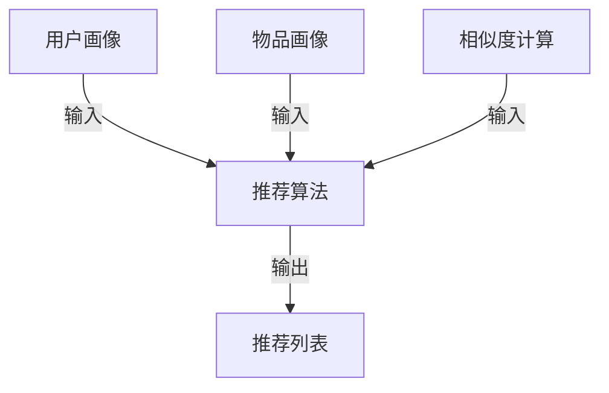

# 传统搜索推荐系统的结果提供

## 1. 背景介绍

### 1.1 问题的由来

在当今信息时代,互联网上存在着海量的数据和信息资源。用户在搜索引擎中输入查询关键词时,往往希望获得与之相关的有价值的信息。然而,由于网络信息的异构性和海量性,单纯依赖关键词匹配往往无法满足用户的实际需求。因此,如何从海量数据中智能地提取与用户查询相关的高质量信息,并以合理的方式呈现给用户,成为了一个亟待解决的问题。

### 1.2 研究现状  

传统的搜索引擎主要依赖关键词匹配和网页排名算法来返回搜索结果。这种方式虽然简单高效,但往往无法充分理解用户的实际需求,导致搜索结果的相关性和满意度不高。为了解决这一问题,研究人员提出了搜索推荐系统(Search Recommendation System)的概念。

搜索推荐系统通过分析用户的查询历史、浏览行为、社交关系等多维度数据,努力挖掘用户的潜在需求和偏好,从而为用户推荐更加个性化和高质量的搜索结果。目前,主流的搜索推荐系统大致可分为以下几种类型:

1. **基于内容的推荐系统**: 根据用户查询的关键词和网页内容的语义相似度,推荐与查询相关的网页或文档。
2. **协同过滤推荐系统**: 基于用户之间的相似性,为目标用户推荐与其他相似用户喜欢的内容。
3. **混合推荐系统**: 将基于内容和协同过滤等多种推荐策略相结合,以获得更加准确的推荐结果。
4. **上下文感知推荐系统**: 考虑用户的地理位置、时间、设备等上下文信息,提供与用户当前环境相关的推荐结果。

### 1.3 研究意义

优秀的搜索推荐系统不仅能够提高用户的搜索体验,还可以为互联网公司带来巨大的商业价值。精准的个性化推荐有助于吸引更多用户,增强用户黏性,从而提高网站的流量和广告收入。此外,搜索推荐系统在电子商务、新闻资讯、社交媒体等多个领域都有广泛的应用前景。

因此,研究和设计高效、准确的搜索推荐算法和系统,对于提升用户体验、促进互联网发展具有重要意义。

### 1.4 本文结构

本文将全面介绍传统搜索推荐系统的核心概念、算法原理、数学模型、实际应用等内容。文章首先阐述搜索推荐系统的基本概念和发展历程,然后详细解析几种主流推荐算法的原理和实现步骤。接下来,我们将构建相应的数学模型,并通过公式推导和案例分析,深入探讨算法的理论基础。

在理论部分之后,文章将转向实践层面,提供完整的代码实例,并对关键模块进行解读和分析。最后,我们将讨论搜索推荐系统在电子商务、新闻资讯等领域的实际应用场景,并对未来的发展趋势和挑战进行展望。

## 2. 核心概念与联系

搜索推荐系统的核心概念主要包括:

1. **用户画像(User Profile)**: 描述用户的基本属性、兴趣爱好、行为习惯等信息的模型。
2. **物品画像(Item Profile)**: 描述物品(如网页、商品、新闻等)的内容特征、元数据等信息的模型。
3. **相似度计算(Similarity Computation)**: 根据特定的相似度度量,计算用户与物品、物品与物品之间的相似程度。
4. **推荐算法(Recommendation Algorithm)**: 基于用户画像、物品画像和相似度计算,为目标用户生成个性化推荐列表的算法。

这些核心概念之间存在紧密的联系,相互依赖和影响。具体来说:

1. 用户画像和物品画像是推荐算法的基础输入,算法的效果很大程度上取决于画像的质量。
2. 相似度计算为推荐算法提供了衡量用户兴趣和物品相关性的标准,是算法的核心环节之一。
3. 推荐算法综合考虑用户画像、物品画像和相似度计算的结果,生成最终的推荐列表。

## 3. 核心算法原理 & 具体操作步骤  

### 3.1 算法原理概述

主流的搜索推荐算法主要包括以下几种:

1. **基于内容的推荐算法**: 根据用户历史浏览记录和物品内容特征,计算用户与物品之间的相似度,推荐与用户偏好相近的物品。
2. **协同过滤推荐算法**: 基于用户之间的相似性,为目标用户推荐与其他相似用户喜欢的物品。
3. **基于知识的推荐算法**: 利用领域知识和规则,根据用户的需求和偏好进行推理,推荐满足特定条件的物品。
4. **混合推荐算法**: 将上述多种算法相结合,以弥补单一算法的不足,提高推荐的准确性和多样性。

### 3.2 算法步骤详解

以基于内容的推荐算法为例,其主要步骤如下:

1. **构建用户画像**: 通过分析用户的浏览历史、点击记录等行为数据,提取用户感兴趣的主题、关键词等,构建用户画像向量。
2. **构建物品画像**: 对物品(如网页、新闻等)的标题、正文内容进行文本挖掘,提取关键词、主题等,构建物品画像向量。
3. **计算相似度**: 采用余弦相似度、Jaccard相似度等度量,计算用户画像与物品画像之间的相似度分数。
4. **生成推荐列表**: 根据相似度分数,为目标用户推荐与其画像最相似的物品集合。

### 3.3 算法优缺点

基于内容的推荐算法具有以下优缺点:

**优点**:
- 无需依赖其他用户的数据,只需要目标用户和物品的信息。
- 算法原理简单,易于实现和解释。
- 能够发现用户潜在的兴趣爱好,为用户推荐新颖的物品。

**缺点**:
- 存在"过度专一化"的问题,推荐结果可能过于相似,缺乏多样性。
- 难以解决"冷启动"问题,即对于新用户或新物品,无法获得足够的数据进行推荐。
- 算法的效果很大程度上取决于用户画像和物品画像的质量。

### 3.4 算法应用领域

基于内容的推荐算法广泛应用于以下领域:

- **新闻资讯推荐**: 根据用户过去阅读的新闻内容,推荐与其兴趣相关的最新资讯。
- **个性化广告投放**: 分析用户的浏览行为,推荐与其潜在需求相关的广告信息。
- **电子商务产品推荐**: 根据用户浏览和购买记录,推荐相似类型或相关的商品。
- **个性化学习资源推荐**: 根据学生的学习偏好和知识水平,推荐合适的教学资源。

## 4. 数学模型和公式 & 详细讲解 & 举例说明

### 4.1 数学模型构建

在基于内容的推荐算法中,用户画像和物品画像通常采用向量空间模型(Vector Space Model)进行表示。

设用户 $u$ 的画像向量为 $\vec{u} = (u_1, u_2, \dots, u_n)$,其中 $u_i$ 表示用户对第 $i$ 个特征词(如关键词、主题等)的兴趣程度。

类似地,物品 $v$ 的画像向量为 $\vec{v} = (v_1, v_2, \dots, v_n)$,其中 $v_i$ 表示物品对第 $i$ 个特征词的相关程度。

### 4.2 公式推导过程

为了量化用户 $u$ 对物品 $v$ 的兴趣程度,我们可以计算两个向量之间的相似度。常用的相似度度量包括:

1. **余弦相似度(Cosine Similarity)**:

$$\text{sim}_\text{cos}(\vec{u}, \vec{v}) = \frac{\vec{u} \cdot \vec{v}}{\|\vec{u}\| \|\vec{v}\|} = \frac{\sum_{i=1}^{n} u_i v_i}{\sqrt{\sum_{i=1}^{n} u_i^2} \sqrt{\sum_{i=1}^{n} v_i^2}}$$

余弦相似度的取值范围为 $[0, 1]$,值越大表示两个向量越相似。

2. **Jaccard相似度(Jaccard Similarity)**:

$$\text{sim}_\text{jac}(\vec{u}, \vec{v}) = \frac{\sum_{i=1}^{n} \min(u_i, v_i)}{\sum_{i=1}^{n} \max(u_i, v_i)}$$

Jaccard相似度也在 $[0, 1]$ 范围内,值越大表示两个向量越相似。

3. **调整余弦相似度(Adjusted Cosine Similarity)**:

$$\text{sim}_\text{adj}(\vec{u}, \vec{v}) = \frac{\sum_{i=1}^{n} (u_i - \bar{u})(v_i - \bar{v})}{\sqrt{\sum_{i=1}^{n} (u_i - \bar{u})^2} \sqrt{\sum_{i=1}^{n} (v_i - \bar{v})^2}}$$

其中 $\bar{u}$ 和 $\bar{v}$ 分别表示 $\vec{u}$ 和 $\vec{v}$ 的均值。调整余弦相似度通过减去均值,消除了向量长度对相似度的影响。

### 4.3 案例分析与讲解

假设用户 $u$ 的画像向量为 $\vec{u} = (2, 1, 0, 3)$,表示该用户对第 1 个和第 4 个特征词有较高的兴趣。

现有两个候选物品 $v_1$ 和 $v_2$,其画像向量分别为:

$$\vec{v_1} = (1, 2, 0, 1)$$
$$\vec{v_2} = (3, 0, 1, 2)$$

我们可以计算用户 $u$ 对这两个物品的相似度:

$$\text{sim}_\text{cos}(\vec{u}, \vec{v_1}) = \frac{2 \times 1 + 1 \times 2 + 0 \times 0 + 3 \times 1}{\sqrt{2^2 + 1^2 + 0^2 + 3^2} \sqrt{1^2 + 2^2 + 0^2 + 1^2}} \approx 0.67$$

$$\text{sim}_\text{cos}(\vec{u}, \vec{v_2}) = \frac{2 \times 3 + 1 \times 0 + 0 \times 1 + 3 \times 2}{\sqrt{2^2 + 1^2 + 0^2 + 3^2} \sqrt{3^2 + 0^2 + 1^2 + 2^2}} \approx 0.89$$

可以看出,用户 $u$ 对物品 $v_2$ 的兴趣更高,因此推荐系统应该优先推荐 $v_2$ 给用户。

### 4.4 常见问题解答

1. **如何处理用户画像和物品画像的稀疏性问题?**

对于高维稀疏向量,可以采用降维技术(如SVD、LDA等)将其映射到低维密集向量空间,从而提高相似度计算的效率和准确性。

2. **如何解决"冷启动"问题?**

对于新用户或新物品,可以利用其他辅助信息(如用户个人资料、物品元数据等)构建初始画像,并在后续的交互过程中不断优化和更新画像。

3. **相似度计算是否考虑特征词的重要性?**

是的,通常会为不同的特征词赋予不同的权重,反映其在用户画像或物品画像中的重要程度。常用