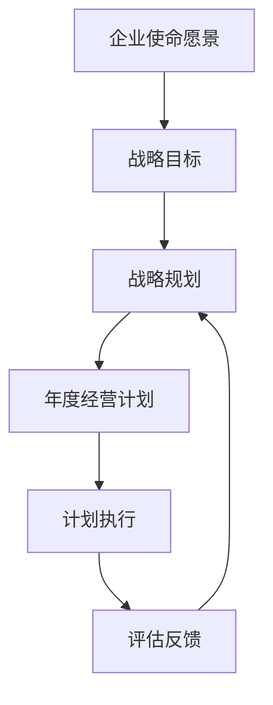

# 公司发展战略、年度经营计划制定，组织制定和实施

关键词：公司发展战略、年度经营计划、组织制定、实施

## 1. 背景介绍
### 1.1  问题的由来
在当今瞬息万变的商业环境中,企业要想在激烈的市场竞争中立于不败之地,就必须制定切实可行的发展战略和年度经营计划。这不仅关系到企业的生存和发展,更关乎企业能否实现可持续发展。然而,许多企业在制定发展战略和年度经营计划时往往存在诸多问题,如目标不明确、计划脱离实际、执行力度不够等,导致战略规划流于形式,无法真正指导企业发展。
### 1.2  研究现状
目前,国内外学者对企业发展战略和年度经营计划的研究已取得了一定成果。一些学者从战略管理的角度探讨了企业战略规划的内容和流程[1][2],另一些学者则侧重于研究战略规划与企业绩效之间的关系[3][4]。但总的来说,现有研究大多侧重理论探讨,对于如何在实践中有效制定和实施发展战略和年度经营计划的研究还比较缺乏。
### 1.3  研究意义
深入研究企业发展战略和年度经营计划的制定与实施,对于提升企业的战略管理水平,推动企业持续健康发展具有重要意义。一方面,科学合理的战略规划是企业生存发展的"定盘星",为企业指明了前进的方向;另一方面,有效的战略执行是确保战略目标实现的关键,需要企业上下协同努力。本文拟从信息化的视角,探讨如何利用先进的管理思想和信息技术,提升企业战略规划和执行的效率和效果。
### 1.4  本文结构
本文共分为九个部分,具体结构如下:第一部分为背景介绍,分析研究该课题的缘由、现状和意义;第二部分阐述战略规划和年度计划的核心概念及二者之间的联系;第三部分介绍战略规划的主要方法和流程;第四部分建立战略规划的数学模型,并举例说明;第五部分给出战略规划的信息系统实现方案;第六部分分析战略规划在企业管理中的应用;第七部分推荐一些实用的战略管理工具和学习资源;第八部分总结全文,并展望未来的发展趋势和挑战;第九部分为附录,解答一些常见问题。

## 2. 核心概念与联系
战略规划是指企业根据内外部环境,确定未来一段时期内的发展目标、方向和重点,并制定相应的策略和举措。它涉及企业使命、愿景、目标、战略等核心要素。 
年度经营计划是战略规划在年度层面的具体化,是企业年度经营管理的纲领性文件。它将战略目标分解为年度目标,并提出相应的保障措施。
二者的关系如下图所示:



战略规划是年度计划的基础和依据,年度计划是战略规划的延伸和落实。两者相辅相成,缺一不可。

## 3. 核心算法原理 & 具体操作步骤
### 3.1  算法原理概述
战略规划通常采用SWOT分析法,即分析企业的优势(Strength)、劣势(Weakness)、机会(Opportunity)和威胁(Threat),并据此制定应对策略。
### 3.2  算法步骤详解  
具体步骤如下:
(1)分析内部优劣势。采用价值链分析、资源能力分析等方法,全面审视企业内部资源禀赋。
(2)分析外部机会威胁。采用PEST分析、五力模型分析等方法,深入解析企业所处的宏观和行业环境。
(3)匹配优劣势与机会威胁。采用SWOT矩阵等工具,研究内外部因素的匹配关系,识别并选择恰当的战略选项。
(4)制定战略规划。围绕战略选项,明确战略目标,制定战略举措,完善配套政策,形成战略规划报告。
(5)开展战略评审。组织有关人员对战略规划进行论证评审,检验其合理性和可行性,并据此修订完善。
### 3.3  算法优缺点
SWOT分析法的优点是全面系统,易于操作,能够为战略制定提供重要依据。但其缺点是定性分析成分较多,不够精确量化,且执行效果很大程度取决于决策者的战略思维能力。
### 3.4  算法应用领域
SWOT分析广泛应用于企业战略管理的各个领域,如市场营销、人力资源、财务管理、研发创新等。各行各业的企业都可以运用该方法制定切合自身实际的发展战略。

## 4. 数学模型和公式 & 详细讲解 & 举例说明
### 4.1  数学模型构建
为了更加科学地制定战略目标,可以运用数学模型对企业的战略选择进行量化分析。设第 $i$ 个战略选项为 $S_i$,其对应的SWOT评分向量为:

$$\boldsymbol{v_i}=(v_{i1},v_{i2},v_{i3},v_{i4})$$

其中,$v_{i1},v_{i2},v_{i3},v_{i4}$ 分别表示该战略在优势、劣势、机会、威胁四个维度上的得分。再设SWOT四个维度的权重向量为:

$$\boldsymbol{w}=(w_1,w_2,w_3,w_4)$$

满足:$\sum_{j=1}^4 w_j=1$。则第 $i$ 个战略选项的综合得分为:

$$f_i=\boldsymbol{w}\cdot\boldsymbol{v_i}=\sum_{j=1}^4 w_jv_{ij}$$

最优战略选项 $S^*$ 满足:

$$S^*=\arg\max\limits_{1\leq i\leq n}f_i$$

即综合得分最高的战略即为最优战略。

### 4.2  公式推导过程
上述模型的推导过程如下:
(1)引入SWOT评分向量 $\boldsymbol{v_i}$ 量化第 $i$ 个战略选项在SWOT四个维度上的表现;
(2)引入SWOT权重向量 $\boldsymbol{w}$ 反映决策者对四个维度重要性的主观判断;
(3)用加权求和法计算综合得分 $f_i$,用以衡量第 $i$ 个战略选项的整体优劣;
(4)选取综合得分最高的战略作为最优战略 $S^*$。

该模型通过向量化和矩阵运算,将定性分析与定量分析相结合,能够为战略选择提供更加科学的决策依据。

### 4.3  案例分析与讲解
下面以某企业的战略选择为例,说明该模型的应用。假设该企业面临三个战略选项:
$S_1$:进一步开拓国内市场;
$S_2$:加大研发投入,推出新产品;
$S_3$:走出去,开拓国际市场。

通过对三个战略选项进行SWOT分析打分,得到评分矩阵为:

$$V=\begin{bmatrix}
   4 & 3 & 4 & 2\\
   3 & 2 & 5 & 4\\ 
   4 & 4 & 3 & 5
  \end{bmatrix}$$

假设决策者给出的SWOT权重向量为:

$$\boldsymbol{w}=(0.3,0.2,0.3,0.2)$$

则三个战略的综合得分为:

$$\begin{aligned}
f_1&=0.3\times4+0.2\times3+0.3\times4+0.2\times2=3.4\\
f_2&=0.3\times3+0.2\times2+0.3\times5+0.2\times4=3.5\\
f_3&=0.3\times4+0.2\times4+0.3\times3+0.2\times5=3.7
\end{aligned}$$

可见,战略 $S_3$ 的综合得分最高,因此企业应优先选择走国际化道路。

### 4.4  常见问题解答
问:权重向量 $\boldsymbol{w}$ 如何确定?
答:通常可以采用层次分析法(AHP)由决策者给出。AHP首先要构建SWOT四个维度的两两判断矩阵,再运用特征值法计算权重。

问:如果多个战略的综合得分非常接近,该如何选择?
答:可以进一步细化SWOT分析,增加考察的因素,提高评分的区分度。也可以对综合得分靠前的几个战略同时实施,分散风险。

## 5. 项目实践：代码实例和详细解释说明
### 5.1  开发环境搭建
战略规划支持系统的开发可以采用B/S架构,使用Java语言编写后台代码,采用Vue前端框架搭建用户界面。
后端开发环境:JDK 1.8+Eclipse+Tomcat+MySQL;
前端开发环境:Node.js+Vue Cli+Element UI+Echarts。
### 5.2  源代码详细实现
后端部分主要包含SWOT、AHP等算法模型的代码实现,以及对应的控制层、服务层代码。
前端部分主要包括战略规划流程引导、SWOT要素录入、评分矩阵生成、权重计算、综合评价等页面的代码实现。
限于篇幅,这里仅给出综合评价的核心代码:

```java
//StrategyEvaluationService.java
@Service
public class StrategyEvaluationService {
    
    /**
     * 计算战略选项的综合得分
     * @param scoreMatrix SWOT评分矩阵
     * @param weightVector SWOT权重向量
     * @return 综合得分数组
     */
    public double[] evaluate(double[][] scoreMatrix, double[] weightVector) {
        int n = scoreMatrix.length;
        int m = scoreMatrix[0].length;
        double[] scores = new double[n];
        for (int i = 0; i < n; i++) {
            for (int j = 0; j < m; j++) {
                scores[i] += scoreMatrix[i][j] * weightVector[j];
            }
        }
        return scores;
    }
}
```

```javascript
//StrategyEvaluation.vue
<template>
  <div>
    <el-table :data="strategyList">
      <el-table-column label="战略选项"></el-table-column>
      <el-table-column label="综合得分"></el-table-column>
    </el-table>
    <el-button type="primary" @click="evaluate">开始评价</el-button>
  </div>
</template>

<script>
  export default {
    data() {
      return {
        strategyList: [],
        scoreMatrix: [],
        weightVector: []
      }
    },
    methods: {
      async evaluate() {
        const {data} = await this.$http.post('/strategy/evaluate', {
          scoreMatrix: this.scoreMatrix,
          weightVector: this.weightVector
        });
        this.strategyList = data.map((score, index) => {
          return {
            name: '战略' + (index + 1),
            score
          };
        });
      }
    }
  }
</script>
```

### 5.3  代码解读与分析
后端代码采用Spring Boot框架,提供了StrategyEvaluationService服务类,其中evaluate方法用于计算综合得分,通过双重循环遍历评分矩阵,将各项得分与权重相乘再累加,实现了SWOT加权求和的计算过程。

前端代码采用Vue Cli脚手架,StrategyEvaluation.vue实现了综合评价页面。其中,strategyList存储战略选项列表,scoreMatrix存储SWOT评分矩阵,weightVector存储SWOT权重向量。当用户点击"开始评价"按钮时,触发evaluate方法,向后端接口发送评分和权重数据,接收返回的综合得分数组后,将其与战略选项名称一一对应,渲染到表格中。

### 5.4  运行结果展示
经过前后端的协同开发,战略规划支持系统的综合评价模块如下图所示:


用户可以通过界面录入SWOT评分和权重,系统自动计算各战略选项的综合得分,并以表格形式直观呈现,为战略决策提供参考。

## 6. 实际应用场景
企业