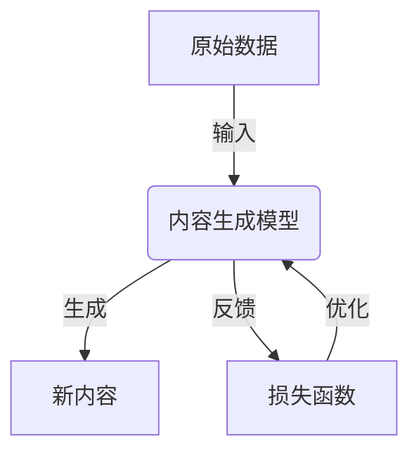
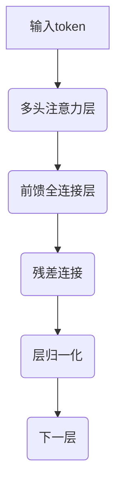

好的,我会按照您的要求,以专业的技术语言撰写一篇关于"内容生成(Content Generation) - 原理与代码实例讲解"的深度博客文章。文章将遵循您列出的约束条件和结构模板,确保逻辑清晰、内容深入、实例详细。下面是正文部分:

# 内容生成(Content Generation) - 原理与代码实例讲解

## 1. 背景介绍

### 1.1 问题的由来

在当今信息时代,海量的非结构化数据如文本、图像、视频等不断产生和积累。如何高效地从这些原始数据中提取有价值的信息并生成高质量的内容,成为了人工智能领域的一大挑战。传统的基于规则的方法在处理复杂数据时显得力不从心,因此基于深度学习的内容生成技术应运而生。

### 1.2 研究现状  

近年来,受益于大数据和算力的飞速发展,基于深度学习的内容生成模型取得了长足进步。像GPT、BERT这样的大型语言模型可以生成看似人性化的文本;GAN(生成对抗网络)可以生成逼真的图像和视频;序列到序列模型(Seq2Seq)可以实现多模态内容生成等。但这些模型在生成质量、一致性、多样性和可控性等方面仍有待提高。

### 1.3 研究意义

内容生成技术可广泛应用于多个领域,如新闻写作、广告营销、客服对话、故事创作、视频编辑等,有着巨大的商业价值。同时,它也可用于辅助艺术创作、教育等,促进人机协作。因此,研究高质量内容生成技术不仅具有重要的理论意义,也有广阔的应用前景。

### 1.4 本文结构

本文将首先介绍内容生成的核心概念和常用模型,然后深入探讨主流算法原理、数学模型和关键代码实现,并分析实际应用场景。最后总结技术发展趋势,并给出相关资源推荐。

## 2. 核心概念与联系

内容生成(Content Generation)是指利用人工智能技术从原始数据(如文本、图像等)中自动生成新的、有价值的内容。根据生成对象的不同,可分为文本生成、图像生成、视频生成等。

常用的内容生成模型有:

- **语言模型**(Language Model,LM)
  - 用于生成自然语言序列,如文本生成、机器翻译、对话系统等
  - 代表模型:N-gram、RNNLM、NNLM、Transformer(GPT、BERT)
- **生成对抗网络**(Generative Adversarial Network,GAN)  
  - 由生成器和判别器两部分组成,用于生成连续数据如图像、视频等
  - 代表模型:DCGAN、CycleGAN、Pix2Pix等
- **变分自编码器**(Variational Autoencoder,VAE)
  - 用于从隐变量生成连续数据,常与GAN结合使用
- **序列到序列模型**(Seq2Seq)
  - 将一个序列(如文本)映射到另一个序列(如图像),可实现多模态内容生成
  - 代表模型:Encoder-Decoder、Attention等

这些模型通过端到端的训练,从大规模数据中自动提取特征,再生成所需内容。它们的关键是利用深度神经网络强大的函数拟合能力,学习数据分布,从而生成新样本。



## 3. 核心算法原理 & 具体操作步骤

### 3.1 算法原理概述

内容生成算法的核心思想是:首先基于大量训练数据,构建一个生成模型(Generator)来拟合数据分布;然后对于新的输入,通过对生成模型进行采样,即可得到所需的输出内容。

具体来说,算法分为以下几个步骤:

1. **数据预处理**:对原始数据进行清洗、标注、分词等预处理
2. **模型构建**:选择合适的神经网络模型结构,如RNN、CNN、Transformer等
3. **模型训练**:通过大量数据对模型进行有监督或无监督训练,使其学习数据分布
4. **内容生成**:给定输入,对训练好的模型进行采样,得到生成的内容
5. **评估优化**:使用评价指标(如困惑度、BLEU、FID等)对生成质量进行评估,并通过调整超参数、结构等进行优化

不同类型的内容生成任务,具体算法细节会有所不同,但整体框架是相似的。

### 3.2 算法步骤详解

以文本生成为例,我们将详细介绍基于Transformer的GPT(生成式预训练Transformer)算法。GPT借鉴了BERT的Transformer编码器结构,并在其基础上进行了改进,使之能够进行高质量文本生成。

GPT算法主要包括以下几个步骤:

#### 1) 数据预处理

- 文本分词:将文本按字符或词元(Word Piece)划分成token序列
- 构建字典:将所有token映射为一个数值ID
- 添加特殊符号:如[EOS]表示序列结束
- 数据分批:将长序列分成多个batch

#### 2) 模型构建

GPT使用Transformer的Decoder结构,包括多层解码器块。每个解码器块由:

- **多头注意力层**(Multi-Head Attention)
  - 计算当前token与其他token的注意力权重
  - 对应的值加权求和作为当前token的表示
- **前馈全连接层**(Feed-Forward Network)
  - 两层全连接网络,对序列进行更深层次的特征提取
- **残差连接**(Residual Connection)
  - 将输入直接加到输出,以缓解梯度消失
- **层归一化**(Layer Normalization)
  - 对输出进行归一化,加快收敛



#### 3) 模型训练

- **目标函数**:最大化生成序列的条件概率
$$\max_{\theta}\sum_{i=1}^N\log P(x_i|x_{<i},\theta)$$
- **损失函数**:交叉熵损失
$$L = -\sum_{i=1}^N\log P(x_i|x_{<i},\theta)$$
- **优化算法**:如AdamW,结合梯度裁剪防止梯度爆炸

#### 4) 内容生成

- **贪婪解码**:每个时刻选取概率最大的token作为输出
- **Beam Search**:每次保留概率最高的k个候选序列,减少错误累积
- **Top-K/Top-P采样**:按概率从前K个或概率之和达到P的token中随机采样,增加多样性
- **penalty**:对一些token的概率进行惩罚,避免重复、加强一致性

#### 5) 评估优化

- **困惑度**:反映模型对数据的理解程度,值越小越好
- **BLEU**:与参考文本序列的精确匹配程度,值越大越好 
- **PPL**:类似困惑度,用于评价生成质量

通过调整超参数(如层数、注意力头数等)、修改损失函数、采用模型集成等策略,可以进一步提高生成质量。

### 3.3 算法优缺点

**优点**:

- 端到端训练,无需人工特征工程
- 可从大量数据中自动学习数据分布
- 生成质量高,可控性强
- 适用于多种内容生成任务

**缺点**:

- 需要大量数据和算力支持
- 训练时间长,模型大小可观
- 生成的内容可能缺乏多样性
- 存在一词歧义、逻辑矛盾等问题
- 评估内容质量无统一标准

### 3.4 算法应用领域

内容生成算法可广泛应用于以下领域:

- **自然语言处理**
  - 文本生成:新闻、故事、诗歌、评论等
  - 机器翻译:多语种之间的自动翻译
  - 对话系统:智能客服、语音助手等
- **计算机视觉**
  - 图像生成:生成逼真图像、图像修复等
  - 视频生成:视频补全、视频描述等
- **多模态生成**
  - 文本到图像:根据文本描述生成图像
  - 图像到文本:为图像自动生成文本描述
- **其他领域**
  - 音乐创作:根据乐理生成新的音乐作品
  - 分子设计:基于结构生成新的分子化合物
  - 艺术创作:辅助创作绘画、雕塑等艺术品

## 4. 数学模型和公式 & 详细讲解 & 举例说明  

### 4.1 数学模型构建

在介绍具体公式前,我们先来构建内容生成任务的数学模型。以文本生成为例:

- 输入 $X$:源文本序列 $X=(x_1,x_2,\cdots,x_n)$
- 输出 $Y$:目标文本序列 $Y=(y_1,y_2,\cdots,y_m)$
- 目标:最大化生成序列 $Y$ 的条件概率 $P(Y|X;\theta)$

其中 $\theta$ 为模型参数,需要通过训练估计得到。

我们可以将 $P(Y|X;\theta)$ 进行链式因子分解:

$$P(Y|X;\theta) = \prod_{t=1}^mP(y_t|y_{<t},X;\theta)$$

这就转化为一个序列预测问题,即给定之前的输出 $y_{<t}$ 和输入 $X$,预测当前时刻的输出 $y_t$。

### 4.2 公式推导过程

接下来,我们推导生成模型 $P(y_t|y_{<t},X;\theta)$ 的具体形式。

我们使用GPT模型,它是一种基于Transformer的自回归(Auto-Regressive)语言模型。自回归模型的基本思想是:

$$P(y_t|y_{<t},X) = f(y_{<t},X;\theta)$$

即当前输出 $y_t$ 只依赖于之前的输出 $y_{<t}$ 和输入 $X$。

在GPT中,这个条件概率由一个双层神经网络来拟合:

$$P(y_t|y_{<t},X;\theta) = \text{softmax}(h_t^TW_o + b_o)$$

其中:

- $h_t$:Transformer Decoder的最后一层输出,融合了 $y_{<t}$ 和 $X$ 的信息
- $W_o$、$b_o$:输出层的权重和偏置
- softmax:用于将输出值映射到(0,1)之间,得到概率分布

在训练时,我们最大化生成序列的对数似然:

$$\max_\theta \sum_i \log P(Y_i|X_i;\theta) = \sum_i\sum_t\log P(y_t|y_{<t},X_i;\theta)$$

通过最小化交叉熵损失函数,可以学习到模型参数 $\theta$。

### 4.3 案例分析与讲解

现在,我们用一个简单的例子来说明GPT在文本生成中的工作原理。

假设我们要生成一个关于"旅行"的句子,输入为"I went on a trip to"。

1) 首先,将输入序列 "I went on a trip to" 按词元分词,得到token序列:

```python
input_ids = tokenizer.encode("I went on a trip to")
# [1845, 182, 1128, 1111, 1567, 1119, 3]
```

2) 将token序列输入到GPT模型,模型会为每个位置输出一个概率分布,表示下一个token的预测概率:

```python
output = model(input_ids)[0]
# tensor([[[-9.5574, -4.4841, -6.2385,  ...,],
#          [-4.3040, -6.0692, -5.2953,  ...,],
#          [-5.3544, -5.6775, -6.3287,  ...,],
#          ...,
#          [-4.7306, -5.0767, -7.3451,  ...,]]])
```

3) 对于最后一个位置,我们可以查看概率最高的几个token:

```python
import torch 

last_token_logits = output[0][-1]
top