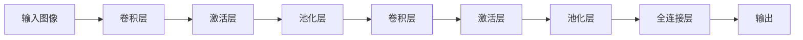

# 卷积神经网络(Convolutional Neural Networks) - 原理与代码实例讲解

关键词：卷积神经网络, CNN, 深度学习, 图像识别, 特征提取, 池化, 反向传播, TensorFlow, Keras

## 1. 背景介绍
### 1.1 问题的由来
随着人工智能技术的飞速发展,图像识别已成为当前研究的热点领域之一。传统的图像识别方法主要依赖于手工提取特征,存在特征表达能力不足、泛化能力差等问题。如何从海量图像数据中自动学习更加抽象和鲁棒的特征表示,是图像识别领域亟需解决的关键问题。

### 1.2 研究现状 
近年来,以卷积神经网络(Convolutional Neural Networks, CNN)为代表的深度学习方法在图像识别领域取得了突破性进展。CNN通过逐层自动学习层次化的特征表示,大大提升了图像识别的性能,在ImageNet大规模图像分类竞赛中多次刷新记录。目前,CNN已成为图像识别的主流方法,在人脸识别、场景分类、目标检测等任务中得到了广泛应用。

### 1.3 研究意义
深入理解CNN的内部工作原理,对于进一步改进CNN模型性能、拓展其应用范围具有重要意义。通过剖析CNN的网络结构与训练算法,讲解其数学原理,并给出详细的代码实例,可以帮助研究者和工程师更好地掌握这一强大的深度学习工具,推动人工智能技术在图像识别等领域的发展。

### 1.4 本文结构
本文将全面介绍CNN的原理和实现。第2节介绍CNN的核心概念。第3节重点讲解CNN的网络结构与训练算法。第4节给出CNN的数学模型与公式推导。第5节通过代码实例展示如何使用TensorFlow和Keras实现CNN。第6节讨论CNN的实际应用场景。第7节推荐CNN相关的学习资源。第8节总结全文并展望CNN的未来发展方向。

## 2. 核心概念与联系

CNN是一种特殊的多层前馈神经网络,它的网络结构主要由以下几个核心概念组成:

- 卷积层(Convolutional Layer):通过卷积操作提取局部特征。
- 池化层(Pooling Layer):对特征图下采样,减少参数数量。  
- 全连接层(Fully-connected Layer):对卷积和池化后的特征进行分类预测。
- 激活函数(Activation Function):增加网络的非线性表达能力,如ReLU。
- 损失函数(Loss Function):衡量模型预测值与真实值的差异,如交叉熵。  
- 优化算法(Optimization Algorithm):通过梯度下降等方法最小化损失函数,更新网络参数,如Adam。

下图展示了CNN的典型网络结构,由若干卷积层、池化层和全连接层组成:

CNN通过卷积和池化操作逐层提取图像的层次化特征,再经过全连接层映射到类别标签空间。在训练过程中,CNN采用反向传播算法和梯度下降法最小化损失函数,学习到判别性强的特征表示。CNN的这种端到端学习范式克服了传统方法对特征工程的依赖,是其性能超越的关键。

## 3. 核心算法原理 & 具体操作步骤
### 3.1 算法原理概述
CNN的核心是通过卷积和池化操作实现特征提取和下采样。卷积层使用卷积核对输入特征图进行卷积,得到新的特征图。池化层对特征图进行降采样,减小特征图的尺寸。卷积和池化的组合可以逐层提取图像的层次化特征表示。

设第 $l$ 层的输入特征图为 $a^{[l-1]}$,卷积核为 $w^{[l]}$,偏置为 $b^{[l]}$,激活函数为 $\sigma$,则卷积层的前向传播公式为:

$$z^{[l]} = a^{[l-1]} * w^{[l]} + b^{[l]}$$
$$a^{[l]} = \sigma(z^{[l]})$$

其中 $*$ 表示卷积操作。

设池化层的池化区域大小为 $s \times s$,则池化层的前向传播公式为:

$$a^{[l]} = pool_{s \times s}(a^{[l-1]})$$

其中 $pool$ 表示池化函数,常见的有最大池化和平均池化。

### 3.2 算法步骤详解
CNN的训练算法主要分为以下几个步骤:

1. 初始化模型参数,包括卷积核权重、偏置等。
2. 前向传播:逐层进行卷积、激活、池化等操作,得到预测输出。 
3. 计算损失函数,衡量预测值与真实值的差异。
4. 反向传播:计算损失函数对各层参数的梯度。
5. 更新参数:使用优化算法如梯度下降法更新各层参数。
6. 重复步骤2-5,直到模型收敛或达到预设的迭代次数。

在测试阶段,只需进行前向传播,将输入图像经过训练好的CNN模型,得到预测类别。

### 3.3 算法优缺点
CNN相比传统方法的优点主要有:

- 端到端学习,无需手工设计特征,特征表达能力强。
- 通过卷积和池化操作,具有一定的平移不变性和尺度不变性。
- 参数共享,大大减少了模型参数数量。
- 分层结构设计,可以建模图像的层次化特征。

CNN的缺点包括:  

- 模型复杂,训练时间长,需要大量标注数据和计算资源。
- 模型可解释性差,难以理解内部工作机制,容易成为"黑盒子"。  
- 对旋转和视角变化等缺乏鲁棒性,泛化能力有待提高。

### 3.4 算法应用领域  
CNN已在多个图像识别任务中取得了巨大成功,主要应用领域包括:

- 图像分类:如ImageNet图像分类、场景识别等。
- 目标检测:如行人检测、车辆检测等。
- 语义分割:如像素级别的图像理解。
- 人脸识别:包括人脸检测、人脸验证和人脸识别等。  
- 医学图像分析:如肿瘤检测、病变区域分割等。

此外,CNN还被用于视频分析、自然语言处理等领域,展现出广阔的应用前景。

## 4. 数学模型和公式 & 详细讲解 & 举例说明
### 4.1 数学模型构建
CNN的数学模型可以表示为一个多层组合函数。设输入图像为 $x$,CNN的 $L$ 层映射函数为 $f_1, f_2, ..., f_L$,分类器为 $g$,整个CNN模型可以表示为:

$$F(x) = g(f_L(...f_2(f_1(x))...))$$

其中每层映射函数 $f_l$ 可以进一步分解为卷积、激活、池化等操作的组合:

$$f_l(a^{[l-1]}) = pool(σ(w^{[l]} * a^{[l-1]} + b^{[l]}))$$

CNN的目标是学习出一组最优的函数参数 $\{w^{[l]}, b^{[l]}\}_{l=1}^L$,使得模型在训练集上的经验风险最小化:

$$\min_{\{w^{[l]}, b^{[l]}\}_{l=1}^L} \frac{1}{N} \sum_{i=1}^N L(F(x_i), y_i)$$

其中 $\{(x_i, y_i)\}_{i=1}^N$ 为 $N$ 个训练样本, $L$ 为损失函数。

### 4.2 公式推导过程
对于卷积层,设输入特征图 $a^{[l-1]}$ 的尺寸为 $W_{l-1} \times H_{l-1} \times C_{l-1}$,卷积核 $w^{[l]}$ 的尺寸为 $F_l \times F_l \times C_{l-1} \times C_l$,偏置 $b^{[l]}$ 的尺寸为 $C_l$,卷积步长为 $S_l$,则卷积层输出特征图 $a^{[l]}$ 的尺寸为:

$$W_l = \frac{W_{l-1} - F_l}{S_l} + 1$$
$$H_l = \frac{H_{l-1} - F_l}{S_l} + 1$$  
$$C_l = \text{卷积核个数}$$

卷积层的前向传播公式为:

$$z^{[l]}_{i,j,k} = \sum_{c=0}^{C_{l-1}} \sum_{m=0}^{F_l-1} \sum_{n=0}^{F_l-1} w^{[l]}_{m,n,c,k} \cdot a^{[l-1]}_{i \cdot S_l+m, j \cdot S_l+n, c} + b^{[l]}_k$$
$$a^{[l]}_{i,j,k} = \sigma(z^{[l]}_{i,j,k})$$

其中 $i,j$ 为特征图的空间位置索引, $k$ 为输出通道索引, $c$ 为输入通道索引, $m,n$ 为卷积核的空间位置索引。

对于最大池化层,设池化区域大小为 $s \times s$,池化步长与之相同,则池化后的特征图尺寸为:

$$W_l = \frac{W_{l-1}}{s}, H_l = \frac{H_{l-1}}{s}, C_l = C_{l-1}$$

最大池化的前向传播公式为:

$$a^{[l]}_{i,j,k} = \max_{0 \leq m,n < s} a^{[l-1]}_{i \cdot s+m, j \cdot s+n, k}$$

平均池化的前向传播公式为:  

$$a^{[l]}_{i,j,k} = \frac{1}{s^2} \sum_{m=0}^{s-1} \sum_{n=0}^{s-1} a^{[l-1]}_{i \cdot s+m, j \cdot s+n, k}$$

### 4.3 案例分析与讲解
下面以一个简单的二分类任务为例,说明如何使用CNN进行图像分类。假设输入图像尺寸为 $32 \times 32 \times 3$,CNN模型包含两个卷积层、两个池化层和两个全连接层,具体结构如下:

- 卷积层1:卷积核尺寸 $5 \times 5$,个数 $6$,步长 $1$,ReLU激活函数
- 最大池化层1:池化区域 $2 \times 2$,步长 $2$ 
- 卷积层2:卷积核尺寸 $5 \times 5$,个数 $16$,步长 $1$,ReLU激活函数
- 最大池化层2:池化区域 $2 \times 2$,步长 $2$
- 全连接层1:神经元个数 $120$,ReLU激活函数
- 全连接层2:神经元个数 $2$,Softmax激活函数

根据前面的公式,可以计算出各层特征图的尺寸:

- 卷积层1输出:$28 \times 28 \times 6$ 
- 池化层1输出:$14 \times 14 \times 6$
- 卷积层2输出:$10 \times 10 \times 16$
- 池化层2输出:$5 \times 5 \times 16$
- 全连接层1输入:$5 \times 5 \times 16=400$
- 全连接层1输出:$120$  
- 全连接层2输出:$2$

可见,经过多层卷积和池化后,特征图的尺寸逐层减小,通道数逐层增加,形成了图像的层次化表示。最后通过全连接层映射到两个类别输出。该CNN模型总共有$(5 \times 5 \times 3+1) \times 6+(5 \times 5 \times 6+1) \times 16+(400+1) \times 120+(120+1) \times 2=61516$个参数需要学习。

在训练时,可以使用交叉熵损失函数,并用反向传播算法求梯度,再用梯度下降等优化算法更新参数,直到模型