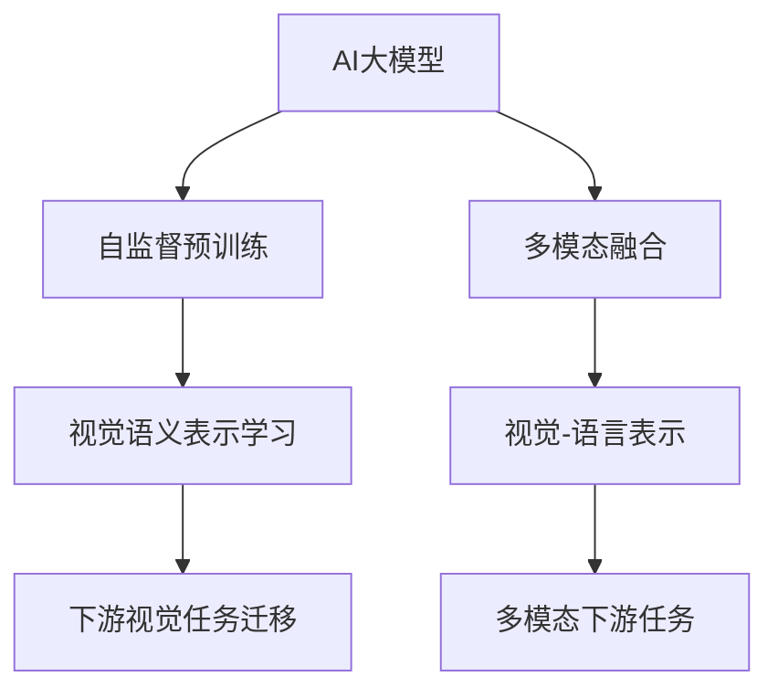
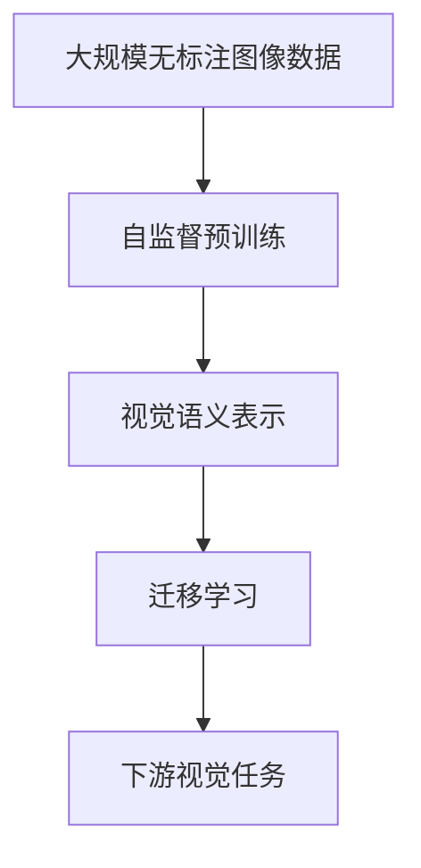

# 图像处理的AI大模型：重塑视觉技术的未来

## 1. 背景介绍

### 1.1 问题的由来

在当今数字时代,图像处理技术已经无处不在,从智能手机摄像头到医疗影像诊断,从自动驾驶汽车到卫星遥感,图像处理在各个领域扮演着至关重要的角色。然而,传统的图像处理算法往往基于人工设计的特征提取和模式识别方法,存在着泛化能力差、适应性低的缺陷,难以满足日益复杂的应用需求。

### 1.2 研究现状  

近年来,随着深度学习技术的蓬勃发展,基于深度神经网络的图像处理方法逐渐占据主导地位。卷积神经网络(CNN)、生成对抗网络(GAN)、变分自编码器(VAE)等深度学习模型展现出了强大的图像理解和生成能力,在图像分类、目标检测、语义分割、图像生成等任务中取得了令人瞩目的成就。

然而,这些深度学习模型通常需要大量的标注数据进行监督训练,且模型结构和训练过程复杂,对计算资源的需求也较高。此外,深度学习模型往往被视为"黑箱",其内在机理并不十分透明,存在可解释性差的问题。

### 1.3 研究意义

为了突破现有深度学习模型的瓶颈,研究人员开始探索基于大规模自监督预训练的AI大模型在图像处理领域的应用。AI大模型通过在海量无标注数据上进行自监督预训练,学习到了丰富的图像先验知识,从而能够在下游任务上实现更高的性能表现。同时,AI大模型具有较强的泛化能力,能够适应多样化的视觉任务,有望成为通用的图像处理基础设施。

本文将系统地介绍AI大模型在图像处理领域的最新研究进展,包括核心概念、算法原理、数学模型、代码实现、应用场景等多个方面,旨在为读者提供全面的理解和实践指导。

### 1.4 本文结构

本文的结构安排如下:

- 第2部分介绍AI大模型在图像处理中的核心概念,如自监督预训练、视觉语义表示等。
- 第3部分详细阐述AI大模型的核心算法原理和具体操作步骤。
- 第4部分构建AI大模型的数学模型,并推导相关公式,辅以案例分析。
- 第5部分提供AI大模型的代码实例,并进行详细的解释说明。
- 第6部分探讨AI大模型在实际应用场景中的应用前景。
- 第7部分推荐相关的学习资源、开发工具和论文等。
- 第8部分总结AI大模型的研究成果,并展望未来发展趋势和面临的挑战。
- 第9部分列出常见的问题并给出解答。

## 2. 核心概念与联系

AI大模型在图像处理领域的核心概念主要包括以下几个方面:

1. **自监督预训练(Self-Supervised Pretraining)**: AI大模型通过在大规模无标注图像数据上进行自监督预训练,学习到丰富的视觉语义表示,从而获得强大的图像理解能力。常见的自监督预训练方法包括遮挡自编码(Masked Autoencoders)、对比学习(Contrastive Learning)等。

2. **视觉语义表示学习(Visual Semantic Representation Learning)**: AI大模型在自监督预训练过程中,学习到了图像的语义表示,能够捕捉图像的高层次语义信息,如物体、场景、属性等。这种丰富的语义表示为后续的视觉任务奠定了基础。

3. **下游视觉任务迁移(Downstream Visual Task Transfer)**: 经过自监督预训练后,AI大模型可以通过迁移学习的方式,将学习到的视觉语义表示知识迁移到下游的视觉任务中,如图像分类、目标检测、语义分割等,从而实现更好的性能表现。

4. **多模态融合(Multimodal Fusion)**: 除了处理单一视觉模态,AI大模型还能够融合视觉和语言等多种模态信息,学习到统一的多模态表示,支持视觉-语言理解、视觉问答、图文生成等多模态下游任务。

5. **视觉-语言表示(Vision-Language Representation)**: AI大模型通过在大规模的视觉-语言数据上进行联合预训练,学习到统一的视觉-语言表示空间,使得视觉和语言信息能够相互对应和理解。

6. **多模态下游任务(Multimodal Downstream Tasks)**: 基于学习到的多模态表示,AI大模型可以应用于多种多模态下游任务,如视觉问答、图像描述生成、文本到图像生成等,展现出强大的多模态理解和生成能力。

这些核心概念相互关联、环环相扣,共同构建了AI大模型在图像处理领域的理论基础和技术体系。接下来,我们将进一步深入探讨AI大模型的算法原理、数学模型和实践应用等内容。

## 3. 核心算法原理 & 具体操作步骤

### 3.1 算法原理概述

AI大模型在图像处理领域的核心算法原理主要基于自监督预训练和迁移学习。自监督预训练旨在从大规模无标注图像数据中学习到丰富的视觉语义表示,而迁移学习则将这些预训练表示知识迁移到下游视觉任务中,实现更好的性能表现。

自监督预训练的关键在于设计合适的预训练目标和训练策略,以驱动模型从图像数据中学习到有用的视觉语义表示。常见的自监督预训练方法包括:

1. **遮挡自编码(Masked Autoencoders, MAE)**: 通过随机遮挡图像的一部分区域,训练模型重建被遮挡的像素,从而学习到图像的语义表示。

2. **对比学习(Contrastive Learning)**: 通过最大化正样本对(如同一图像的不同视角)之间的相似性,最小化负样本对之间的相似性,从而学习到区分性的视觉表示。

3. **自监督预测(Self-Supervised Prediction)**: 通过预测图像的某些属性或转换(如旋转角度、下一帧等),驱动模型学习到与任务相关的视觉表示。

经过自监督预训练后,AI大模型获得了丰富的视觉语义知识,可以通过迁移学习的方式应用于下游视觉任务。常见的迁移学习策略包括:

1. **特征提取(Feature Extraction)**: 将预训练模型的部分层(如卷积层)作为特征提取器,提取图像的特征表示,然后在此基础上训练新的分类器或回归器等任务头。

2. **微调(Fine-tuning)**: 在预训练模型的基础上,对全部或部分层进行进一步的训练,使模型适应特定的下游视觉任务。

3. **提示学习(Prompt Learning)**: 通过设计合适的文本提示,将下游视觉任务映射到预训练模型的输入空间,从而利用预训练模型直接进行预测。

通过自监督预训练和迁移学习的有机结合,AI大模型能够在下游视觉任务上展现出卓越的性能表现,同时保持了良好的泛化能力和适应性。

### 3.2 算法步骤详解

AI大模型在图像处理领域的算法步骤可以概括为以下几个主要阶段:

1. **数据预处理**
   - 收集大规模无标注图像数据集
   - 进行数据清洗、增强和归一化等预处理操作

2. **模型初始化**
   - 选择合适的神经网络架构(如Vision Transformer、ConvNeXt等)作为基础模型
   - 初始化模型参数

3. **自监督预训练**
   - 设计自监督预训练目标和损失函数(如遮挡自编码损失、对比损失等)
   - 在大规模无标注图像数据上进行自监督预训练
   - 定期评估预训练模型在下游任务上的性能,决定是否继续预训练

4. **迁移学习**
   - 选择合适的迁移学习策略(如特征提取、微调或提示学习)
   - 在特定的下游视觉任务数据集上进行迁移学习
   - 根据任务指标(如准确率、mAP等)评估模型性能

5. **模型优化**
   - 根据性能评估结果,调整超参数、训练策略或模型架构
   - 重复迭代训练,直至达到满意的性能水平

6. **模型部署**
   - 将训练好的模型导出为可部署的格式(如ONNX、TensorRT等)
   - 在目标硬件平台(如GPU、TPU或移动端)上部署模型
   - 进行在线推理和应用服务

在整个算法流程中,自监督预训练和迁移学习是AI大模型在图像处理领域的核心环节,决定了模型的性能表现和泛化能力。同时,数据预处理、模型优化和部署等步骤也至关重要,确保了算法的可靠性和实用性。

### 3.3 算法优缺点

AI大模型在图像处理领域具有以下优点:

1. **强大的泛化能力**: 通过在大规模无标注数据上进行自监督预训练,AI大模型学习到了丰富的视觉语义知识,能够很好地泛化到不同的下游视觉任务。

2. **高效的迁移学习**: 基于预训练的视觉语义表示,AI大模型可以快速地通过迁移学习适应新的视觉任务,节省了大量的标注和训练成本。

3. **多模态融合能力**: AI大模型能够融合视觉和语言等多种模态信息,支持多模态下游任务,展现出强大的多模态理解和生成能力。

4. **可解释性**: 与传统的黑箱深度学习模型相比,AI大模型的自监督预训练过程和视觉语义表示具有一定的可解释性,有助于理解模型的内在机理。

然而,AI大模型在图像处理领域也存在一些缺点和挑战:

1. **计算资源需求高**: 训练AI大模型需要大量的计算资源,包括GPU、TPU等加速硬件,以及海量的数据存储和处理能力,这对硬件设施和能源消耗提出了很高的要求。

2. **预训练数据质量影响大**: AI大模型的性能在很大程度上依赖于预训练数据的质量和多样性,如果预训练数据存在偏差或噪声,可能会导致模型学习到不准确的视觉语义表示。

3. **缺乏理论指导**: 目前AI大模型的设计和训练过程仍然缺乏系统的理论指导,很多关键的设计选择(如模型架构、预训练目标等)依赖于经验和试错。

4. **安全隐私风险**: AI大模型在训练过程中可能会学习到一些不当的偏见或隐私信息,如果不加以控制和审查,可能会产生安全和隐私风险。

5. **可解释性有限**: 尽管AI大模型的自监督预训练过程具有一定的可解释性,但对于模型内部的具体计算过程和决策机制,可解释性仍然有限。

总的来说,AI大模型在图像处理领域展现出了巨大的潜力,但也面临着一些挑战和局限性。未来需要进一步的理论研究和技术创新,以充分发挥AI大模型的优势,并解决其中的缺陷和风险。

### 3.4 算法应用领域

AI大模型在图像处理领域具有广泛的应用前景,包括但不限于以下几个主要领域:

1. **计算机视觉任务**
   - 图像