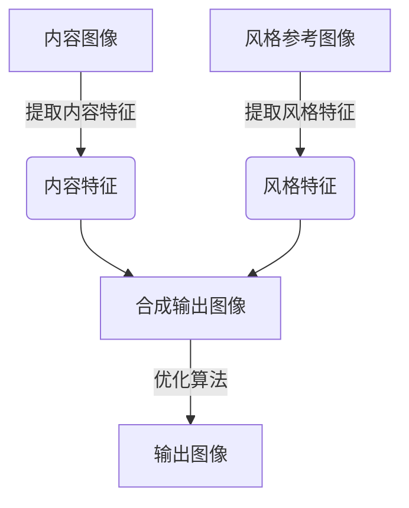

以下是《图像风格迁移(Style Transfer)原理与代码实战案例讲解》的文章正文部分：

# 图像风格迁移(Style Transfer)原理与代码实战案例讲解

## 1. 背景介绍

### 1.1 问题的由来

在日常生活中，我们常常会欣赏到各种风格的艺术作品,比如梵高的油画作品、毕加索的立体主义作品等。这些作品不仅展现了艺术家独特的创作风格,也引发了人们对于图像风格转换的浓厚兴趣。传统的图像处理方式需要人工逐像素进行编辑,费时费力且缺乏灵活性。因此,如何自动将一种风格迁移到另一种图像中,成为了计算机视觉和机器学习领域的一个重要研究课题。

### 1.2 研究现状

早期的图像风格迁移方法主要基于低级特征(如颜色、纹理等)进行分析和合成,但效果并不理想。近年来,随着深度学习技术的快速发展,基于卷积神经网络(CNN)的风格迁移算法取得了突破性进展,能够有效捕捉图像的高级语义特征,并将风格和内容特征分离,实现高质量的风格迁移效果。

### 1.3 研究意义

图像风格迁移技术在多个领域具有广泛的应用前景,例如:

1. **艺术创作**: 可以为艺术家提供灵活的创作工具,实现跨风格的艺术融合。
2. **图像增强**: 通过风格迁移可以增强图像的视觉吸引力,提高图像质量。
3. **影视特效**: 可以为电影特效制作提供高质量的图像处理手段。
4. **个性化滤镜**: 为手机摄影爱好者提供个性化的滤镜效果。

### 1.4 本文结构

本文将首先介绍图像风格迁移的核心概念和算法原理,然后详细讲解基于卷积神经网络的风格迁移算法流程。接下来,我们将构建数学模型并推导公式,通过案例分析加深理解。之后,我们将实战代码示例,并对代码进行解读和分析。最后,我们将探讨图像风格迁移在实际应用中的场景,介绍相关工具和资源,总结未来发展趋势和面临的挑战。

## 2. 核心概念与联系

图像风格迁移的核心思想是将一幅内容图像(Content Image)的内容特征与另一幅风格参考图像(Style Image)的风格特征相结合,生成一幅新的输出图像,使其同时保留了内容图像的内容信息和风格参考图像的风格特征。

这个过程可以概括为以下三个步骤:

1. **提取内容特征**: 从内容图像中提取内容特征,通常使用预训练的卷积神经网络(如VGG)的某些层输出作为内容特征。
2. **提取风格特征**: 从风格参考图像中提取风格特征,通常使用预训练卷积神经网络的不同层输出的格拉姆矩阵(Gram Matrix)作为风格特征。
3. **合成输出图像**: 通过优化算法(如梯度下降),生成一个新的输出图像,使其与内容图像的内容特征和风格参考图像的风格特征尽可能接近。

以下是图像风格迁移的核心概念和流程:

## 3. 核心算法原理 & 具体操作步骤

### 3.1 算法原理概述

图像风格迁移算法的核心思想是将内容图像和风格参考图像的特征分离,然后将它们重新组合生成新的输出图像。具体来说,算法包括以下几个主要步骤:

1. **预处理**: 将输入图像进行预处理,如调整大小、归一化等。
2. **特征提取**: 使用预训练的卷积神经网络(如VGG19)提取内容图像和风格参考图像的特征。
3. **特征重建**: 构建一个目标函数,该函数包含内容损失项(Content Loss)和风格损失项(Style Loss),分别衡量输出图像与内容图像的内容差异和与风格参考图像的风格差异。
4. **优化求解**: 使用优化算法(如梯度下降)最小化目标函数,迭代更新输出图像,直到内容损失和风格损失达到最小。

### 3.2 算法步骤详解

1. **预处理**:
   - 将输入图像调整到相同大小,以便于特征提取和计算。
   - 对图像像素值进行归一化处理,使其在0到1之间。

2. **特征提取**:
   - 使用预训练的VGG19网络提取内容图像和风格参考图像的特征。
   - 内容特征通常来自VGG19网络的较浅层(如`conv4_2`),用于捕捉图像的内容信息。
   - 风格特征来自VGG19网络的多个层(如`conv1_1`、`conv2_1`、`conv3_1`、`conv4_1`、`conv5_1`)的特征图,用于捕捉图像的风格信息。

3. **特征重建**:
   - 构建内容损失函数,衡量输出图像与内容图像的内容差异,通常使用均方误差(Mean Squared Error)。
   - 构建风格损失函数,衡量输出图像与风格参考图像的风格差异,通常使用格拉姆矩阵(Gram Matrix)来表示风格特征,并计算两个格拉姆矩阵之间的均方误差。
   - 将内容损失和风格损失相加,构建总体目标损失函数。

4. **优化求解**:
   - 初始化一个输出图像,通常使用内容图像或随机噪声作为初始值。
   - 使用优化算法(如L-BFGS)最小化总体目标损失函数,迭代更新输出图像。
   - 在每次迭代中,计算当前输出图像与内容图像的内容损失,以及与风格参考图像的风格损失。
   - 根据损失的梯度,更新输出图像的像素值,使总体损失最小化。
   - 重复上述过程,直到损失函数收敛或达到最大迭代次数。

### 3.3 算法优缺点

**优点**:

1. **高质量输出**: 基于深度学习的风格迁移算法能够生成高质量的输出图像,保留了内容图像的内容信息和风格参考图像的风格特征。
2. **灵活性强**: 可以将任意风格应用于任意内容图像,实现灵活的风格融合。
3. **自动化程度高**: 相比传统的人工编辑方式,算法可以自动完成风格迁移过程,提高效率。

**缺点**:

1. **计算开销大**: 需要使用预训练的深度卷积神经网络提取特征,计算量较大。
2. **优化过程缓慢**: 使用梯度下降等优化算法迭代求解,收敛速度较慢。
3. **参数调整困难**: 内容损失和风格损失的权重需要手动调整,影响输出质量。
4. **结果不确定性**: 由于优化过程的随机性,相同输入可能产生不同的输出结果。

### 3.4 算法应用领域

图像风格迁移算法在以下领域有广泛的应用前景:

1. **艺术创作**: 为艺术家提供创新的创作工具,实现跨风格的艺术融合。
2. **影视特效**: 可用于电影特效制作,为场景添加特殊的视觉效果。
3. **个性化滤镜**: 为手机摄影爱好者提供个性化的滤镜效果。
4. **图像增强**: 通过风格迁移可以增强图像的视觉吸引力,提高图像质量。
5. **图像编辑**: 可用于图像编辑软件,实现图像的风格转换。
6. **视频处理**: 可应用于视频流的实时风格迁移,为视频添加艺术效果。

## 4. 数学模型和公式 & 详细讲解 & 举例说明

### 4.1 数学模型构建

为了实现图像风格迁移,我们需要构建一个数学模型,该模型包含两个主要部分:内容损失函数和风格损失函数。

**内容损失函数**:

内容损失函数衡量输出图像与内容图像在内容特征上的差异,通常使用均方误差(Mean Squared Error)来计算:

$$J_{\text{content}}(G) = \frac{1}{2} \sum_{i,j} (G_{ij} - F_{ij}^l)^2$$

其中:
- $G$ 表示输出图像的特征图
- $F^l$ 表示内容图像在第 $l$ 层的特征图
- $i,j$ 表示特征图的空间位置索引

目标是最小化内容损失函数,使输出图像的内容特征尽可能接近内容图像。

**风格损失函数**:

风格损失函数衡量输出图像与风格参考图像在风格特征上的差异,通常使用格拉姆矩阵(Gram Matrix)来表示风格特征,并计算两个格拉姆矩阵之间的均方误差:

$$J_{\text{style}}(G, S) = \sum_l w_l E_l$$

$$E_l = \frac{1}{4N_l^2M_l^2} \sum_{i,j} (G_{ij}^l - S_{ij}^l)^2$$

其中:
- $G^l$ 表示输出图像在第 $l$ 层的特征图
- $S^l$ 表示风格参考图像在第 $l$ 层的特征图
- $N_l$ 和 $M_l$ 分别表示特征图的高度和宽度
- $w_l$ 是第 $l$ 层的权重系数,用于调节不同层的贡献

格拉姆矩阵 $G_{ij}^l$ 定义为:

$$G_{ij}^l = \sum_k F_{ik}^l F_{jk}^l$$

其中 $F_{ik}^l$ 和 $F_{jk}^l$ 分别表示第 $l$ 层特征图在空间位置 $(i,k)$ 和 $(j,k)$ 处的值。

格拉姆矩阵可以捕捉特征图之间的相关性,从而编码风格信息。

**总体损失函数**:

最终的总体损失函数是内容损失函数和风格损失函数的加权和:

$$J(G) = \alpha J_{\text{content}}(G) + \beta J_{\text{style}}(G, S)$$

其中 $\alpha$ 和 $\beta$ 分别是内容损失和风格损失的权重系数,用于平衡两者的贡献。

目标是最小化总体损失函数 $J(G)$,使输出图像 $G$ 同时保留了内容图像的内容信息和风格参考图像的风格特征。

### 4.2 公式推导过程

以下是风格损失函数的推导过程:

1. 定义格拉姆矩阵 $G^l$ 为第 $l$ 层特征图的内积:

   $$G_{ij}^l = \sum_k F_{ik}^l F_{jk}^l$$

   其中 $F_{ik}^l$ 和 $F_{jk}^l$ 分别表示第 $l$ 层特征图在空间位置 $(i,k)$ 和 $(j,k)$ 处的值。

2. 格拉姆矩阵捕捉了特征图之间的相关性,可以编码风格信息。

3. 定义第 $l$ 层的风格损失项 $E_l$ 为输出图像的格拉姆矩阵 $G^l$ 与风格参考图像的格拉姆矩阵 $S^l$ 之间的均方误差:

   $$E_l = \frac{1}{4N_l^2M_l^2} \sum_{i,j} (G_{ij}^l - S_{ij}^l)^2$$

   其中 $N_l$ 和 $M_l$ 分别表示第 $l$ 层特征图的高度和宽度,用于归一化。

4. 将所有层的风格损失项加权求和,得到总体风格损失函数:

   $$J_{\text{style}}(G, S) = \sum_l w_l E_l$$

   其中 $w_l