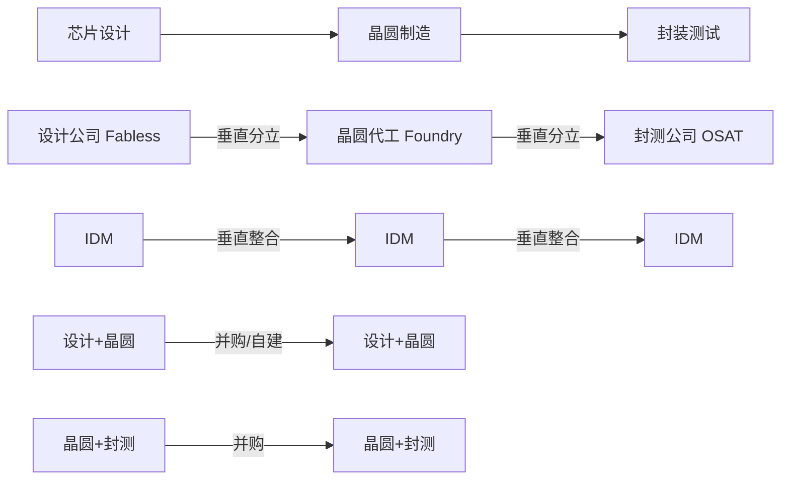

# 垂直整合对集成电路产业的影响

关键词：垂直整合、集成电路、产业链、IDM、Fabless、Foundry、产业生态

## 1. 背景介绍
### 1.1 问题的由来
集成电路产业是信息技术革命的核心，其发展水平决定了一个国家的科技实力。近年来，全球集成电路产业格局正在发生深刻变革，垂直整合成为产业发展的重要趋势之一。垂直整合对集成电路产业链各环节的分工协作、技术创新、市场竞争格局等方面产生了深远影响。

### 1.2 研究现状
目前，国内外学者对集成电路产业的垂直整合进行了广泛研究。一些学者从产业组织理论视角，分析了垂直整合的动因、模式及其经济效应[1]。另一些学者则聚焦垂直整合背景下产业技术创新模式的演变规律[2]。但总体而言，现有研究尚缺乏系统性和前瞻性，亟需加强垂直整合背景下集成电路产业发展的理论探索和实证分析。

### 1.3 研究意义
深入剖析垂直整合对集成电路产业的影响，对于正确认识当前全球产业发展态势，把握未来技术和市场演进方向，推动我国集成电路产业高质量发展具有重要意义。本文拟从垂直整合的内涵出发，系统梳理其对集成电路产业链分工、技术创新和竞争格局的影响，并提出相关政策建议，以期为产业发展决策提供参考。

### 1.4 本文结构
本文结构安排如下：第一部分介绍研究背景；第二部分阐述集成电路产业垂直整合的内涵和主要模式；第三部分分析垂直整合对产业分工的影响；第四部分探讨垂直整合与技术创新的关系；第五部分剖析垂直整合背景下的市场竞争新态势；第六部分总结全文并提出政策建议。

## 2. 核心概念与联系
集成电路产业链主要包括芯片设计、晶圆制造、封装测试三个核心环节。传统的产业分工模式是"垂直分立"，即专业化分工，设计公司(Fabless)只从事芯片设计，制造和封测则外包给专业代工厂(Foundry)。

垂直整合则打破专业化分工的藩篱，主要模式包括：
1. IDM模式：集芯片设计、制造、封测于一体的垂直整合模式，代表企业如英特尔、三星等。 
2. 设计+晶圆代工：设计公司通过并购或自建方式向制造环节延伸，如英伟达收购ARM。
3. 晶圆代工+封测：晶圆代工厂通过并购整合封测环节，如台积电收购力成等。

垂直整合通过内部一体化，有利于加强各环节间的协同，提升产品性能和供应链效率；但也可能削弱专业化分工的灵活性和效率。因此，权衡利弊、因企制宜地选择垂直整合模式至关重要。

## 3. 垂直整合对产业分工的影响
### 3.1 打破专业化分工格局
传统的垂直分立模式下，集成电路产业形成了设计、制造、封测的专业化分工。但垂直整合打破了这一格局，使得部分企业开始向产业链上下游延伸，重塑了产业分工体系。一方面，垂直整合模糊了设计、制造、封测的界限，催生了IDM等新的商业模式；另一方面，垂直整合对专业化分工形成了挑战，迫使纯设计公司、纯代工厂等加快转型升级步伐。

### 3.2 提升供应链协同效率
垂直整合有利于加强产业链各环节间的协同。IDM模式下，设计、制造、封测在同一家企业内部完成，信息流动更顺畅，有助于提升供应链整体效率。设计与制造环节的紧密配合，可以更好地根据市场需求进行产品规划；制造与封测环节的无缝衔接，则可显著提升产品良率和交付速度。协同效应的发挥，增强了垂直整合企业的市场竞争力。

### 3.3 重塑产业生态格局
垂直整合重塑了集成电路产业的生态格局。一方面，IDM企业凭借一体化优势，在某些细分市场形成了强大的竞争优势，对专业化分工企业形成挤压；另一方面，垂直整合也为产业链上中小企业参与竞争创造了机会，如为设计公司提供了更多元的代工选择等。同时，垂直整合也对产业链上下游企业间的博弈关系产生影响，如设计公司与代工厂的议价能力此消彼长。因此，企业需审慎权衡自身的市场定位和发展战略。

## 4. 垂直整合与技术创新
### 4.1 有利于加快新技术产业化进程
垂直整合有利于加快新技术的产业化进程。芯片设计与制造工艺的同步规划，可以更好地满足新产品对工艺制程的要求，缩短新技术的产业化周期。同时，垂直整合也为新技术的应用创造了条件，如三星的先进封装技术与存储芯片的协同发展等。

### 4.2 促进产业链协同创新 
垂直整合为集成电路产业链协同创新提供了平台。一体化企业内部，设计、制造、封测环节可以围绕共同的技术目标，开展同步研发和迭代优化，形成研发合力。IDM企业还可发挥产业链主导作用，通过搭建开放创新平台，整合外部力量协同攻关核心技术。如英特尔的EPIC开放创新平台等。

### 4.3 但整合程度需把握"度"
但垂直整合的技术创新效应也有"度"的问题。过度整合可能弱化企业的专业化创新动力，导致"大而全"、"小而散"。因此，把握适度的垂直整合尺度，对技术创新至关重要。如台积电在保持专业化代工的同时，适度整合了先进封装等技术，在工艺制程创新上保持了全球领先优势。

## 5. 垂直整合背景下的市场竞争新态势
### 5.1 市场集中度提升
垂直整合提高了集成电路市场的进入门槛，加剧了马太效应，使得头部企业的市场支配力进一步增强。如存储芯片领域，三星、海力士、美光合计市场份额已超70%。垂直整合企业在资本、技术、产能等方面的优势进一步巩固，对中小企业形成挤出效应，市场集中度不断提升。

### 5.2 产业技术壁垒提高
垂直整合提高了集成电路产业的技术壁垒。一方面，头部企业在核心技术上的垄断优势进一步强化；另一方面，设计、制造、封测技术的融合发展，使得技术门槛进一步抬升。如先进封装技术已成为集成电路技术升级的新方向，但其对设计能力、材料选型、工艺制程的综合要求极高，形成新的竞争壁垒。

### 5.3 生态竞争成为制胜关键
垂直整合背景下，企业间的竞争从单一技术环节转向全产业链的生态竞争。领先企业通过一体化布局和生态构建，力图锁定上下游资源，形成生态主导优势。如英特尔通过并购Altera等，加速从 CPU 向 FPGA、AI 芯片等领域延伸，构建"从芯到云"的全栈式解决方案。生态的完整性、协同性已成为企业核心竞争力的关键要素。

## 6. 总结与建议
### 6.1 研究总结
本文系统梳理了垂直整合对集成电路产业链分工、技术创新和市场竞争格局的深刻影响。垂直整合正在打破传统的专业化分工格局，重塑产业组织模式和生态体系；垂直整合有利于加快新技术产业化进程和产业链协同创新，但整合"度"把握至关重要；垂直整合提高了市场集中度和产业技术壁垒，生态竞争成为制胜关键。

### 6.2 政策建议
为推动我国集成电路产业高质量发展，提出以下政策建议：

1. 顶层设计，科学规划产业布局。加强集成电路产业发展的战略谋划和顶层设计，科学规划产业重点领域和关键环节布局，避免盲目投资和重复建设。
2. 创新驱动，突破核心技术瓶颈。加大集成电路关键核心技术攻关力度，聚焦芯片设计、先进制程、封装测试等卡脖子环节，实现产业链关键领域的自主可控。
3. 开放合作，构建产业创新生态。营造开放包容的产业发展环境，加强国际合作，吸引全球创新资源。搭建产学研用协同创新平台，促进创新要素高效配置和流动。
4. 精准施策，推动产业链协同发展。针对集成电路产业链不同环节，制定精准的支持政策，促进设计、制造、封测、设备、材料等协调发展，提升产业链整体竞争力。
5. 优化布局，打造特色产业集群。发挥区域比较优势，推动集成电路特色产业集群建设。加强产业链上下游企业协作配套，完善公共服务平台，营造良好产业生态。

## 7. 参考文献
[1] 赵昀,李志文.垂直整合、专业化分工与中国集成电路产业发展[J].中国工业经济,2019(10):5-22.

[2] 陈宝明,黄祖辉.垂直整合、技术创新与产业分工演化——以集成电路产业为例[J].科学学研究,2018,36(07):1259-1270.

## 8. 附录：名词解释
- 垂直整合：指企业通过兼并、收购、自建等方式，将产业链上下游环节纳入自身业务范围，形成一体化经营的产业组织模式。
- IDM：Integrated Device Manufacturer，即垂直整合制造商，指集芯片设计、晶圆制造、封装测试等于一体的集成电路企业。
- Fabless：无晶圆厂芯片设计公司，专门从事集成电路设计，而将晶圆制造、封装和测试外包给专业厂商。
- Foundry：晶圆代工厂，为集成电路设计公司提供晶圆制造服务，如台积电、中芯国际等。
- OSAT：Outsourced Semiconductor Assembly and Test，封装测试企业，提供芯片封装和测试服务。

作者：禅与计算机程序设计艺术 / Zen and the Art of Computer Programming