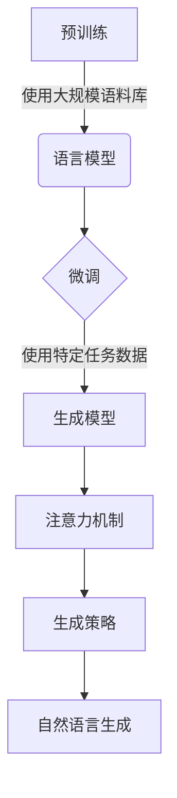

# 基于AI大模型的自然语言生成：写作的未来

## 1. 背景介绍

### 1.1 问题的由来

在当今信息时代,文字写作无疑已成为一项不可或缺的技能。无论是在学术领域还是商业领域,清晰、富有洞见的写作都扮演着关键角色。然而,高质量的写作需要耗费大量的时间和精力,这对于很多人来说都是一个挑战。

传统的写作过程通常包括构思主题、搜集资料、组织结构、撰写初稿、反复修改等步骤,这些步骤往往耗时耗力。特别是对于一些专业领域的写作,往往需要作者具备扎实的专业知识和丰富的写作经验,这无疑增加了写作的难度。

### 1.2 研究现状  

为了提高写作效率,人们一直在探索各种辅助写作的工具和技术。例如,文字处理软件、语法检查工具、写作模板等,都在一定程度上简化了写作流程。然而,这些工具主要是在写作的"后期"阶段提供帮助,而对于写作的"前期"阶段,如主题构思、内容组织等,帮助有限。

近年来,随着人工智能技术的不断发展,基于自然语言处理(NLP)的AI写作辅助系统开始崭露头角。这些系统能够根据用户的输入,自动生成连贯、富有内容的文本,为写作提供了全新的解决方案。

### 1.3 研究意义

AI写作辅助技术的出现,为传统写作带来了革命性的变化。它有望极大提高写作效率,降低写作门槛,让更多人能够享受高质量写作带来的好处。同时,AI写作辅助技术也为一些特殊群体(如残障人士)提供了更加便利的写作方式。

从商业角度来看,AI写作辅助技术也具有巨大的应用前景。它可以应用于新闻写作、营销文案撰写、客户服务等领域,大幅提升工作效率。此外,AI写作辅助技术在教育领域也有潜在的应用价值,可以帮助学生提高写作水平。

### 1.4 本文结构

本文将全面介绍基于AI大模型的自然语言生成技术在写作领域的应用。我们将从核心概念和算法原理出发,深入探讨数学模型和公式,并结合实际项目实践,分析该技术在各个应用场景中的表现。最后,我们将总结该技术的发展趋势和面临的挑战,并提供相关的学习资源和工具推荐。

## 2. 核心概念与联系

基于AI大模型的自然语言生成技术,是当前自然语言处理领域的一个热门研究方向。它的核心思想是利用深度学习模型(尤其是Transformer模型)在大规模语料库上进行预训练,获取丰富的语言知识,然后针对特定任务(如文本生成)进行微调,从而实现高质量的自然语言生成。

这项技术的核心概念主要包括:

1. **预训练(Pre-training)**: 在海量语料库上训练模型,使其学习到丰富的语言知识和表达能力。
2. **微调(Fine-tuning)**: 在特定任务数据上对预训练模型进行进一步训练,使其适应目标任务。
3. **注意力机制(Attention Mechanism)**: 模型能够自动学习输入序列中不同位置的关联性,从而生成更加连贯的输出。
4. **生成策略(Generation Strategy)**: 控制模型在生成过程中的行为,如解码方式、生成长度等,以获得更好的输出质量。

这些核心概念相互关联、相辅相成,共同推动了基于AI大模型的自然语言生成技术的发展。下面我们将详细介绍其核心算法原理和数学模型。

## 3. 核心算法原理 & 具体操作步骤

### 3.1 算法原理概述

基于AI大模型的自然语言生成技术,主要基于Transformer模型和自回归语言模型(Auto-Regressive Language Model)。

1. **Transformer模型**

Transformer模型是一种全新的基于注意力机制的序列到序列(Seq2Seq)模型,它完全摒弃了传统的RNN和CNN结构,使用多头注意力机制来捕获输入和输出之间的长距离依赖关系。

2. **自回归语言模型**

自回归语言模型是一种特殊的语言模型,它的目标是根据给定的文本前缀,预测下一个单词或字符的概率分布。这种模型可以用于文本生成任务,通过不断采样下一个单词,最终生成完整的文本。

算法的核心思想是:首先使用Transformer模型在大规模语料库上进行预训练,获得通用的语言表示能力;然后在目标任务数据上进行微调,使模型适应特定的文本生成任务;最后,利用自回归语言模型的生成策略,根据给定的文本前缀,不断采样生成新的单词或字符,从而得到完整的生成文本。

### 3.2 算法步骤详解

1. **预训练阶段**

   - 数据准备:收集大规模的语料库数据,包括书籍、新闻、网页等多种来源的文本。
   - 模型训练:使用Transformer模型在语料库上进行预训练,目标是最小化掩码语言模型(Masked Language Model)和下一句预测(Next Sentence Prediction)的损失函数。预训练过程中,模型学习到丰富的语言知识和表达能力。

2. **微调阶段**

   - 数据准备:收集目标任务的数据集,如新闻标题生成、文案创作等。
   - 模型微调:将预训练模型的参数作为初始化,在目标任务数据上进行进一步训练,目标是最小化序列到序列的生成损失。

3. **生成阶段**

   - 输入处理:对于给定的文本前缀(如新闻开头、主题关键词等),将其输入到微调后的模型中。
   - 自回归生成:模型根据输入,预测下一个单词或字符的概率分布。通过采样或贪婪搜索等策略,选择概率最高的单词作为输出。
   - 迭代生成:重复上一步,不断生成新的单词,直到达到终止条件(如生成长度上限、特殊结束符等)。

### 3.3 算法优缺点

**优点**:

- 生成质量高:benefitting from large-scale pre-training and fine-tuning, the model can generate high-quality, coherent, and contextually relevant text.
- 泛化能力强:预训练过程使模型学习到通用的语言知识,因此能够较好地泛化到不同领域的文本生成任务。
- 高效便捷:一旦模型训练完成,文本生成过程就变得高效和便捷,只需输入少量前缀即可快速生成所需文本。

**缺点**:

- 训练成本高:预训练和微调过程需要消耗大量的计算资源,对硬件要求较高。
- 生成偏差:生成的文本可能存在factual错误、逻辑缺陷或者偏差,需要人工审查和修正。
- 安全隐患:模型在生成过程中可能产生有害、歧视性或不当内容,需要相应的审核和过滤机制。

### 3.4 算法应用领域

基于AI大模型的自然语言生成技术可以应用于多个领域:

- **写作辅助**: 用于新闻报道、故事创作、营销文案、论文撰写等写作场景,提高写作效率。
- **对话系统**: 生成自然、多样的对话响应,提升人机交互体验。
- **自动摘要**: 根据长文本自动生成摘要,提高信息获取效率。
- **机器翻译**: 将一种语言的文本翻译成另一种语言。
- **问答系统**: 根据问题生成相关的答复,为用户提供所需信息。
- **代码生成**: 根据自然语言描述自动生成相应的计算机代码。

## 4. 数学模型和公式 & 详细讲解 & 举例说明

### 4.1 数学模型构建

基于AI大模型的自然语言生成技术主要基于Transformer模型和自回归语言模型,我们将分别介绍它们的数学模型。

1. **Transformer模型**

Transformer模型的核心是多头注意力机制(Multi-Head Attention),它能够自动学习输入序列中不同位置的关联性。给定一个查询向量$\boldsymbol{q}$、键向量$\boldsymbol{K}$和值向量$\boldsymbol{V}$,注意力机制的计算公式如下:

$$\text{Attention}(\boldsymbol{Q}, \boldsymbol{K}, \boldsymbol{V}) = \text{softmax}\left(\frac{\boldsymbol{Q}\boldsymbol{K}^T}{\sqrt{d_k}}\right)\boldsymbol{V}$$

其中,$d_k$是缩放因子,用于防止内积过大导致梯度饱和。多头注意力机制是将注意力机制运用于不同的子空间,然后将结果拼接,公式如下:

$$\text{MultiHead}(\boldsymbol{Q}, \boldsymbol{K}, \boldsymbol{V}) = \text{Concat}(head_1, ..., head_h)\boldsymbol{W}^O$$
$$\text{where } head_i = \text{Attention}(\boldsymbol{Q}\boldsymbol{W}_i^Q, \boldsymbol{K}\boldsymbol{W}_i^K, \boldsymbol{V}\boldsymbol{W}_i^V)$$

其中,$\boldsymbol{W}_i^Q$、$\boldsymbol{W}_i^K$、$\boldsymbol{W}_i^V$和$\boldsymbol{W}^O$是可训练的线性映射参数。

2. **自回归语言模型**

自回归语言模型的目标是最大化给定上文$\boldsymbol{x}_{<t}$时,下一个单词$x_t$的条件概率:

$$P(x_t | \boldsymbol{x}_{<t}) = \text{Model}(\boldsymbol{x}_{<t})_t$$

其中,Model表示语言模型,可以是RNN、Transformer等序列模型。在生成过程中,我们从开始符号<bos>开始,不断采样下一个单词的概率分布,直到生成终止符号<eos>或达到最大长度。

### 4.2 公式推导过程

以Transformer的多头注意力机制为例,我们将推导其数学表达式。

首先,我们定义注意力权重$\alpha_{ij}$,表示查询向量$\boldsymbol{q}_i$对键向量$\boldsymbol{k}_j$的注意力程度:

$$\alpha_{ij} = \frac{\exp\left(\frac{\boldsymbol{q}_i\boldsymbol{k}_j^T}{\sqrt{d_k}}\right)}{\sum_{l=1}^n \exp\left(\frac{\boldsymbol{q}_i\boldsymbol{k}_l^T}{\sqrt{d_k}}\right)}$$

其中,$d_k$是缩放因子,用于防止内积过大导致梯度饱和。

然后,我们将注意力权重$\alpha_{ij}$与值向量$\boldsymbol{v}_j$相乘,并对所有$j$求和,得到注意力输出$\boldsymbol{o}_i$:

$$\boldsymbol{o}_i = \sum_{j=1}^n \alpha_{ij}\boldsymbol{v}_j$$

将所有查询向量$\boldsymbol{q}_i$的注意力输出$\boldsymbol{o}_i$拼接,得到最终的注意力输出矩阵$\boldsymbol{O}$:

$$\boldsymbol{O} = [\boldsymbol{o}_1, \boldsymbol{o}_2, ..., \boldsymbol{o}_n]$$

对于多头注意力机制,我们将上述过程在$h$个不同的线性投影空间中独立运行,得到$h$个注意力输出矩阵$\boldsymbol{O}_1, \boldsymbol{O}_2, ..., \boldsymbol{O}_h$,然后将它们拼接:

$$\text{MultiHead}(\boldsymbol{Q}, \boldsymbol{K}, \boldsymbol{V}) = \text{Concat}(\boldsymbol{O}_1, \boldsymbol{O}_2, ..., \boldsymbol