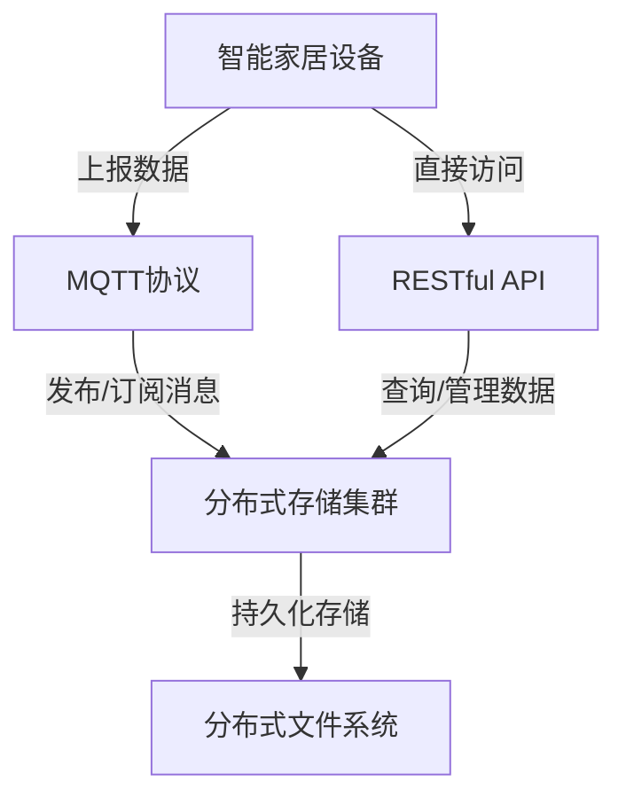

# 基于MQTT协议和RESTful API的智能家居分布式存储解决方案

## 1. 背景介绍

### 1.1 问题的由来

随着物联网(IoT)技术的快速发展,智能家居系统逐渐成为现代生活中不可或缺的一部分。智能家居系统旨在将家中的各种设备(如照明、暖通空调、安防监控等)连接到网络中,实现自动化控制和远程管理,从而提高生活质量和能源利用效率。然而,由于智能家居涉及多种异构设备和复杂的网络环境,如何高效、可靠地存储和管理大量的设备数据成为了一个亟待解决的问题。

### 1.2 研究现状

目前,智能家居系统中的数据存储和管理主要采用以下几种方式:

1. **本地存储**: 每个设备都有自己的本地存储空间,用于存储设备状态和相关数据。这种方式简单直观,但存在数据孤岛、难以共享和集中管理的问题。

2. **云存储**: 将所有设备数据上传到云端服务器进行统一存储和管理。这种方式可以实现数据集中化,但存在隐私和安全风险,同时对网络带宽和延迟要求较高。

3. **边缘计算**: 在网关或边缘节点上部署计算和存储资源,实现就近处理和存储。这种方式可以缓解云端压力,但难以实现全局数据共享和协同。

上述方式各有优缺点,难以满足智能家居系统对数据存储和管理的多样化需求。因此,需要一种新的分布式存储解决方案来应对这一挑战。

### 1.3 研究意义

设计一种基于MQTT(Message Queuing Telemetry Transport)协议和RESTful(Representational State Transfer) API的智能家居分布式存储解决方案,可以有效解决当前智能家居系统中数据存储和管理的痛点,具有重要的理论和实践意义:

1. **高效性**: 利用MQTT的发布/订阅机制和RESTful API,可以实现设备数据的高效传输和访问。

2. **可扩展性**: 采用分布式存储架构,可以根据需求动态扩展存储容量和计算资源。

3. **安全性**: 通过MQTT的安全传输机制和RESTful API的访问控制,可以保护数据的隐私和完整性。

4. **异构支持**: 支持多种异构设备和协议,提高系统的通用性和兼容性。

5. **智能分析**: 基于分布式存储的海量数据,可以开展大数据分析和人工智能应用,实现智能决策和优化。

### 1.4 本文结构

本文将首先介绍智能家居分布式存储解决方案的核心概念和关键技术,包括MQTT协议、RESTful API和分布式存储架构。然后详细阐述系统的设计原理、算法流程和数学模型。接着通过项目实践展示具体的代码实现和运行效果。最后分析实际应用场景,探讨未来发展趋势和面临的挑战。

## 2. 核心概念与联系

智能家居分布式存储解决方案的核心概念包括MQTT协议、RESTful API和分布式存储架构,它们之间存在紧密的联系和互相依赖的关系。

1. **MQTT协议**: 是一种基于发布/订阅模式的轻量级消息传输协议,适用于物联网环境中的设备通信。智能家居设备可以通过MQTT协议将数据上报到MQTT代理(Broker),分布式存储集群作为订阅者接收这些数据并进行持久化存储。

2. **RESTful API**: 提供了一种统一的数据访问接口,允许智能家居设备或其他客户端通过HTTP协议直接查询和管理分布式存储集群中的数据。

3. **分布式存储架构**: 由多个存储节点组成的集群,利用分布式文件系统(如HDFS、Ceph等)实现数据的分布式存储和管理。每个存储节点既是MQTT的订阅者(接收设备数据),也是RESTful API的服务提供者(响应数据查询和管理请求)。

上述三个核心概念相互配合,形成了一个完整的智能家居分布式存储解决方案:设备通过MQTT协议上报数据,数据被分布式存储集群持久化到分布式文件系统中,并且可以通过RESTful API进行访问和管理。

## 3. 核心算法原理 & 具体操作步骤

### 3.1 算法原理概述

智能家居分布式存储解决方案的核心算法原理包括以下几个方面:

1. **MQTT消息路由**: MQTT代理根据主题(Topic)将消息路由到相应的订阅者(分布式存储节点)。

2. **数据分片和分发**: 将设备上报的数据进行分片,并根据一致性哈希或其他分发策略将数据分发到不同的存储节点。

3. **数据持久化**: 存储节点将接收到的数据片段持久化到分布式文件系统中,实现数据的冗余存储和容错。

4. **数据查询和聚合**: 当客户端通过RESTful API查询数据时,相关的存储节点会从分布式文件系统中读取对应的数据片段,并进行数据聚合和响应。

5. **负载均衡和故障转移**: 通过负载均衡算法和故障转移机制,实现集群的高可用性和负载均衡。

6. **数据生命周期管理**: 根据数据的重要性和保留策略,对数据进行有效的生命周期管理,包括数据备份、压缩、删除等操作。

### 3.2 算法步骤详解

1. **设备数据上报**:
   - 步骤1: 智能家居设备通过MQTT协议连接到MQTT代理(Broker)。
   - 步骤2: 设备根据预定义的主题(Topic)发布数据消息。

2. **MQTT消息路由**:
   - 步骤3: MQTT代理根据消息的主题,将消息路由到已订阅该主题的分布式存储节点。

3. **数据分片和分发**:
   - 步骤4: 分布式存储节点收到消息后,将消息数据进行分片。
   - 步骤5: 根据一致性哈希或其他分发策略,将数据片段分发到不同的存储节点。

4. **数据持久化**:
   - 步骤6: 每个存储节点将接收到的数据片段持久化到分布式文件系统中,实现数据的冗余存储。

5. **数据查询和聚合**:
   - 步骤7: 客户端通过RESTful API向任意一个存储节点发送数据查询请求。
   - 步骤8: 接收查询请求的存储节点作为协调者,根据请求的数据范围确定相关的存储节点。
   - 步骤9: 协调节点向相关存储节点发送数据读取请求。
   - 步骤10: 相关存储节点从分布式文件系统中读取对应的数据片段,并返回给协调节点。
   - 步骤11: 协调节点对收集到的数据片段进行聚合,并将结果响应给客户端。

6. **负载均衡和故障转移**:
   - 步骤12: 监控集群中每个节点的负载情况,根据负载均衡算法动态调整数据分发策略。
   - 步骤13: 当某个存储节点发生故障时,其他节点可以从分布式文件系统中读取冗余数据,实现故障转移。

7. **数据生命周期管理**:
   - 步骤14: 根据数据的重要性和保留策略,对存储在分布式文件系统中的数据进行备份、压缩或删除等操作,实现数据生命周期管理。

### 3.3 算法优缺点

**优点**:

1. **高效传输**: 利用MQTT协议的发布/订阅模式和基于主题的消息路由,可以实现设备数据的高效上报和分发。

2. **可扩展性强**: 采用分布式存储架构,可以根据需求动态扩展存储容量和计算资源,满足不同规模的智能家居系统需求。

3. **高可用性**: 通过数据冗余存储、负载均衡和故障转移机制,提高了系统的可靠性和容错能力。

4. **数据安全**: MQTT协议支持多种安全传输机制,RESTful API可以实现细粒度的访问控制,保护数据的隐私和完整性。

5. **异构支持**: 支持多种异构设备和协议,提高了系统的通用性和兼容性。

**缺点**:

1. **系统复杂度高**: 涉及多种技术和组件的集成,包括MQTT、RESTful API、分布式存储、负载均衡等,系统设计和实现较为复杂。

2. **数据一致性挑战**: 在分布式环境下,需要解决数据一致性和事务处理的问题,增加了系统的复杂性。

3. **网络开销**: 由于涉及大量的数据传输和协调,可能会增加网络开销和延迟。

4. **运维难度较大**: 需要对MQTT代理、分布式存储集群和相关中间件进行统一的运维和监控,提高了运维难度。

### 3.4 算法应用领域

基于MQTT协议和RESTful API的智能家居分布式存储解决方案不仅适用于智能家居场景,还可以应用到其他物联网和大数据领域,包括但不限于:

1. **工业物联网(IIoT)**: 可用于工业设备的数据采集、存储和分析,实现智能制造和预测性维护。

2. **智慧城市**: 可用于城市基础设施(如交通、环境、能源等)的数据管理和决策支持。

3. **农业物联网**: 可用于农业设备和环境监测数据的存储和分析,支持精准农业和智能决策。

4. **物流跟踪**: 可用于物流车辆和货物的实时数据采集和跟踪,优化物流路线和效率。

5. **能源管理**: 可用于能源设备和用户数据的收集和分析,实现能源优化和需求响应。

6. **医疗健康**: 可用于医疗设备和可穿戴设备数据的存储和分析,支持远程医疗和健康管理。

总之,基于MQTT协议和RESTful API的分布式存储解决方案具有广阔的应用前景,可以满足各种物联网和大数据场景对数据存储和管理的需求。

## 4. 数学模型和公式 & 详细讲解 & 举例说明

在智能家居分布式存储解决方案中,数学模型和公式主要用于数据分片、分发策略、负载均衡和容错等方面,以实现高效、可靠的数据存储和访问。

### 4.1 数据分片模型

为了提高存储效率和并行能力,需要将设备上报的数据进行分片存储。常见的数据分片模型包括:

1. **固定大小分片模型**:

   将数据按照固定的大小(如64MB或128MB)进行分片,每个分片作为一个独立的存储单元。该模型简单直观,但可能会导致数据分片不均匀,影响存储效率。

2. **基于时间窗口的分片模型**:

   根据数据的时间戳,将落在同一个时间窗口内的数据归为一个分片。该模型可以保证数据的时序性,但需要根据数据量动态调整时间窗口大小。

3. **基于设备或主题的分片模型**:

   根据设备ID或MQTT主题,将来自同一设备或主题的数据归为一个分片。该模型可以方便对特定设备或主题的数据进行管理和分析,但可能会导致数据分布不均匀。

4. **组合分片模型**:

   综合考虑多种因素(如大小、时间、设备等),采用复合分片策略,以平衡存储效率和数据组织形式。

无论采用何种分片模型,都需要确保分片大小在一定范围内,既不能过大导致单个分片过于庞大,也不能过小导致分片过多影响效率。通常可以设