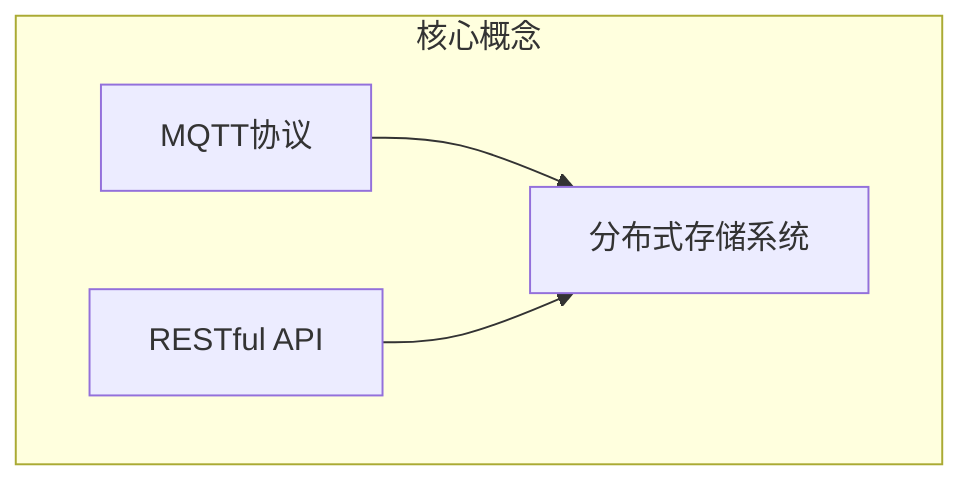
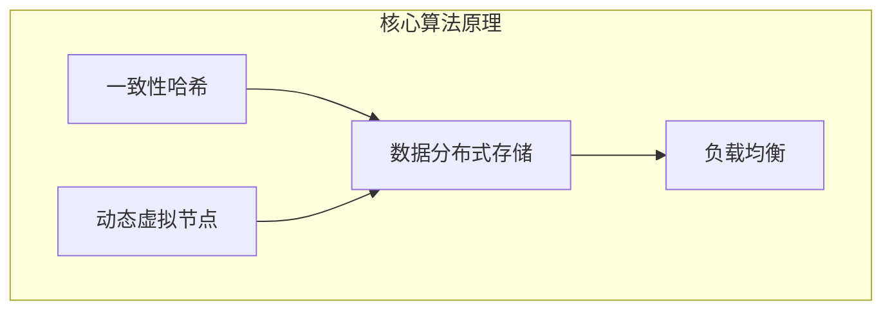

# 基于MQTT协议和RESTful API的智能家居分布式存储解决方案

## 1. 背景介绍

### 1.1 问题的由来

随着物联网和智能家居技术的快速发展,越来越多的家用电器和智能设备被连接到家庭网络中。这些设备产生的海量数据需要被高效地收集、存储和管理。然而,传统的集中式存储方案面临着可扩展性、单点故障和隐私安全等挑战,无法满足智能家居场景下对数据存储的需求。

### 1.2 研究现状 

目前,已有一些分布式存储解决方案被应用于物联网和智能家居领域,如基于IPFS(InterPlanetary File System)的分布式文件系统、基于区块链的去中心化存储等。然而,这些方案要么过于复杂,要么缺乏对实时数据流的支持,无法完全满足智能家居场景下对数据存储的需求。

### 1.3 研究意义

本文提出了一种基于MQTT(Message Queuing Telemetry Transport)协议和RESTful API的智能家居分布式存储解决方案。该方案利用MQTT协议实现设备与服务器之间的实时数据交换,并通过RESTful API提供对分布式存储系统的访问和管理。该解决方案具有以下优势:

1. 实时性:MQTT协议确保了数据的实时传输和处理。
2. 可扩展性:分布式存储系统可以根据需求动态扩展存储容量。
3. 高可用性:分布式存储系统避免了单点故障的风险。
4. 隐私安全:数据可以在本地存储,提高了隐私保护。

### 1.4 本文结构

本文首先介绍了智能家居分布式存储解决方案的背景和研究意义。接下来,详细阐述了该解决方案的核心概念和算法原理。然后,对数学模型和公式进行了推导和案例分析。此外,还提供了一个基于Python的项目实践,包括代码实现和运行结果展示。最后,探讨了该解决方案的实际应用场景、未来发展趋势和面临的挑战。

## 2. 核心概念与联系

本节将介绍智能家居分布式存储解决方案的核心概念,包括MQTT协议、RESTful API和分布式存储系统,并阐述它们之间的联系。

### 2.1 MQTT协议

MQTT(Message Queuing Telemetry Transport)是一种基于发布/订阅模式的轻量级消息传输协议,被广泛应用于物联网和移动应用领域。它具有以下特点:

- 轻量级:MQTT协议的开销很小,适合于带宽和计算资源有限的环境。
- 可靠性:MQTT协议提供了三种不同的消息传递质量级别,确保了消息的可靠传输。
- 灵活性:MQTT协议支持多种编程语言和平台,易于集成和部署。

在智能家居场景中,MQTT协议可以用于实现家庭网络中各种智能设备与服务器之间的实时数据交换。

### 2.2 RESTful API

RESTful API(Representational State Transfer Application Programming Interface)是一种基于HTTP协议的软件架构风格,它定义了一组约束条件和原则,用于设计Web服务。RESTful API具有以下优点:

- 简单性:RESTful API使用HTTP协议的标准方法(GET、POST、PUT、DELETE等)进行资源操作,易于理解和使用。
- 无状态性:RESTful API是无状态的,每个请求都包含了完整的信息,不依赖于之前的请求。
- 可扩展性:RESTful API可以轻松地添加新的资源和操作,具有良好的扩展性。

在智能家居分布式存储解决方案中,RESTful API可以用于提供对分布式存储系统的访问和管理,包括数据的存储、检索、更新和删除等操作。

### 2.3 分布式存储系统

分布式存储系统是一种将数据分散存储在多个节点上的存储架构,具有高可扩展性、高可用性和容错性等优点。在智能家居场景中,分布式存储系统可以用于存储来自各种智能设备的海量数据,避免了传统集中式存储方案的单点故障风险。

分布式存储系统通常采用以下策略来实现数据的分布式存储:

- 数据分片:将数据划分为多个块,分散存储在不同的节点上。
- 数据复制:为了提高数据的可用性和容错性,在多个节点上存储数据的副本。
- 一致性协议:采用一致性协议(如Paxos、Raft等)来确保分布式系统中数据的一致性。

在本解决方案中,MQTT协议用于实现智能设备与服务器之间的实时数据交换,RESTful API提供对分布式存储系统的访问和管理,而分布式存储系统则负责数据的分布式存储和管理。这三者相互配合,构建了一个完整的智能家居分布式存储解决方案。

## 3. 核心算法原理 & 具体操作步骤

### 3.1 算法原理概述

本解决方案的核心算法原理基于一致性哈希(Consistent Hashing)和动态虚拟节点(Dynamic Virtual Node)技术,实现了数据的分布式存储和负载均衡。

#### 一致性哈希

一致性哈希(Consistent Hashing)是一种分布式哈希算法,它可以将数据均匀地分布在多个节点上,并且在节点加入或离开时,只需重新映射少量数据,从而提高了系统的可扩展性和容错性。

在一致性哈希算法中,所有的节点和数据块都被映射到同一个哈希环上。当需要存储或检索数据时,首先计算数据块的哈希值,然后在哈希环上顺时针查找第一个大于或等于该哈希值的节点,将数据块存储或检索到该节点上。

#### 动态虚拟节点

为了进一步提高数据分布的均匀性,本解决方案采用了动态虚拟节点(Dynamic Virtual Node)技术。每个实际节点在哈希环上被表示为多个虚拟节点,这些虚拟节点均匀地分布在哈希环上。当需要存储或检索数据时,先计算数据块的哈希值,然后在哈希环上顺时针查找第一个大于或等于该哈希值的虚拟节点,将数据块存储或检索到该虚拟节点对应的实际节点上。

通过动态调整虚拟节点的数量,可以实现数据分布的动态均衡,从而提高了系统的负载均衡能力。

### 3.2 算法步骤详解

1. **初始化哈希环和节点映射**

   - 创建一个哈希环,范围为0到2^32-1。
   - 为每个实际节点生成多个虚拟节点,将虚拟节点的哈希值映射到哈希环上。
   - 建立虚拟节点到实际节点的映射表。

2. **数据存储**

   - 计算数据块的哈希值。
   - 在哈希环上顺时针查找第一个大于或等于该哈希值的虚拟节点。
   - 根据虚拟节点到实际节点的映射表,将数据块存储到对应的实际节点上。

3. **数据检索**

   - 计算数据块的哈希值。
   - 在哈希环上顺时针查找第一个大于或等于该哈希值的虚拟节点。
   - 根据虚拟节点到实际节点的映射表,从对应的实际节点上检索数据块。

4. **节点加入或离开**

   - 对于加入的新节点,生成对应的虚拟节点,并将它们映射到哈希环上。
   - 对于离开的节点,删除对应的虚拟节点映射。
   - 重新计算受影响的数据块的存储位置,并进行数据迁移。

5. **动态调整虚拟节点数量**

   - 监控节点的负载情况。
   - 如果某个节点的负载过高,增加该节点对应的虚拟节点数量。
   - 如果某个节点的负载过低,减少该节点对应的虚拟节点数量。
   - 重新计算受影响的数据块的存储位置,并进行数据迁移。

### 3.3 算法优缺点

#### 优点

- **高可扩展性**:通过一致性哈希算法,新节点加入或离开时只需重新映射少量数据,提高了系统的可扩展性。
- **高可用性**:分布式存储系统避免了单点故障的风险,提高了系统的可用性。
- **负载均衡**:动态虚拟节点技术可以实现数据分布的动态均衡,提高了系统的负载均衡能力。

#### 缺点

- **数据迁移开销**:当节点加入或离开时,需要进行数据迁移,可能会带来一定的开销。
- **一致性问题**:分布式系统中需要解决数据一致性问题,可能会增加系统的复杂性。
- **哈希计算开销**:需要进行大量的哈希计算,可能会对系统性能产生一定影响。

### 3.4 算法应用领域

基于一致性哈希和动态虚拟节点的分布式存储算法不仅可以应用于智能家居场景,还可以广泛应用于以下领域:

- **内容分发网络(CDN)**:通过将内容分布式存储在多个节点上,可以提高内容分发的效率和可靠性。
- **分布式缓存**:可以将热点数据分布式存储在多个缓存节点上,提高缓存的命中率和可扩展性。
- **分布式文件系统**:可以将大文件分割为多个数据块,分布式存储在多个节点上,提高文件存储的可靠性和可扩展性。
- **分布式数据库**:可以将数据分布式存储在多个节点上,提高数据库的可扩展性和容错性。

## 4. 数学模型和公式 & 详细讲解 & 举例说明

### 4.1 数学模型构建

为了更好地理解和分析一致性哈希算法的性能,我们构建了一个数学模型。假设哈希环的范围为[0, N-1],共有n个节点均匀分布在哈希环上。我们需要计算在节点加入或离开时,需要重新映射的数据块的比例。

设$K$为需要重新映射的数据块数量,$M$为总的数据块数量。我们定义重新映射比例$R$如下:

$$R = \frac{K}{M}$$

我们的目标是求出$R$的期望值$E(R)$,并分析它与$n$和$N$的关系。

### 4.2 公式推导过程

首先,我们考虑单个数据块被重新映射的概率。由于节点在哈希环上是均匀分布的,因此数据块被重新映射的概率等于节点加入或离开时,该数据块落在新节点或离开节点所负责的区间的概率。

对于单个节点加入或离开,该概率为$\frac{1}{n}$。因此,单个数据块被重新映射的概率为:

$$P = 1 - \left(1 - \frac{1}{n}\right)^2 = \frac{2}{n} - \frac{1}{n^2}$$

由于总共有$M$个数据块,需要重新映射的数据块数量$K$服从二项分布,其期望值为:

$$E(K) = M \cdot P = M \cdot \left(\frac{2}{n} - \frac{1}{n^2}\right)$$

将$E(K)$代入重新映射比例$R$的定义,我们得到:

$$E(R) = \frac{E(K)}{M} = \frac{2}{n} - \frac{1}{n^2}$$

从上式可以看出,$E(R)$与$N$无关,只与节点数量$n$有关。当$n$足够大时,$\frac{1}{n^2}$可以忽略不计,因此$E(R)$近似为$\frac{2}{n}$。

### 4.3 案例分析与讲解

现在,我们以一个具体的案