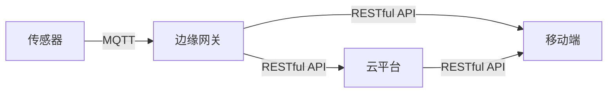

# 基于MQTT协议和RESTful API的智能家居自然灾害预警系统

关键词：物联网、MQTT协议、RESTful API、智能家居、自然灾害预警、传感器、边缘计算、云平台

## 1. 背景介绍
### 1.1 问题的由来
随着全球气候变化加剧,自然灾害发生的频率和强度都在不断增加。火灾、洪水、地震等灾害给人们的生命财产造成了巨大损失。传统的灾害预警系统存在信息传递不及时、覆盖范围有限等问题,难以满足日益增长的防灾减灾需求。

### 1.2 研究现状
近年来,物联网、云计算、大数据等新兴技术的发展为灾害预警系统的升级提供了新的思路。国内外学者围绕物联网在灾害预警中的应用开展了大量研究。但现有方案大多存在系统复杂度高、实时性不足、扩展性差等不足。

### 1.3 研究意义
开发一套基于MQTT协议和RESTful API的智能家居自然灾害预警系统,利用物联网传感器实时采集环境数据,通过轻量级MQTT协议进行数据上报,并使用RESTful API实现系统各模块的解耦和对接,从而构建一个实时、高效、可扩展的灾害预警平台,对提升社会防灾减灾能力具有重要意义。

### 1.4 本文结构
本文首先介绍了智能家居自然灾害预警系统的背景和研究现状,阐述了研究意义。然后重点分析了系统涉及的MQTT协议、RESTful API等核心概念。接着详细讲解了系统的整体架构设计、硬件选型、服务端和客户端的实现方案。最后总结了全文,并对智能家居灾害预警的发展趋势和挑战进行了展望。

## 2. 核心概念与联系
智能家居自然灾害预警系统的实现涉及多个核心概念:
- 物联网(IoT):通过各种信息传感设备,实时采集环境中的数据,并通过网络进行传输和处理,从而实现智能感知和控制。
- MQTT协议:一种轻量级的发布/订阅模式消息传输协议,适用于低带宽、不稳定的网络环境,被广泛应用于物联网数据传输领域。
- RESTful API:一种基于HTTP协议的架构风格,通过一套标准化的接口定义实现不同系统之间的通信和资源操作。
- 传感器:用于感知环境中的各种物理量如温度、湿度、烟雾浓度等,并将其转换为电信号进行传输。常见的传感器有温湿度传感器、烟雾传感器、水位传感器等。
- 边缘计算:在靠近物联网设备或数据源的网络边缘侧,融合网络、计算、存储、应用核心能力的分布式开放平台,就近提供边缘智能服务,满足行业在实时业务、应用智能、安全与隐私保护等方面的基本需求。
- 云平台:提供海量数据存储、高性能计算、智能分析等能力,支撑灾害预警的大数据处理和智能决策。

在智能家居灾害预警系统中,传感器负责感知环境数据,通过MQTT协议将数据上报到边缘网关。边缘网关在本地进行初步的数据清洗和分析,触发报警则通过RESTful API推送警报到云平台和用户终端。云平台进一步汇总分析数据,生成预警信息,并通过API同步到各终端。由此形成一个完整的由感知层、网络层、平台层、应用层组成的端到端物联网灾害预警系统。



## 3. 核心算法原理 & 具体操作步骤
### 3.1 算法原理概述
智能家居灾害预警的核心是通过环境数据分析实现灾害的早期识别和预警。针对不同灾害类型,需要采集不同的环境参数,并设定相应的预警阈值。以火灾预警为例,需要重点关注环境温度、烟雾浓度等指标。当监测数值超过设定阈值时,判定为火灾风险,触发报警。

### 3.2 算法步骤详解
1. 数据采集:传感器以一定频率采集环境温度、烟雾浓度等数据,并通过MQTT协议上报到边缘网关。
2. 数据预处理:边缘网关对接收到的数据进行校验、去噪、归一化等预处理,提高数据质量。
3. 阈值比对:将预处理后的数据与预设阈值进行比对。以温度和烟雾浓度为例,可分别设置温度上限Tmax和烟雾浓度上限Smax。
4. 风险判断:根据阈值比对结果判断火灾风险。设当前温度为T,烟雾浓度为S,则火灾风险判断规则为:
   $$ Risk = \begin{cases}
   High & T>Tmax \and S>Smax \\
   Medium & T>Tmax \or S>Smax \\
   Low & T<=Tmax \and S<=Smax
   \end{cases} $$
5. 触发报警:当判定出现火灾高风险时,由边缘网关通过RESTful API向云平台和用户终端发送报警信息。

### 3.3 算法优缺点
优点:
- 算法简单易实现,计算开销小,适合边缘计算场景。
- 阈值可灵活设置,支持个性化定制。
- 同时考虑温度和烟雾浓度,可有效降低误报率。

缺点: 
- 阈值设置需要大量经验数据作为参考,否则容易造成漏报或误报。
- 缺乏环境数据的动态学习能力,难以应对复杂多变的实际环境。
- 只能识别已知场景,对于一些罕见的火灾征兆缺乏判断力。

### 3.4 算法应用领域
该算法适用于家庭、办公室、仓库等场所的火灾预警。通过在高危区域部署传感器,并设置合理的预警阈值,可以及时发现火灾隐患,为人员疏散和救援赢得宝贵时间。同时该算法也可以推广到其他类型的灾害预警如洪水、有毒气体泄漏等场景。

## 4. 数学模型和公式 & 详细讲解 & 举例说明
### 4.1 数学模型构建
为了量化表示火灾风险,引入火灾风险指数R。R的取值范围为0到100,数值越大表示火灾风险越高。R可以用当前温度T和烟雾浓度S的函数来表示:

$$R=f(T,S)$$

考虑到温度和烟雾浓度对火灾风险的影响不是线性的,且存在一个临界点。当温度或烟雾浓度超过临界值时,火灾风险急剧增大。因此可以用Sigmoid函数来建模R与T、S的关系:

$$R=\frac{100}{1+e^{-(\alpha T+\beta S)}}$$

其中,$\alpha$和$\beta$为待定参数,反映温度和烟雾浓度对火灾风险影响的权重。

### 4.2 公式推导过程
对Sigmoid函数求导,得:

$$\frac{dR}{dT}=\frac{100\alpha e^{-(\alpha T+\beta S)}}{(1+e^{-(\alpha T+\beta S)})^2}$$

$$\frac{dR}{dS}=\frac{100\beta e^{-(\alpha T+\beta S)}}{(1+e^{-(\alpha T+\beta S)})^2}$$

可以看出,风险指数R关于温度T和烟雾浓度S的导数恒大于0,即R是T和S的单调递增函数。且当$\alpha T+\beta S$较小时,R对T和S的变化不敏感;当$\alpha T+\beta S$较大时,R对T和S的变化极为敏感。这与前面提到的火灾风险判断的临界特性是一致的。

$\alpha$和$\beta$可以根据经验数据进行估计。例如,统计分析历史火灾案例,得到火灾发生时的平均温度为80℃,平均烟雾浓度为5mg/m³。代入Sigmoid函数,假设此时的火灾风险指数R为90,则:

$$90 = \frac{100}{1+e^{-(\alpha \cdot 80+\beta \cdot 5)}}$$

再根据常温(20℃)、无烟雾环境下的火灾风险指数接近0,可得:

$$0 \approx \frac{100}{1+e^{-(\alpha \cdot 20+\beta \cdot 0)}}$$

联立求解上述两个方程,可得$\alpha$和$\beta$的估计值。

### 4.3 案例分析与讲解
假设某智能家居系统监测到客厅的温度为60℃,烟雾浓度为3mg/m³。根据上一节估计出的$\alpha=0.15,\beta=1.2$,代入Sigmoid函数,可得:

$$R=\frac{100}{1+e^{-(0.15 \cdot 60+1.2 \cdot 3)}}=95.2$$

可见在当前环境下,火灾风险指数高达95.2,属于高风险情况,系统应立即触发报警。

如果此时温度下降到40℃,烟雾浓度下降到1mg/m³,则火灾风险指数变为:

$$R=\frac{100}{1+e^{-(0.15 \cdot 40+1.2 \cdot 1)}}=22.4$$

风险指数降至22.4,处于较低水平,系统可以解除报警。

### 4.4 常见问题解答
Q: 如何确定火灾风险指数R的阈值?
A: R的阈值需要根据实际应用场景和用户的风险偏好来设定。通常可以将R划分为几个区间,例如:
   - R<30:低风险,无需报警
   - 30<=R<70:中等风险,发出预警信息
   - R>=70:高风险,立即报警
   
阈值的划分需要不断优化和调整,以平衡漏报和误报的风险。

Q: 模型是否可以扩展到其他类型的传感器数据?
A: 可以。Sigmoid函数是一种常见的机器学习模型,可以融合多种传感器的数据,训练得到一个综合的风险评估模型。例如,可以在模型中加入湿度、气压等参数,以提高预警的准确性。

Q: 模型的训练和更新方法是什么?
A: 可以采用监督学习的方法,以历史火灾数据作为训练样本,优化模型参数使其输出与实际火灾情况尽量吻合。在系统运行过程中,也要定期用新采集的数据对模型进行fine-tuning,使其适应环境的变化。在线学习、增量学习是常用的模型更新方法。

## 5. 项目实践：代码实例和详细解释说明
### 5.1 开发环境搭建
- 硬件:Raspberry Pi 4B、DHT11温湿度传感器、MQ-2烟雾传感器
- 操作系统:Raspberry Pi OS
- 编程语言:Python 3.7
- 依赖库:paho-mqtt、flask、numpy

### 5.2 源代码详细实现
```python
import paho.mqtt.client as mqtt
from flask import Flask, request
import numpy as np
import json
import time

# MQTT配置
MQTT_BROKER = "127.0.0.1"
MQTT_PORT = 1883
MQTT_TOPIC = "home/sensor/fire"

# 火灾风险模型参数
ALPHA = 0.15
BETA = 1.2

# 初始化Flask应用
app = Flask(__name__)

# 风险评估函数
def fire_risk_score(temp, smoke):
    R = 100 / (1 + np.exp(-(ALPHA*temp + BETA*smoke)))
    return R

# 接收传感器数据的回调函数
def on_message(client, userdata, msg):
    payload = json.loads(msg.payload.decode())
    temp = payload["temperature"]
    smoke = payload["smoke"]
    
    # 计算火灾风险指数
    risk_score = fire_risk_score(temp, smoke)
    print(f"Temperature: {temp}°C, Smoke: {smoke}mg/m³, Risk Score: {risk_score:.2f}")
    
    # 触发报警
    if risk_score >= 70:
        # 向云平台发送高风险报警
        requests.post("http://api.example.com/alert", json={"