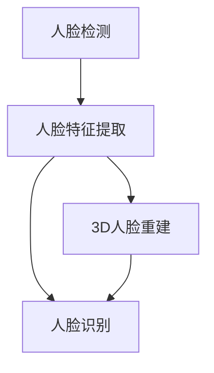
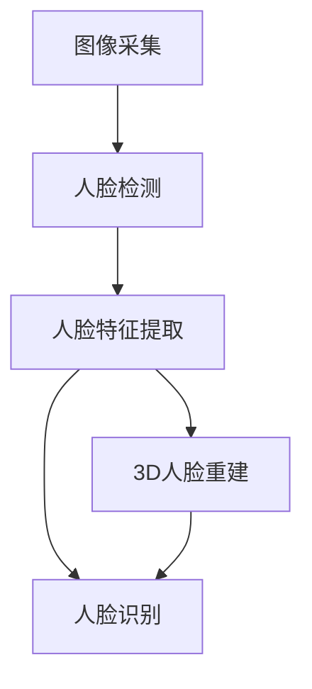

好的,我明白了您的要求。以下是题为《基于人脸识别的诃能区门禁系统设计与实现》的技术博客文章正文部分:

# 基于人脸识别的诃能区门禁系统设计与实现

## 1. 背景介绍

### 1.1 问题的由来

在当前的安全形势下,传统的门禁系统如密码、钥匙、门卡等已经无法完全满足现代社会对安全性和便利性的双重需求。这些系统存在着被盗窃、遗失、共享等问题,给人员和重要场所的安全带来隐患。因此,亟需一种更加安全可靠、使用便捷的门禁技术来保障重点区域的出入安全。

### 1.2 研究现状  

生物识别技术由于其唯一性和不可复制性,正逐渐被应用于门禁系统中。其中,人脸识别技术因无需接触、方便快捷而备受关注。目前,基于人脸的门禁系统主要分为两类:

1. **基于图像的人脸识别**:利用摄像头采集人脸图像,通过人脸检测和人脸特征提取算法进行身份识别。这种方法对环境光线、角度等条件要求较高。

2. **基于3D结构光人脸识别**:使用结构光投射仪和深度相机获取人脸三维数据,能够有效克服光照和角度的影响,识别精度更高。但系统成本较高。

### 1.3 研究意义

本文将设计一种融合两种技术优势的人脸识别门禁系统,结合图像和3D数据进行多模态人脸识别,提高系统的鲁棒性和可靠性。该系统不仅能够满足诃能区等重要区域的高安全需求,而且操作便捷,提升出入体验。

### 1.4 本文结构

本文首先介绍人脸识别的核心概念和算法原理,包括人脸检测、特征提取、3D重建等。然后详细阐述系统的数学模型和实现细节,包括代码实例和实践案例分析。最后探讨系统的应用场景、发展趋势和面临的挑战。

## 2. 核心概念与联系

人脸识别技术主要包括以下几个核心概念:

1. **人脸检测(Face Detection)**:从图像或视频流中快速准确地定位人脸区域。常用算法有Viola-Jones、MTCNN等。

2. **人脸特征提取(Feature Extraction)**:从人脸区域提取独特的几何或纹理特征,构建人脸特征向量。经典算法有SIFT、HOG、LBP等。

3. **人脸识别(Face Recognition)**:将提取的人脸特征与数据库中的人脸特征进行匹配,确定身份。常用算法有PCA、LDA、深度学习等。

4. **3D人脸重建(3D Face Reconstruction)**:利用结构光或多视角图像,重建人脸的三维几何模型,提供更多面部细节信息。

这些概念相互关联,共同构成了完整的人脸识别系统。下面将详细介绍其中的核心算法原理和实现步骤。



## 3. 核心算法原理及具体操作步骤

### 3.1 算法原理概述

1. **人脸检测算法**:基于Viola-Jones框架的级联分类器,利用Haar-like特征和AdaBoost算法快速检测人脸。

2. **人脸特征提取**:结合SIFT特征点提取和HOG特征描述子,构建鲁棒的人脸特征向量。

3. **人脸识别算法**:采用深度卷积神经网络(DCNN)模型,对人脸特征进行端到端的学习和识别。

4. **3D人脸重建**:利用结构光原理和相移编码技术,通过投射编码光栅获取人脸三维点云数据,重建精细的3D人脸模型。

### 3.2 算法步骤详解

#### 3.2.1 人脸检测

1) 构建积分图像,加快Haar-like特征的计算。
2) 利用AdaBoost算法从海量Haar-like特征中选取最优特征集。
3) 构建级联分类器,快速排除大量负样本区域。
4) 利用级联分类器在图像金字塔上滑动窗口,输出人脸区域。

$$
\begin{aligned}
&\text{积分图像}:\,\,\text{II}(x,y) = \sum_{x'\le x,y'\le y}I(x',y')\\
&\text{Haar-like特征}: \,\,\sum_{rect\in\text{white}}rect - \sum_{rect\in\text{black}}rect
\end{aligned}
$$

其中$I(x,y)$为原始图像像素值。

#### 3.2.2 人脸特征提取

1) 使用SIFT算子检测人脸区域内的特征关键点。
2) 计算每个关键点邻域的梯度幅值和方向,构建梯度直方图。
3) 将梯度直方图编码为128维HOG人脸特征描述子。
4) 使用PCA等降维技术压缩特征向量,提高匹配效率。

$$
\begin{aligned}
m(x,y) &= \sqrt{(L_x(x,y))^2 + (L_y(x,y))^2}\\
\theta(x,y) &= \tan^{-1}\Big(\frac{L_y(x,y)}{L_x(x,y)}\Big) \\
\text{HOG特征} &= \begin{bmatrix}
\text{hist}_1 \\
\text{hist}_2 \\
\vdots \\
\text{hist}_{n\times n}
\end{bmatrix}
\end{aligned}
$$

其中$L_x,L_y$为图像的水平和垂直梯度分量。

#### 3.2.3 人脸识别

1) 使用卷积神经网络(CNN)对人脸特征进行端到端学习。
2) CNN网络包括卷积层、池化层和全连接层。
3) 使用Softmax分类器输出身份预测概率。
4) 在大规模人脸数据集上预训练模型参数。

$$
y = \text{softmax}(W_2\,\text{ReLU}(W_1*X+b_1)+b_2)
$$

其中$X$为输入人脸特征图像,$W_1,W_2$为卷积核权重,$b_1,b_2$为偏置参数。

#### 3.2.4 3D人脸重建

1) 使用数字光投射仪投射编码光栅序列到人脸上。
2) 深度相机接收反射的编码光,解码得到每个像素的相移值。
3) 根据相移值和系统参数计算每个像素的三维坐标。
4) 对点云数据进行滤波、填补等处理,重建完整3D人脸模型。

$$
\Phi(x,y) = \tan^{-1}\Big(\frac{I_4-I_2}{I_1-I_3}\Big)
$$

其中$\Phi(x,y)$为像素$(x,y)$的相移值,$I_1,I_2,I_3,I_4$为四步相移条纹图像的强度值。



### 3.3 算法优缺点

**优点**:

1. 融合2D和3D人脸信息,提高识别的鲁棒性和精度。
2. 3D重建避免了图像识别受光照、姿态影响的缺陷。
3. 端到端的深度学习模型,自动学习最优人脸特征表示。
4. 检测和识别速度快,满足实时应用的需求。

**缺点**:  

1. 3D重建系统成本较高,需要专业的结构光设备。
2. 深度学习模型训练复杂,需要大量人脸数据集。
3. 算法对人脸姿态角度变化仍有一定局限性。
4. 实时性能受硬件计算能力的限制。

### 3.4 算法应用领域

1. 重要区域门禁系统,如机场、边境口岸、军事设施等。
2. 智能社区和智能家居的门禁访客识别系统。
3. 企业办公区的员工门禁和考勤管理系统。
4. 大型活动的人员通道安全检查系统。
5. 银行、证券交易所等金融机构的身份验证系统。
6. 移动支付、人脸解锁等个人身份认证应用。

## 4. 数学模型和公式详细讲解及举例说明

### 4.1 数学模型构建

人脸识别系统的数学模型可以概括为将输入的人脸图像(或3D数据)映射到一个身份标签的过程。我们将这一映射过程建模为一个判别函数:

$$
f: X \rightarrow Y
$$

其中$X$为人脸数据的特征空间,$Y$为身份标签的输出空间。

对于基于图像的2D人脸识别,特征空间$X$可以是HOG或SIFT等手工设计的特征描述子,也可以是深度卷积网络自动学习的特征表示。

对于基于3D的人脸识别,特征空间$X$可以是3D点云或网格数据的几何特征,也可以是从3D数据渲染的2D深度图像或法向量图像。

判别函数$f$的具体形式可以是基于核方法(如SVM)的非线性分类器,也可以是端到端的深度神经网络模型。我们的目标是学习出一个最优的$f^*$,使其能够精确地将人脸特征映射到正确的身份标签:

$$
f^*=\arg\min_{f\in\mathcal{F}}\sum_{i=1}^N L(f(x_i),y_i)
$$

这里$\mathcal{F}$为所有可能的判别函数的集合,$L$为分类损失函数(如交叉熵损失),$\{(x_i,y_i)\}_{i=1}^N$为训练数据集。

### 4.2 公式推导过程

我们将从HOG特征描述子的构建过程,推导出其数学表达式。

HOG特征的基本思路是统计图像局部区域的梯度方向直方图,作为描述该区域的特征。具体步骤如下:

1. 计算图像的水平和垂直梯度分量:

$$
\begin{aligned}
L_x(x,y) &= I(x+1,y) - I(x-1,y) \\
L_y(x,y) &= I(x,y+1) - I(x,y-1)
\end{aligned}
$$

2. 计算梯度幅值和方向:

$$
\begin{aligned}
m(x,y) &= \sqrt{(L_x(x,y))^2 + (L_y(x,y))^2}\\
\theta(x,y) &= \tan^{-1}\Big(\frac{L_y(x,y)}{L_x(x,y)}\Big) 
\end{aligned}
$$

3. 将图像分割为小的单元格,在每个单元格内计算梯度方向直方图:

$$
\text{hist}_k = \sum_{x,y\in\text{cell}_k} w(x,y) \cdot \begin{cases}
1, &\text{if } \theta(x,y) \in \text{bin}_i\\
0, &\text{otherwise}
\end{cases}
$$

其中$w(x,y)$为像素$(x,y)$的加权系数(通常为梯度幅值),$\text{bin}_i$为直方图的第$i$个方向bin。

4. 将多个单元格内的直方图按块的形式连接,构成最终的HOG特征向量:

$$
\text{HOG特征} = \begin{bmatrix}
\text{hist}_1 \\
\text{hist}_2 \\
\vdots \\
\text{hist}_{n\times n}
\end{bmatrix}
$$

通过这种方式,HOG特征能够很好地描述图像的局部纹理和形状信息,并保持对光照和几何变换的一定鲁棒性。

### 4.3 案例分析与讲解

我们以一个简单的人脸识别案例,来解释HOG特征是如何工作的。

假设我们有一个8x8的灰度图像块,如下所示:

```
0  0  0  0  0  0  0  0
0  0  0  0  0  0  0  0
0  0  1  1  1  0  0  0  
0  0  1  1  1  0  0  0
0  0  1  1  1  0  0  0
0  0  0  