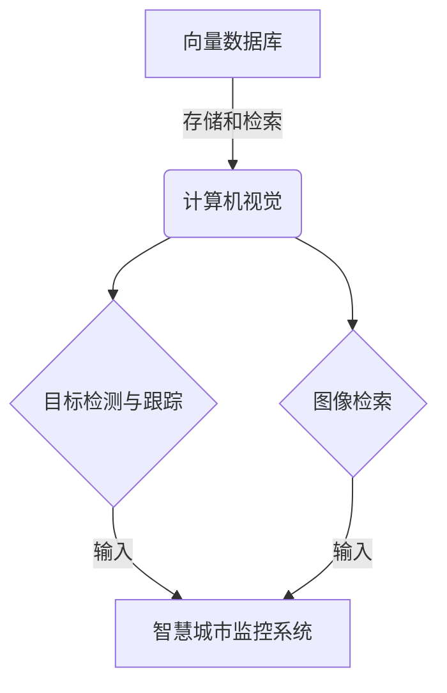

# 基于向量数据库的智慧城市监控系统

## 1. 背景介绍

### 1.1 问题的由来

随着城市化进程的不断加快,城市面临着交通拥堵、环境污染、公共安全等一系列挑战。传统的城市管理模式已经无法满足现代城市的发展需求,迫切需要一种新型的智能化城市管理系统来应对这些挑战。智慧城市的概念应运而生,它利用物联网、大数据、人工智能等先进技术,实现对城市各个领域的智能化管理和优化。

其中,城市监控系统作为智慧城市的重要组成部分,对于维护城市安全、优化城市运营、提高公共服务质量等方面发挥着关键作用。然而,传统的城市监控系统存在一些明显的不足,例如:

1. **数据孤岛**:各个监控系统之间数据无法共享,导致数据资源无法充分利用。
2. **实时性差**:大量视频数据的传输和处理存在时延,无法实现实时监控。
3. **识别能力有限**:传统监控系统主要依赖人工识别,识别精度和效率较低。
4. **扩展性差**:监控系统的扩展性能较差,难以适应城市规模的快速增长。

因此,迫切需要一种新型的城市监控系统,能够克服上述问题,实现高效、智能、实时的城市监控和管理。

### 1.2 研究现状

近年来,随着人工智能、大数据、物联网等技术的快速发展,智慧城市监控系统也取得了长足的进步。其中,基于向量数据库的智慧城市监控系统受到了广泛关注。

向量数据库是一种新型的数据库系统,它能够高效地存储和检索高维度的向量数据,例如图像、视频、音频等非结构化数据。相比于传统的关系型数据库和NoSQL数据库,向量数据库具有以下优势:

1. **高效相似性搜索**:向量数据库可以基于向量相似度快速检索相似的数据,适合于图像、视频等非结构化数据的处理。
2. **高维度支持**:向量数据库能够支持高达数千维的向量数据,满足复杂场景下的数据需求。
3. **可扩展性强**:向量数据库通常采用分布式架构,具有良好的水平扩展能力。
4. **低延迟查询**:向量数据库的查询延迟通常在毫秒级,适合实时查询场景。

基于向量数据库的智慧城市监控系统可以将来自各个监控点的视频流、图像等数据转换为高维向量,存储在向量数据库中。通过人工智能算法对这些向量数据进行分析和处理,实现对目标的实时检测、跟踪和识别,从而提高监控系统的智能化水平和实时性能。

### 1.3 研究意义

基于向量数据库的智慧城市监控系统具有重要的理论和应用价值:

1. **理论意义**:该系统将人工智能、大数据、物联网等前沿技术与城市监控系统相结合,是智慧城市建设的重要探索。它可以为智慧城市的其他领域提供借鉴和参考。

2. **应用价值**:该系统能够实现对城市公共安全、交通管理、环境监测等多个领域的智能化监控,提高城市运营效率,优化公共资源配置,提升市民的生活质量。

3. **经济价值**:通过提高监控系统的智能化水平和实时性能,可以降低人力成本,提高工作效率,为城市节约大量的运营成本。

4. **社会价值**:该系统有助于维护城市安全,预防犯罪,保障市民的生命财产安全,促进社会和谐稳定。

### 1.4 本文结构

本文将全面介绍基于向量数据库的智慧城市监控系统的核心概念、关键技术、系统架构和实现方法。文章主要内容包括:

1. 核心概念与联系
2. 核心算法原理与具体操作步骤
3. 数学模型和公式详细讲解与案例分析
4. 项目实践:代码实例和详细解释说明
5. 实际应用场景分析
6. 工具和资源推荐
7. 总结:未来发展趋势与挑战
8. 附录:常见问题与解答

## 2. 核心概念与联系

基于向量数据库的智慧城市监控系统涉及多个核心概念,包括向量数据库、计算机视觉、目标检测与跟踪、图像检索等,这些概念相互关联,共同构建了该系统的技术框架。

1. **向量数据库**:向量数据库是一种专门为高维向量数据(如图像、视频、音频等)而设计的数据库系统。它能够高效地存储和检索这些非结构化数据,支持基于向量相似度的快速查询。在智慧城市监控系统中,向量数据库用于存储和管理来自各个监控点的视频流和图像数据。

2. **计算机视觉**:计算机视觉是一门研究如何使计算机能够获取、处理和理解数字图像或视频数据的科学。它涉及图像处理、模式识别、目标检测与跟踪等多个领域。在智慧城市监控系统中,计算机视觉技术用于从视频流中提取有用的信息,如目标检测、跟踪和识别等。

3. **目标检测与跟踪**:目标检测是指在图像或视频中自动定位感兴趣的目标对象,如人、车辆等。目标跟踪是指在连续的视频帧中持续跟踪检测到的目标对象。这两项技术在智慧城市监控系统中发挥着关键作用,用于实时监测城市中的人员和车辆等目标。

4. **图像检索**:图像检索是指根据图像的内容或特征,从大规模图像数据库中快速检索出相似的图像。在智慧城市监控系统中,图像检索技术可用于快速查找监控视频中的特定目标,如嫌疑人员、车辆等,提高监控效率。

上述核心概念相互关联、相互作用,共同构建了基于向量数据库的智慧城市监控系统的技术框架。向量数据库为计算机视觉、目标检测与跟踪、图像检索等技术提供了高效的数据存储和检索支持,而这些技术又为智慧城市监控系统提供了强大的数据处理和分析能力。

## 3. 核心算法原理与具体操作步骤

### 3.1 算法原理概述

基于向量数据库的智慧城市监控系统的核心算法主要包括目标检测、目标跟踪和图像检索三个部分。

1. **目标检测算法**:目标检测算法的主要任务是从视频流或图像中自动定位感兴趣的目标对象,如人、车辆等。常用的目标检测算法包括基于深度学习的算法(如YOLO、Faster R-CNN等)和基于传统机器学习的算法(如HOG+SVM等)。

2. **目标跟踪算法**:目标跟踪算法的任务是在连续的视频帧中持续跟踪检测到的目标对象。常用的目标跟踪算法包括相关滤波跟踪算法(如MOSSE、KCF等)、深度学习跟踪算法(如SiamFC、SiamRPN等)和基于检测的跟踪算法(如SORT、Deep SORT等)。

3. **图像检索算法**:图像检索算法的目标是根据图像的内容或特征,从大规模图像数据库中快速检索出相似的图像。常用的图像检索算法包括基于内容的图像检索(CBIR)算法和基于深度学习的图像检索算法。

这三类算法相互配合,共同实现了智慧城市监控系统的核心功能。目标检测算法从视频流中提取出感兴趣的目标,目标跟踪算法持续跟踪这些目标,图像检索算法则可以快速查找监控视频中的特定目标。

### 3.2 算法步骤详解

基于向量数据库的智慧城市监控系统的核心算法步骤如下:

1. **视频预处理**:将来自各个监控点的视频流进行预处理,包括解码、降噪、图像增强等操作,以提高后续处理的质量。

2. **目标检测**:使用目标检测算法(如YOLO、Faster R-CNN等)在每一帧视频图像中检测出感兴趣的目标对象,如人、车辆等。

3. **特征提取**:对检测到的目标对象进行特征提取,将其转换为高维向量表示。常用的特征提取方法包括基于深度学习的方法(如ResNet、VGGNet等)和基于传统机器学习的方法(如HOG、SIFT等)。

4. **向量存储**:将提取的目标特征向量存储到向量数据库中,以便后续的目标跟踪和图像检索操作。

5. **目标跟踪**:使用目标跟踪算法(如SORT、Deep SORT等)在连续的视频帧中持续跟踪检测到的目标对象。

6. **图像检索**:当需要查找特定目标时,可以使用图像检索算法(如CBIR、基于深度学习的检索等)在向量数据库中快速检索出相似的目标特征向量,从而定位目标在监控视频中的位置。

7. **结果输出**:将目标检测、跟踪和检索的结果进行可视化显示,并根据需要触发相应的警报或响应措施。

上述算法步骤形成了一个闭环,实现了对城市中目标对象的实时检测、跟踪和检索,为智慧城市监控系统提供了强大的数据处理和分析能力。

### 3.3 算法优缺点

基于向量数据库的智慧城市监控系统的核心算法具有以下优缺点:

**优点**:

1. **实时性强**:利用向量数据库的高效检索能力,可以实现对目标的实时检测、跟踪和检索,满足智慧城市监控系统的实时性需求。

2. **准确性高**:采用先进的深度学习算法进行目标检测和特征提取,可以获得较高的检测和识别精度。

3. **扩展性好**:向量数据库通常采用分布式架构,具有良好的水平扩展能力,能够适应不断增长的监控数据量。

4. **综合能力强**:将目标检测、跟踪和图像检索等多种算法有机结合,提供了全面的智能化监控能力。

**缺点**:

1. **计算开销大**:深度学习算法和高维向量计算通常需要消耗大量的计算资源,对硬件要求较高。

2. **数据标注成本高**:训练深度学习模型需要大量标注数据,标注过程耗时耗力。

3. **隐私和伦理问题**:监控系统涉及大量个人隐私数据,需要注意相关的隐私和伦理问题。

4. **算法鲁棒性**:目前的算法在复杂环境下的鲁棒性仍有待提高,如遮挡、光照变化等情况下的表现还需进一步优化。

### 3.4 算法应用领域

基于向量数据库的智慧城市监控系统的核心算法不仅可以应用于城市监控领域,还可以广泛应用于其他领域,如:

1. **公共安全**:在机场、火车站、体育场馆等人员密集的公共场所,可以利用该系统实现人员实时监控和识别,提高公共安全水平。

2. **交通管理**:在城市道路和高速公路上,可以利用该系统实时监测车辆流量,识别违章车辆,优化交通管理。

3. **智能零售**:在商场、超市等场所,可以利用该系统实现顾客行为分析、商品防损监控等应用。

4. **工业视觉**:在工业生产线上,可以利用该系统实现产品质量检测、缺陷识别等视觉检测任务。