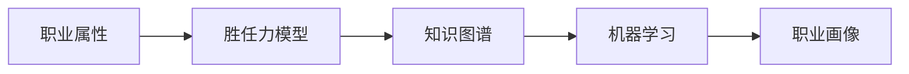

# 基于大数据技术的职业岗位画像设计与实现

关键词：大数据、职业画像、知识图谱、机器学习、人岗匹配

## 1. 背景介绍
### 1.1 问题的由来
随着大数据时代的到来,海量的职业和人才相关数据被不断产生和累积。如何有效地利用这些数据,挖掘其中蕴含的价值,成为了人力资源管理领域亟待解决的问题。职业画像技术应运而生,它利用大数据和人工智能技术,对特定职业的技能要求、任职资格、发展路径等多维度信息进行全面刻画,为职业规划、人岗匹配、人才培养提供数据支撑和决策依据。
### 1.2 研究现状
目前,国内外学者对职业画像的研究主要集中在以下几个方面:

1. 职业画像构建方法。主要包括基于本体的方法、基于知识图谱的方法、基于深度学习的方法等。
2. 职业画像应用场景。如人岗匹配、职业规划、人才盘点等。
3. 职业画像可视化。利用信息可视化技术,将职业画像以直观形象的方式呈现。

总的来说,职业画像仍是一个新兴的研究领域,在理论基础、技术架构、行业应用等方面都有待进一步探索。
### 1.3 研究意义 
职业画像对个人、企业、社会都具有重要意义:

1. 对个人而言,通过职业画像可以清晰地了解职业胜任力模型,制定职业发展路径,实现职业价值最大化。
2. 对企业而言,职业画像可以帮助HR优化配置人力资源,提高人岗匹配度,打造高绩效的人才队伍。
3. 对社会而言,职业画像有利于构建科学、精准的人才需求预测和培养体系,促进人力资源的优化配置,推动经济高质量发展。
### 1.4 本文结构
本文将重点探讨基于大数据技术的职业画像设计与实现。内容安排如下:

第2部分,介绍职业画像涉及的核心概念。第3部分,阐述职业画像构建的核心算法原理和操作步骤。第4部分,建立职业画像数学模型并给出公式推导。第5部分,展示职业画像的代码实现。第6部分,分析职业画像的实际应用场景。第7部分,推荐相关工具和学习资源。第8部分,总结全文并展望未来。

## 2. 核心概念与联系
职业画像是对特定职业进行全方位、多维度解析和刻画的信息集合。其核心概念包括:

- 职业属性:职业的内在特征,如工作任务、工作环境、薪酬待遇等。
- 胜任力模型:胜任某职业所需的知识、技能、态度等要素的组合。
- 知识图谱:以图形化、结构化的方式描述职业领域概念、实体及其关联。
- 机器学习:从职业数据中自动提取、学习职业特征,生成职业画像的关键技术。

这些概念相辅相成,共同构成了职业画像的理论基础和技术架构。其关联如下图所示:



## 3. 核心算法原理 & 具体操作步骤
### 3.1 算法原理概述
职业画像构建主要依赖自然语言处理、知识图谱、机器学习等大数据技术。其核心算法包括:

- 文本挖掘:从非结构化的职位描述、简历等文本数据中提取结构化信息。
- 实体识别:识别文本中的职业、技能、企业等关键实体。
- 关系抽取:发现实体间的上下位、同义、因果等语义关系。
- 知识融合:将多源异构数据映射、链接、整合为一致的知识图谱。
- 表示学习:学习职业实体的低维向量表示,用于相似度计算、聚类、分类等。
### 3.2 算法步骤详解
以下是利用上述算法构建职业画像知识图谱的主要步骤:

1. 数据采集:从招聘网站、企业内部等渠道采集职位描述、简历等原始数据。
2. 数据清洗:去除噪声数据,提取关键字段形成结构化数据。
3. 文本分析:利用分词、词性标注、命名实体识别等NLP技术,提取职业、技能、企业等关键实体。
4. 关系抽取:利用句法分析、依存分析等技术,识别实体间的关系,如"职业-所需技能"、"职业-从业企业"等。
5. 知识融合:基于本体、规则、深度学习等方法,将抽取的实体、关系、属性整合为职业知识图谱。
6. 知识存储:将知识图谱导入图数据库如Neo4j进行存储和管理。
7. 特征学习:利用TransE、Word2vec等表示学习算法,学习职业实体的低维语义表示。
8. 应用开发:开发基于知识图谱的职业画像可视化、语义检索、人岗匹配等应用。
### 3.3 算法优缺点
上述算法的优点在于:
- 全面性:多维度、多粒度地刻画职业特征。
- 语义化:挖掘数据内在语义,提升信息组织和检索的智能性。 
- 可解释:知识图谱以图形化方式呈现概念、实例间的关联,便于人类理解和交互。

同时,该方法也存在一些局限:
- 知识获取:高质量的知识获取需要大量标注数据,成本较高。 
- 领域适应:不同行业、职业的知识体系差异较大,通用性有待提高。
- 实时更新:职业数据更新速度快,知识图谱的实时性、扩展性有待加强。
### 3.4 算法应用领域
职业画像算法可应用于企业人力资源管理的各个环节,例如:

- 人才招聘:基于职业画像进行智能简历解析、人岗匹配,提高招聘效率。
- 员工画像:刻画员工的职业素质和发展潜力,辅助绩效考核、晋升任用等决策。
- 技能培训:依据岗位胜任力模型,针对性地提升员工技能,制定个性化培训计划。
- 组织优化:洞察组织人才分布,优化组织架构,支撑战略性人力资源规划。 

此外,职业画像在职业教育、就业指导、人力资源市场监测等领域也有广阔应用前景。

## 4. 数学模型和公式 & 详细讲解 & 举例说明
### 4.1 数学模型构建
为了定量刻画职业的特征,需要构建职业画像数学模型。设职业实体集合为 $E$,关系集合为 $R$,每个职业实体 $e_i \in E$ 的特征向量为 $\mathbf{v}_i \in \mathbb{R}^d$。

假设存在一个理想的职业画像空间,每个职业实体在该空间中的位置可由其特征向量 $\mathbf{v}_i$ 唯一确定。同时,职业实体间的关系 $r_k \in R$ 可看作该空间中的翻译向量。

给定三元组 $(h,r,t)$,其中 $h,t \in E$ 为头尾实体,$r \in R$ 为二者关系,我们希望学习一个评分函数 $f_r(h,t)$,使得当 $(h,r,t)$ 在知识图谱中成立时,$f_r(h,t)$ 值较高;否则 $f_r(h,t)$ 值较低。
### 4.2 公式推导过程
TransE 是一种经典的知识图谱表示学习算法,其核心思想是将关系看作实体间的平移向量。形式化地,TransE 定义评分函数为:

$$f_r(h,t) = -||\mathbf{v}_h + \mathbf{r} - \mathbf{v}_t||_{L1/L2}$$

其中 $\mathbf{v}_h, \mathbf{v}_t \in \mathbb{R}^d$ 分别是头尾实体的特征向量,$\mathbf{r} \in \mathbb{R}^d$ 是关系的平移向量。当三元组 $(h,r,t)$ 成立时,理想情况下有 $\mathbf{v}_h + \mathbf{r} \approx \mathbf{v}_t$,即评分函数值较小。

TransE 的目标是学习实体和关系的低维向量表示,使评分函数能够区分正负三元组。其优化目标为:

$$\mathcal{L} = \sum_{(h,r,t) \in S} \sum_{(h',r,t') \in S'_{(h,r,t)}} [\gamma + f_r(h,t) - f_r(h',t')]_+$$

其中 $S$ 为正三元组集合,$S'_{(h,r,t)}$ 为通过随机替换头尾实体得到的负三元组集合,$\gamma > 0$ 为超参数,控制正负三元组间的间隔。$[x]_+ = max(0,x)$ 为合页损失函数。
### 4.3 案例分析与讲解
以下是一个利用 TransE 构建程序员职业画像的简单示例:

设程序员相关实体集合 $E=\{e_1,e_2,e_3,e_4,e_5\}$,其中:
- $e_1$: 程序员
- $e_2$: Java
- $e_3$: 软件工程师 
- $e_4$: 计算机科学
- $e_5$: 互联网公司

关系集合 $R=\{r_1,r_2,r_3\}$,其中:
- $r_1$: 需要技能
- $r_2$: 属于职业
- $r_3$: 就职企业类型

给定正三元组 $(e_1,r_1,e_2)$,$(e_1,r_2,e_3)$,$(e_1,r_3,e_5)$,以及负三元组 $(e_1,r_1,e_4)$,TransE 算法通过最小化损失函数:

$$\mathcal{L} = [f_r(e_1,e_2) - f_r(e_1,e_4)]_+ + f_r(e_1,e_3) + f_r(e_1,e_5)$$

来学习各实体和关系的低维向量表示。学习后,可利用 TransE 模型进行职业相关的语义匹配和推理,例如:

给定查询 $(e_1,r_1,?)$,模型可通过计算 $\mathbf{v}_{e_1} + \mathbf{r}_1$ 与所有实体向量的相似度,找出与"程序员需要技能"最相关的实体,如 Java、C++、算法等。
### 4.4 常见问题解答
**Q: TransE 存在哪些局限性?**

A: TransE 假设实体和关系在同一语义空间中,对复杂关系(如 1-N、N-1、N-N)的建模能力有限。此外,TransE 难以处理自反、对称、传递等特殊关系。针对这些问题,后续研究提出了TransH、TransR 等改进模型。

**Q: 除 TransE 外,还有哪些知识图谱表示学习算法?**

A: 知识图谱表示学习是一个活跃的研究方向,代表性算法还包括:
- 基于语义匹配的模型:RESCAL、DistMult、ComplEx 等。
- 基于神经网络的模型:ConvE、R-GCN、KBGAN 等。
- 基于图神经网络的模型:R-GCN、KBAT 等。

不同模型在编码机制、训练方式等方面各有特点,可根据实际场景选择合适的算法。

## 5. 项目实践：代码实例和详细解释说明
### 5.1 开发环境搭建
首先,安装必要的 Python 库,包括:
- numpy: 数值计算库
- pandas: 数据分析库
- sklearn: 机器学习库
- matplotlib: 可视化库
- neo4j: 图数据库接口

使用 pip 安装这些库:

```bash
pip install numpy pandas sklearn matplotlib neo4j
```

### 5.2 源代码详细实现
以下是利用 TransE 构建职业画像知识图谱的简要代码实现:

```python
import numpy as np
import pandas as pd
from sklearn.preprocessing import L