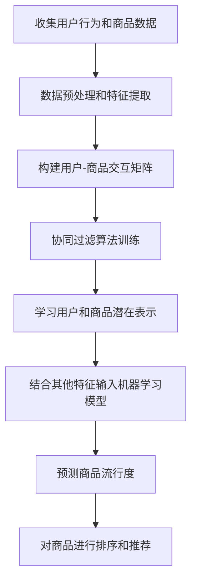

# 基于推荐算法的商品流行性预测算法研究

## 1. 背景介绍

### 1.1 问题的由来

在电子商务时代,网上购物已成为人们日常生活的一部分。随着互联网的不断发展,各大电商平台上的商品种类和数量也在不断增加,给消费者带来了前所未有的选择。然而,这种选择的丰富性也给消费者带来了新的挑战:如何在海量商品中找到自己真正需要和感兴趣的商品?这就需要电商平台能够精准地预测和推荐用户可能喜欢的商品。

商品流行性预测是实现个性化推荐的关键环节之一。通过分析用户的历史行为数据、商品的属性和评价等信息,预测某个商品在未来一段时间内的流行程度,从而为用户推荐热门和潜在感兴趣的商品。准确的流行性预测不仅能够提高推荐系统的效果,增强用户体验,还能为电商平台的运营决策和库存管理提供有价值的参考。

### 1.2 研究现状  

目前,学术界和工业界针对商品流行性预测问题提出了多种算法模型,主要可分为三大类:

1. **基于机器学习的模型**:利用历史数据训练分类器或回归模型来预测商品的流行程度,如逻辑回归、决策树、随机森林等。这些模型的优点是可解释性强,但往往难以捕捉数据中的复杂模式。

2. **基于深度学习的模型**:使用神经网络等深度学习模型来自动从数据中提取特征并进行预测,如卷积神经网络、递归神经网络、注意力机制等。这些模型具有强大的非线性拟合能力,但可解释性较差。

3. **基于图神经网络的模型**:将用户、商品、评论等实体及其关系表示为异构图,并使用图神经网络模型来捕捉图结构中的模式,如图卷积神经网络、图注意力网络等。这种方法能够很好地融合结构化数据和非结构化数据,但计算复杂度较高。

尽管已有多种流行性预测模型,但由于电商场景的复杂性和动态性,现有模型在准确性、泛化能力和可解释性等方面仍有提升空间。

### 1.3 研究意义

准确预测商品的流行趋势,对于电商平台的运营和发展至关重要。它可以带来以下主要意义:

1. **提高推荐系统的效果**:通过预测热门商品,为用户推荐感兴趣的潜在商品,提高推荐系统的准确性和用户体验。

2. **优化库存管理**:根据流行性预测结果,合理安排热门商品的库存,减少积压,提高资源利用效率。

3. **支持营销决策**:了解商品的流行趋势,为促销活动、广告投放等营销策略制定提供依据。

4. **发现新兴市场需求**:及时发现新兴热门商品类别,把握市场发展动向,引导产品设计和供给。

因此,研究更精准的商品流行性预测算法,对于提高电商平台的竞争力和盈利能力具有重要意义。

### 1.4 本文结构

本文将围绕基于推荐算法的商品流行性预测算法展开深入探讨。文章的主要结构安排如下:

- 第2部分介绍流行性预测所涉及的核心概念及其内在联系; 
- 第3部分详细阐述预测算法的原理和具体操作步骤;
- 第4部分构建数学模型,推导公式,并结合案例进行讲解;
- 第5部分通过代码实例演示算法的具体实现和运行结果;
- 第6部分分析算法在实际应用场景中的应用前景;
- 第7部分推荐相关的学习资源、开发工具和参考文献;
- 第8部分总结研究成果,展望未来发展趋势和面临的挑战;
- 第9部分列出常见问题并给出解答。

## 2. 核心概念与联系

在商品流行性预测领域,有几个核心概念是必须要正确理解和把握的,它们之间存在着内在的联系。我们将在这一部分对它们进行介绍。

### 2.1 商品流行度

商品流行度(Item Popularity)是指某个商品在特定时间段内的热门程度或受欢迎程度。它通常可以通过以下几个指标来衡量:

- 销售量或购买次数
- 浏览量或点击量 
- 收藏数或加购物车数
- 好评数或评分
- 社交媒体上的讨论热度

不同的电商平台可能会根据自身的业务目标,选择合适的指标或指标组合来定义流行度。通常,流行度越高的商品就越有可能被推荐给用户。

### 2.2 协同过滤

协同过滤(Collaborative Filtering)是推荐系统中最常用的一种技术,其核心思想是:对于未知的用户-商品偏好,可以基于其他相似用户或相似商品的已知偏好进行预测。根据相似度的计算对象,协同过滤可分为两种:

- 基于用户的协同过滤(User-based CF):利用用户之间的相似度,找到与目标用户兴趣相似的其他用户,并推荐这些相似用户喜欢的商品。
- 基于商品的协同过滤(Item-based CF):利用商品之间的相似度,找到与目标商品相似的其他商品,并推荐给喜欢目标商品的用户。

协同过滤算法在推荐系统中有着广泛的应用,也常被用于预测商品流行度。例如,可以根据用户对商品的历史行为数据(浏览、购买等)计算商品之间的相似度,进而推测出热门商品。

### 2.3 上下文信息

上下文信息(Contextual Information)是指可能影响用户对商品偏好的环境因素,如时间、地点、天气、设备等。考虑上下文信息有助于更精准地预测用户的兴趣,进而提高推荐的准确性。例如,在夏季,用户可能会对防晒产品更感兴趣;在节假日,用户可能会对礼品类商品更感兴趣等。

上下文信息在商品流行性预测中也扮演着重要角色。不同的时间、地点等环境因素会影响商品的流行程度,如节假日期间礼品商品会更受欢迎、冬季羽绒服会比其他季节更热门等。因此,上下文信息是预测模型需要考虑的重要特征。

### 2.4 关联规则挖掘

关联规则挖掘(Association Rule Mining)是一种从大规模数据中发现有趣关联或相关模式的技术,最初应用于市场篮分析,后被广泛应用于多个领域。在商品流行性预测中,关联规则挖掘可以用于发现商品之间的关联性,从而预测热门商品组合。

例如,如果发现牛奶和面包这两种商品经常被同时购买,那么当其中一种商品热门时,另一种也可能会变得热门。通过分析用户的购物行为数据,可以发现这种商品之间的关联规则,并将其纳入预测模型,以提高预测的准确性。

上述这些核心概念相互关联、相辅相成,共同构建了商品流行性预测的理论基础和技术路线。下一部分,我们将详细介绍预测算法的原理和具体实现步骤。

## 3. 核心算法原理与具体操作步骤

在前面的部分,我们介绍了商品流行性预测所涉及的核心概念。本部分将重点阐述预测算法的原理和具体操作步骤,以及算法的优缺点和应用领域。

### 3.1 算法原理概述

基于推荐算法的商品流行性预测算法,主要思路是:

1. 收集用户的历史行为数据(如浏览记录、购买记录等)和商品的元数据(如标题、描述、类别等);
2. 对数据进行预处理,提取特征;
3. 构建用户-商品交互矩阵,表示用户对各商品的偏好程度;
4. 使用协同过滤算法(如基于用户的协同过滤、基于商品的协同过滤)在交互矩阵上进行训练,学习用户和商品的潜在表示;
5. 将用户和商品的潜在表示、上下文信息等特征输入机器学习模型(如矩阵分解、神经网络等),对商品的流行度进行预测;
6. 根据预测的流行度值对商品进行排序,将顶部的热门商品推荐给用户。

该算法的核心在于利用协同过滤技术学习用户和商品的潜在特征表示,并将这些特征与其他上下文特征相结合,输入机器学习模型进行流行度预测。这种方法能够有效地融合协同过滤和机器学习的优势,提高预测的准确性。

算法的工作流程如下的Mermaid流程图所示:

### 3.2 算法步骤详解

接下来,我们将对算法的具体步骤进行详细说明。

#### 步骤1: 数据收集和预处理

首先需要收集用户的历史行为数据和商品的元数据,这些数据通常存储在电商平台的日志系统和数据库中。常见的用户行为数据包括:

- 浏览记录:用户浏览过的商品及浏览时间
- 购买记录:用户购买过的商品及购买时间
- 收藏记录:用户收藏过的商品及收藏时间
- 评价记录:用户对商品的评分和评论内容

商品元数据通常包括:

- 商品标题、描述、类别等文本信息
- 商品价格、品牌、规格等结构化信息
- 商品图片、视频等多媒体信息

对于这些原始数据,需要进行适当的预处理,如去重、填充缺失值、数据清洗、特征提取等,将其转换为算法可以直接处理的数值型特征向量。

#### 步骤2: 构建用户-商品交互矩阵

基于预处理后的数据,我们可以构建一个用户-商品交互矩阵(User-Item Interaction Matrix),该矩阵的行表示用户,列表示商品,每个元素的值表示该用户对该商品的偏好程度。

偏好程度可以用不同的指标来衡量,如:

- 二元指标:用1表示用户曾经购买或浏览过该商品,0表示从未购买或浏览过
- 频率指标:用户购买或浏览该商品的次数
- 评分指标:用户对该商品的评分(如1-5分)

通过这个交互矩阵,我们可以清晰地看到每个用户对不同商品的偏好模式。

#### 步骤3: 协同过滤算法训练

接下来,我们将交互矩阵输入协同过滤算法,学习用户和商品的潜在表示(Latent Representation)。常用的协同过滤算法包括:

- **基于用户的协同过滤**(User-based CF):通过计算用户之间的相似度,找到与目标用户兴趣相似的其他用户,并推荐这些相似用户喜欢的商品。
- **基于商品的协同过滤**(Item-based CF):通过计算商品之间的相似度,找到与目标商品相似的其他商品,并推荐给喜欢目标商品的用户。
- **矩阵分解**(Matrix Factorization):将交互矩阵分解为用户潜在特征矩阵和商品潜在特征矩阵的乘积,捕捉用户和商品的潜在特征。

这些算法的原理和具体实现方法在推荐系统领域有大量研究,此处不再赘述。通过协同过滤算法的训练,我们可以得到每个用户和商品的潜在特征向量表示。

#### 