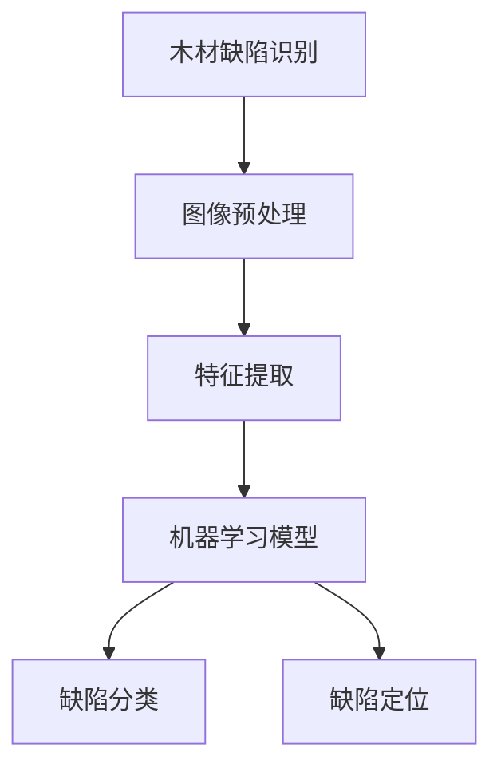

# 基于机器学习的木材缺陷识别方法研究

## 1. 背景介绍

### 1.1 问题的由来

木材作为一种天然资源,在建筑、家具制造等领域扮演着重要角色。然而,木材在加工过程中难免会出现各种缺陷,如裂纹、节疤、腐蚀等。这些缺陷不仅影响木材的美观度,还会降低其强度和使用寿命。传统的人工检测方式不仅效率低下,而且存在主观性和疲劳等问题。因此,开发一种高效、准确的自动化木材缺陷检测系统成为当前研究的重点。

### 1.2 研究现状

近年来,随着机器学习和计算机视觉技术的快速发展,基于图像处理的木材缺陷检测方法受到了广泛关注。研究人员提出了多种基于深度学习的缺陷检测模型,如卷积神经网络(CNN)、递归神经网络(RNN)等。这些模型通过对大量木材图像数据进行训练,能够自动学习特征并进行缺陷分类和定位。

然而,现有方法仍然存在一些挑战:

1. 数据集不足:高质量的标注数据集对模型训练至关重要,但目前公开可用的木材缺陷数据集数量有限,缺乏多样性。
2. 复杂背景干扰:木材表面的纹理、颜色变化等会干扰缺陷检测的准确性。
3. 实时性差:一些复杂的深度学习模型计算量大,难以满足实时检测的需求。

### 1.3 研究意义

开发高效准确的木材缺陷检测系统,不仅能够提高木材加工的效率和质量,还能够减少资源浪费,促进可持续发展。同时,该研究也将推动机器学习和计算机视觉技术在工业领域的应用,为智能制造提供技术支持。

### 1.4 本文结构

本文将全面介绍基于机器学习的木材缺陷识别方法。首先阐述核心概念和算法原理,然后详细讲解数学模型和公式推导过程。接下来,通过实际项目案例和代码实现,展示该方法的应用场景和实践细节。最后,总结研究成果,并探讨未来发展趋势和面临的挑战。

## 2. 核心概念与联系

木材缺陷识别是一个典型的计算机视觉和模式识别问题。其核心概念包括:

1. **图像预处理**: 对原始木材图像进行增强、去噪、分割等操作,以提高图像质量并方便后续特征提取。
2. **特征提取**: 从预处理后的图像中提取出能够有效表征缺陷的特征,如纹理、形状、颜色等特征。
3. **机器学习模型**: 基于提取的特征,训练监督或非监督的机器学习模型,如支持向量机(SVM)、随机森林(RF)、卷积神经网络(CNN)等。
4. **缺陷分类**: 将检测到的缺陷按类型(如裂纹、节疤等)进行分类。
5. **缺陷定位**: 准确地定位缺陷在木材图像中的位置和范围。

这些概念相互关联,构成了完整的木材缺陷识别流程。图像预处理和特征提取为机器学习模型提供高质量的输入数据,而模型则根据这些数据进行缺陷分类和定位,最终实现自动化检测。

## 3. 核心算法原理 & 具体操作步骤

### 3.1 算法原理概述

基于机器学习的木材缺陷识别算法主要分为两个阶段:训练阶段和测试(推理)阶段。

1. **训练阶段**:
   - 收集并标注大量木材图像数据,构建训练集和验证集。
   - 对图像进行预处理,如去噪、增强对比度等,以提高图像质量。
   - 提取特征,可以使用手工设计的特征(如HOG、LBP等)或深度学习自动学习的特征。
   - 选择合适的机器学习模型,如SVM、RF或CNN等,并使用训练集对模型进行训练。
   - 在验证集上评估模型性能,根据需要调整超参数或模型结构。
   - 重复上述步骤,直至模型性能满足要求。

2. **测试(推理)阶段**:
   - 对新的木材图像进行预处理和特征提取,输入到训练好的模型中。
   - 模型输出缺陷类型和位置信息,实现自动化检测。

算法的关键在于选择合适的特征提取方法和机器学习模型,以及充分利用大量标注数据进行模型训练。

### 3.2 算法步骤详解

1. **图像采集**:使用高分辨率相机或扫描仪获取木材图像,确保图像清晰、对比度适中。
2. **图像预处理**:
   - 图像增强:调整对比度、亮度等,提高图像质量。
   - 图像分割:将木材区域与背景区域分离,方便后续处理。
   - 去噪:使用滤波器等方法去除图像噪声。
3. **特征提取**:
   - 手工设计特征:计算图像的纹理特征(如LBP)、形状特征(如HOG)等。
   - 深度学习特征:使用CNN等深度网络自动学习特征表示。
4. **模型训练**:
   - 划分数据集:将标注好的数据划分为训练集、验证集和测试集。
   - 选择模型:如SVM、RF或CNN等,根据问题复杂度选择合适的模型。
   - 模型训练:使用训练集对模型进行训练,验证集用于调参和防止过拟合。
   - 模型评估:在测试集上评估模型性能,计算准确率、召回率等指标。
5. **缺陷检测**:
   - 对新的木材图像进行预处理和特征提取。
   - 将特征输入到训练好的模型,获取缺陷类型和位置信息。
   - 在原始图像上标注检测结果,输出最终结果。

### 3.3 算法优缺点

**优点**:

1. 高效准确:机器学习算法能够自动学习特征模式,检测准确率高于人工方式。
2. 可扩展性强:通过增加训练数据,算法能够适应不同类型和复杂程度的缺陷。
3. 自动化程度高:减少了人工参与,提高了检测效率。

**缺点**:

1. 对训练数据质量要求高:需要大量高质量的标注数据进行模型训练。
2. 模型选择和调参复杂:不同的模型和参数对结果影响较大,需要反复试验。
3. 计算资源需求大:深度学习模型训练和推理过程计算量较大。

### 3.4 算法应用领域

基于机器学习的木材缺陷识别算法可应用于以下领域:

1. **木材加工**:在木材生产和加工过程中,实现自动化缺陷检测和分级,提高产品质量。
2. **木材贸易**:对进口木材进行快速检测,判断质量等级,为定价提供依据。
3. **建筑工程**:检测建筑用木材是否存在缺陷,确保工程质量和安全性。
4. **家具制造**:对家具原材料进行缺陷检测,提高产品品质。
5. **林业管理**:对林木进行远程监测,及时发现病虫害等问题。

## 4. 数学模型和公式 & 详细讲解 & 举例说明

### 4.1 数学模型构建

在木材缺陷识别问题中,常用的数学模型包括:

1. **支持向量机(SVM)**: SVM是一种有监督的机器学习模型,通过寻找最优超平面将不同类别的数据分开。对于线性可分的情况,SVM的数学模型如下:

$$
\begin{align}
\min_{\mathbf{w},b} \quad & \frac{1}{2}\|\mathbf{w}\|^2 \\
\text{s.t.} \quad & y_i(\mathbf{w}^T\mathbf{x}_i+b) \geq 1, \quad i=1,\ldots,n
\end{align}
$$

其中 $\mathbf{x}_i$ 为第 $i$ 个样本的特征向量, $y_i \in \{-1,1\}$ 为其类别标记, $\mathbf{w}$ 和 $b$ 分别为超平面的法向量和偏移量。

2. **卷积神经网络(CNN)**: CNN是一种常用的深度学习模型,能够自动学习图像特征。CNN的基本结构包括卷积层、池化层和全连接层。卷积层通过卷积核对输入图像进行特征提取,池化层用于降维,全连接层则对提取的特征进行分类或回归。

3. **递归神经网络(RNN)**: RNN是一种序列模型,适用于处理序列数据,如时间序列或自然语言等。在木材缺陷检测中,可以将图像看作一个序列,使用RNN对缺陷进行定位和分类。

4. **生成对抗网络(GAN)**: GAN是一种无监督的深度学习模型,由生成器和判别器组成。生成器负责生成逼真的图像,判别器则判断生成图像是否为真实图像。GAN可用于数据增强,生成更多的训练样本。

这些模型各有优缺点,需要根据具体问题选择合适的模型。在实际应用中,还可以将多种模型组合使用,发挥各自的优势。

### 4.2 公式推导过程

以SVM为例,我们推导其对偶形式,以便求解:

首先,引入拉格朗日乘子 $\alpha_i \geq 0$, 构造拉格朗日函数:

$$
L(\mathbf{w},b,\boldsymbol{\alpha}) = \frac{1}{2}\|\mathbf{w}\|^2 - \sum_{i=1}^n \alpha_i \big[y_i(\mathbf{w}^T\mathbf{x}_i+b)-1\big]
$$

对 $\mathbf{w}$ 和 $b$ 分别求偏导数并令其等于零,可得:

$$
\begin{align}
\frac{\partial L}{\partial \mathbf{w}} &= \mathbf{w} - \sum_{i=1}^n \alpha_i y_i \mathbf{x}_i = 0 \\
\frac{\partial L}{\partial b} &= -\sum_{i=1}^n \alpha_i y_i = 0
\end{align}
$$

将上式代入拉格朗日函数,可得SVM的对偶形式:

$$
\begin{align}
\max_{\boldsymbol{\alpha}} \quad & \sum_{i=1}^n \alpha_i - \frac{1}{2} \sum_{i,j=1}^n \alpha_i \alpha_j y_i y_j \mathbf{x}_i^T\mathbf{x}_j \\
\text{s.t.} \quad & \sum_{i=1}^n \alpha_i y_i = 0 \\
& 0 \leq \alpha_i \leq C, \quad i=1,\ldots,n
\end{align}
$$

其中 $C$ 是一个正则化参数,用于控制模型的复杂度。

通过求解上述对偶问题,我们可以得到最优的 $\boldsymbol{\alpha}^*$,进而计算出 $\mathbf{w}^*$ 和 $b^*$,从而获得SVM的最优分类超平面。

### 4.3 案例分析与讲解

考虑一个二分类问题,需要将木材图像中的裂纹缺陷与正常区域区分开来。我们使用SVM模型,并基于HOG特征进行训练。

假设有 $n$ 个训练样本 $\{(\mathbf{x}_i,y_i)\}_{i=1}^n$,其中 $\mathbf{x}_i$ 为第 $i$ 个样本的HOG特征向量, $y_i \in \{-1,1\}$ 为其类别标记(裂纹或正常)。我们希望找到一个超平面 $\mathbf{w}^T\mathbf{x}+b=0$,能够很好地将两类样本分开。

根据SVM的对偶形式,我们需要求解以下