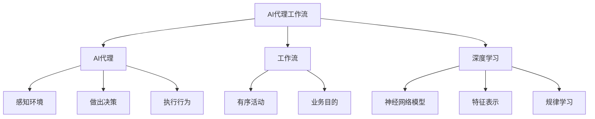

以下是标题为《基于深度学习的AI代理工作流：案例与实践》的技术博客正文:

# 基于深度学习的AI代理工作流：案例与实践

## 1. 背景介绍

### 1.1 问题的由来

在当今快节奏的商业环境中,企业面临着越来越多的复杂任务和大量数据的挑战。传统的工作流程往往效率低下、成本高昂,难以满足企业的需求。因此,开发一种高效、智能的工作流管理系统变得迫在眉睫。

### 1.2 研究现状  

近年来,人工智能(AI)技术的飞速发展为解决这一问题提供了新的途径。深度学习作为AI的一个重要分支,已被广泛应用于各个领域,展现出巨大的潜力。一些研究人员开始尝试将深度学习应用于工作流程管理,以提高效率和智能化水平。

### 1.3 研究意义

基于深度学习的AI代理工作流系统能够自动化地处理复杂任务,提高工作效率,降低人力成本。同时,它还可以通过持续学习不断优化流程,实现智能化管理。这对于企业的发展至关重要。

### 1.4 本文结构

本文将首先介绍AI代理工作流的核心概念,然后深入探讨其算法原理、数学模型和实现细节。此外,还将分享一些实际应用案例,并对未来发展趋势和挑战进行展望。

## 2. 核心概念与联系

AI代理工作流是一种基于深度学习的智能系统,它能够自主地规划、执行和监控工作流程。其核心概念包括:

1. **AI代理(Agent)**: 一个具有自主性的智能体,能够感知环境、做出决策并执行行为。
2. **工作流(Workflow)**: 一系列有序的活动,用于实现特定的业务目的。
3. **深度学习(Deep Learning)**: 一种机器学习技术,通过构建深层神经网络模型来从数据中学习特征表示和规律。

这三个概念紧密相关并共同构成了AI代理工作流系统。AI代理利用深度学习算法从历史数据中学习工作流模式,并基于所学知识自主地规划和执行工作流程。

## 3. 核心算法原理 & 具体操作步骤

### 3.1 算法原理概述

AI代理工作流系统的核心算法是基于序列到序列(Seq2Seq)的深度学习模型。该模型能够将输入序列(如历史工作流数据)映射到输出序列(如未来工作流计划)。

算法的工作原理可概括为以下三个主要步骤:

1. **编码器(Encoder)**: 将输入序列编码为向量表示。
2. **上下文向量(Context Vector)**: 捕获输入序列的语义和上下文信息。
3. **解码器(Decoder)**: 根据上下文向量和先前的输出,生成下一个输出。

### 3.2 算法步骤详解

1. **数据预处理**:
   - 收集和清洗历史工作流数据
   - 将工作流数据转换为序列格式(如活动序列)
   - 对序列数据进行标记和编码

2. **模型构建**:
   - 定义编码器、解码器和上下文向量
   - 选择合适的神经网络架构(如LSTM、GRU等)
   - 设计损失函数和优化算法

3. **模型训练**:
   - 将预处理后的数据输入模型
   - 使用反向传播算法优化模型参数
   - 在验证集上评估模型性能,进行超参数调整

4. **模型推理**:
   - 对新的输入序列进行编码
   - 利用训练好的模型生成相应的输出序列
   - 将输出序列解码为可读的工作流计划

5. **工作流执行**:
   - AI代理根据生成的工作流计划执行相应的活动
   - 收集执行过程中的数据,用于模型的持续学习和改进

### 3.3 算法优缺点

**优点**:

- 能够自动化地规划和执行工作流,提高效率
- 通过持续学习不断优化工作流,实现智能化管理
- 可以处理复杂的序列数据,具有较强的泛化能力

**缺点**:

- 需要大量的历史数据用于模型训练
- 模型训练过程计算量大,需要强大的硬件支持
- 生成的工作流计划可能存在一定的不确定性和错误

### 3.4 算法应用领域

序列到序列的深度学习模型不仅可以应用于工作流管理,还可以广泛用于以下领域:

- 机器翻译
- 语音识别
- 对话系统
- 时序预测
- 文本摘要

## 4. 数学模型和公式 & 详细讲解 & 举例说明

### 4.1 数学模型构建

AI代理工作流系统的数学模型基于序列到序列(Seq2Seq)的框架,其中编码器和解码器都采用了循环神经网络(RNN)的结构。

对于给定的输入序列 $X = (x_1, x_2, \dots, x_T)$ 和目标输出序列 $Y = (y_1, y_2, \dots, y_{T'})$,模型的目标是最大化条件概率 $P(Y|X)$。

编码器将输入序列 $X$ 编码为上下文向量 $c$:

$$c = f(x_1, x_2, \dots, x_T)$$

其中 $f$ 是一个非线性函数,通常使用RNN实现。

解码器则根据上下文向量 $c$ 和先前的输出 $y_1, y_2, \dots, y_{t-1}$ 生成下一个输出 $y_t$:

$$y_t = g(y_1, y_2, \dots, y_{t-1}, c)$$

其中 $g$ 也是一个非线性函数,通常也使用RNN实现。

模型的训练目标是最小化输入序列 $X$ 和目标序列 $Y$ 之间的损失函数,常用的损失函数包括交叉熵损失和序列损失等。

### 4.2 公式推导过程

假设我们使用基于注意力机制(Attention Mechanism)的Seq2Seq模型,其中编码器和解码器都采用LSTM(Long Short-Term Memory)结构。

对于输入序列 $X = (x_1, x_2, \dots, x_T)$,编码器的隐藏状态 $h_t$ 可以表示为:

$$\begin{aligned}
i_t &= \sigma(W_{xi}x_t + W_{hi}h_{t-1} + b_i) \\
f_t &= \sigma(W_{xf}x_t + W_{hf}h_{t-1} + b_f) \\
o_t &= \sigma(W_{xo}x_t + W_{ho}h_{t-1} + b_o) \\
g_t &= \tanh(W_{xg}x_t + W_{hg}h_{t-1} + b_g) \\
c_t &= f_t \odot c_{t-1} + i_t \odot g_t \\
h_t &= o_t \odot \tanh(c_t)
\end{aligned}$$

其中 $i_t$、$f_t$、$o_t$ 分别表示输入门、遗忘门和输出门,用于控制信息的流动。$c_t$ 是细胞状态,用于存储长期信息。$W$ 和 $b$ 是可学习的权重和偏置参数。

在解码器端,我们需要计算上下文向量 $c_t$,它是输入序列在每个时间步的加权和,权重由注意力分数决定:

$$\begin{aligned}
a_t(s) &= v_a^\top \tanh(W_a s_t + U_a h_s) \\
\alpha_t(s) &= \frac{\exp(a_t(s))}{\sum_{s'=1}^T \exp(a_t(s'))} \\
c_t &= \sum_{s=1}^T \alpha_t(s) h_s
\end{aligned}$$

其中 $s_t$ 是解码器的隐藏状态, $h_s$ 是编码器在时间步 $s$ 的隐藏状态。$v_a$、$W_a$ 和 $U_a$ 是可学习的注意力参数。

解码器的隐藏状态 $s_t$ 和输出 $y_t$ 可以表示为:

$$\begin{aligned}
s_t &= \text{LSTM}(y_{t-1}, s_{t-1}, c_t) \\
p(y_t|y_{<t}, X) &= \text{softmax}(W_o s_t + b_o)
\end{aligned}$$

其中 $y_{t-1}$ 是前一个输出,softmax函数用于计算下一个输出的概率分布。

通过最小化模型输出与目标序列之间的损失函数(如交叉熵损失),我们可以学习模型参数,从而实现序列到序列的映射。

### 4.3 案例分析与讲解

为了更好地理解AI代理工作流系统的工作原理,我们以一个简单的案例进行分析和讲解。

假设我们有一家电子商务公司,需要处理大量的订单。传统的订单处理流程包括以下步骤:

1. 接收订单
2. 验证订单信息
3. 扣除库存
4. 生成发货单
5. 安排物流
6. 发送订单确认邮件

我们可以将这个流程看作一个序列,每个步骤是序列中的一个元素。

现在,我们希望训练一个AI代理工作流系统,能够根据历史订单数据自动生成合理的订单处理流程。我们可以按照以下步骤进行:

1. **数据预处理**:收集并清洗历史订单数据,将每个订单处理流程转换为序列格式,如 `[1, 2, 3, 4, 5, 6]`。

2. **模型构建**:构建一个基于LSTM的Seq2Seq模型,其中编码器将输入序列编码为上下文向量,解码器根据上下文向量生成输出序列。

3. **模型训练**:使用预处理后的数据训练模型,通过反向传播算法优化模型参数,最小化输出序列与目标序列之间的损失函数。

4. **模型推理**:对新的订单数据进行编码,利用训练好的模型生成相应的订单处理流程序列。

5. **工作流执行**:AI代理根据生成的序列执行相应的订单处理步骤,并收集执行过程中的数据,用于模型的持续学习和改进。

通过这个案例,我们可以看到AI代理工作流系统如何利用深度学习技术从历史数据中学习工作流模式,并自主地规划和执行工作流程。这种智能化的工作流管理方式可以大大提高效率,降低人力成本。

### 4.4 常见问题解答

1. **为什么要使用序列到序列的模型?**

序列到序列的模型能够很好地处理序列数据,如工作流、自然语言等。它可以捕获序列中元素之间的依赖关系,并生成新的序列作为输出,非常适合工作流规划和生成任务。

2. **注意力机制的作用是什么?**

注意力机制允许模型在生成每个输出时,selectively关注输入序列的不同部分,从而捕获更加准确的上下文信息。这对于处理长序列尤为重要,可以有效缓解长期依赖问题。

3. **如何评估模型的性能?**

常用的评估指标包括:

- **精确率(Precision)**:正确预测的工作流数 / 总预测工作流数
- **召回率(Recall)**:正确预测的工作流数 / 总真实工作流数
- **序列精度(Sequence Accuracy)**:完全正确预测的工作流数 / 总工作流数

除了这些指标外,我们还可以考虑工作流执行的效率、成本等实际业务指标。

4. **模型训练需要多少数据?**

模型训练所需的数据量取决于工作流的复杂程度和多样性。通常来说,数据量越大,模型的泛化能力就越强。但是,过多的数据也会增加计算开销