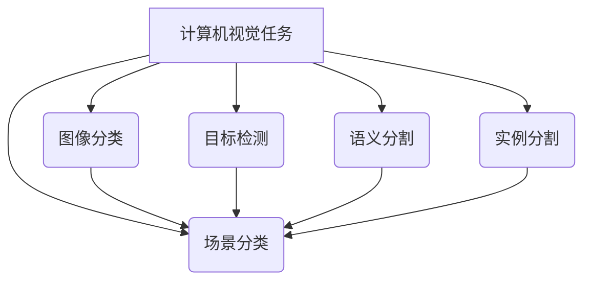
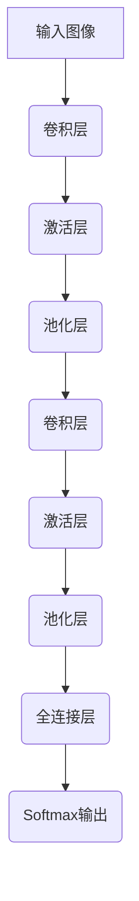

# 基于深度学习的场景分类研究

## 1. 背景介绍

### 1.1 问题的由来

在当今信息时代,图像和视频数据的爆炸式增长引发了对自动化场景理解的迫切需求。场景分类作为计算机视觉的一个核心任务,旨在自动识别和理解图像或视频中所呈现的场景类别,如室内场景(卧室、厨房等)、户外场景(海滩、森林等)等。准确的场景分类不仅可以增强人工智能系统对视觉内容的理解能力,也为许多下游应用(如内容检索、机器人导航等)提供了有价值的语义信息。

### 1.2 研究现状  

早期的场景分类方法主要基于手工设计的低级特征(如颜色直方图、纹理特征等)和机器学习分类器(如支持向量机、决策树等)。然而,这些方法往往缺乏对高层次语义信息的建模能力,且性能受到手工特征表示能力的限制。

随着深度学习技术的兴起,基于深度卷积神经网络(CNN)的场景分类方法取得了突破性进展。CNN能够自动从原始图像数据中学习层次化的特征表示,极大提高了分类性能。著名的AlexNet、VGGNet、GoogLeNet、ResNet等模型在ImageNet等大型数据集上取得了卓越的分类精度,为场景分类研究奠定了坚实基础。

### 1.3 研究意义

准确的场景分类技术在诸多领域具有广泛的应用前景:

1. **内容理解与检索**: 场景分类可为图像和视频等多媒体内容提供语义标注,提升内容理解和检索效率。

2. **机器人导航与交互**: 通过识别周围环境,机器人可以更好地规划路径、避障和与人交互。

3. **智能监控与安防**: 场景分类可用于识别异常场景(如火灾、犯罪等),提高监控系统的智能化水平。

4. **增强现实(AR)与虚拟现实(VR)**: 准确的场景理解有助于构建更加沉浸式的AR/VR体验。

5. **自动驾驶**: 对道路场景的精准分类对于自动驾驶系统的路况感知至关重要。

因此,提高场景分类的准确性和鲁棒性,对于推动人工智能技术的实际应用具有重要意义。

### 1.4 本文结构

本文将全面介绍基于深度学习的场景分类研究,内容安排如下:

- 第2部分阐述场景分类任务的核心概念及其与其他计算机视觉任务的联系。
- 第3部分详细解析基于深度学习的场景分类算法原理和具体操作步骤。
- 第4部分介绍场景分类中常用的数学模型和公式,并结合案例进行讲解。
- 第5部分提供一个基于深度学习的场景分类项目实践,包括代码实现和运行结果分析。
- 第6部分探讨场景分类技术在实际应用中的应用场景。
- 第7部分推荐一些有用的学习资源、开发工具和相关论文。
- 第8部分总结研究成果,展望未来发展趋势和面临的挑战。
- 第9部分列举常见的问题并给出解答。

## 2. 核心概念与联系

场景分类是计算机视觉领域的一个核心任务,旨在自动识别图像或视频中所呈现的场景类别。它与计算机视觉中的其他任务密切相关,如下所示:

1. **图像分类(Image Classification)**: 将整个图像归类为特定类别(如猫、狗等),是一个常见的基础任务。场景分类可视为图像分类的一个特例,关注的是整体场景而非单个物体。

2. **目标检测(Object Detection)**: 定位图像中的目标物体并识别其类别。场景分类可利用目标检测的结果作为辅助信息。

3. **语义分割(Semantic Segmentation)**: 对图像中的每个像素进行分类,生成像素级的语义掩码图。语义分割的结果可用于提取场景元素,从而促进场景分类。

4. **实例分割(Instance Segmentation)**: 在语义分割的基础上,进一步区分同一类别的不同实例。实例分割的结果也可为场景分类提供有用信息。

由此可见,场景分类与其他计算机视觉任务存在交叉和互补关系。通过有机结合不同任务的成果,可以提升场景分类的性能和鲁棒性。

## 3. 核心算法原理 & 具体操作步骤

### 3.1 算法原理概述

基于深度学习的场景分类算法通常采用卷积神经网络(CNN)作为核心模型。CNN由多个卷积层、池化层和全连接层组成,能够自动从原始图像数据中学习层次化的特征表示,并在最后一层输出场景类别的概率分布。

CNN的工作原理可概括为以下几个关键步骤:

1. **卷积层(Convolutional Layer)**: 通过滑动卷积核在输入特征图上进行卷积操作,提取局部特征。

2. **激活层(Activation Layer)**: 对卷积层的输出施加非线性激活函数(如ReLU),增强网络的表达能力。

3. **池化层(Pooling Layer)**: 对激活层的输出进行下采样,缩小特征图尺寸并实现平移不变性。

4. **全连接层(Fully-Connected Layer)**: 将前面层的高级特征映射为场景类别的评分。

5. **Softmax输出层**: 将全连接层的评分转化为每个场景类别的概率分布。

在训练阶段,CNN通过反向传播算法和梯度下降优化,学习能够最小化损失函数(如交叉熵损失)的权重参数。在测试阶段,将输入图像传递至CNN,输出层会给出每个场景类别的概率值,取概率最大的类别作为最终分类结果。

### 3.2 算法步骤详解

基于深度学习的场景分类算法的具体步骤如下:

1. **数据准备**
    - 收集并标注场景图像数据集
    - 对图像进行预处理(如调整尺寸、归一化等)
    - 将数据集划分为训练集、验证集和测试集

2. **模型设计**
    - 选择合适的CNN架构(如AlexNet、VGGNet、ResNet等)
    - 确定模型超参数(如学习率、批量大小、正则化强度等)

3. **模型训练**
    - 定义损失函数(如交叉熵损失)和优化器(如SGD、Adam等)
    - 通过反向传播算法和梯度下降优化模型参数
    - 在验证集上评估模型性能,进行超参数调整

4. **模型评估**
    - 在测试集上评估模型的分类精度
    - 计算评估指标(如准确率、精确率、召回率、F1分数等)
    - 可视化混淆矩阵,分析错分类案例

5. **模型优化**
    - 探索数据增强、模型集成、迁移学习等策略
    - 根据错分类案例的特征,设计适当的优化方案

6. **模型部署**
    - 将训练好的模型导出为可部署格式
    - 集成至目标应用系统中,提供场景分类服务

在整个过程中,良好的实验管理和可视化工具可以帮助跟踪模型性能、诊断问题并促进理解。此外,注意遵循最佳实践(如合理的超参数初始化、恰当的正则化等),有助于提高模型的泛化能力。

### 3.3 算法优缺点

基于深度学习的场景分类算法具有以下优缺点:

**优点**:

1. **自动特征学习**: CNN能够自动从原始图像数据中学习层次化的特征表示,无需手工设计特征。

2. **端到端训练**: 整个模型可以通过反向传播算法进行端到端的训练,简化了传统机器学习流程。

3. **泛化能力强**: 深度模型具有强大的非线性映射能力,可以很好地捕捉场景的高层次语义信息。

4. **可迁移性好**: 通过迁移学习和模型微调,可以将在大型数据集上预训练的模型迁移至新的场景分类任务。

**缺点**:

1. **数据饥渴**: 训练高质量的深度模型需要大量标注数据,数据采集和标注成本高昂。

2. **黑盒操作**: 深度神经网络的内部工作机理通常难以解释,缺乏可解释性。

3. **计算资源需求大**: 训练深度模型需要大量计算资源(GPU等),存在一定的硬件门槛。

4. **对抗样本脆弱性**: 深度模型容易被精心设计的对抗样本攻击所欺骗,存在一定的安全隐患。

因此,在实际应用中需要权衡算法的优缺点,并采取适当的策略(如数据增强、模型压缩、可解释性增强等)来缓解相关问题。

### 3.4 算法应用领域

基于深度学习的场景分类算法在诸多领域具有广泛的应用前景,包括但不限于:

1. **多媒体内容理解与检索**: 通过对图像和视频进行场景分类,可以自动添加语义标签,提高内容理解和检索效率。

2. **机器人导航与交互**: 机器人可以利用场景分类技术识别周围环境,实现更智能的路径规划、避障和人机交互。

3. **智能监控与安防**: 场景分类可用于识别异常场景(如火灾、犯罪等),提高监控系统的智能化水平。

4. **增强现实(AR)与虚拟现实(VR)**: 准确的场景理解有助于构建更加沉浸式和智能化的AR/VR体验。

5. **自动驾驶**: 对道路场景的精准分类对于自动驾驶系统的路况感知至关重要,可提高行车安全性。

6. **遥感图像分析**: 利用场景分类技术对遥感图像进行语义理解,可广泛应用于农业、林业、城市规划等领域。

7. **医学图像分析**: 将场景分类应用于医学影像数据,可辅助疾病诊断和病理分析。

8. **视频监控与分析**: 通过对视频流进行实时场景分类,可实现智能监控和行为分析。

总的来说,场景分类作为一项基础技术,在促进人工智能系统对视觉内容的理解方面发挥着重要作用,并为众多领域的智能化应用提供了有力支撑。

## 4. 数学模型和公式 & 详细讲解 & 举例说明

### 4.1 数学模型构建

在基于深度学习的场景分类任务中,通常采用卷积神经网络(CNN)作为核心数学模型。CNN由多个卷积层、池化层和全连接层组成,能够自动从原始图像数据中学习层次化的特征表示。

设输入图像为 $I \in \mathbb{R}^{H \times W \times C}$,其中 $H$、$W$、$C$ 分别表示图像的高度、宽度和通道数。CNN 模型的前向传播过程可以表示为一系列函数变换:

$$
\begin{aligned}
X_l &= f_l(X_{l-1}; W_l, b_l) \\
y &= f_L(X_{L-1}; W_L, b_L)
\end{aligned}
$$

其中:

- $X_l$ 表示第 $l$ 层的特征图输出
- $f_l$ 表示第 $l$ 层的变换函数(如卷积、池化、激活等)
- $W_l$ 和 $b_l$ 分别表示第 $l$ 层的权