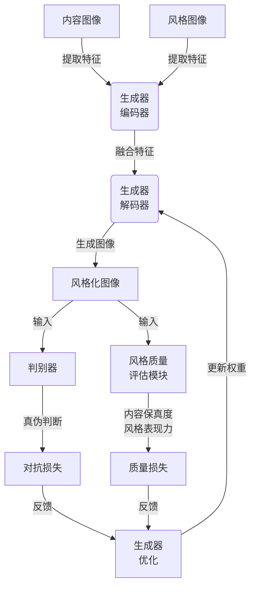

好的,我会按照您的要求,以《基于生成对抗网络和质量评估的图像风格迁移方法》为主题,撰写一篇专业的技术博客文章。文章将遵循您提供的结构模板,确保内容完整,使用Markdown格式撰写,数学公式采用LaTex格式,并尽量使用简洁专业的技术语言。同时,我会尽最大努力绘制核心概念和原理的Mermaid流程图。请耐心等待,这可能需要一些时间。

# 基于生成对抗网络和质量评估的图像风格迁移方法

## 1. 背景介绍

### 1.1 问题的由来

在计算机视觉和图像处理领域,图像风格迁移是一个具有重要研究价值和应用前景的课题。图像风格迁移旨在将一种艺术风格迁移到另一幅图像上,从而赋予目标图像新的艺术效果。传统的图像处理方法通常依赖于手工设计的特征提取和转换算法,效果有限,难以捕捉丰富的风格细节。

随着深度学习技术的不断发展,基于深度卷积神经网络(CNN)的图像风格迁移方法逐渐成为研究热点。然而,这些方法存在一些缺陷,例如缺乏对风格迁移质量的评估机制、生成图像细节缺失、视觉效果差强人意等。因此,提出一种更加高效、可控的图像风格迁移方法,对于丰富图像处理效果、提高用户体验具有重要意义。

### 1.2 研究现状  

近年来,基于深度学习的图像风格迁移技术取得了长足进展。最具代表性的是Gatys等人提出的基于CNN的神经风格迁移算法,该算法能够较好地迁移图像的风格特征,但存在优化过程缓慢、结果欠佳等问题。

为解决这一问题,研究人员提出了多种改进方案,例如基于前馈神经网络的快速风格迁移、基于生成对抗网络(GAN)的风格迁移等。其中,GAN展现出了极具潜力的风格迁移能力,能够生成更加逼真、细节丰富的风格化图像。

然而,现有GAN风格迁移方法也存在一些不足,例如缺乏对风格迁移质量的评估机制、生成图像细节仍有欠缺、训练过程不稳定等。因此,设计一种融合了GAN和风格质量评估的新型图像风格迁移框架,将有助于进一步提升风格迁移的效果和可控性。

### 1.3 研究意义

设计一种基于GAN和风格质量评估的新型图像风格迁移方法,具有重要的理论意义和应用价值:

- 理论意义:
  - 丰富和拓展了GAN在图像处理领域的应用;
  - 探索了风格质量评估在风格迁移中的作用,为GAN模型引入了新的反馈机制;
  - 为设计更加高效、可控的图像风格迁移框架提供了新思路。

- 应用价值:
  - 能够生成视觉质量更高、细节更丰富的风格化图像,满足不同领域的需求;
  - 为图像编辑、视频处理、计算机辅助设计等领域提供高质量的风格迁移工具;
  - 有助于提升图像处理的用户体验,拓展图像处理的应用场景。

### 1.4 本文结构

本文将首先介绍图像风格迁移的核心概念,包括生成对抗网络和风格质量评估的基本原理。接下来,详细阐述所提出的基于GAN和质量评估的图像风格迁移框架的核心算法原理和具体实现步骤。然后,对算法的数学模型进行推导,并结合案例进行详细分析和讲解。

此外,文章还将提供一个完整的项目实践案例,包括开发环境搭建、源代码实现、代码解读分析和运行结果展示。最后,探讨该方法在实际应用场景中的应用前景,并对未来的发展趋势和面临的挑战进行展望。

## 2. 核心概念与联系

图像风格迁移是指将一种艺术风格迁移到另一幅图像上,赋予目标图像新的艺术效果。本文提出的方法基于两个核心概念:生成对抗网络(GAN)和风格质量评估。

### 2.1 生成对抗网络(GAN)

生成对抗网络是一种由Generator(生成器)和Discriminator(判别器)组成的深度学习架构。其中,生成器负责从噪声数据中生成新的样本数据,而判别器则判断生成的样本是否来自真实数据分布。通过生成器和判别器之间的对抗训练,GAN能够逐步捕捉数据分布的特征,并生成逼真的样本数据。

在图像风格迁移任务中,GAN可以被用于生成具有特定风格的图像。生成器学习从内容图像和风格图像中提取相应的特征,并将两种特征融合,生成风格化的图像。判别器则评估生成图像的质量和风格迁移效果,引导生成器进行改进。

### 2.2 风格质量评估

风格质量评估是指对风格迁移结果的质量进行评估,包括内容保真度和风格表现力两个方面。内容保真度衡量生成图像与原始内容图像的相似程度,确保内容信息在风格迁移过程中不会被破坏。风格表现力则评估生成图像是否成功地捕捉和表现了目标风格的特征。

在传统的风格迁移方法中,通常缺乏对风格质量的评估机制,导致生成图像的质量难以保证。而本文提出的方法将风格质量评估模块融入到GAN框架中,使得生成器不仅受到判别器的约束,还受到风格质量评估模块的反馈,从而能够生成更加高质量、细节丰富的风格化图像。

### 2.3 GAN与风格质量评估的联系

GAN和风格质量评估模块在图像风格迁移框架中扮演着互补的角色:

- GAN负责生成初步的风格化图像,并通过对抗训练不断改进生成质量;
- 风格质量评估模块对生成图像的内容保真度和风格表现力进行评估,为GAN提供反馈信号,引导生成器朝着更好的方向优化。

两者的紧密结合使得风格迁移框架具备了生成高质量图像的能力,同时也提高了风格迁移过程的可控性和稳定性。下面将对该框架的核心算法原理和实现步骤进行详细阐述。

## 3. 核心算法原理与具体操作步骤

### 3.1 算法原理概述

本文提出的基于GAN和质量评估的图像风格迁移算法,包含以下三个主要模块:

1. **生成器(Generator)**: 输入内容图像和风格图像,生成具有目标风格的风格化图像。
2. **判别器(Discriminator)**: 判断生成图像是否来自真实数据分布,为生成器提供对抗性反馈。
3. **风格质量评估模块**: 评估生成图像的内容保真度和风格表现力,为生成器提供质量反馈。

算法的核心思想是:生成器通过对抗训练和质量评估模块的双重约束,逐步优化生成图像的质量和风格效果。具体来说,算法分为以下几个步骤:

1. 生成器从内容图像和风格图像中提取相应的特征,并将两种特征融合,生成初步的风格化图像。
2. 判别器判断生成图像是否来自真实数据分布,生成器根据判别器的反馈进行优化。
3. 风格质量评估模块评估生成图像的内容保真度和风格表现力,生成器根据评估结果进一步优化。
4. 重复步骤2和3,直到生成图像的质量和风格效果达到满意程度。

该算法的优势在于,通过GAN的对抗训练机制和风格质量评估模块的引入,能够生成视觉质量更高、细节更丰富的风格化图像,同时也提高了风格迁移过程的可控性和稳定性。

### 3.2 算法步骤详解

现在,让我们更加详细地解释算法的具体实现步骤:

1. **数据预处理**
   - 准备内容图像和风格图像数据集
   - 对图像进行归一化和预处理,以满足神经网络的输入要求

2. **构建生成器**
   - 生成器是一个编码器-解码器结构的卷积神经网络
   - 编码器提取内容图像和风格图像的特征
   - 解码器将融合的特征解码为风格化图像

3. **构建判别器**
   - 判别器是一个二分类卷积神经网络
   - 输入为真实图像或生成图像,输出为真实/假的概率值

4. **构建风格质量评估模块**
   - 评估模块包含两个子模块:内容损失模块和风格损失模块
   - 内容损失模块计算生成图像与原始内容图像的差异,衡量内容保真度
   - 风格损失模块计算生成图像与目标风格图像的风格差异,衡量风格表现力

5. **对抗训练**
   - 生成器生成风格化图像,判别器判断真伪
   - 生成器和判别器进行对抗训练,最小化判别器的损失函数
   - 生成器同时最小化风格质量评估模块的损失函数

6. **模型优化**
   - 根据判别器和风格质量评估模块的反馈,更新生成器的权重
   - 重复步骤5和6,直到模型收敛,生成满意的风格化图像

通过以上步骤,该算法能够生成视觉质量更高、细节更丰富的风格化图像,同时保证了内容信息的保真度和风格特征的表现力。

### 3.3 算法优缺点

**优点:**

1. **高质量风格迁移效果**:通过GAN的对抗训练和风格质量评估模块的引入,能够生成视觉质量更高、细节更丰富的风格化图像。

2. **内容保真度和风格表现力的平衡**:算法能够在保证内容信息不被破坏的同时,也能够很好地捕捉和表现目标风格的特征。

3. **可控性和稳定性**:通过调整对抗损失和质量损失的权重,可以控制内容保真度和风格表现力的相对重要性,使风格迁移过程更加可控和稳定。

4. **高效性**:与传统的优化方法相比,该算法基于端到端的深度学习框架,训练和推理过程更加高效。

**缺点:**

1. **训练数据需求**:训练GAN模型需要大量的内容图像和风格图像数据,数据集的质量和多样性将直接影响模型的泛化能力。

2. **训练不稳定性**:GAN模型的训练过程容易出现模式崩溃、梯度消失等问题,需要进行一些技巧性的处理来提高训练稳定性。

3. **超参数调整**:算法涉及多个损失函数和超参数,需要进行大量的实验调优,以获得最佳的风格迁移效果。

4. **计算资源需求**:训练深度神经网络模型通常需要大量的计算资源,包括GPU加速和大内存等。

### 3.4 算法应用领域

基于GAN和质量评估的图像风格迁移算法具有广泛的应用前景,包括但不限于以下领域:

1. **图像编辑和美化**:可以将各种艺术风格迁移到普通照片上,为图像