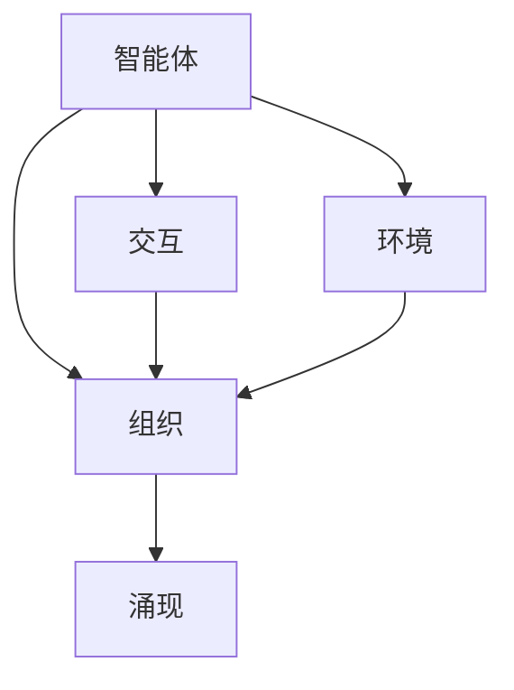

# 多Agent系统：多Agent系统的概念，其中多个Agent可以同步或异步地交互，以执行更复杂的任务

关键词：多Agent系统、分布式人工智能、智能体、协同、交互、自主性、适应性、复杂任务

## 1. 背景介绍
### 1.1 问题的由来
在现实世界中，许多复杂的问题需要多个智能体协同工作才能有效解决。例如，在救灾、探索未知环境、工业生产等场景中，单个智能体难以独立完成任务，需要多个智能体通过分工协作来实现目标。这就引出了多Agent系统（Multi-Agent System，MAS）的概念。

### 1.2 研究现状 
多Agent系统是分布式人工智能领域的重要研究方向之一。近年来，随着人工智能技术的快速发展，多Agent系统得到了广泛关注和应用。国内外学者在多Agent系统的理论基础、关键技术、应用场景等方面开展了大量研究工作，取得了丰硕成果。

### 1.3 研究意义
深入研究多Agent系统，对于解决复杂问题、提高系统效率、增强系统鲁棒性等方面具有重要意义。通过探索多Agent系统的基本概念、核心算法、关键技术等，可以为构建高效、灵活、智能的分布式系统提供理论指导和技术支撑。

### 1.4 本文结构
本文将围绕多Agent系统展开深入探讨。首先，介绍多Agent系统的核心概念和特点；然后，重点阐述多Agent系统的关键技术，包括智能体建模、协同机制、通信交互等；接着，给出多Agent系统的典型应用场景；最后，总结全文并展望未来研究方向。

## 2. 核心概念与联系
多Agent系统是由多个智能体（Agent）组成的分布式系统。每个智能体具有一定的自主性、社会性和学习能力，能够感知环境、做出决策并与其他智能体进行交互。多Agent系统的核心概念包括：

- 智能体（Agent）：能够自主行动、与环境交互的计算实体，具有一定的智能性和社会性。
- 环境（Environment）：智能体所处的环境，提供智能体感知和行动的场所。
- 交互（Interaction）：智能体之间通过通信协议进行信息交换、协商与协作。
- 组织（Organization）：智能体按照一定的结构和规则形成组织，协同完成任务。
- 涌现（Emergence）：多智能体在交互过程中产生的群体智能行为。

下图展示了多Agent系统的核心概念之间的关系：



## 3. 核心算法原理 & 具体操作步骤
### 3.1 算法原理概述
多Agent系统的核心算法包括智能体决策算法、协同算法和学习算法等。智能体决策算法主要解决单个智能体如何根据环境状态和自身目标做出最优决策的问题；协同算法研究多个智能体如何通过交互实现协同与分工；学习算法则探讨智能体如何根据反馈不断优化自身行为。

### 3.2 算法步骤详解
以智能体决策算法中的马尔科夫决策过程（Markov Decision Process，MDP）为例，其主要步骤如下：

1. 定义状态空间 $S$，表示智能体所处的可能状态集合。
2. 定义动作空间 $A$，表示智能体在每个状态下可以采取的动作集合。  
3. 定义状态转移概率函数 $P(s'|s,a)$，表示在状态 $s$ 下采取动作 $a$ 后转移到状态 $s'$ 的概率。
4. 定义奖励函数 $R(s,a)$，表示智能体在状态 $s$ 下采取动作 $a$ 后获得的即时奖励。
5. 定义折扣因子 $\gamma$，表示对未来奖励的衰减程度。
6. 定义策略 $\pi(a|s)$，表示智能体在状态 $s$ 下选择动作 $a$ 的概率。
7. 通过值迭代或策略迭代等算法，求解最优策略 $\pi^*$，使得智能体在有限步或无限步内获得最大期望累积奖励。

### 3.3 算法优缺点
MDP 算法的优点在于数学模型简洁，求解过程有理论保障，能够在状态完全可观察的环境中找到最优策略。但其缺点是状态空间和动作空间较大时计算复杂度高，且难以处理部分可观察和非静态环境。

### 3.4 算法应用领域
MDP 算法广泛应用于机器人控制、自动驾驶、智能调度等领域，是多Agent系统中智能体决策的经典算法之一。

## 4. 数学模型和公式 & 详细讲解 & 举例说明
### 4.1 数学模型构建
在多Agent系统中，为了刻画智能体的行为和交互关系，需要构建合适的数学模型。以博弈论模型为例，可以将多Agent系统抽象为一个博弈问题：

- 参与者（Players）：对应多Agent系统中的智能体。
- 策略（Strategies）：每个参与者可供选择的行动方案。
- 效用函数（Utility Functions）：刻画各参与者在不同策略组合下的收益。

博弈论模型常用的数学形式包括策略型博弈、扩展型博弈等。

### 4.2 公式推导过程
以纳什均衡（Nash Equilibrium）的求解为例，说明博弈论模型中的公式推导过程。考虑一个两人博弈，参与者分别为 $P1$ 和 $P2$，他们的策略空间分别为 $S1$ 和 $S2$，效用函数分别为 $u1$ 和 $u2$。

纳什均衡的定义为：一个策略组合 $(s1^*,s2^*)$ 是纳什均衡，当且仅当对于任意 $s1 \in S1$ 和 $s2 \in S2$，有：

$$
u1(s1^*,s2^*) \geq u1(s1,s2^*) \\
u2(s1^*,s2^*) \geq u2(s1^*,s2)
$$

即在纳什均衡下，任何一方单方面改变策略都不会增加自己的效用。求解纳什均衡的常用方法包括最优响应、消去法等。

### 4.3 案例分析与讲解
以著名的"囚徒困境"博弈为例，说明博弈论模型在多Agent系统中的应用。假设两名囚徒 $A$ 和 $B$ 面临同样的处境，他们可以选择合作（C）或背叛（D）。根据博弈规则，不同策略组合下的效用矩阵如下：

|  | C | D |
| --- | --- | --- |  
| C | (-1,-1) | (-10,0) |
| D | (0,-10) | (-8,-8) |

可以证明，尽管双方合作（C,C）能带来更好的整体收益，但（D,D）才是该博弈的纳什均衡，即双方都选择背叛是理性的结果。这一悖论启示我们，在设计多Agent系统时，要充分考虑个体理性与集体理性的矛盾，并设计合适的机制来促进合作。

### 4.4 常见问题解答
Q: 如何判断一个博弈是否存在纳什均衡？
A: 纳什均衡的存在性可以通过不动点定理（如布劳威尔不动点定理）来证明。对于有限博弈，至少存在一个混合策略纳什均衡；对于无限博弈，在一定条件下（如策略空间是凸紧集）也能保证纳什均衡的存在性。

Q: 现实中智能体的博弈是否一定能达到纳什均衡？  
A: 不一定。纳什均衡是建立在完全理性、完全信息等假设基础上的，现实中智能体往往是有限理性的，博弈过程也可能是动态变化的。因此，纳什均衡更多是作为理想状态而存在，现实博弈的结果可能与之存在一定差距。

## 5. 项目实践：代码实例和详细解释说明
### 5.1 开发环境搭建
以 Python 为例，常用的多Agent系统开发库包括 MESA、PADE、aiomas 等。以 MESA 为例，安装方法如下：

```
pip install mesa
```

### 5.2 源代码详细实现
以 MESA 库为例，实现一个简单的基于网格的多Agent系统，模拟智能体的随机移动和交互。核心代码如下：

```python
import random
from mesa import Agent, Model
from mesa.time import RandomActivation
from mesa.space import MultiGrid

class MyAgent(Agent):
    def __init__(self, unique_id, model):
        super().__init__(unique_id, model)
        
    def move(self):
        possible_steps = self.model.grid.get_neighborhood(
            self.pos, moore=True, include_center=False)
        new_position = random.choice(possible_steps)
        self.model.grid.move_agent(self, new_position)
        
    def interact(self):
        cellmates = self.model.grid.get_cell_list_contents([self.pos])
        if len(cellmates) > 1:
            other = random.choice(cellmates)
            print(f"Agent {self.unique_id} interacts with {other.unique_id}")
        
    def step(self):
        self.move()
        self.interact()
        
class MyModel(Model):
    def __init__(self, N, width, height):
        self.num_agents = N
        self.grid = MultiGrid(width, height, True)
        self.schedule = RandomActivation(self)
        
        for i in range(self.num_agents):
            a = MyAgent(i, self)
            self.schedule.add(a)
            x = random.randrange(self.grid.width)
            y = random.randrange(self.grid.height)
            self.grid.place_agent(a, (x, y))
            
    def step(self):
        self.schedule.step()
        
model = MyModel(10, 5, 5)
for i in range(5):
    model.step()
```

### 5.3 代码解读与分析
上述代码定义了两个类：`MyAgent` 和 `MyModel`，分别表示智能体和多Agent系统模型。

在 `MyAgent` 类中，`move` 方法实现了智能体在网格上的随机移动，`interact` 方法实现了智能体之间的交互（这里只是简单地输出交互信息），`step` 方法定义了智能体在每个时间步要执行的动作。

在 `MyModel` 类中，`__init__` 方法实现了模型的初始化，包括创建网格、调度器，并随机生成并放置智能体；`step` 方法定义了模型在每个时间步要执行的操作，这里是调用调度器，按照随机顺序激活各个智能体。

最后，创建一个具有 10 个智能体的 5x5 网格模型，运行 5 个时间步，观察智能体的移动和交互情况。

### 5.4 运行结果展示
运行上述代码，可以看到类似如下的输出结果：

```
Agent 3 interacts with 7
Agent 0 interacts with 9
Agent 4 interacts with 1
Agent 0 interacts with 5
Agent 8 interacts with 2
...
```

每一行表示一次智能体之间的交互，交互的双方是随机选择的。可以看出，智能体在网格上随机移动，并与同一位置的其他智能体进行交互。

## 6. 实际应用场景
多Agent系统在很多领域都有广泛应用，包括：

- 智能交通系统：将车辆、道路、信号灯等建模为智能体，通过协同控制实现交通流优化。
- 智慧城市管理：将建筑、设备、居民等建模为智能体，通过分布式感知和调度实现城市资源的高效利用。  
- 电子商务中的自动谈判：将买家和卖家建模为智能体，通过博弈协商实现供需匹配和价格优化。
- 智能电网调度：将发电、输电、用电设备建模为智能体，通过分布式优化实现电力平衡和节能。
- 多机器人协同任务：将机器人建模为智能体，通过分工合作完成搜索救援、探测勘察等任务。

### 6.4 未来应用展望
随着人工智能、5G通信、物联网等新技术的发展，多Agent系统有望在更广阔的领域得到应用。一些值得期待的应用