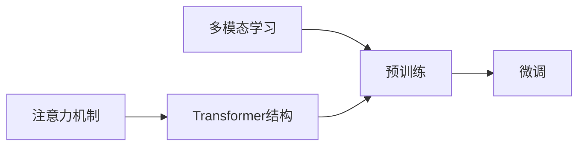

# 多模态大模型：技术原理与实战 OpenAI的成长并非一帆风顺

## 1. 背景介绍
### 1.1 问题的由来
近年来,随着人工智能技术的飞速发展,多模态大模型成为了业界关注的焦点。多模态大模型可以同时处理文本、图像、音频等多种模态的数据,实现跨模态的理解和生成,为人工智能带来了全新的突破。OpenAI作为该领域的先驱,推出了一系列引领潮流的多模态大模型,如GPT、DALL-E、Whisper等。然而,OpenAI的成长之路并非一帆风顺,他们在技术研发和商业化过程中遇到了诸多挑战。

### 1.2 研究现状
目前,多模态大模型已经成为学术界和工业界的研究热点。谷歌、微软、Meta等科技巨头纷纷投入巨资,希望在这一领域占据先机。学术界也涌现出大量关于多模态大模型的研究论文,如多模态预训练、跨模态对齐、零样本学习等。然而,多模态大模型仍面临着诸多技术难题,如模态间的语义对齐、海量多模态数据的高效处理、模型的可解释性等。

### 1.3 研究意义 
深入研究多模态大模型的技术原理和实战经验,对于推动人工智能的发展具有重要意义。一方面,多模态大模型能够实现更加智能、自然的人机交互,为智能助手、智能搜索、内容创作等应用带来革命性变化。另一方面,多模态大模型的突破也将促进认知科学、神经科学等基础学科的发展,加深我们对人类智能的理解。此外,总结OpenAI的发展历程,也能为其他AI企业提供宝贵的经验和启示。

### 1.4 本文结构
本文将围绕多模态大模型的技术原理和OpenAI的实战经验展开论述。第二章介绍多模态大模型的核心概念和技术基础。第三章重点阐述多模态大模型的核心算法原理和具体操作步骤。第四章从数学角度对多模态大模型的原理进行建模和推导。第五章通过代码实例,讲解如何实现一个多模态大模型。第六章探讨多模态大模型的实际应用场景。第七章推荐相关的学习资源和开发工具。第八章总结全文,展望多模态大模型的未来发展趋势和挑战。第九章附录,解答读者的常见问题。

## 2. 核心概念与联系
多模态大模型涉及的核心概念包括:

- 多模态学习(Multimodal Learning):利用多种模态的数据(如文本、图像、音频等)进行联合学习,实现跨模态的理解和生成。
- 预训练(Pre-training):在大规模多模态数据上进行无监督/自监督学习,让模型掌握多模态数据的一般性知识和规律。
- 微调(Fine-tuning):在特定任务的少量标注数据上,对预训练模型进行监督学习,使其适应特定任务。
- 注意力机制(Attention Mechanism):通过注意力权重动态地聚焦输入数据的不同部分,提取关键信息。
- Transformer结构:基于自注意力机制的神经网络结构,擅长处理序列数据,是大模型的主流架构。

这些概念之间紧密相关。多模态学习是大模型的目标,通过预训练掌握多模态知识,再通过微调适应特定任务。Transformer结构和注意力机制是实现大模型的核心架构。下图展示了这些概念之间的联系:

## 3. 核心算法原理 & 具体操作步骤
### 3.1 算法原理概述
多模态大模型的核心算法主要包括:

1. 多模态预训练:利用自监督学习,在大规模多模态语料上训练模型,掌握不同模态之间的对应关系和一般性知识。常见的预训练任务有:
   - 掩码语言建模(Masked Language Modeling,MLM):随机掩盖文本的部分token,让模型根据上下文预测被掩盖的token。
   - 图像-文本匹配(Image-Text Matching,ITM):给定图像和文本,判断它们是否匹配。
   - 掩码图像建模(Masked Image Modeling,MIM):随机掩盖图像的部分区域,让模型根据上下文重建被掩盖区域。

2. 模态对齐:通过对比学习等方法,将不同模态映射到一个共同的语义空间,实现模态间的语义对齐。常见方法有:
   - CLIP(Contrastive Language-Image Pre-training):最大化匹配的图像-文本对的相似度,最小化不匹配对的相似度。
   - ALIGN(A Large-scale ImaGe and Noisy-text embedding):类似CLIP,引入更大规模的图像-文本对数据集。

3. Transformer编码器:以自注意力机制为核心,对输入的文本、图像、音频等进行编码,提取特征表示。Transformer可以并行计算,适合处理长序列。

4. Transformer解码器:根据编码器的输出,自回归地生成目标序列,如文本、图像等。解码器也采用自注意力机制,并引入交叉注意力来关注编码器的输出。生成过程通常采用Beam Search等策略。

### 3.2 算法步骤详解
以图像-文本匹配任务为例,详细说明多模态大模型的训练步骤:

1. 数据准备:收集大量图像-文本对作为训练数据,图像和文本应具有对应关系。同时构造一些不匹配的图像-文本对作为负样本。

2. 图像编码:将图像输入到视觉Transformer编码器,提取图像特征。具体步骤包括:
   - 图像分块:将图像分割成固定大小的块(如16x16)
   - 位置编码:为每个图像块添加位置嵌入,以引入位置信息  
   - Transformer编码:通过多层自注意力和前馈网络,提取图像块之间的关系,得到图像特征向量

3. 文本编码:将文本输入到语言Transformer编码器,提取文本特征。具体步骤包括:
   - 文本token化:将文本划分成token(如单词、子词),并转换成id
   - 位置编码:为每个token添加位置嵌入
   - Transformer编码:通过多层自注意力和前馈网络,提取token之间的关系,得到文本特征向量
  
4. 对比学习:将图像特征和文本特征映射到同一个语义空间,并计算它们的相似度。对于匹配的图像-文本对,最大化其相似度;对于不匹配的图像-文本对,最小化其相似度。常见的相似度函数有内积、余弦相似度等。

5. 损失函数:使用交叉熵损失函数,将图像-文本匹配任务建模为二分类问题。对于匹配对,目标概率为1;对于不匹配对,目标概率为0。

6. 优化训练:使用Adam等优化器,最小化损失函数,更新模型参数。训练通常采用大批量、多GPU分布式的方式,以提高效率。

7. 推理应用:训练完成后,可以使用图像编码器和文本编码器,将图像和文本映射到共同的语义空间,并计算它们的相似度,实现图像-文本检索、图像描述生成等任务。

### 3.3 算法优缺点
多模态大模型的优点包括:

- 通过预训练掌握了海量多模态数据中的知识,具有强大的语义理解和生成能力
- 可以处理文本、图像、音频等多种模态,实现跨模态的理解和生成
- 采用注意力机制和Transformer结构,可以建模长距离依赖,并行计算效率高
- 通过微调,可以方便地适应下游的各种任务

多模态大模型的缺点包括:  

- 模型参数量巨大,训练和推理成本高,需要大量算力支持
- 模型复杂度高,可解释性差,容易产生偏见和安全隐患  
- 过度依赖大规模数据,对长尾、小样本场景适应性差
- 不同模态间的语义对齐仍是难题,需要更多的研究

### 3.4 算法应用领域
多模态大模型可以应用于多个领域,包括:

- 智能助手:通过语音、图像等多模态交互,提供更自然、高效的用户体验
- 信息检索:支持文本-图像、图像-文本等跨模态检索,丰富检索方式
- 内容创作:自动生成图像描述、根据文本生成图像等,辅助内容创作
- 医疗诊断:联合分析医学影像和病历,辅助疾病诊断
- 教育培训:开发多模态的智能教学系统,提供互动式学习体验
- 无人驾驶:融合视觉、雷达等多传感器信息,实现精准的环境感知和决策

## 4. 数学模型和公式 & 详细讲解 & 举例说明
### 4.1 数学模型构建
以图像-文本对比学习为例,说明多模态大模型的数学建模过程。

首先,定义图像编码器$f_v$和文本编码器$f_t$,它们分别将图像$I$和文本$T$映射到$d$维的特征空间:

$$
f_v(I) \in \mathbb{R}^d, f_t(T) \in \mathbb{R}^d
$$

然后,定义图像-文本对$(I, T)$的相似度函数$s$,常见的相似度函数有内积、余弦相似度等:

$$
s(I, T) = f_v(I)^\top f_t(T)
$$

对于一个匹配的图像-文本对$(I, T)$,我们希望最大化其相似度$s(I,T)$。同时,对于一个不匹配的图像-文本对$(I, T')$,我们希望最小化其相似度$s(I,T')$。因此,可以定义如下的对比损失函数:

$$
L(I, T) = -\log \frac{\exp(s(I,T))}{\exp(s(I,T)) + \sum_{T'} \exp(s(I,T'))}
$$

其中,$T'$表示除$T$以外的所有负样本文本。直观地说,该损失函数希望匹配对的相似度远大于所有不匹配对的相似度。

### 4.2 公式推导过程
对上述损失函数求导,可得:

$$
\begin{aligned}
\frac{\partial L(I, T)}{\partial f_v(I)} &= -\frac{\exp(s(I,T))}{\exp(s(I,T)) + \sum_{T'} \exp(s(I,T'))} \cdot f_t(T) \\
&+ \sum_{T'} \frac{\exp(s(I,T'))}{\exp(s(I,T)) + \sum_{T'} \exp(s(I,T'))} \cdot f_t(T') \\
\frac{\partial L(I, T)}{\partial f_t(T)} &= -\frac{\exp(s(I,T))}{\exp(s(I,T)) + \sum_{T'} \exp(s(I,T'))} \cdot f_v(I)
\end{aligned}
$$

根据上式,可以使用梯度下降法更新图像编码器$f_v$和文本编码器$f_t$的参数$\theta_v$和$\theta_t$:

$$
\begin{aligned}
\theta_v &\leftarrow \theta_v - \eta \cdot \frac{\partial L(I, T)}{\partial f_v(I)} \cdot \frac{\partial f_v(I)}{\partial \theta_v} \\
\theta_t &\leftarrow \theta_t - \eta \cdot \frac{\partial L(I, T)}{\partial f_t(T)} \cdot \frac{\partial f_t(T)}{\partial \theta_t}
\end{aligned}
$$

其中,$\eta$为学习率。重复以上步骤,直到损失函数收敛。

### 4.3 案例分析与讲解
下面以一个简单的例子,说明图像-文本对比学习的过程。

假设我们有三张图像$I_1, I_2, I_3$和三段文本$T_1, T_2, T_3$,它们的真实匹配关系为:

$$
I_1 \leftrightarrow T_1, I_2 \leftrightarrow T_2, I_3 \leftrightarrow T_3
$$

在训练时