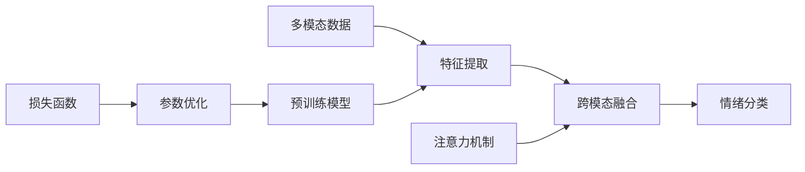

# 多模态大模型：技术原理与实战 多模态大模型在情绪识别领域的应用

关键词：多模态大模型, 情绪识别, 深度学习, 迁移学习, 跨模态融合, 预训练模型, 注意力机制, 情感分析

## 1. 背景介绍
### 1.1  问题的由来
随着人工智能技术的飞速发展,多模态大模型在各个领域得到广泛应用。其中,情绪识别作为人机交互中的重要一环,受到学术界和工业界的高度关注。传统的情绪识别方法主要基于单一模态(如文本、语音、表情等),难以充分利用不同模态信息之间的互补性,识别准确率有待提高。因此,亟需研究融合多种模态信息的情绪识别新方法。

### 1.2  研究现状
目前,多模态情绪识别的研究主要集中在以下几个方面:

(1)特征表示学习。通过深度学习方法自动提取不同模态数据的高层语义特征,替代人工设计特征。如使用CNN提取视觉特征,LSTM提取语音和文本特征等。

(2)跨模态信息融合。探索有效的融合策略,充分挖掘不同模态信息之间的互补性。常见方法有早期融合、晚期融合和混合融合等。

(3)上下文信息建模。考虑情绪在时间维度上的连续性和上下文依赖性,引入时序模型如RNN对多模态数据进行建模。

(4)迁移学习。利用在大规模数据集上预训练的通用模型,迁移到下游的情绪识别任务中,缓解标注数据稀缺的问题。

尽管取得了一定进展,但现有方法在处理真实场景中的复杂多模态数据时,仍然面临特征表示能力不足、模态融合方式单一、模型泛化性差等挑战。

### 1.3  研究意义
多模态情绪识别在人机交互、医疗诊断、社交媒体分析等领域有广阔的应用前景。研究融合文本、语音、视觉等多模态信息的情绪识别模型,有助于提高识别的准确性和鲁棒性,增强AI系统感知和理解用户情绪的能力,推动情感计算走向实用化。同时,相关研究也将促进多模态机器学习、认知科学、心理学等学科的理论创新和技术进步。

### 1.4  本文结构
本文将围绕多模态大模型在情绪识别中的应用展开论述。第2部分介绍相关的核心概念;第3部分详细阐述多模态大模型的核心算法原理;第4部分建立情绪识别的数学模型并推导相关公式;第5部分给出基于多模态大模型的情绪识别代码实例;第6部分分析多模态情绪识别的实际应用场景;第7部分推荐相关学习资源和开发工具;第8部分总结全文,展望未来研究方向。

## 2. 核心概念与联系
在讨论多模态大模型用于情绪识别之前,有必要先明确几个核心概念:

- 多模态学习:旨在处理和关联来自多种信息源的数据,挖掘不同模态数据的内在联系,完成预测、决策等任务的机器学习范式。

- 大模型:指参数量极大(数亿到数千亿)、采用自监督预训练范式、具备少样本学习和跨任务迁移能力的深度神经网络模型。代表模型有BERT、GPT-3、CLIP等。

- 情绪识别:根据人的外显行为(如面部表情、语音语调、身体姿态)和生理信号(如心率、皮电)等,判断其情绪状态(如高兴、悲伤、愤怒)的过程。与情感分析的区别在于,情绪识别关注个体的情绪状态,而情感分析关注文本的情感倾向。

- 跨模态语义对齐:在共同的语义空间中,对齐不同模态表示的语义信息,使其可以直接比较和关联。常用对比学习和对偶学习等方法实现。

- 注意力机制:通过学习样本不同部分的重要程度,自适应地分配权重,聚焦于信息量大的区域。自注意力进一步考虑样本内部不同位置之间的依赖关系。

多模态大模型通过自监督预训练学习通用的多模态特征表示,利用注意力机制动态融合不同模态信息,再通过跨模态语义对齐增强模态互补性,从而显著提升下游情绪识别任务的性能。

## 3. 核心算法原理 & 具体操作步骤
### 3.1  算法原理概述
本文采用基于Transformer的多模态大模型架构,通过自监督预训练和监督微调的范式,实现端到端的情绪识别。模型以文本、语音、视觉等多模态数据为输入,首先利用模态特定的特征提取器(如BERT、VGGish、ResNet)分别提取不同模态的特征表示,然后通过跨模态注意力模块进行特征融合,最后接情绪分类器输出情绪类别。模型通过最小化情绪分类损失和跨模态对比损失,联合优化多模态特征表示和分类决策边界。

### 3.2  算法步骤详解
算法主要分为两个阶段:预训练阶段和微调阶段。

预训练阶段步骤如下:
1. 构建大规模无标注多模态数据集,包括文本、语音、视频等。
2. 对每个模态的输入数据进行预处理,如音频波形转为梅尔频谱、视频帧抽取等。
3. 利用模态特定的特征提取器提取单模态特征,得到文本向量、语音向量、视觉向量。
4. 将不同模态的特征向量拼接,输入跨模态注意力模块进行特征交互融合。
5. 对融合后的多模态特征进行自监督预训练,如掩码语言建模、对比学习等,学习通用的语义表示。
6. 重复步骤2-5,直到模型收敛。

微调阶段步骤如下:  
1. 在下游情绪识别数据集上,固定预训练模型的参数,添加情绪分类器。
2. 端到端地微调整个模型,联合优化多模态特征和分类器。
3. 在验证集上评估模型性能,并调整超参数。
4. 重复步骤2-3,直到模型性能最优。
5. 在测试集上评估模型的泛化性能。

### 3.3  算法优缺点
优点:
- 通过自监督预训练学习通用的多模态语义表示,减少对标注数据的依赖。
- 利用注意力机制动态调整不同模态的重要性,增强模态互补性。
- 端到端可微,联合优化特征表示和分类决策。

缺点:  
- 对计算资源要求高,预训练成本大。
- 模态丢失问题,即在融合过程中,部分模态信息可能被忽略。
- 对模态差异敏感,如不同模态的数据分布差异大时,性能下降明显。

### 3.4  算法应用领域
多模态情绪识别算法可应用于以下领域:

- 智能客服:通过分析用户的语音、表情、语义等,实时判断用户情绪,提供个性化服务。
- 医疗诊断:通过分析患者的面部表情、语音、体征等,辅助诊断心理疾病。
- 驾驶监测:通过分析驾驶员的面部表情、语音、驾驶行为等,判断其情绪和疲劳状态,预防交通事故。
- 社交媒体分析:通过分析用户发布的文本、图像、视频等,挖掘用户情绪倾向,进行舆情监测。

## 4. 数学模型和公式 & 详细讲解 & 举例说明
### 4.1  数学模型构建
我们定义情绪识别任务为给定多模态输入 $X=(X^t,X^a,X^v)$,其中 $X^t$、$X^a$、$X^v$ 分别表示文本、语音、视觉模态的输入数据,预测其情绪标签 $y \in \mathcal{Y}$。多模态模型 $\mathcal{F}$ 将输入 $X$ 映射为情绪分布 $\mathbf{p} \in \mathbb{R}^{|\mathcal{Y}|}$。模型的目标是学习最优参数 $\theta$,最小化经验风险:

$$\mathcal{L}(\theta)=\mathbb{E}_{(X,y) \sim \mathcal{D}} \ell(\mathcal{F}(X;\theta),y)$$

其中 $\mathcal{D}$ 为数据分布,$\ell$ 为损失函数,如交叉熵损失:

$$\ell(\mathbf{p},y)=-\sum_{i=1}^{|\mathcal{Y}|} y_i \log p_i$$

其中 $y_i \in \{0,1\}$ 表示样本是否属于第 $i$ 类, $p_i$ 为模型预测该样本属于第 $i$ 类的概率。

考虑到不同模态特征的差异性,我们引入注意力机制来自适应地融合不同模态的信息。具体地,给定第 $l$ 层第 $i$ 个模态的特征 $\mathbf{h}_i^l$,注意力权重 $\alpha_i^l$ 计算如下:

$$e_{ij}^l=\mathbf{q}^{lT} \cdot \tanh(\mathbf{W}_1^l \mathbf{h}_i^l+\mathbf{W}_2^l \mathbf{h}_j^l)$$

$$\alpha_{ij}^l=\frac{\exp(e_{ij}^l)}{\sum_{k=1}^{N^l} \exp(e_{ik}^l)}$$

其中 $\mathbf{q}^l,\mathbf{W}_1^l,\mathbf{W}_2^l$ 为可学习参数,$N^l$ 为第 $l$ 层的模态数。

第 $l+1$ 层第 $i$ 个模态的特征 $\mathbf{h}_i^{l+1}$ 通过加权平均得到:

$$\mathbf{h}_i^{l+1}=\sum_{j=1}^{N^l} \alpha_{ij}^l \mathbf{h}_j^l$$

最终,我们将最后一层的多模态融合特征 $\mathbf{h}^L$ 输入分类器(如MLP)进行情绪预测:

$$\mathbf{p}=\mathrm{softmax}(\mathbf{W}_c \mathbf{h}^L+\mathbf{b}_c)$$

其中 $\mathbf{W}_c,\mathbf{b}_c$ 为分类器参数。

为了进一步增强不同模态特征的语义一致性,我们在预训练阶段引入跨模态对比损失:

$$\mathcal{L}_c=-\mathbb{E}_{(X^t,X^a,X^v) \sim \mathcal{D}} [\log \frac{\exp(\mathrm{sim}(\mathbf{z}^t,\mathbf{z}^a)/\tau)}{\sum_{v^- \in \mathcal{N}_v} \exp(\mathrm{sim}(\mathbf{z}^t,\mathbf{z}^{v^-})/\tau)}]$$

其中 $\mathbf{z}^t,\mathbf{z}^a,\mathbf{z}^v$ 分别表示文本、语音、视觉模态特征的归一化表示,$\mathcal{N}_v$ 为负样本集合,$\tau$ 为温度超参数,$\mathrm{sim}$ 为余弦相似度:

$$\mathrm{sim}(\mathbf{z}_1,\mathbf{z}_2)=\frac{\mathbf{z}_1^T \mathbf{z}_2}{||\mathbf{z}_1|| \cdot ||\mathbf{z}_2||}$$

直觉上,对比损失鼓励匹配的文本-语音对比不匹配的文本-视觉对更相似,从而实现跨模态语义对齐。

综上,模型的总体损失为监督分类损失和对比损失的加权和:

$$\mathcal{L}=\mathcal{L}_c + \lambda \mathcal{L}_s$$

其中 $