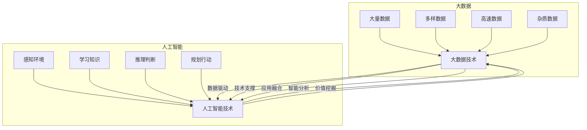
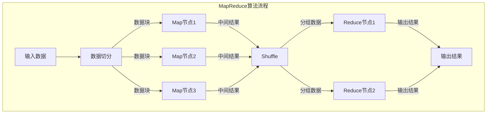

好的,我会严格按照您的要求来撰写这篇文章。以下是文章正文部分:

# 大数据与AI的未来发展

## 1. 背景介绍

### 1.1 问题的由来

在当今时代,数据已经成为了推动科技发展和社会进步的重要燃料。随着互联网、物联网、云计算等新兴技术的不断发展,海量的数据被源源不断地产生和积累。这些数据蕴含着巨大的价值,但同时也带来了管理和分析的巨大挑战。传统的数据处理方法已经无法满足当前数据规模和复杂性的需求。因此,大数据技术应运而生,旨在高效地收集、存储、处理和分析大规模数据集,从中提取有价值的信息和知识。

与此同时,人工智能(AI)技术也取得了长足的进步。benefiting from 受益于大数据时代提供的海量数据资源,AI算法能够从这些数据中学习并不断提高性能。AI技术在计算机视觉、自然语言处理、决策优化等领域展现出了令人惊叹的能力,正在深刻影响和改变着我们的生活、工作和思维方式。

大数据和人工智能的结合,正在催生新的机遇和挑战。它们的未来发展息息相关,将对科技创新、商业模式和社会变革产生深远影响。

### 1.2 研究现状

近年来,大数据和AI技术的研究和应用受到了广泛关注。学术界和工业界都在积极投入资源,推动这两个领域的创新发展。

在大数据领域,分布式存储和计算框架(如Hadoop、Spark)、实时数据处理系统(如Kafka、Flink)、数据湖和数据仓库等技术日益成熟,为海量数据的管理和分析提供了强有力的支撑。同时,数据可视化、数据治理、数据安全等方面也取得了重要进展。

在AI领域,机器学习和深度学习算法不断涌现,在计算机视觉、自然语言处理、决策优化等领域取得了突破性的进展。AI芯片、AI加速器等硬件设施也在快速发展,为AI算法的高效执行提供了坚实基础。

大数据和AI的融合也成为研究的热点。一方面,大数据为AI算法提供了丰富的训练数据和应用场景;另一方面,AI技术也被广泛应用于大数据的处理和分析,提高了数据价值的挖掘效率。

### 1.3 研究意义

大数据和AI技术的发展对于推动科技创新、提高生产效率、优化决策过程、改善生活质量等方面具有重大意义:

1. **科技创新驱动**:大数据和AI技术为新兴领域(如智能制造、智慧城市、智能交通等)提供了强大的支撑,推动了科技创新的步伐。

2. **效率提升**:通过对海量数据的分析和AI算法的应用,可以优化生产流程、提高决策质量、改善资源利用效率,从而提升整体生产效率。

3. **智能决策**:利用大数据和AI技术,可以建立更加精准的预测模型和决策系统,为企业经营、社会管理等提供智能化的决策支持。

4. **生活质量改善**:大数据和AI技术在医疗健康、教育培训、环境保护等领域的应用,有助于提高人们的生活质量和幸福指数。

5. **新兴产业培育**:大数据和AI技术的发展将催生新的商业模式和产业形态,为经济发展注入新的动力。

综上所述,深入研究大数据与AI技术的未来发展趋势和挑战,对于把握技术发展方向、制定相关政策、布局产业发展等具有重要的理论意义和现实意义。

### 1.4 本文结构  

本文将全面探讨大数据与人工智能技术的未来发展趋势和面临的挑战。主要内容包括:

1. 阐述大数据和AI技术的核心概念及其内在联系。

2. 介绍大数据和AI领域的核心算法原理和具体实现步骤。 

3. 建立相关的数学模型,推导公式,并通过案例分析加深理解。

4. 通过实际项目实践,呈现具体的代码实现和运行效果。

5. 探讨大数据和AI技术在不同领域的应用场景。

6. 推荐相关的学习资源、开发工具和论文等资源。

7. 总结技术发展趋势,分析面临的主要挑战,并对未来研究方向进行展望。

8. 附录部分回答常见的问题,以帮助读者更好地理解相关概念。

## 2. 核心概念与联系

在探讨大数据和人工智能技术的未来发展之前,我们有必要先厘清两者的核心概念及其内在联系。

**大数据(Big Data)** 指的是规模大到无法使用传统数据库软件工具进行捕获、管理和处理的数据集。大数据具有4V特征:

1. **Volume(大量)**: 指数据的规模大到超出了传统数据库工具的处理能力。

2. **Variety(多样)**: 指数据来源和格式种类多样,包括结构化数据和非结构化数据。

3. **Velocity(高速)**: 指数据的产生、传输和处理的速度很快。

4. **Veracity(价值密度低)**: 指数据的质量参差不齐,噪音和低价值数据较多。

**人工智能(Artificial Intelligence, AI)** 是一门致力于研究和开发能够模拟人类智能行为的理论、方法、技术及应用系统的学科。AI的核心是使计算机系统能够具备一定的智能,包括感知环境、学习知识、推理判断、规划行动等能力。

大数据和AI之间存在紧密的内在联系:

1. **数据驱动**: AI算法需要大量高质量的数据进行训练和学习,大数据为AI提供了丰富的数据资源。

2. **价值挖掘**: 大数据技术能够从海量数据中发现隐藏的模式和规律,AI算法则能够对这些发现进行分析和利用,从而挖掘出数据的价值。

3. **智能分析**: AI算法能够对大数据进行智能化的分析和处理,提高了数据分析的效率和质量。

4. **应用融合**: 大数据和AI技术在许多领域都有广泛的应用,两者的结合能够产生强大的协同效应。

5. **技术支撑**: 大数据技术为AI算法的训练和应用提供了必要的计算、存储和管理支持。

总的来说,大数据为AI提供了发展所需的数据基础,而AI则为大数据赋予了更强的分析和挖掘能力。二者相辅相成,共同推动着科技创新和智能化发展。

上图展示了大数据和人工智能技术的核心概念以及它们之间的内在联系。大数据技术致力于管理和处理大量、多样、高速和杂质的数据;而人工智能技术则旨在赋予计算机系统感知、学习、推理和规划的智能能力。两者相互促进、相辅相成,共同推动着智能化发展进程。

## 3. 核心算法原理 & 具体操作步骤

大数据和AI技术的核心是一系列先进的算法,这些算法赋予了系统强大的数据处理和智能分析能力。下面我们将介绍其中的几种核心算法原理及其具体实现步骤。

### 3.1 算法原理概述

#### 3.1.1 MapReduce算法

MapReduce是一种分布式计算模型,用于在大规模数据集上并行执行计算。它将计算过程划分为两个阶段:Map阶段和Reduce阶段。

- **Map阶段**:输入数据被拆分为多个数据块,并行地在集群节点上执行Map函数,生成中间结果。
- **Reduce阶段**:合并Map阶段的输出结果,并行地在集群节点上执行Reduce函数,生成最终结果。

MapReduce算法的优点是可扩展性强、容错性好,适合处理大规模数据集。

#### 3.1.2 K-Means聚类算法

K-Means是一种常用的无监督学习算法,用于对数据进行聚类分析。算法的目标是将n个数据对象划分为k个聚类,使得同一个聚类内的对象相似度较高,不同聚类之间的对象相似度较低。

算法的基本思想是:

1. 随机选择k个初始聚类中心。
2. 计算每个数据对象与各个聚类中心的距离,将其分配到最近的聚类中。
3. 重新计算每个聚类的中心点。
4. 重复步骤2和3,直到聚类中心不再发生变化。

K-Means算法广泛应用于客户细分、图像分割、文本聚类等领域。

#### 3.1.3 决策树算法

决策树是一种常用的监督学习算法,通过构建决策树模型来对数据进行分类或回归预测。决策树由节点和有向边组成,每个内部节点表示对特征的一个测试,每个分支代表一种测试输出,而每个叶节点则存储了一个类别或数值。

构建决策树的基本步骤包括:

1. 从根节点开始,选择最优特征进行数据划分。
2. 对每个子节点,递归地重复步骤1,构建子树。
3. 直到满足停止条件(如达到最大深度、节点数据纯度足够高等)。

决策树模型易于解释和可视化,在金融风险评估、医疗诊断等领域有广泛应用。

### 3.2 算法步骤详解

接下来,我们将对上述三种核心算法的具体实现步骤进行详细阐述。

#### 3.2.1 MapReduce算法实现步骤

1. **输入数据切分**:将输入数据切分为多个数据块,每个数据块存储在不同的计算节点上。

2. **Map阶段**:
   a. 并行地在各个计算节点上执行Map函数。
   b. Map函数将输入数据块转换为键值对(key/value)形式的中间结果。
   c. 对中间结果进行分区和排序操作。

3. **Shuffle阶段**:将Map阶段的输出结果按照键值对的键进行分组,并传输到对应的Reduce节点。

4. **Reduce阶段**:
   a. 并行地在各个Reduce节点上执行Reduce函数。
   b. Reduce函数对相同键的值进行聚合操作,生成最终结果。

5. **输出结果**:将Reduce阶段的输出结果写入到分布式文件系统或其他存储介质中。

#### 3.2.2 K-Means聚类算法实现步骤

1. **初始化**:随机选择k个数据对象作为初始聚类中心。

2. **分配数据对象**:计算每个数据对象与各个聚类中心的距离,将其分配到最近的聚类中。

3. **更新聚类中心**:对于每个聚类,重新计算其所有数据对象的均值作为新的聚类中心。