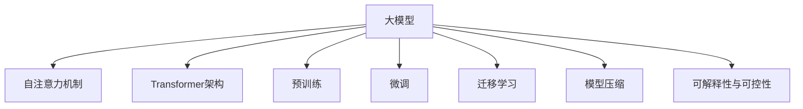

# 大模型的技术发展与市场应用

## 1. 背景介绍

### 1.1 问题的由来

在过去几年中,人工智能领域取得了长足的进步,尤其是在自然语言处理和计算机视觉等任务上表现出色。这些进展很大程度上归功于大型神经网络模型的出现,通常被称为"大模型"。大模型指的是包含数十亿甚至数万亿参数的深度神经网络,通过在大规模数据集上进行预训练而获得强大的表示能力。

这些大模型展现出惊人的泛化能力,能够在看似不相关的下游任务上表现出色,引发了研究人员和工业界的广泛关注。然而,大模型也面临着一些挑战,例如庞大的计算资源需求、数据隐私问题、安全性和可解释性等。因此,探索大模型的技术发展方向及其在各个领域的应用前景,具有重要的理论和实践意义。

### 1.2 研究现状

目前,大模型的研究主要集中在以下几个方面:

1. **模型架构创新**: 研究人员不断探索新颖的模型架构,以提高大模型的性能和效率。例如,Transformer架构在自然语言处理任务中取得了巨大成功,而Vision Transformer则将该架构成功应用于计算机视觉领域。

2. **预训练策略优化**: 通过优化预训练过程,可以提高大模型的泛化能力。常见的策略包括自监督学习、对比学习、多任务学习等。

3. **高效推理技术**: 由于大模型的巨大计算需求,研究人员致力于开发高效的推理技术,如模型压缩、知识蒸馏、量化等,以降低推理成本。

4. **可解释性与可控性**: 提高大模型的可解释性和可控性是一个重要的研究方向,旨在增强模型的透明度、安全性和可靠性。

5. **应用探索**: 大模型在自然语言处理、计算机视觉、推荐系统、医疗健康等领域展现出广阔的应用前景,吸引了众多研究者的关注。

### 1.3 研究意义

大模型的研究对于推动人工智能技术的发展具有重要意义:

1. **提高任务性能**: 大模型凭借其强大的表示能力,能够在广泛的任务中取得出色的性能表现,推动人工智能技术的发展。

2. **促进技术创新**: 大模型的研究带来了诸多技术创新,如新颖的模型架构、高效的训练和推理算法等,这些创新也可能为其他领域带来启发。

3. **拓展应用场景**: 大模型在多个领域展现出巨大的应用潜力,有望解决一些长期以来难以攻克的挑战性问题。

4. **推动理论发展**: 大模型的出现对现有的机器学习理论提出了新的挑战,需要我们重新思考和发展理论,以更好地解释和指导大模型的设计与应用。

### 1.4 本文结构

本文将全面探讨大模型的技术发展与市场应用。首先介绍大模型的核心概念和关键技术,包括模型架构、预训练策略、高效推理技术等。然后深入分析大模型在自然语言处理、计算机视觉、推荐系统等领域的应用,并讨论其面临的挑战和未来发展趋势。最后,本文还将推荐一些有用的工具和资源,以帮助读者更好地了解和使用大模型技术。

## 2. 核心概念与联系

大模型是一种基于深度学习的人工智能模型,其核心思想是通过在大规模数据集上进行预训练,获得强大的表示能力,从而在各种下游任务上表现出色。大模型的核心概念包括:

1. **自注意力机制(Self-Attention)**: 自注意力机制是大模型中广泛使用的关键技术,它能够捕捉输入序列中元素之间的长程依赖关系,从而提高模型的表示能力。

2. **Transformer架构**: Transformer是一种基于自注意力机制的序列到序列模型架构,它在机器翻译等自然语言处理任务中表现出色,并被广泛应用于大模型的设计中。

3. **预训练(Pre-training)**: 预训练是指在大规模无标注数据集上训练模型,使其学习到通用的表示能力。常见的预训练策略包括自监督学习、对比学习等。

4. **微调(Fine-tuning)**: 微调是指在特定下游任务的标注数据集上继续训练预训练模型,使其适应该任务的特征。

5. **迁移学习(Transfer Learning)**: 迁移学习是指将预训练模型中学习到的知识迁移到新的任务中,从而提高模型的泛化能力。

6. **模型压缩**: 由于大模型通常包含数十亿甚至数万亿参数,因此需要采用模型压缩技术(如知识蒸馏、剪枝等)来降低推理成本。

7. **可解释性与可控性**: 提高大模型的可解释性和可控性是一个重要的研究方向,旨在增强模型的透明度、安全性和可靠性。

这些核心概念相互关联,共同构成了大模型的技术体系。例如,Transformer架构和自注意力机制为大模型提供了强大的表示能力;预训练和微调策略则使大模型能够在各种下游任务中发挥作用;而模型压缩和可解释性技术则解决了大模型的效率和可靠性问题。

## 3. 核心算法原理与具体操作步骤

### 3.1 算法原理概述

大模型的核心算法原理主要包括以下几个方面:

1. **自注意力机制**

自注意力机制是大模型中广泛使用的关键技术,它能够捕捉输入序列中元素之间的长程依赖关系,从而提高模型的表示能力。自注意力机制的基本思想是将每个输入元素与其他所有元素进行关联,计算它们之间的注意力权重,然后根据这些权重对输入元素进行加权求和,得到该元素的表示向量。

2. **Transformer架构**

Transformer是一种基于自注意力机制的序列到序列模型架构,它不仅在机器翻译等自然语言处理任务中表现出色,而且还被广泛应用于大模型的设计中。Transformer架构主要由编码器(Encoder)和解码器(Decoder)两部分组成,其中编码器负责将输入序列映射到一个连续的表示空间,而解码器则根据编码器的输出生成目标序列。

3. **预训练策略**

预训练是指在大规模无标注数据集上训练模型,使其学习到通用的表示能力。常见的预训练策略包括:

- **自监督学习(Self-Supervised Learning)**: 利用无标注数据本身的某些属性(如邻近性、上下文等)构建自监督任务,通过解决这些任务来学习数据的表示。

- **对比学习(Contrastive Learning)**: 通过最大化正样本与负样本之间的区分度,学习数据的有区别的表示。

- **多任务学习(Multi-Task Learning)**: 同时在多个相关任务上训练模型,促进模型学习到通用的表示。

4. **微调与迁移学习**

微调是指在特定下游任务的标注数据集上继续训练预训练模型,使其适应该任务的特征。迁移学习则是将预训练模型中学习到的知识迁移到新的任务中,从而提高模型的泛化能力。

5. **模型压缩**

由于大模型通常包含数十亿甚至数万亿参数,因此需要采用模型压缩技术来降低推理成本。常见的模型压缩技术包括:

- **知识蒸馏(Knowledge Distillation)**: 利用一个大型教师模型指导一个小型学生模型的训练,使学生模型学习到教师模型的知识。

- **剪枝(Pruning)**: 通过移除模型中的冗余参数,从而减小模型的大小和计算量。

- **量化(Quantization)**: 将模型参数从32位或16位浮点数压缩到8位或更低位宽度的定点数或整数,以减小模型的存储和计算开销。

6. **可解释性与可控性**

提高大模型的可解释性和可控性是一个重要的研究方向,旨在增强模型的透明度、安全性和可靠性。常见的方法包括:

- **注意力可视化**: 通过可视化自注意力机制中的注意力权重,了解模型关注的重点区域。

- **概念激活向量(Concept Activation Vectors)**: 通过训练模型识别特定的概念,从而解释模型的决策过程。

- **对抗攻击**: 通过构造对抗样本,评估模型的鲁棒性并发现其弱点。

- **控制策略**: 通过设计特定的约束条件或奖励函数,引导模型产生符合预期的输出。

### 3.2 算法步骤详解

以下是大模型训练和应用的典型步骤:

1. **数据收集与预处理**

收集大规模的无标注数据集,如网页文本、图像、视频等,并对数据进行必要的预处理,如去重、清洗、标准化等。

2. **预训练**

在无标注数据集上训练大模型,采用自监督学习、对比学习或多任务学习等预训练策略,使模型学习到通用的表示能力。

3. **微调**

根据具体的下游任务,收集相应的标注数据集。在该数据集上对预训练模型进行微调,使其适应该任务的特征。

4. **模型评估**

在保留的测试集上评估微调后模型的性能,如准确率、F1分数等指标。

5. **模型压缩(可选)**

如果模型过大,可采用知识蒸馏、剪枝或量化等技术对模型进行压缩,以降低推理成本。

6. **模型部署**

将压缩后的模型部署到生产环境中,用于实际的应用场景。

7. **可解释性与可控性分析(可选)**

通过注意力可视化、概念激活向量等技术,分析模型的决策过程,并采取必要的控制策略,以提高模型的可解释性和可控性。

8. **持续优化**

根据模型在实际应用中的表现,持续收集反馈并优化模型,形成迭代式的改进过程。

### 3.3 算法优缺点

大模型算法的优点包括:

1. **强大的表示能力**: 通过在大规模数据集上预训练,大模型能够学习到丰富的知识表示,在各种下游任务中表现出色。

2. **泛化能力强**: 由于预训练过程中涉及大量不同领域的数据,大模型具有良好的泛化能力,能够适应新的任务和环境。

3. **可迁移性高**: 预训练模型中学习到的知识可以方便地迁移到新的任务中,减少了从头开始训练的成本。

4. **持续学习能力强**: 大模型具有强大的持续学习能力,可以通过在新数据上继续训练,不断扩展和更新其知识库。

但大模型也存在一些缺点和挑战:

1. **计算资源需求巨大**: 训练大模型需要大量的计算资源,包括GPU、TPU等昂贵的硬件设备,以及海量的数据集。

2. **推理效率低下**: 大模型通常包含数十亿甚至数万亿参数,推理时的计算开销和延迟较高,影响实际应用。

3. **可解释性和可控性差**: 大模型的决策过程通常是一个黑箱,缺乏可解释性和可控性,存在潜在的安全隐患。

4. **数据隐私和伦理问题**: 大模型的训练过程需要大量的数据,可能会涉及隐私和版权等问题。

5. **知识偏差和不确定性**: 由于训练数据的局限性,大模型可能会存在知识偏差和不确定性,产生错误或有害的输出。

### 3.4 算法应用领域