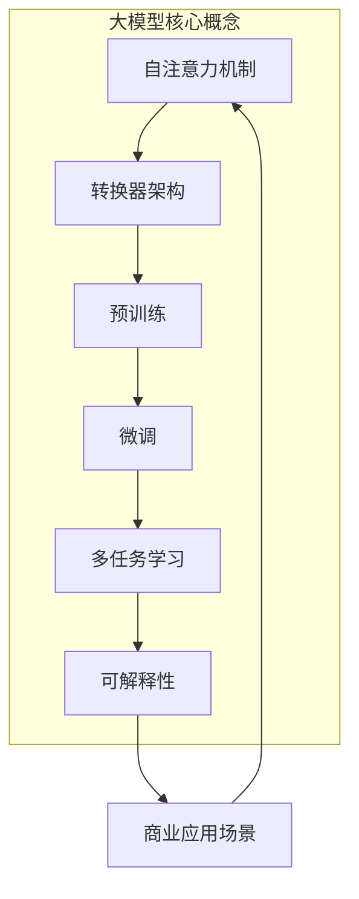
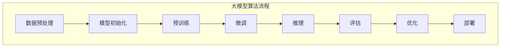

# 大模型：商业应用的无限可能

## 1. 背景介绍

### 1.1 问题的由来

在过去的几年里,大型语言模型(Large Language Models, LLMs)的发展飞速,它们展现出了令人惊叹的能力,可以执行各种复杂的自然语言处理任务。从写作到编程,从问答到分析,大模型的应用范围不断扩大。然而,与此同时,人们也开始思考如何将这种强大的技术应用到商业领域,以推动企业的创新和发展。

商业环境日益复杂,企业面临着来自多方面的挑战,包括提高效率、降低成本、优化决策等。传统的商业智能工具和分析方法已经难以满足当前的需求。因此,如何利用大模型的强大能力来解决这些挑战,成为了一个迫切的课题。

### 1.2 研究现状

目前,一些领先的科技公司和研究机构已经开始探索大模型在商业领域的应用。例如,OpenAI的GPT-3模型被用于自动化写作、客户服务和内容生成等场景。谷歌的LaMDA模型则被应用于对话系统和问答系统的开发。另外,一些初创公司也在尝试将大模型应用于营销、销售和决策支持等领域。

然而,尽管取得了一些进展,但将大模型真正应用于商业环境仍然面临诸多挑战。这些挑战包括:

1. 数据隐私和安全性
2. 模型的可解释性和可控性
3. 商业场景的复杂性和多样性
4. 模型部署和集成的困难
5. 成本和计算资源的限制

### 1.3 研究意义

成功地将大模型应用于商业领域,将为企业带来巨大的价值和机遇。大模型可以帮助企业:

1. 提高效率和生产力
2. 优化决策过程
3. 改善客户体验
4. 发现新的商业机会
5. 降低运营成本

因此,探索大模型在商业领域的应用具有重要的理论和实践意义。从理论上讲,它将推动自然语言处理、机器学习和人工智能等领域的发展;从实践上讲,它将为企业带来竞争优势,并推动整个商业生态系统的创新。

### 1.4 本文结构

本文将全面探讨大模型在商业应用中的无限可能。首先,我们将介绍大模型的核心概念和原理,以及它们与传统模型的区别。接下来,我们将详细阐述大模型在各种商业场景中的应用,包括营销、销售、客户服务、决策支持等。然后,我们将分析大模型应用于商业领域所面临的挑战,并提出相应的解决方案。最后,我们将展望大模型在商业领域的未来发展趋势,并总结本文的主要观点。

## 2. 核心概念与联系

大模型(Large Language Models, LLMs)是一种基于自然语言处理(Natural Language Processing, NLP)和深度学习技术的语言模型。它们通过在海量文本数据上进行训练,学习到了丰富的语言知识和上下文信息,从而具备了强大的语言理解和生成能力。

大模型与传统的语言模型有着根本的区别。传统模型通常是基于统计方法或规则系统构建的,它们的能力有限,只能处理特定的任务或领域。相比之下,大模型采用了全新的架构和训练方式,具有更强的泛化能力,可以应对各种复杂的语言任务。

大模型的核心概念包括:

1. **自注意力机制(Self-Attention Mechanism)**: 这是大模型的关键创新之一。自注意力机制允许模型捕捉输入序列中任意两个位置之间的关系,从而更好地理解上下文信息。

2. **转换器架构(Transformer Architecture)**: 大模型通常采用转换器架构,它是一种全新的序列到序列(Sequence-to-Sequence)模型,能够高效地处理长序列输入。

3. **预训练(Pre-training)**: 大模型通过在海量无标注文本数据上进行预训练,学习到了丰富的语言知识和上下文信息。这种预训练方式大大提高了模型的泛化能力。

4. **微调(Fine-tuning)**: 经过预训练后,大模型可以通过在特定任务上进行微调,快速适应新的任务和领域。这种transfer learning方式大大提高了模型的灵活性和效率。

5. **多任务学习(Multi-task Learning)**: 大模型可以同时学习多个任务,从而提高模型的泛化能力和鲁棒性。

6. **可解释性(Interpretability)**: 与传统的黑箱模型不同,大模型具有一定的可解释性,我们可以通过分析注意力权重等方式来理解模型的决策过程。

这些核心概念使得大模型具备了强大的语言理解和生成能力,为其在商业领域的应用奠定了基础。

## 3. 核心算法原理 & 具体操作步骤

### 3.1 算法原理概述

大模型的核心算法是基于自注意力机制和转换器架构的预训练语言模型。这种算法架构能够有效地捕捉输入序列中任意两个位置之间的关系,从而更好地理解上下文信息。

自注意力机制是大模型的关键创新之一。传统的序列模型(如RNN和LSTM)采用的是顺序结构,只能捕捉局部的上下文信息。而自注意力机制则允许模型直接捕捉任意两个位置之间的关系,从而更好地理解全局上下文。

转换器架构则是一种全新的序列到序列模型,它完全基于自注意力机制构建,能够高效地处理长序列输入。与RNN和LSTM相比,转换器架构具有更好的并行性,可以更快地训练和推理。

大模型通常采用的是自监督预训练的方式。首先,模型会在海量无标注文本数据上进行预训练,学习到丰富的语言知识和上下文信息。预训练任务通常包括掩码语言模型(Masked Language Modeling)和下一句预测(Next Sentence Prediction)等。

经过预训练后,大模型可以通过在特定任务上进行微调(Fine-tuning),快速适应新的任务和领域。这种transfer learning方式大大提高了模型的灵活性和效率。

### 3.2 算法步骤详解

大模型的训练和应用过程可以概括为以下几个步骤:

1. **数据预处理**:首先需要对原始文本数据进行预处理,包括分词、标记化、过滤等操作,将数据转换为模型可以接受的格式。

2. **模型初始化**:初始化模型的参数,包括embedding层、编码器层、解码器层等。

3. **预训练**:在海量无标注文本数据上进行预训练,学习到丰富的语言知识和上下文信息。预训练任务通常包括掩码语言模型和下一句预测等。

4. **微调**:根据具体的任务和数据,对预训练模型进行微调,使其适应新的任务和领域。

5. **推理**:使用微调后的模型进行推理,生成所需的输出,如文本生成、问答、分类等。

6. **评估**:对模型的输出进行评估,计算相关指标,如准确率、召回率、F1分数等。

7. **优化**:根据评估结果,对模型进行进一步优化,如调整超参数、增加训练数据等。

8. **部署**:将优化后的模型部署到生产环境中,用于实际的商业应用场景。

在整个过程中,自注意力机制和转换器架构是大模型的核心算法,而预训练和微调则是关键的训练策略。通过这种方式,大模型可以学习到丰富的语言知识,并快速适应各种任务和领域。

### 3.3 算法优缺点

大模型算法具有以下优点:

1. **强大的语言理解和生成能力**:通过预训练和微调,大模型可以学习到丰富的语言知识和上下文信息,从而具备强大的语言理解和生成能力。

2. **泛化能力强**:与传统的任务特定模型不同,大模型具有很强的泛化能力,可以快速适应新的任务和领域。

3. **多任务学习**:大模型可以同时学习多个任务,从而提高模型的泛化能力和鲁棒性。

4. **可解释性较好**:通过分析自注意力权重等方式,大模型具有一定的可解释性,我们可以理解模型的决策过程。

5. **高效的并行计算**:转换器架构具有很好的并行性,可以充分利用现代硬件(如GPU和TPU)的计算能力,加快训练和推理速度。

但是,大模型算法也存在一些缺点和挑战:

1. **需要大量计算资源**:训练大模型需要海量的数据和计算资源,对硬件要求很高,成本也较高。

2. **可能存在偏差和不确定性**:由于预训练数据的局限性,大模型可能会存在一些偏差和不确定性,需要进一步的优化和调整。

3. **安全性和隐私问题**:大模型可能会泄露隐私信息或生成有害内容,需要采取相应的安全措施。

4. **缺乏因果推理能力**:目前的大模型主要是基于相关性建模,缺乏真正的因果推理能力。

5. **可解释性有限**:尽管大模型具有一定的可解释性,但对于复杂的决策过程,可解释性仍然有限。

### 3.4 算法应用领域

大模型算法可以应用于自然语言处理的各个领域,包括但不限于:

1. **文本生成**:如新闻报道、故事创作、广告文案等。

2. **机器翻译**:将一种语言的文本翻译成另一种语言。

3. **问答系统**:回答各种问题,如一般问答、医疗问答、法律问答等。

4. **文本分类**:将文本分类到预定义的类别中,如情感分析、新闻分类等。

5. **信息抽取**:从文本中抽取出关键信息,如命名实体识别、关系抽取等。

6. **对话系统**:与人进行自然对话,如客户服务、智能助手等。

7. **文本摘要**:自动生成文本的摘要。

8. **代码生成**:根据需求自动生成代码。

9. **语音识别**:将语音转换为文本。

10. **语音合成**:将文本转换为自然语音。

总的来说,大模型算法为自然语言处理领域带来了革命性的变化,它的应用前景广阔,将推动人工智能技术在各个领域的发展和应用。

## 4. 数学模型和公式 & 详细讲解 & 举例说明

### 4.1 数学模型构建

大模型算法的核心是自注意力机制和转换器架构,它们都是基于深度学习的数学模型构建的。下面我们将详细介绍这些模型的数学原理。

#### 4.1.1 自注意力机制

自注意力机制是大模型的关键创新之一,它允许模型捕捉输入序列中任意两个位置之间的关系。

给定一个输入序列 $X = (x_1, x_2, \dots, x_n)$,自注意力机制首先计算每个位置的查询向量(Query)、键向量(Key)和值向量(Value):

$$
Q = XW^Q \\
K = XW^K \\
V = XW^V
$$

其中 $W^Q$、$W^K$ 和 $W^V$ 分别是查询矩阵、键矩阵和值矩阵。

然后,计算查询向量和键向量之间的相似度分数:

$$
\text{Attention