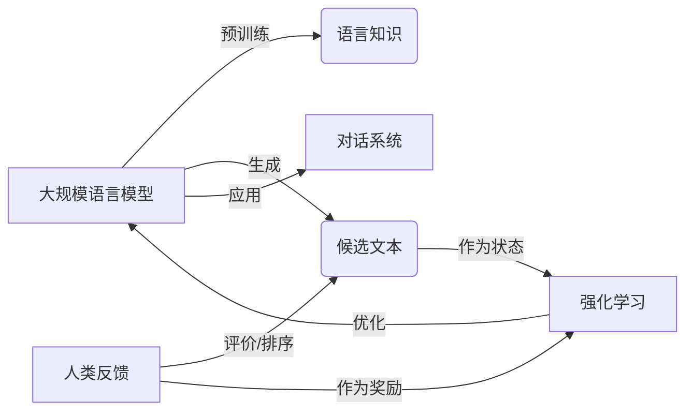
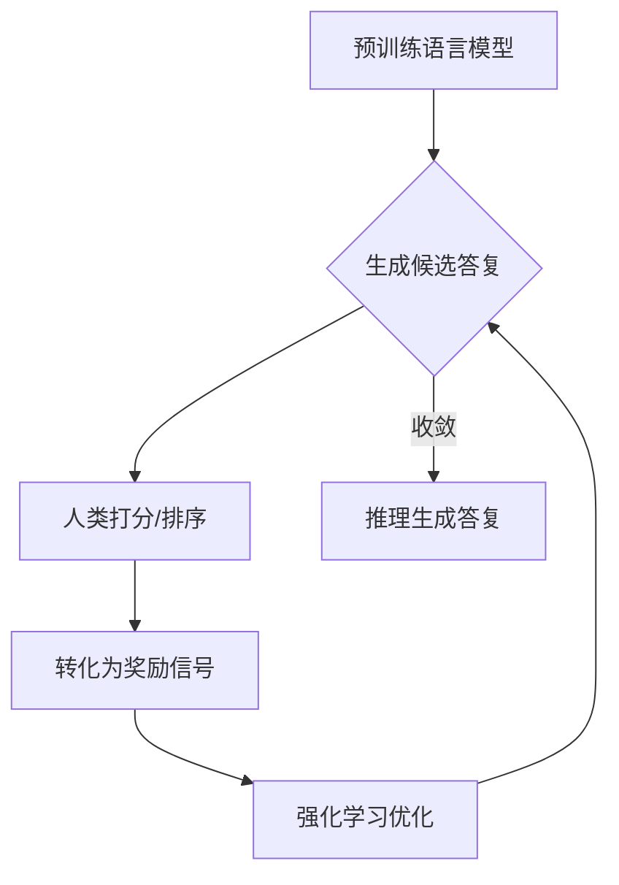

# 大规模语言模型从理论到实践 基于人类反馈的强化学习流程

关键词：大规模语言模型, 人类反馈, 强化学习, InstructGPT, 对话系统

## 1. 背景介绍
### 1.1  问题的由来
近年来,随着深度学习技术的飞速发展,大规模语言模型(Large Language Models, LLMs)在自然语言处理领域取得了突破性进展。LLMs 通过在海量文本数据上进行预训练,可以学习到丰富的语言知识和常识,在诸如问答、对话、文本生成等任务上表现出色。然而,现有的 LLMs 仍然存在一些局限性,例如生成的文本可能存在事实性错误、逻辑不一致、偏离主题等问题。如何进一步提升 LLMs 的性能,使其生成更加可靠、连贯、符合人类偏好的文本,成为了一个亟待解决的问题。

### 1.2  研究现状
为了解决上述问题,学术界和工业界提出了多种改进 LLMs 的方法。其中一个重要的研究方向是通过人类反馈来指导模型学习,即利用人类对模型生成文本的评价来优化模型。代表性的工作包括:
- InstructGPT[^1]:通过人工标注指令跟随数据集,并基于人类偏好对模型生成的回答进行排序,训练出能够听从指令、符合人类意图的语言模型。  
- WebGPT[^2]:引入基于网络搜索的信息检索能力,并利用人类反馈不断更新搜索策略,提升语言模型的知识获取和事实性。
- Delphi[^3]:构建了涵盖伦理道德领域的自然语言数据集,并通过人类反馈训练模型,使其能对伦理问题做出符合人类价值观的判断。

### 1.3  研究意义
本文旨在探讨如何将人类反馈与强化学习相结合,用于优化大规模语言模型。通过系统地总结现有工作,提出一个基于人类反馈的强化学习流程,并给出详细的算法和实践指南。这不仅有助于提升 LLMs 的性能,生成更加符合人类偏好的文本,而且对于发展安全可控的通用人工智能系统具有重要意义。同时,本文也为 LLMs 在智能对话、知识问答等领域的应用提供了新的思路。

### 1.4  本文结构
本文后续章节安排如下:第2节介绍相关的核心概念;第3节详细阐述基于人类反馈的强化学习算法原理;第4节给出算法所涉及的数学模型和公式推导;第5节通过代码实例演示算法的实现;第6节讨论该方法在实际场景中的应用;第7节推荐相关的学习资源和工具;第8节总结全文并展望未来研究方向;第9节列举一些常见问题解答。

## 2. 核心概念与联系
在讨论基于人类反馈的强化学习算法之前,我们首先需要了解几个核心概念:
- 大规模语言模型(LLMs):以 Transformer[^4] 为基础的深度神经网络模型,通过在大规模文本语料上进行预训练,可以学习到丰富的语言知识和生成能力。代表模型包括 GPT 系列[^5]、BERT[^6] 等。
- 人类反馈(Human Feedback):人类对模型生成文本的主观评价,可以是对文本质量的打分,也可以是对多个候选答案的排序。反馈信息可用于指导模型学习,优化其生成策略。
- 强化学习(Reinforcement Learning):一种机器学习范式,通过智能体(Agent)与环境交互,根据环境反馈的奖励信号来优化自身的决策策略[^7]。将人类反馈作为奖励,可用于训练语言模型生成符合人类偏好的文本。
- 对话系统(Dialogue System):一种人机交互系统,能够与人进行自然语言对话,完成诸如问答、任务指导、闲聊等功能[^8]。大规模语言模型是构建开放域对话系统的重要基础。

这些概念之间的关系如下图所示:

## 3. 核心算法原理 & 具体操作步骤
### 3.1  算法原理概述
基于人类反馈的强化学习算法的核心思想是:将人类对语言模型生成文本的偏好作为奖励信号,通过策略梯度等强化学习算法来优化语言模型的生成策略,使其能够生成符合人类偏好的高质量文本。该算法主要包括以下几个关键组件:
- 语言模型:以 Transformer 等神经网络为基础,通过在大规模语料上预训练得到,具备文本生成能力。
- 人类反馈模型:将人类对文本质量的打分或排序转化为数值化的奖励信号。可以是启发式规则,也可以是另一个机器学习模型。
- 强化学习算法:以语言模型生成的文本为状态,以人类反馈为奖励,通过策略梯度等优化算法来更新语言模型参数,提升其生成策略。
- 训练数据:由人工标注的指令、查询及其对应的高质量答复组成,用于指导语言模型学习。

### 3.2  算法步骤详解
基于人类反馈的强化学习算法的主要步骤如下:
1. 准备训练数据集,包括指令、查询及其人工标注的参考答复。
2. 预训练一个基础的语言模型,作为强化学习的初始策略。
3. 根据当前的语言模型策略,对训练集中的指令/查询生成多个候选答复。
4. 由人类对候选答复进行打分或排序,得到反馈信息。
5. 将人类反馈转化为奖励信号,例如排序中候选答复的相对位置。
6. 利用强化学习算法(如 PPO[^9])更新语言模型参数,最大化期望奖励。
7. 重复步骤 3-6,直到语言模型的生成质量达到预期要求。
8. 利用训练好的语言模型进行推理,生成最终的高质量答复。

算法流程可用下图表示:

### 3.3  算法优缺点
基于人类反馈的强化学习算法的优点包括:
- 可以显式地将人类偏好引入模型训练,生成更加符合人类期望的答复。
- 通过人类反馈不断迭代优化,可以持续提升语言模型的生成质量。
- 相比纯粹的监督学习,强化学习可以更好地处理数据稀疏、标注成本高等问题。

同时,该算法也存在一些局限性:
- 需要大量人工标注数据,对标注质量和成本要求较高。
- 人类反馈信息可能存在噪声和偏差,需要一定的质量控制手段。
- 算法训练时间较长,调参复杂度高,对计算资源要求较高。

### 3.4  算法应用领域
基于人类反馈的强化学习算法可应用于多个自然语言处理任务,包括:
- 开放域对话:生成更加自然、贴近人类偏好的对话响应。
- 问答系统:根据问题生成准确、完整、符合人类期望的答案。
- 文本生成:控制生成文本的主题、风格、逻辑一致性等属性。
- 机器翻译:生成更加流畅、忠实原文的翻译结果。

除此之外,该算法还可以扩展到其他需要引入人类知识和偏好的人工智能任务中,如决策优化、行为控制等。

## 4. 数学模型和公式 & 详细讲解 & 举例说明
### 4.1  数学模型构建
我们以策略梯度算法为例,介绍基于人类反馈的强化学习算法的数学模型。令 $\pi_\theta(a|s)$ 表示参数为 $\theta$ 的语言模型策略,其中 $s$ 为输入的指令/查询,$a$ 为生成的答复。该策略的期望奖励为:

$$J(\theta)=\mathbb{E}_{s \sim \rho^\pi, a \sim \pi_\theta}[R(s,a)]$$

其中 $\rho^\pi$ 为训练数据的分布,$R(s,a)$ 为人类对答复 $a$ 的打分或排序结果。我们的优化目标是最大化期望奖励 $J(\theta)$。

根据策略梯度定理[^10],参数 $\theta$ 的更新梯度为:

$$\nabla_\theta J(\theta) = \mathbb{E}_{s \sim \rho^\pi, a \sim \pi_\theta}[\nabla_\theta \log \pi_\theta(a|s) \cdot R(s,a)]$$

直观地说,该梯度将答复 $a$ 的对数概率 $\log \pi_\theta(a|s)$ 与其获得的人类反馈奖励 $R(s,a)$ 相乘,并对训练数据分布 $\rho^\pi$ 求期望,从而鼓励模型生成高质量、受人类青睐的答复。

### 4.2  公式推导过程
为了估计策略梯度,我们从训练数据分布 $\rho^\pi$ 中采样一个批次的指令/查询 $\{s_i\}_{i=1}^N$,然后从当前策略 $\pi_\theta$ 生成相应的答复 $\{a_i\}_{i=1}^N$,并获得人类反馈奖励 $\{R(s_i,a_i)\}_{i=1}^N$。梯度估计器为:

$$\hat{\nabla}_\theta J(\theta) = \frac{1}{N} \sum_{i=1}^N \nabla_\theta \log \pi_\theta(a_i|s_i) \cdot R(s_i,a_i)$$

利用链式法则,可以进一步将梯度分解为:

$$\nabla_\theta \log \pi_\theta(a_i|s_i) = \nabla_\theta \log p_\theta(a_i|s_i) = \frac{\nabla_\theta p_\theta(a_i|s_i)}{p_\theta(a_i|s_i)}$$

其中 $p_\theta(a_i|s_i)$ 为语言模型在给定指令/查询 $s_i$ 时生成答复 $a_i$ 的概率。假设语言模型的输出为词表上的概率分布,则有:

$$p_\theta(a_i|s_i) = \prod_{t=1}^T p_\theta(w_t|w_{<t},s_i)$$

其中 $w_t$ 为答复 $a_i$ 的第 $t$ 个词,$T$ 为答复长度。将其代入梯度公式,即可通过反向传播计算语言模型参数 $\theta$ 的更新量。

### 4.3  案例分析与讲解
下面我们以一个简单的例子来说明该算法的计算过程。假设训练数据只包含一个指令/查询 $s$,语言模型生成两个候选答复 $a_1$ 和 $a_2$,人类对它们的打分分别为 $R(s,a_1)=1$ 和 $R(s,a_2)=2$,即 $a_2$ 比 $a_1$ 更符合人类偏好。

首先,我们计算语言模型生成这两个答复的概率:

$$p_\theta(a_1|s) = 0.4, \quad p_\theta(a_2|s) = 0.6$$

然后,计算策略梯度估计器:

$$\begin{aligned}
\hat{\nabla}_\theta J(\theta) &= \nabla_\theta \log \pi_\theta(a_1|s) \cdot R(s,a_1) + \nabla_\theta \log \pi_\theta(a_2|s) \cdot R(s,a_2) \\
&= \frac{\nabla_\theta p_\theta(a_1|s)}{p_\theta(a_1|s)} \cdot 1 