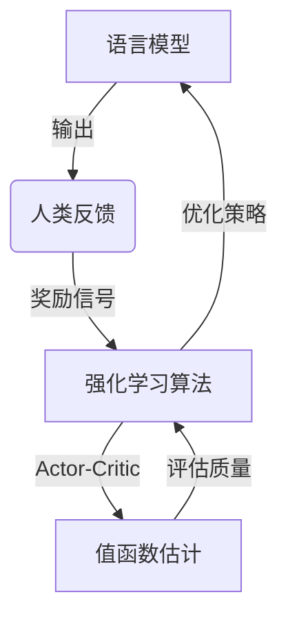

# 大规模语言模型从理论到实践 基于人类反馈的强化学习流程

## 1. 背景介绍

### 1.1 问题的由来

随着人工智能技术的不断发展,大规模语言模型在自然语言处理领域取得了令人瞩目的成就。然而,训练这些庞大的模型需要消耗大量的计算资源,并且存在一些潜在的风险和挑战,例如模型输出的不确定性、偏差和安全性问题等。因此,如何有效地控制和优化这些语言模型的行为,使其能够根据人类的反馈进行持续学习和改进,成为了当前研究的重点课题。

### 1.2 研究现状

目前,基于人类反馈的强化学习方法被广泛应用于语言模型的优化和控制。这种方法通过收集人类对模型输出的评价反馈,并将这些反馈作为奖励信号,来指导模型进行策略更新和参数调整。一些典型的强化学习算法,如策略梯度算法(Policy Gradient)、Actor-Critic算法等,已经被成功地应用于语言模型的训练过程中。

然而,现有的基于人类反馈的强化学习方法还存在一些局限性和挑战,例如:

1. 反馈收集效率低下,需要大量的人力成本。
2. 反馈的质量和一致性难以保证,存在主观偏差。
3. 算法收敛性能和稳定性有待提高。
4. 难以处理复杂的语境和长文本输入。
5. 缺乏有效的方法来解释和理解模型的决策过程。

### 1.3 研究意义

通过研究和改进基于人类反馈的强化学习流程,我们可以更好地控制和优化大规模语言模型的行为,提高其输出的质量、一致性和安全性。这不仅有助于提升语言模型在自然语言处理任务中的性能,还可以促进人工智能系统与人类之间的互动和协作,从而推动人工智能技术的发展和应用。

### 1.4 本文结构

本文将全面介绍基于人类反馈的强化学习流程在大规模语言模型中的理论和实践。我们将首先阐述核心概念和相关联系,然后深入探讨核心算法的原理和具体操作步骤。接下来,我们将详细讲解相关的数学模型和公式,并通过案例分析加深理解。此外,我们还将提供项目实践的代码实例和详细解释说明。最后,我们将探讨该方法在实际应用场景中的应用,介绍相关的工具和资源,并总结未来的发展趋势和面临的挑战。

## 2. 核心概念与联系

在介绍基于人类反馈的强化学习流程之前,我们需要先了解以下几个核心概念:

1. **语言模型(Language Model)**: 语言模型是一种用于预测序列中下一个元素(通常是单词或字符)的概率分布的统计模型。它广泛应用于自然语言处理任务,如机器翻译、文本生成、语音识别等。

2. **强化学习(Reinforcement Learning)**: 强化学习是一种基于环境反馈的机器学习范式,其目标是通过试错和奖惩机制,学习一个策略(policy),使得智能体(agent)在与环境(environment)的互动中获得最大的累积奖励(reward)。

3. **人类反馈(Human Feedback)**: 在语言模型的优化过程中,人类反馈指的是人类对模型输出的评价和反馈,通常包括对输出质量、一致性、相关性等方面的评分或标注。

4. **策略梯度(Policy Gradient)**: 策略梯度是一种强化学习算法,它通过直接优化策略参数,使得策略在给定环境下获得的期望奖励最大化。

5. **Actor-Critic**: Actor-Critic是一种结合了策略梯度和值函数估计的强化学习算法,其中Actor负责选择动作,而Critic负责评估动作的质量,从而加速策略的学习过程。

这些核心概念之间存在密切的联系。语言模型作为智能体,通过与人类交互获取反馈,并将这些反馈作为奖励信号,应用强化学习算法(如策略梯度或Actor-Critic)来优化模型的策略,从而提高模型的性能和输出质量。



## 3. 核心算法原理 & 具体操作步骤

### 3.1 算法原理概述

基于人类反馈的强化学习流程可以概括为以下几个关键步骤:

1. **初始化语言模型**: 首先,我们需要初始化一个预训练的语言模型,作为强化学习过程的起点。这个模型可以是基于transformer架构的大型语言模型,如GPT、BERT等。

2. **与人类交互并收集反馈**: 将语言模型部署到实际的应用场景中,并与人类用户进行交互。在交互过程中,收集人类对模型输出的评价反馈,作为奖励信号。

3. **构建奖励模型**: 根据收集到的人类反馈,构建一个奖励模型(Reward Model),用于估计模型输出的质量分数或奖励值。

4. **应用强化学习算法**: 将语言模型视为强化学习中的智能体,将环境设置为与人类交互的场景。利用奖励模型计算的奖励值,应用策略梯度或Actor-Critic等强化学习算法,优化语言模型的策略参数。

5. **策略更新和模型微调**: 根据强化学习算法的优化结果,更新语言模型的策略参数,并对模型进行微调,使其能够生成更高质量的输出。

6. **迭代优化**: 重复步骤2到5,持续收集人类反馈、优化奖励模型和语言模型策略,直到达到预期的性能水平。

这个过程形成了一个闭环,语言模型通过不断地与人类交互、获取反馈并进行优化,逐步提高自身的性能和输出质量。

### 3.2 算法步骤详解

下面我们将详细介绍基于人类反馈的强化学习流程中的每一个步骤。

#### 3.2.1 初始化语言模型

在强化学习过程的起点,我们需要初始化一个预训练的语言模型。这个模型通常是基于transformer架构的大型语言模型,如GPT、BERT等。这些模型已经在大规模语料库上进行了预训练,具备一定的语言理解和生成能力。

初始化语言模型的代码示例(使用Hugging Face的Transformers库):

```python
from transformers import AutoModelForCausalLM, AutoTokenizer

model_name = "gpt2"
tokenizer = AutoTokenizer.from_pretrained(model_name)
model = AutoModelForCausalLM.from_pretrained(model_name)
```

在这个示例中,我们加载了GPT-2模型及其对应的tokenizer。初始化后的模型将作为强化学习过程的起点。

#### 3.2.2 与人类交互并收集反馈

将初始化的语言模型部署到实际的应用场景中,如对话系统、文本生成任务等,并与人类用户进行交互。在交互过程中,收集人类对模型输出的评价反馈,作为奖励信号。

收集人类反馈的方式有多种,例如:

1. **评分反馈**: 让人类对模型输出进行评分,如1-5分等级制。
2. **二元反馈**: 人类对模型输出进行正面或负面的二元评价。
3. **自由文本反馈**: 人类用自然语言对模型输出进行评论和反馈。

无论采用何种反馈方式,都需要将收集到的反馈数据进行适当的预处理和标准化,以便后续构建奖励模型。

#### 3.2.3 构建奖励模型

根据收集到的人类反馈数据,我们需要构建一个奖励模型(Reward Model),用于估计模型输出的质量分数或奖励值。奖励模型的输入是语言模型的输出,输出是对应的奖励值。

构建奖励模型的方法有多种,例如:

1. **监督学习方法**: 将人类反馈数据作为标签,训练一个回归模型或分类模型,用于预测奖励值。
2. **无监督学习方法**: 利用语言模型的输出和参考答案之间的相似度或其他指标,构建一个无监督的奖励函数。
3. **基于规则的方法**: 根据一些预定义的规则和启发式方法,计算模型输出的奖励值。

无论采用何种方法,奖励模型的目标都是能够准确地估计模型输出的质量,为强化学习过程提供有效的奖励信号。

#### 3.2.4 应用强化学习算法

将语言模型视为强化学习中的智能体,将与人类交互的场景设置为环境。利用奖励模型计算的奖励值,应用策略梯度或Actor-Critic等强化学习算法,优化语言模型的策略参数。

**策略梯度算法**

策略梯度算法直接优化语言模型的策略参数,使得在给定环境下获得的期望奖励最大化。算法的核心思想是通过梯度上升法,沿着期望奖励的梯度方向更新策略参数。

策略梯度算法的伪代码如下:

```
初始化策略参数 θ
repeat:
    采样轨迹 τ ~ π_θ(τ)
    计算轨迹的奖励 R(τ)
    更新策略参数: θ = θ + α * ∇_θ log π_θ(τ) * R(τ)
until convergence
```

其中,π_θ(τ)表示当前策略下采样轨迹τ的概率,R(τ)表示轨迹τ的奖励值,α是学习率。

**Actor-Critic算法**

Actor-Critic算法结合了策略梯度和值函数估计,通过引入一个critic网络来评估动作的质量,从而加速策略的学习过程。

Actor-Critic算法的伪代码如下:

```
初始化Actor策略参数 θ 和 Critic值函数参数 w
repeat:
    采样轨迹 τ ~ π_θ(τ)
    计算轨迹的奖励 R(τ)
    计算Advantage估计 A(s,a) = R(τ) - V_w(s)
    更新Critic参数: w = w + β * ∇_w (R(τ) - V_w(s))^2
    更新Actor参数: θ = θ + α * ∇_θ log π_θ(a|s) * A(s,a)
until convergence
```

其中,V_w(s)表示Critic网络对状态s的值函数估计,A(s,a)表示在状态s下执行动作a的Advantage估计,α和β分别是Actor和Critic的学习率。

通过应用这些强化学习算法,语言模型的策略参数将不断被优化,使得模型在与人类交互的场景中获得更高的奖励,从而提高模型的输出质量。

### 3.3 算法优缺点

基于人类反馈的强化学习流程在优化语言模型时具有以下优点:

1. **直接优化模型输出质量**: 通过将人类反馈作为奖励信号,算法直接优化模型输出的质量,而不是间接地优化一些代理目标(如最大似然估计)。
2. **持续学习和改进**: 算法形成了一个闭环,语言模型可以通过不断地与人类交互、获取反馈并进行优化,持续学习和改进自身的性能。
3. **融合人类知识和偏好**: 算法将人类的知识和偏好融入到模型的优化过程中,使得模型的输出更符合人类的期望和需求。
4. **适用于各种任务和场景**: 该流程可以应用于各种自然语言处理任务和应用场景,如对话系统、文本生成、机器翻译等。

然而,该算法也存在一些局限性和挑战:

1. **反馈收集效率低下**: 收集高质量的人类反馈数据是一个耗时耗力的过程,需要大量的人力成本。
2. **反馈质量和一致性难以保证**: 人类反馈存在主观偏差,不同人对同一输出的评价可能存在