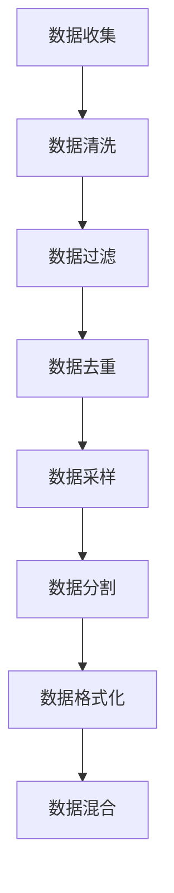

# 大规模语言模型从理论到实践：大语言模型预训练数据

## 1. 背景介绍

### 1.1 问题的由来

在自然语言处理(NLP)领域中,大规模语言模型已经成为一种非常流行和有影响力的技术。这些模型通过在大量文本数据上进行预训练,学习到了丰富的语言知识和上下文表示能力,可以广泛应用于下游任务,例如机器翻译、问答系统、文本摘要等。然而,训练这些大型模型需要消耗大量的计算资源,并且需要高质量、多样化的预训练数据作为输入。因此,如何高效地构建和利用大规模预训练数据集成为了一个关键问题。

### 1.2 研究现状

目前,主流的大型语言模型预训练数据集包括:

- **书籍语料库**:包含大量书籍文本,如BookCorpus、PG-19等。
- **网页爬取语料库**:从互联网上爬取的网页文本,如CommonCrawl、CC-News等。
- **维基百科语料库**:来自维基百科的文章,如WikiText-103等。
- **论文语料库**:包含大量论文文本,如arXiv、PubMed等。

这些数据集在规模、质量和多样性方面存在一定差异,研究人员通常会对它们进行清洗、过滤和组合,以构建更加优质的预训练数据集。

### 1.3 研究意义

高质量的预训练数据对于训练出性能良好的大型语言模型至关重要。合理构建和利用预训练数据集,可以提高模型的泛化能力,增强其在下游任务中的表现。此外,不同领域和任务可能需要特定类型的预训练数据,因此研究如何根据需求构建定制化的预训练数据集也具有重要意义。

### 1.4 本文结构

本文将全面探讨大规模语言模型预训练数据的理论和实践。我们将首先介绍核心概念和相关技术,然后深入探讨预训练数据构建的核心算法原理和数学模型,并通过实际案例进行详细分析和讲解。接下来,我们将提供代码实例和开发环境搭建指南,帮助读者动手实践。最后,我们将讨论预训练数据在实际应用中的场景,以及未来的发展趋势和挑战。

## 2. 核心概念与联系

在探讨大规模语言模型预训练数据之前,我们需要先了解一些核心概念和相关技术:

1. **自然语言处理(NLP)**: 自然语言处理是一个跨学科领域,旨在使计算机能够理解和生成人类语言。它包括多个子任务,如机器翻译、文本分类、问答系统等。

2. **语言模型**: 语言模型是NLP中一个基础技术,它通过学习大量文本数据,捕捉语言的统计规律,从而能够预测下一个单词或字符的概率。传统的语言模型通常基于N-gram或神经网络。

3. **预训练(Pre-training)**: 预训练是一种迁移学习技术,通过在大量通用数据上训练模型,使其学习到通用的语言知识和表示能力,然后将这些知识迁移到下游任务上进行微调(fine-tuning),从而提高模型性能。

4. **自注意力机制(Self-Attention)**: 自注意力机制是一种用于捕捉长距离依赖关系的神经网络结构,它被广泛应用于大型语言模型中,如Transformer模型。

5. **Transformer模型**: Transformer是一种全新的基于自注意力机制的序列到序列(Seq2Seq)模型,它在机器翻译等任务上表现出色,并成为了当前主流的大型语言模型架构。

6. **BERT(Bidirectional Encoder Representations from Transformers)**: BERT是一种基于Transformer的双向编码器语言模型,它通过掩蔽语言模型(Masked Language Model)和下一句预测(Next Sentence Prediction)任务进行预训练,在多个NLP任务上取得了state-of-the-art的表现。

7. **GPT(Generative Pre-trained Transformer)**: GPT是一种基于Transformer的单向解码器语言模型,它通过标准的语言模型任务进行预训练,可以生成连贯、流畅的文本。GPT-3是其最新版本,具有惊人的文本生成能力。

这些概念和技术为大规模语言模型预训练数据的研究奠定了基础。接下来,我们将深入探讨预训练数据构建的核心算法原理和数学模型。

## 3. 核心算法原理与具体操作步骤

### 3.1 算法原理概述

构建高质量的大规模语言模型预训练数据集需要遵循以下核心原则:

1. **数据规模**: 预训练数据集应该足够大,以确保模型能够学习到丰富的语言知识和上下文表示。通常需要数十亿甚至上百亿个单词的文本数据。

2. **数据质量**: 预训练数据集应该包含高质量的文本,避免过多的噪声数据,如垃圾信息、错误拼写等。通常需要进行数据清洗和过滤。

3. **数据多样性**: 预训练数据集应该覆盖多种领域和主题,以提高模型的泛化能力。可以从不同来源(如书籍、网页、论文等)收集数据。

4. **数据平衡性**: 预训练数据集中不同类型的文本应该保持适当的比例,避免过度偏向某一类型。

5. **数据隐私和版权**: 在构建预训练数据集时,需要注意数据隐私和版权问题,遵守相关法律法规。

基于这些原则,我们可以设计出高效的算法来构建大规模语言模型预训练数据集。下面我们将详细介绍算法的具体步骤。

### 3.2 算法步骤详解

构建大规模语言模型预训练数据集的算法可以分为以下几个主要步骤:

1. **数据收集**

   从多个来源收集原始文本数据,包括书籍、网页、论文、新闻等。可以使用网络爬虫、API等方式自动化收集数据。

2. **数据清洗**

   对收集到的原始数据进行清洗,去除HTML标签、垃圾信息、错误拼写等噪声数据。可以使用正则表达式、自然语言处理工具等方法进行清洗。

3. **数据过滤**

   根据预定义的规则对清洗后的数据进行过滤,去除不符合要求的数据。例如,可以设置文本长度、语言类型、主题领域等过滤条件。

4. **数据去重**

   由于数据来源的重叠,预训练数据集中可能存在重复的文本。需要进行去重操作,避免模型在训练时重复学习相同的数据。

5. **数据采样**

   为了保证预训练数据集的多样性和平衡性,可以对不同类型的文本进行采样,控制它们在数据集中的比例。

6. **数据分割**

   将清洗、过滤和采样后的数据分割成多个子集,方便后续的并行处理和分布式训练。

7. **数据格式化**

   将分割后的数据转换为模型可接受的格式,例如将文本转换为字符或字词序列,添加特殊标记等。

8. **数据混合**

   最后,将格式化后的多个子集合并,构建出最终的大规模预训练数据集。

在实际操作中,这些步骤可能会根据具体情况进行调整和优化。例如,可以在数据收集阶段就进行初步的清洗和过滤,减少后续处理的工作量。或者,可以在数据格式化阶段添加一些数据增强技术,如随机遮蔽、同义词替换等,以增强模型的泛化能力。

### 3.3 算法优缺点

构建大规模语言模型预训练数据集的算法具有以下优点:

- **可扩展性强**: 算法可以轻松地扩展到更大规模的数据集,只需增加计算资源即可。
- **灵活性高**: 算法中的各个步骤都可以根据需求进行定制和优化,适应不同的场景和要求。
- **质量可控**: 通过设置合理的过滤规则和采样策略,可以有效控制预训练数据集的质量。

但同时,该算法也存在一些缺点:

- **计算资源消耗大**: 处理大规模数据集需要消耗大量的计算资源,包括CPU、内存和存储空间。
- **隐私和版权风险**: 在数据收集和处理过程中,可能会涉及隐私和版权问题,需要格外小心。
- **噪声数据难以完全避免**: 即使经过多重清洗和过滤,预训练数据集中仍可能存在一些噪声数据。

### 3.4 算法应用领域

构建大规模语言模型预训练数据集的算法可以广泛应用于自然语言处理领域,为训练各种大型语言模型提供高质量的数据支持。具体应用场景包括但不限于:

- **机器翻译**: 通过预训练数据集训练的大型语言模型可以显著提高机器翻译的质量和准确性。
- **文本摘要**: 预训练模型能够很好地捕捉文本的语义信息,有助于生成高质量的文本摘要。
- **问答系统**: 预训练模型可以在大量文本数据上学习知识,为构建智能问答系统提供基础。
- **自动写作**: 基于预训练模型的自动写作系统可以生成连贯、流畅的文本内容。
- **情感分析**: 预训练模型可以捕捉文本中的情感倾向,应用于情感分析和观点挖掘任务。
- **语音识别**: 预训练模型可以提供强大的语言建模能力,提高语音识别的准确率。

除了自然语言处理领域,构建大规模预训练数据集的算法也可以推广应用于其他领域,如计算机视觉、推荐系统等,为训练大型模型提供高质量的数据支持。

## 4. 数学模型和公式详细讲解与举例说明

在构建大规模语言模型预训练数据集的过程中,我们需要使用一些数学模型和公式来量化和优化数据的质量和分布。下面我们将详细介绍这些模型和公式,并通过具体案例进行讲解和说明。

### 4.1 数学模型构建

#### 4.1.1 数据熵模型

数据熵是衡量数据集多样性和不确定性的一个重要指标。对于一个包含 $N$ 个不同类型文本的预训练数据集 $D$,其熵 $H(D)$ 可以定义为:

$$H(D) = -\sum_{i=1}^{N} p(x_i) \log p(x_i)$$

其中 $p(x_i)$ 表示数据集中第 $i$ 类文本的概率,可以通过计数得到。熵值越高,说明数据集的多样性越好。

我们可以将数据熵作为一个优化目标,在数据采样阶段调整不同类型文本的比例,使得数据熵最大化,从而提高预训练数据集的多样性。

#### 4.1.2 数据质量评分模型

为了量化预训练数据集的质量,我们可以构建一个评分模型,对每个文本样本进行打分。评分模型可以考虑多个因素,如语法正确性、语义连贯性、主题相关性等。

假设我们有一个评分函数 $f(x)$,它可以为任意文本 $x$ 赋予一个 $[0,1]$ 区间内的分数,其中 $1$ 表示最高质量。那么,对于整个预训练数据集 $D$,我们可以定义其质量评分 $Q(D)$ 为所有样本评分的加权平均:

$$Q(D) = \frac{1}{|D|}\sum_{x \in D} f(x) \cdot \omega(x)$$

其中 $\omega(x)$ 是样本 $x$ 的权重,可以根据样本长度、来源等因素进行设置。我们的目标是最