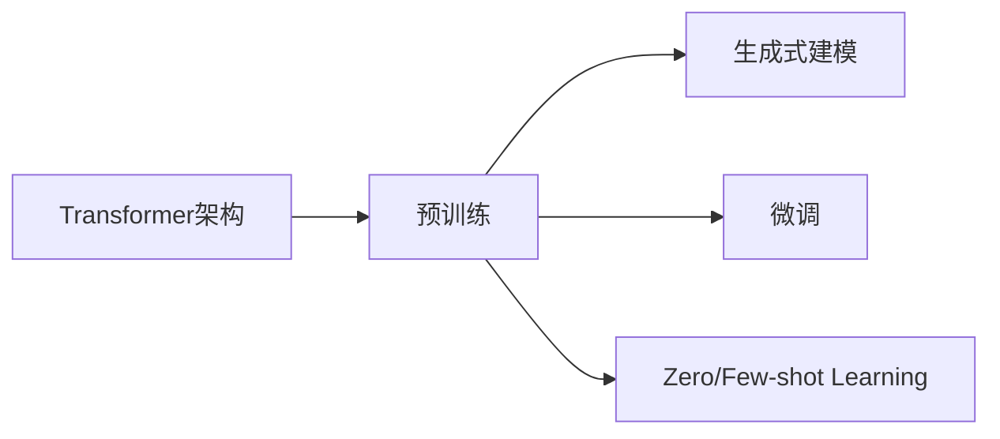

# 大规模语言模型从理论到实践 生成式预训练语言模型GPT

作者：禅与计算机程序设计艺术 / Zen and the Art of Computer Programming

## 1. 背景介绍

### 1.1 问题的由来

随着人工智能技术的飞速发展,自然语言处理(NLP)领域也取得了突破性的进展。其中,大规模语言模型的出现为NLP带来了革命性的变革。传统的NLP方法主要基于特定任务的有监督学习,需要大量人工标注的训练数据,且难以泛化到其他任务。而大规模语言模型通过在海量无标注文本上进行自监督预训练,可以学习到语言的通用表示,再通过少量微调即可应用于下游任务,极大提升了NLP的性能和效率。

### 1.2 研究现状

目前,业界主流的大规模语言模型包括谷歌的BERT、OpenAI的GPT系列、Facebook的RoBERTa等。其中,GPT(Generative Pre-trained Transformer)作为生成式预训练语言模型的代表,以其强大的语言生成能力和广泛的应用场景而备受关注。GPT模型通过在大规模无标注文本语料上进行自回归语言建模的预训练,可以生成连贯流畅、语法正确、富有创意的文本。GPT-3作为GPT系列的最新成果,其参数量高达1750亿,在许多NLP任务上接近甚至超越人类水平,引发了学术界和工业界的广泛讨论。

### 1.3 研究意义 

深入研究和理解GPT等大规模语言模型的原理和实践,对于推动NLP技术的进步具有重要意义。一方面,GPT展示了海量数据和算力对于提升语言理解和生成能力的重要性,为构建更加智能的对话系统、写作助手、知识问答等应用奠定了基础。另一方面,GPT的突破性成果也引发了关于通用人工智能、机器创造力、AI安全等问题的思考和讨论。探索GPT的内在机制和外在影响,有助于我们把握人工智能发展的方向和挑战。

### 1.4 本文结构

本文将从理论到实践的角度,全面介绍生成式预训练语言模型GPT。第2部分阐述GPT的核心概念与联系。第3部分详细讲解GPT的核心算法原理和具体操作步骤。第4部分建立GPT的数学模型,推导相关公式,并给出案例分析。第5部分通过代码实例,演示如何实现和训练GPT模型。第6部分展望GPT在各领域的实际应用场景。第7部分推荐GPT相关的学习资源和开发工具。第8部分总结GPT的研究成果、发展趋势和面临的挑战。第9部分附录解答GPT的常见问题。

## 2. 核心概念与联系

GPT的核心概念包括:

- Transformer:GPT采用Transformer作为基本的神经网络架构,利用自注意力机制建模文本序列的长程依赖关系。
- 预训练(Pre-training):GPT在大规模无标注语料上进行自监督学习,通过自回归语言建模任务学习通用的语言表示。  
- 生成式(Generative):GPT是一种生成式语言模型,可以根据给定的上下文生成后续的连贯文本。
- 微调(Fine-tuning):GPT可以在预训练的基础上,通过少量特定任务的有标注数据进行微调,快速适应下游应用。
- Zero/Few-shot Learning:得益于强大的语言理解和生成能力,GPT可以在没有或很少样本的情况下,通过任务描述直接进行推理。

这些概念之间紧密相关,共同构成了GPT的理论基础和方法论。Transformer提供了建模长文本的有效架构,预训练使GPT学习到语言的通用表示,生成式建模赋予GPT语言创作的能力,微调和零/少样本学习则体现了GPT的快速适应和泛化能力。

## 3. 核心算法原理 & 具体操作步骤

### 3.1 算法原理概述

GPT的核心是基于Transformer的自回归语言模型。给定一个文本序列$x=(x_1,x_2,...,x_T)$,GPT的目标是最大化如下的似然概率:

$$P(x)=\prod_{t=1}^{T}P(x_t|x_{1:t-1})$$

其中$x_{1:t-1}$表示$x_t$之前的所有token。GPT通过Transformer的解码器结构来建模这个条件概率。具体地,GPT的基本单元是自注意力层和前馈神经网络层的堆叠。

### 3.2 算法步骤详解

1. 输入表示:将文本序列$x$通过Embedding层映射为实值向量表示$E(x)$,并加入位置编码。

2. 自注意力:通过计算$Q$,$K$,$V$三个矩阵,得到每个位置关注其他位置的权重,并加权求和得到新的表示。

$$Attention(Q,K,V)=softmax(\frac{QK^T}{\sqrt{d_k}})V$$

3. 前馈神经网络:通过两层全连接层对自注意力的输出进行非线性变换。

$$FFN(x)=max(0,xW_1+b_1)W_2+b_2$$

4. Layer Norm和残差连接:每个子层之后进行Layer Norm和残差连接,提高训练稳定性。

$$x'=LayerNorm(x+Sublayer(x))$$

5. 堆叠多层:重复步骤2-4多次,得到Transformer解码器的最终输出。

6. 语言模型头:对Transformer的输出进行线性变换和softmax,得到下一个token的概率分布。

$$P(x_t|x_{1:t-1})=softmax(E(x_{1:t-1})W_e^T)$$

其中$W_e$是token embedding矩阵。

7. 最大似然训练:以最大化对数似然为目标,利用梯度下降等优化算法进行训练。

$$L(\theta)=\sum_{i=1}^{N}\log P(x^{(i)};\theta)$$

### 3.3 算法优缺点

GPT的优点包括:
- 通过在大规模语料上的预训练,可以学习到语言的通用表示,具有强大的语言理解和生成能力。
- 采用Transformer架构,可以有效建模长文本序列,捕捉长距离依赖关系。
- 通过微调和零/少样本学习,可以快速适应下游任务,大幅减少标注数据的需求。
- 生成式建模使其可以创作出连贯、流畅、富有创意的文本。

GPT的缺点包括:  
- 需要海量的无标注数据和算力进行预训练,训练成本高昂。
- 模型参数量巨大,推理和部署的计算开销大。
- 难以对生成的文本进行细粒度控制和解释。
- 可能生成有偏见、错误、不恰当的内容。

### 3.4 算法应用领域

GPT可以应用于各种NLP任务,如:
- 文本生成:小说、新闻、诗歌、对话等创意写作
- 文本摘要:自动生成长文档的摘要
- 机器翻译:无需平行语料,实现零样本翻译
- 问答系统:根据给定问题生成自然语言答案
- 语义理解:文本分类、情感分析、命名实体识别等
- 代码生成:根据自然语言描述自动生成代码

## 4. 数学模型和公式 & 详细讲解 & 举例说明

### 4.1 数学模型构建

GPT的数学模型可以用如下的公式来表示:

$$P(x_t|x_{1:t-1})=softmax(E(x_{1:t-1})W_e^T)$$

$$E(x_{1:t-1})=Transformer(Embedding(x_{1:t-1}))$$

其中,$Embedding$将token映射为实值向量,$Transformer$对应Transformer解码器的多层堆叠,$W_e$是token embedding矩阵。

整个模型的训练目标是最小化负对数似然损失:

$$L(\theta)=-\sum_{i=1}^{N}\log P(x^{(i)};\theta)$$

其中$\theta$是模型参数,$x^{(i)}$是第$i$个训练样本。

### 4.2 公式推导过程

Transformer解码器的核心是自注意力机制和前馈神经网络。对于第$l$层的第$i$个位置,其自注意力的计算过程为:

$$Q_i^l=E(x_i)W_Q^l, K_i^l=E(x_i)W_K^l, V_i^l=E(x_i)W_V^l$$

$$head_i^l=Attention(Q_i^l,K_{1:i}^l,V_{1:i}^l)$$

$$MultiHead(E(x_i))=Concat(head_1^l,...,head_h^l)W_O^l$$

其中,$W_Q^l,W_K^l,W_V^l,W_O^l$是可学习的参数矩阵,$h$是自注意力头的数量。

前馈神经网络对应的公式为:

$$FFN(x)=max(0,xW_1+b_1)W_2+b_2$$

将自注意力和前馈神经网络的计算结果经过Layer Norm和残差连接,得到第$l$层的输出:

$$x'^l=LayerNorm(MultiHead(E(x^{l-1}))+E(x^{l-1}))$$

$$x^l=LayerNorm(FFN(x'^l)+x'^l)$$

最终,Transformer解码器的输出即为最后一层$x^L$。

### 4.3 案例分析与讲解

以英文文本生成为例,假设我们要让GPT续写以下句子:

"The quick brown fox jumps over the lazy"

首先,将该句子转化为token序列作为GPT的输入:

$x=(x_1=\text{The},x_2=\text{quick},x_3=\text{brown},x_4=\text{fox},x_5=\text{jumps},x_6=\text{over},x_7=\text{the},x_8=\text{lazy})$

然后,GPT通过Embedding层将每个token映射为实值向量,并加入位置编码:

$E(x)=(e(x_1),e(x_2),...,e(x_8))$

接下来,GPT的Transformer解码器对$E(x)$进行自注意力和前馈神经网络的计算,得到最后一层的输出$x^L$。

最后,GPT的语言模型头将$x^L$线性变换并softmax,得到下一个token的概率分布:

$P(x_9|x_{1:8})=softmax(x^LW_e^T)$

从概率分布中采样或选择概率最大的token作为生成的下一个词,例如"dog"。将生成的词加入到输入序列中,重复上述过程,直到生成所需长度的文本或遇到终止符。

最终得到续写的结果:"The quick brown fox jumps over the lazy dog"。

### 4.4 常见问题解答

Q:GPT能否处理不定长的输入序列?

A:GPT采用Transformer的解码器结构,通过位置编码和自注意力机制,可以处理任意长度的输入序列。在训练时,可以对过长的序列进行截断。在推理时,可以通过滑动窗口的方式生成任意长度的文本。

Q:GPT的生成结果是否具有随机性?  

A:GPT生成文本时,通常采用随机采样的方式从概率分布中选择下一个token。不同的随机种子会导致生成的文本不同。此外,可以通过调节采样的温度参数,控制生成结果的随机性和多样性。温度越高,生成的文本越具有创意和不确定性;温度越低,生成的文本越保守和确定性。

Q:如何避免GPT生成重复、无意义的内容?

A:可以采取以下策略来改进GPT的生成质量:
1)在解码时引入惩罚重复的项,如覆盖度惩罚。
2)对生成的内容进行反向语言模型打分,过滤低质量的文本。
3)通过人类反馈来优化生成结果,如采用强化学习的方法。
4)对输入进行更多的约束和引导,如提供关键词、句式等。
5)在训练语料中加入高质量的文本,提高生成内容的水平。

## 5. 项目实践：代码实例和详细解释说明

### 5.1 开发环境搭建

首先,我们需要搭