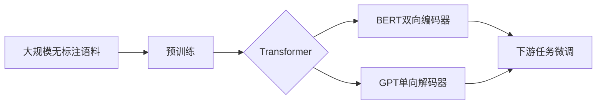

# 大规模预训练语言模型：BERT与GPT争锋

## 1. 背景介绍

### 1.1 问题的由来

近年来,随着深度学习技术的飞速发展,自然语言处理(NLP)领域取得了突破性进展。其中,预训练语言模型的出现标志着NLP进入了一个新的时代。预训练语言模型通过在大规模无标注文本语料上进行自监督学习,可以学习到语言的通用表示,从而在下游NLP任务上取得优异表现。

### 1.2 研究现状 

目前,业界主流的预训练语言模型主要包括BERT(Bidirectional Encoder Representations from Transformers)和GPT(Generative Pre-trained Transformer)两大类。BERT由Google于2018年提出,通过双向编码器学习文本的上下文表示。而GPT系列模型则由OpenAI开发,通过单向Transformer解码器生成文本。这两类模型在学习方式和应用场景上各有侧重。

### 1.3 研究意义

深入研究BERT和GPT的原理、异同点以及优缺点,对于理解大规模预训练语言模型的发展脉络和技术细节具有重要意义。通过系统梳理和比较分析,可以更好地把握这一领域的研究现状和未来趋势,为后续的模型改进和创新提供参考。

### 1.4 本文结构

本文将围绕BERT和GPT两大类预训练语言模型展开深入探讨。首先,我们将介绍它们的核心概念和内在联系。然后重点阐述它们的模型结构、训练方法和应用场景。接着通过数学模型和代码实例加深理解。最后总结当前的局限性和未来的发展方向。

## 2. 核心概念与联系

预训练(Pre-training):指在大规模无标注语料上进行自监督学习,学习文本的通用表示。这是BERT和GPT的共同特点。

语言模型(Language Model):用于建模文本序列生成概率的模型。GPT是典型的语言模型,而BERT则兼具MLM和NSP两种语言建模任务。

Transformer:一种基于自注意力机制的神经网络结构。BERT和GPT都基于Transformer构建,但BERT使用双向编码器,GPT使用单向解码器。

微调(Fine-tuning):将预训练模型应用到下游任务时,在任务特定的数据集上进行监督学习。这是预训练语言模型的重要应用方式。

BERT和GPT的内在联系可以用下面的Mermaid流程图表示:



## 3. 核心算法原理 & 具体操作步骤

### 3.1 算法原理概述

BERT和GPT的核心是基于Transformer的自注意力机制和预训练范式。

BERT的预训练任务包括:
- MLM(Masked Language Model):随机遮挡部分词汇,预测被遮挡词的概率分布。
- NSP(Next Sentence Prediction):预测两个句子是否前后相邻。

GPT的预训练任务是传统的语言模型:
- 给定前面的词,预测下一个词的概率。

### 3.2 算法步骤详解

BERT的训练步骤如下:

1. 构建输入:对文本进行WordPiece分词,加入[CLS]和[SEP]特殊符号,按照预定义概率对词进行遮挡。
2. Embedding:将词、位置、段落三种嵌入相加作为输入表示。
3. Transformer编码:通过多层Transformer的自注意力和前馈计算,得到每个位置的上下文表示。
4. MLM预测:将遮挡位置对应的Transformer输出送入全连接层和Softmax,预测词表上每个词的概率。 
5. NSP预测:将[CLS]位置的Transformer输出送入全连接层和Sigmoid,预测两个句子是否相邻。

GPT的训练步骤如下:

1. 构建输入:对文本进行BPE分词,加入位置编码。
2. Transformer解码:通过多层Transformer的自注意力和前馈计算,得到每个位置的表示。
3. 语言模型预测:将每个位置的Transformer输出送入全连接层和Softmax,预测下一个词的概率分布。

### 3.3 算法优缺点

BERT的优点:
- 双向建模,可以更好地捕捉上下文信息。
- 引入MLM和NSP任务,增强了模型的理解能力。
- 在多个NLP任务上取得SOTA效果。

BERT的缺点:
- 计算量大,训练和推理成本高。
- 生成能力有限,难以应用于文本生成任务。

GPT的优点: 
- 单向解码,适合文本生成任务。
- 通过语言模型预训练,可以生成流畅自然的文本。
- 计算高效,推理速度快。

GPT的缺点:
- 单向建模,难以充分利用上下文。
- 在理解型任务上的表现不如BERT。

### 3.4 算法应用领域

BERT主要应用于NLP的理解型任务,如:
- 文本分类
- 命名实体识别
- 问答系统
- 关系抽取
- 语义相似度计算

GPT主要应用于文本生成任务,如:
- 对话生成
- 文章写作
- 故事创作
- 机器翻译
- 文本摘要

## 4. 数学模型和公式 & 详细讲解 & 举例说明

### 4.1 数学模型构建

BERT和GPT的数学模型都基于Transformer结构。Transformer的核心是自注意力机制(Self-Attention)和前馈神经网络(Feed-Forward Network)。

自注意力机制可以表示为:

$Attention(Q,K,V) = softmax(\frac{QK^T}{\sqrt{d_k}})V$

其中,$Q$,$K$,$V$分别是查询、键、值向量,$d_k$是键向量的维度。

前馈神经网络可以表示为:

$FFN(x) = max(0, xW_1 + b_1)W_2 + b_2$

其中,$W_1$,$W_2$是权重矩阵,$b_1$,$b_2$是偏置项。

### 4.2 公式推导过程

以BERT的MLM任务为例,我们详细推导其训练目标函数。

假设输入序列为$\mathbf{x} = \{x_1, x_2, ..., x_n\}$,其中部分词$\mathbf{x}^{mask} \subseteq \mathbf{x}$被遮挡。我们的目标是最大化被遮挡词的对数似然概率:

$\mathcal{L}_{MLM} = \log P(\mathbf{x}^{mask}|\mathbf{x}^{\backslash mask}) $
$= \sum_{x \in \mathbf{x}^{mask}} \log P(x|\mathbf{x}^{\backslash mask})$

其中,$\mathbf{x}^{\backslash mask}$表示未被遮挡的词。

根据BERT的Transformer结构,我们可以得到每个位置的上下文表示$\mathbf{h} = \{h_1, h_2, ..., h_n\}$。对于被遮挡的位置$i$,我们将其表示$h_i$输入全连接层和Softmax函数,得到词表上每个词的概率分布:

$P(x|\mathbf{x}^{\backslash mask}) = softmax(h_iW + b)$

其中,$W$和$b$是全连接层的参数。

因此,BERT的MLM任务的损失函数可以写作:

$\mathcal{L}_{MLM} = -\sum_{i \in \mathbf{x}^{mask}} \log softmax(h_iW + b)_{x_i}$

其中,$x_i$是位置$i$处的真实词。

### 4.3 案例分析与讲解

我们以一个简单的例子来说明BERT的MLM任务。

假设输入序列为:"The quick brown fox jumps over the lazy dog"。

我们随机遮挡其中的"quick"和"jumps"两个词,得到:

"The [MASK] brown fox [MASK] over the lazy dog"

BERT的目标是预测出被遮挡的词。通过Transformer编码,我们得到每个位置的上下文表示。对于"[MASK]"位置,我们将其表示输入全连接层和Softmax,得到词表上每个词的概率分布。

假设词表大小为10000,我们希望"quick"和"jumps"这两个词的概率最大化。因此,MLM任务的损失函数可以写作:

$\mathcal{L}_{MLM} = -(\log softmax(h_2W + b)_{quick} + \log softmax(h_5W + b)_{jumps})$

通过最小化该损失函数,BERT可以学习到"quick"和"jumps"在给定上下文下的表示。

### 4.4 常见问题解答

Q:BERT和GPT的预训练任务有何异同?

A:BERT和GPT都在大规模无标注语料上进行预训练,但任务设置不同。BERT使用MLM和NSP任务,可以建模上下文信息。GPT使用传统的语言模型任务,擅长文本生成。

Q:为什么BERT使用双向Transformer编码而GPT使用单向解码?

A:这是由它们的任务特性决定的。BERT的目标是学习上下文表示,因此需要双向建模。GPT的目标是生成文本,因此使用单向解码可以避免信息泄露。

Q:BERT和GPT的微调方式有何区别?

A:BERT通常在特定任务的数据集上进行微调,输出对应任务的标签。GPT则在任务数据上进一步预训练语言模型,然后根据输入生成目标文本。

## 5. 项目实践：代码实例和详细解释说明

### 5.1 开发环境搭建

要运行BERT和GPT的代码,我们需要准备以下环境:

- Python 3.6+
- PyTorch 1.0+
- Transformers库

可以通过以下命令安装Transformers库:

```bash
pip install transformers
```

### 5.2 源代码详细实现

以下是使用BERT进行文本分类的PyTorch代码示例:

```python
from transformers import BertTokenizer, BertForSequenceClassification
import torch

# 加载预训练模型和分词器
model = BertForSequenceClassification.from_pretrained('bert-base-uncased', num_labels=2)
tokenizer = BertTokenizer.from_pretrained('bert-base-uncased')

# 准备输入数据
text = "This movie is amazing!"
inputs = tokenizer(text, return_tensors="pt", padding=True, truncation=True)

# 模型推理
outputs = model(**inputs)
probs = torch.softmax(outputs.logits, dim=1)
predicted_class = torch.argmax(probs).item()

print("Predicted class:", predicted_class)
```

以下是使用GPT生成文本的PyTorch代码示例:

```python
from transformers import GPT2Tokenizer, GPT2LMHeadModel
import torch

# 加载预训练模型和分词器
model = GPT2LMHeadModel.from_pretrained('gpt2')
tokenizer = GPT2Tokenizer.from_pretrained('gpt2')

# 准备输入数据
prompt = "The quick brown fox"
inputs = tokenizer(prompt, return_tensors="pt")

# 模型推理
outputs = model.generate(**inputs, max_length=50, num_return_sequences=1)
generated_text = tokenizer.decode(outputs[0], skip_special_tokens=True)

print("Generated text:", generated_text)
```

### 5.3 代码解读与分析

在BERT的文本分类代码中,主要步骤如下:

1. 加载预训练的BERT模型和分词器。
2. 将输入文本进行分词,转换为模型需要的输入格式。
3. 将输入送入BERT模型,得到输出的logits。
4. 对logits进行Softmax归一化,得到每个类别的概率。
5. 取概率最大的类别作为预测结果。

在GPT的文本生成代码中,主要步骤如下:

1. 加载预训练的GPT模型和分词器。
2. 将输入文本进行分词,转换为模型需要的输入格式。
3. 将输入送入GPT模型,使用generate方法生成文本。
4. 将生成的token解码为文本,去除特殊符号。

可以看出,使用Transformers库可以方便地加载预训练模型,并应用于下游任务。BERT和GPT的使用方式略有不同,但都遵循"分词-编码-解码"的流程。

### 5.4 运行结果展示

对于BERT的文本分类示例,运行结果如下:

```
Predicted class: 1
```

其中,1表示正面情感,0表示负面情感。可以看出,BERT