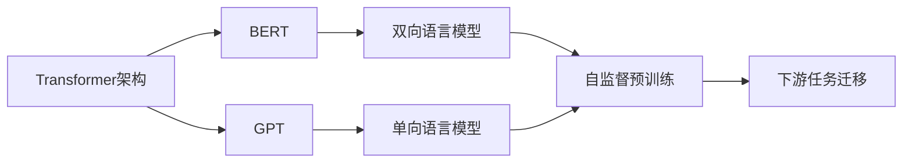

# 大规模预训练语言模型：BERT与GPT争锋

关键词：预训练语言模型、BERT、GPT、Transformer、自然语言处理

## 1. 背景介绍
### 1.1  问题的由来
随着人工智能的快速发展,自然语言处理(NLP)领域也取得了长足进步。传统的NLP方法主要依赖于特定任务的有监督学习,需要大量标注数据,且泛化能力有限。为了突破这一瓶颈,预训练语言模型应运而生。通过在海量无标注语料上进行自监督预训练,语言模型可以学习到语言的通用表示,再针对下游任务进行微调,从而大幅提升NLP系统的性能。

### 1.2  研究现状
近年来,以BERT和GPT为代表的预训练语言模型取得了显著成果。2018年,Google推出了BERT(Bidirectional Encoder Representations from Transformers)模型[1],通过双向Transformer编码器学习上下文信息,在多个NLP任务上刷新了当时最好成绩。OpenAI开发的GPT(Generative Pre-trained Transformer)系列模型[2,3]则致力于生成式预训练,在文本生成、对话、问答等方面展现出惊人的能力。这两大模型引领了NLP领域的新潮流,成为当前研究的热点。

### 1.3  研究意义 
BERT和GPT的出现标志着NLP进入预训练时代。它们强大的语言理解和生成能力为NLP应用开辟了广阔前景,有望在智能客服、知识问答、机器翻译、文本摘要等领域取得突破。同时,它们为NLP技术的民主化做出了贡献,研究者可以直接使用预训练模型进行迁移学习,降低了开发成本。深入研究BERT和GPT的原理,对于推动NLP基础研究和产业应用都具有重要意义。

### 1.4  本文结构
本文将围绕BERT和GPT展开深入探讨。第2部分介绍相关的核心概念。第3部分剖析两大模型的核心算法原理和操作步骤。第4部分阐述其背后的数学模型和公式推导。第5部分给出代码实例和详细解读。第6部分讨论实际应用场景。第7部分推荐相关工具和资源。第8部分总结全文并展望未来。第9部分列举常见问题解答。

## 2. 核心概念与联系
* **Transformer**：一种基于自注意力机制的神经网络架构,摒弃了传统的RNN/CNN结构,以并行计算和全局建模能力著称[4]。BERT和GPT都以Transformer为骨干网络。

* **语言模型**：对语言符号序列的概率分布建模,可用于预测下一个单词、计算序列出现概率等。传统的N-gram、NNLM等语言模型只能单向建模,而BERT和GPT分别实现了双向和单向的语言模型预训练。

* **自监督学习**：一种不需要人工标注数据的学习范式。通过对输入数据施加某种形式的corruption,模型学习去恢复原始信号,从而捕捉数据的内在结构。BERT采用了Masked Language Model和Next Sentence Prediction两种自监督任务。

* **迁移学习**：将源领域学到的知识迁移应用到目标领域的学习范式。预训练语言模型通过在大规模语料上学习通用语言表示,可以迁移到下游NLP任务,显著提升模型性能和训练效率。

下图展示了BERT和GPT的内在联系与区别:

## 3. 核心算法原理 & 具体操作步骤
### 3.1  算法原理概述
#### BERT
BERT的核心是利用Transformer的双向编码能力,通过Masked Language Model(MLM)和Next Sentence Prediction(NSP)两个自监督任务进行预训练。

MLM随机mask输入序列的部分token,让模型根据上下文去预测被mask的token。这迫使模型学习每个token的上下文语义信息。NSP则让模型判断两个句子在原文中是否相邻,使其能捕捉句子间的逻辑关系。

预训练后的BERT编码器可以生成上下文相关的token embedding和句子整体embedding,蕴含了丰富的语义信息。在下游任务中,只需在BERT顶层添加简单的任务专属层并微调即可。

#### GPT
GPT系列模型本质上是基于Transformer解码器的单向语言模型。给定前面的token序列,模型学习预测下一个token的条件概率分布。

GPT预训练聚焦于自回归语言建模,让模型习得自左向右生成文本的能力。这使其在文本续写、对话生成等任务中大放异彩。GPT-2进一步扩大了模型和数据规模,实现了零样本学习。GPT-3则将参数量和语料体量推向了前所未有的量级,展现出令人惊叹的few-shot和zero-shot能力。

### 3.2  算法步骤详解
#### BERT
1. **输入表示**：对输入序列进行token化,添加[CLS]和[SEP]特殊标记,将token映射为embedding向量。位置编码和segment编码也被加入其中。

2. **Transformer编码**：多层Transformer编码器对输入embedding进行编码,通过自注意力机制和前馈网络学习token的上下文表示。

3. **自监督任务**：
   - MLM：随机mask 15%的token,用[MASK]标记替换。模型需要根据上下文预测被mask的token。
   - NSP：将两个句子拼接作为输入,并在它们之间插入[SEP]标记。模型学习判断第二个句子是否跟在第一个句子后面。

4. **微调**：对于特定任务,在BERT顶层添加对应的输出层(如分类、序列标注等),端到端微调整个模型。输入序列的[CLS]表示或token表示被用于预测。

#### GPT
1. **输入表示**：将输入token序列映射为embedding向量,并添加位置编码。

2. **Transformer解码**：多层Transformer解码器对输入embedding进行自回归建模。在每个时间步,模型根据之前的token预测下一个token的概率分布。

3. **语言建模损失**：采用交叉熵损失函数,让模型学习最大化目标序列的似然概率。

4. **生成**：给定初始token,通过贪婪搜索、beam search或top-k采样等策略,不断生成后续token,直到遇到终止符或达到最大长度。

5. **微调**：将任务输入转化为语言建模格式,在GPT预训练参数的基础上进一步微调。对于zero-shot或few-shot任务,也可以通过prompt engineering技术来指导模型生成。

### 3.3  算法优缺点
#### BERT优点
* 双向建模,充分利用上下文信息
* 统一的框架适用于各类NLP任务
* 预训练+微调范式,降低任务门槛

#### BERT缺点
* 推理速度慢,难以应用于在线场景  
* 生成能力有限,不适合文本生成任务
* 句子长度受限,难以处理长文档

#### GPT优点  
* 强大的语言生成能力,适用于开放域对话等任务
* 单向语言模型,可以处理任意长度的上下文
* 规模效应显著,few-shot和zero-shot能力突出

#### GPT缺点
* 单向建模,难以充分利用双向信息  
* 语言模型目标与下游任务不一致,微调难度大
* 模型参数量巨大,训练和推理成本高

### 3.4  算法应用领域
* BERT：文本分类、序列标注、阅读理解、自然语言推理、语义相似度等
* GPT：文本生成、对话系统、问答、摘要、创意写作等  

## 4. 数学模型和公式 & 详细讲解 & 举例说明
### 4.1  数学模型构建
#### Transformer
Transformer的核心是注意力机制,可以建模任意两个位置之间的依赖关系。其数学表达为:

$$
\text{Attention}(Q,K,V) = \text{softmax}(\frac{QK^T}{\sqrt{d_k}})V
$$

其中,$Q$,$K$,$V$分别是query,key,value矩阵,$d_k$为key的维度。

Transformer编码器包含多个相同的层,每层由两个子层组成:

$$
\begin{aligned}
\text{MultiHead}(X) &= [\text{head}_1; \ldots; \text{head}_h]W^O \\
\text{head}_i &= \text{Attention}(XW_i^Q, XW_i^K, XW_i^V)
\end{aligned}
$$

$$
\text{FFN}(X) = \max(0, XW_1 + b_1)W_2 + b_2
$$

多头注意力将输入$X$线性投影为$h$个不同的query,key,value子空间,并行计算注意力,再concat结果。前馈网络则通过两个全连接层变换特征。

Transformer解码器在编码器之外,还引入了masked self-attention和encoder-decoder attention,以实现自回归生成。

#### BERT
BERT的预训练目标由MLM和NSP两部分组成。MLM的损失函数为:

$$
\mathcal{L}_{\text{MLM}} = -\sum_{i \in \mathcal{M}} \log p(x_i | \hat{x}_{\backslash \mathcal{M}})
$$

其中,$\mathcal{M}$为被mask的token位置集合,$\hat{x}_{\backslash \mathcal{M}}$表示除$\mathcal{M}$外的其他token。

NSP则是一个二分类任务,采用交叉熵损失:

$$
\mathcal{L}_{\text{NSP}} = -y\log p(s_2|s_1) - (1-y)\log(1-p(s_2|s_1))
$$

其中,$y$为标签(0或1),$p(s_2|s_1)$为给定句子$s_1$后句子$s_2$出现的概率。

BERT的总体目标为最小化两个任务的损失之和:

$$
\mathcal{L} = \mathcal{L}_{\text{MLM}} + \mathcal{L}_{\text{NSP}}
$$

#### GPT
GPT的语言模型目标是最大化给定前缀token的目标序列条件概率:

$$
\mathcal{L}(\mathcal{D}) = -\sum_{i=1}^n \log p(x_i|x_{<i};\theta)
$$

其中,$\mathcal{D} = \{x_1,\ldots,x_n\}$为训练语料,$\theta$为模型参数。

对于每个位置$i$,GPT通过Transformer解码器建模条件概率:

$$
p(x_i|x_{<i}) = \text{softmax}(\text{FFN}(\text{Decoder}(x_{<i})))
$$

生成阶段则根据前缀token不断采样下一个token:

$$
\hat{x}_i \sim p(x_i|\hat{x}_{<i})
$$

### 4.2  公式推导过程
以上公式的推导涉及Transformer、语言模型、最大似然估计等基础知识,限于篇幅不再赘述。感兴趣的读者可以参考原论文[1,2,3,4]和相关教程。

### 4.3  案例分析与讲解
下面以一个简单的例子来说明BERT的MLM和NSP任务。

输入序列: "[CLS] I love natural language processing [SEP] I want to learn NLP [SEP]"

MLM过程:
1. 随机选择"language"和"learn"进行mask,替换为[MASK]标记
2. 输入BERT编码,输出[MASK]位置的token概率分布
3. 计算被mask token的交叉熵损失

NSP过程:  
1. 构造正例和负例。上述两个句子为正例,随机选择另一个无关句子作为负例
2. 将两个句子拼接并输入BERT,输出[CLS]位置的二分类概率
3. 计算正负例的交叉熵损失

通过这两个任务,BERT学习了token的双向上下文表示和句子间的语义关系。

### 4.4  常见问题解答
**Q**: BERT和GPT的主要区别是什么?
**A**: BERT采用双向Transformer编码器,通过MLM和NSP任务学习双向语言表示,主要用于自然语言理解。GPT采用单向Transformer解码器,通过自回归语言模型学习单向语言表示,主要用于自然语言生成。

**Q**: MLM和传统