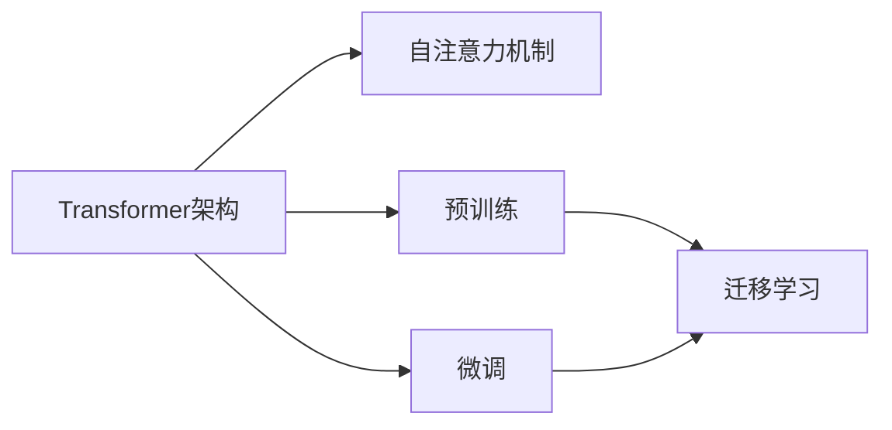

# 大语言模型(Large Language Models) - 原理与代码实例讲解

## 1. 背景介绍
### 1.1 问题的由来
近年来,随着深度学习技术的快速发展,自然语言处理(Natural Language Processing, NLP)领域取得了突破性的进展。其中,大语言模型(Large Language Models, LLMs)的出现,为NLP领域带来了革命性的变化。LLMs 能够从海量的文本数据中学习语言的规律和知识,具备强大的语言理解和生成能力,在机器翻译、对话系统、文本摘要等任务上取得了优异的表现。

### 1.2 研究现状 
目前,业界主流的大语言模型包括 Google 的 BERT、OpenAI 的 GPT 系列模型、Facebook 的 RoBERTa 等。这些模型在各种 NLP 任务上不断刷新着最好成绩。同时,各大科技公司和研究机构也在不断探索 LLMs 的新架构和训练方法,推动着这一领域的发展。

### 1.3 研究意义
LLMs 的研究具有重要的理论和实践意义。从理论角度看,LLMs 的研究有助于加深我们对语言本质的认识,探索语言和知识的表示方法。从实践角度看,LLMs 为构建更加智能化的 NLP 应用奠定了基础,如智能客服、知识问答、文本生成等,将极大提升人机交互的体验。

### 1.4 本文结构
本文将围绕大语言模型的原理和实现展开论述。第2部分介绍 LLMs 的核心概念;第3部分阐述 LLMs 的核心算法原理;第4部分给出 LLMs 的数学模型和公式推导;第5部分提供基于 PyTorch 的 LLMs 代码实例;第6部分分析 LLMs 的实际应用场景;第7部分推荐 LLMs 的学习资源;第8部分对全文进行总结并展望 LLMs 的未来发展方向。

## 2. 核心概念与联系
大语言模型的核心是利用深度神经网络,从大规模文本语料中学习语言的统计规律和隐含知识。其主要涉及以下几个核心概念:

- 自注意力机制(Self-Attention):允许模型的每个位置关注输入序列的任意位置,捕捉长距离依赖关系。
- Transformer 架构:基于自注意力机制,抛弃了传统的 RNN/CNN 结构,大幅提升了模型的并行计算能力和训练效率。
- 预训练(Pre-training):在大规模无标注语料上进行自监督学习,让模型学会语言的基本规律和常识性知识。
- 微调(Fine-tuning):在下游任务的标注数据上对预训练模型进行监督学习,使其适应特定任务。
- 迁移学习:将预训练模型学到的语言知识迁移到下游任务,大幅减少标注数据的需求。

这些概念环环相扣,共同构成了大语言模型的核心。Transformer 作为 LLMs 的主流架构,以自注意力机制为基础,通过预训练和微调来实现强大的迁移学习能力。下图展示了这些概念之间的关系:

## 3. 核心算法原理 & 具体操作步骤
### 3.1 算法原理概述
LLMs 的核心算法可以概括为两个阶段:无监督预训练和有监督微调。

在预训练阶段,模型在大规模无标注语料上进行自监督学习。主要采用的任务有:

- 语言模型:预测下一个单词,如 GPT 系列模型。 
- 去噪自编码:随机遮挡输入的一部分,让模型恢复原始输入,如 BERT。
- 对比学习:让模型判断两个句子是否连续,如 ALBERT。

通过这些任务,模型可以学习到语言的基本规律和常识性知识。

在微调阶段,我们在下游任务的标注数据上对预训练模型进行监督学习。主要采用的任务有:

- 文本分类:判断文本的类别,如情感分析。
- 序列标注:为每个单词预测一个标签,如命名实体识别。
- 问答:根据给定问题从文章中找出答案。

通过微调,预训练模型可以适应特定任务,实现知识的迁移。

### 3.2 算法步骤详解

以 BERT 为例,详细讲解其算法步骤:

1. 输入表示:将输入序列 Token 化,添加特殊字符[CLS]和[SEP],将每个 token 映射为向量。
2. 位置编码:为每个 token 的向量添加位置信息。
3. Transformer 编码:将输入序列通过多层 Transformer 编码器,每一层包括两个子层:
   - 多头自注意力(Multi-head Self-Attention):计算 token 之间的注意力权重,得到每个 token 的上下文表示。
   - 前馈神经网络(Feed-Forward Network):对每个 token 的表示进行非线性变换。
4. 输出表示:取[CLS]位置的输出向量作为整个序列的表示,用于下游任务。
5. 预训练任务:
   - MLM(Masked Language Model):随机 mask 掉部分 token,让模型预测被 mask 的 token。
   - NSP(Next Sentence Prediction):判断两个句子是否前后相接。
6. 微调任务:在下游任务数据上进行监督学习,根据任务类型添加相应的输出层。

### 3.3 算法优缺点

BERT 的优点在于:
- 强大的特征提取能力:通过预训练学习语言的本质特征。
- 优异的迁移学习能力:在多个 NLP 任务上取得 SOTA 效果。
- 双向建模:同时考虑 token 的左右上下文信息。

BERT 的缺点包括:
- 计算开销大:自注意力机制的计算复杂度为平方级。
- 难以并行:预测下一个 token 需要依赖前面的结果。
- 语言模型能力弱:被 mask 的 token 缺乏全局语义。

### 3.4 算法应用领域
BERT 及其变体在各种 NLP 任务上得到了广泛应用,如:
- 机器翻译:将其作为编码器,提取源语言的语义表示。
- 文本分类:利用其强大的语义理解能力,进行情感分析、垃圾邮件检测等。
- 问答系统:通过微调使其具备从文本中抽取答案的能力。
- 命名实体识别:用于识别文本中的人名、地名、机构名等。

此外,BERT 还被用于对话系统、关系抽取、文本摘要等领域,展现出广阔的应用前景。

## 4. 数学模型和公式 & 详细讲解 & 举例说明
### 4.1 数学模型构建
BERT 的数学模型可以用如下公式表示:

$$
\begin{aligned}
\mathbf{E} &= \text{Embedding}(X) \\
\mathbf{E}^{pos} &= \mathbf{E} + \text{PositionalEncoding}(X) \\
\mathbf{H}^0 &= \mathbf{E}^{pos} \\
\mathbf{H}^l &= \text{Transformer}(\mathbf{H}^{l-1}), l=1,\dots,L \\
\mathbf{C} &= \mathbf{h}_{[CLS]}^L \\
p(y|\mathbf{C}) &= \text{softmax}(\mathbf{W}\mathbf{C})
\end{aligned}
$$

其中,$X$表示输入序列,$\mathbf{E}$表示词嵌入向量,$\mathbf{E}^{pos}$表示添加位置编码后的向量,$\mathbf{H}^l$表示第$l$层 Transformer 的输出,$\mathbf{C}$表示[CLS]位置的输出向量,$p(y|\mathbf{C})$表示基于$\mathbf{C}$对标签$y$的预测概率。

### 4.2 公式推导过程
接下来,我们详细推导 Transformer 编码器的公式。

Transformer 编码器由多头自注意力和前馈神经网络组成。多头自注意力的计算过程如下:

$$
\begin{aligned}
\mathbf{Q}_i,\mathbf{K}_i,\mathbf{V}_i &= \mathbf{H}_{l-1}\mathbf{W}_i^Q,\mathbf{H}_{l-1}\mathbf{W}_i^K,\mathbf{H}_{l-1}\mathbf{W}_i^V \\
\text{head}_i &= \text{softmax}(\frac{\mathbf{Q}_i\mathbf{K}_i^T}{\sqrt{d_k}})\mathbf{V}_i \\
\text{MultiHead}(\mathbf{H}_{l-1}) &= \text{Concat}(\text{head}_1,\dots,\text{head}_h)\mathbf{W}^O
\end{aligned}
$$

其中,$\mathbf{Q}_i,\mathbf{K}_i,\mathbf{V}_i$分别表示查询、键、值向量,$\mathbf{W}_i^Q,\mathbf{W}_i^K,\mathbf{W}_i^V$为学习的权重矩阵,$d_k$为缩放因子,$h$为注意力头数。

前馈神经网络的计算过程如下:

$$
\text{FFN}(\mathbf{x}) = \max(0, \mathbf{x}\mathbf{W}_1 + \mathbf{b}_1)\mathbf{W}_2 + \mathbf{b}_2
$$

其中,$\mathbf{W}_1,\mathbf{W}_2,\mathbf{b}_1,\mathbf{b}_2$为学习的权重矩阵和偏置向量。

将多头自注意力和前馈神经网络结合,得到 Transformer 编码器的完整公式:

$$
\begin{aligned}
\mathbf{Z} &= \text{MultiHead}(\mathbf{H}_{l-1}) + \mathbf{H}_{l-1} \\
\mathbf{H}_l &= \text{FFN}(\mathbf{Z}) + \mathbf{Z}
\end{aligned}
$$

### 4.3 案例分析与讲解
下面以一个具体的例子来说明 BERT 的工作原理。

假设我们有一个输入序列:"The man went to the store."

1. 输入表示:将序列 token 化并映射为向量:
   
   $\mathbf{E} = [e_{[CLS]},e_{The},e_{man},e_{went},e_{to},e_{the},e_{store},e_{[SEP]}]$

2. 位置编码:为每个向量添加位置信息:

   $\mathbf{E}^{pos} = [e_{[CLS]}^{pos},e_{The}^{pos},e_{man}^{pos},e_{went}^{pos},e_{to}^{pos},e_{the}^{pos},e_{store}^{pos},e_{[SEP]}^{pos}]$

3. Transformer 编码:通过多层 Transformer 编码器对输入进行编码:

   $\mathbf{H}^1 = \text{Transformer}(\mathbf{E}^{pos})$

   $\mathbf{H}^2 = \text{Transformer}(\mathbf{H}^1)$

   $\dots$

   $\mathbf{H}^L = \text{Transformer}(\mathbf{H}^{L-1})$

4. 输出表示:取[CLS]位置的输出向量 $\mathbf{C} = \mathbf{h}_{[CLS]}^L$ 用于下游任务。

5. 预训练任务:
   - MLM:随机 mask 掉"went",让模型预测被 mask 的词。
   - NSP:判断"The man went to the store."和另一个句子是否相接。

6. 微调任务:假设下游任务为情感分类,则在$\mathbf{C}$之后添加一个全连接层和 softmax 层:

   $p(y|\mathbf{C}) = \text{softmax}(\mathbf{W}\mathbf{C})$

   其中$y$表示情感标签(正面/负面)。

通过这个例子,我们可以清晰地看到 BERT 的端到端工作流程,以及其强大的语义理解和迁移学习能力。

### 4.4 常见问题解答
1. Q:BERT 和 GPT 有什么区别?
   A:BERT 采用双向建模,GPT 采用单向建模;BERT 以去噪自编码为预训练任务,GPT 以语言模型为预训练任务。

2. Q:为什么要对注意力矩阵除以$\sqrt{d_k}$?