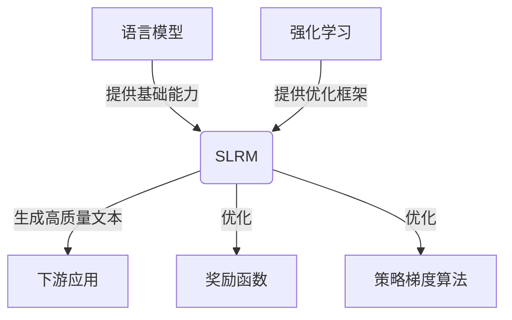

# 大语言模型原理与工程实践：Sentence-level 强化建模

## 1. 背景介绍

### 1.1 问题的由来

在自然语言处理领域中,大型语言模型已经取得了令人瞩目的成就,展现出强大的语言理解和生成能力。然而,传统的语言模型通常是在token级别进行建模和训练,这种方式存在一些固有的局限性。首先,token级别的建模无法直接捕捉句子级别的语义和逻辑关系,导致生成的文本可能缺乏连贯性和一致性。其次,token级别的训练目标函数(如最大似然估计)并不直接优化最终的任务指标,可能会引入次优的结果。

为了解决这些问题,研究人员提出了Sentence-level强化建模(Sentence-level Reinforcement Modeling,SLRM)的概念,旨在直接在句子级别对语言模型进行优化,以生成更加连贯、一致和高质量的文本输出。

### 1.2 研究现状

目前,SLRM的研究主要集中在以下几个方面:

1. **强化学习算法**:探索不同的强化学习算法(如策略梯度、Actor-Critic等)在SLRM中的应用和性能。
2. **奖励函数设计**:设计合理的奖励函数,以量化生成文本的质量和任务相关性。
3. **模型架构优化**:优化语言模型的架构,使其更适合SLRM的训练和推理过程。
4. **数据增强技术**:利用数据增强等技术,扩充训练数据,提高模型的泛化能力。
5. **评估指标研究**:探索更加合理和全面的评估指标,以衡量SLRM生成文本的质量。

虽然SLRM取得了一定的进展,但仍然面临着诸多挑战,如奖励函数的稳定性、训练效率低下、生成文本的多样性不足等。

### 1.3 研究意义

SLRM的研究对于推进自然语言处理技术具有重要意义:

1. **提高语言生成质量**:SLRM可以直接优化语言模型在句子级别的生成质量,产生更加连贯、一致和高质量的文本输出,为下游应用(如机器翻译、对话系统等)提供更好的语言生成能力。

2. **增强语言理解能力**:SLRM需要语言模型在句子级别捕捉语义和逻辑关系,这有助于提高模型对自然语言的理解能力。

3. **促进强化学习在NLP中的应用**:SLRM将强化学习技术引入自然语言处理领域,为强化学习在NLP中的应用开辟了新的研究方向。

4. **推动人工智能系统的发展**:高质量的语言生成和理解能力是构建智能系统的关键组成部分,SLRM的研究有助于推动人工智能系统向更高水平发展。

### 1.4 本文结构

本文将全面介绍SLRM的理论基础、算法实现、工程实践和应用场景。具体内容安排如下:

- 第2部分阐述SLRM的核心概念,包括强化学习在语言建模中的应用、奖励函数的设计等。
- 第3部分详细讲解SLRM的核心算法原理和具体操作步骤。
- 第4部分构建SLRM的数学模型,推导相关公式,并通过案例分析加深理解。
- 第5部分提供SLRM的代码实现示例,并对关键模块进行解读和分析。
- 第6部分探讨SLRM在不同应用场景中的实践,并展望未来的发展方向。
- 第7部分推荐SLRM相关的学习资源、开发工具和论文等。
- 第8部分总结SLRM的研究成果、发展趋势和面临的挑战。
- 第9部分列出SLRM常见问题及解答,帮助读者更好地理解和掌握这一领域的知识。

## 2. 核心概念与联系

SLRM的核心思想是将强化学习的理念引入到语言模型的训练过程中,直接在句子级别对模型进行优化,以生成更加高质量的文本输出。这一过程涉及以下几个关键概念:

1. **语言模型(Language Model,LM)**:语言模型是自然语言处理中的基础模型,旨在学习语言的统计规律,并对给定的文本序列计算概率。传统的语言模型通常在token级别进行建模和训练。

2. **强化学习(Reinforcement Learning,RL)**:强化学习是机器学习的一个重要分支,它通过与环境的交互,学习一种策略,使得在环境中获得的累积奖励最大化。在SLRM中,语言模型就是智能体,生成文本的过程即是与环境交互的过程。

3. **策略(Policy)**:在强化学习中,策略指的是智能体在每个状态下采取行动的概率分布。对于SLRM,策略就是语言模型生成下一个token的概率分布。

4. **奖励函数(Reward Function)**:奖励函数用于量化智能体在环境中采取行动后获得的回报,是强化学习的关键组成部分。在SLRM中,奖励函数用于评估生成文本的质量和任务相关性。

5. **策略梯度(Policy Gradient)**:策略梯度是一种常用的强化学习算法,它通过估计策略参数对期望奖励的梯度,并沿着梯度方向更新策略参数,从而优化策略。在SLRM中,策略梯度用于优化语言模型的参数,使其生成更高质量的文本。

这些概念之间存在紧密的联系:语言模型提供了生成文本的基础能力,强化学习则为语言模型提供了直接优化句子级别质量的框架。通过设计合理的奖励函数,并采用策略梯度等算法,SLRM可以有效地提高语言模型的生成质量。

## 3. 核心算法原理 & 具体操作步骤

### 3.1 算法原理概述

SLRM的核心算法原理是将强化学习的思想应用到语言模型的训练过程中。具体来说,它将语言模型视为一个智能体,生成文本的过程视为与环境交互的过程。通过设计合理的奖励函数,语言模型可以根据生成文本的质量获得相应的奖励,并采用策略梯度等强化学习算法,优化模型参数,使得生成的文本质量不断提高。

算法的基本流程如下:

1. 初始化语言模型的参数。
2. 对于每个训练样本:
   a. 使用当前的语言模型生成文本序列。
   b. 根据预定义的奖励函数,计算生成文本的奖励值。
   c. 使用强化学习算法(如策略梯度)更新语言模型的参数,使得期望奖励最大化。
3. 重复步骤2,直至模型收敛或达到预定的训练轮数。

在这个过程中,奖励函数和强化学习算法是两个关键组成部分,它们直接决定了SLRM的性能和效果。

### 3.2 算法步骤详解

1. **初始化语言模型参数**

   首先,我们需要初始化语言模型的参数。通常情况下,我们会使用预训练的语言模型(如BERT、GPT等)作为初始化参数,以利用它们在大规模语料库上学习到的语言知识。

2. **生成文本序列**

   对于每个训练样本,我们使用当前的语言模型生成一个文本序列。具体来说,我们从起始token开始,根据语言模型给出的概率分布,采样生成下一个token,直至生成完整的文本序列或达到预定的最大长度。

   生成文本序列的过程可以表示为:

   $$
   P(x_1, x_2, \dots, x_T) = \prod_{t=1}^T P(x_t | x_1, x_2, \dots, x_{t-1}; \theta)
   $$

   其中,$ x_1, x_2, \dots, x_T $是生成的文本序列,$ \theta $是语言模型的参数。

3. **计算奖励值**

   生成文本序列后,我们需要根据预定义的奖励函数计算该序列的奖励值。奖励函数的设计是SLRM的关键部分之一,它直接决定了模型优化的目标和方向。

   常见的奖励函数包括:

   - **质量奖励**:根据生成文本的流畅性、连贯性、语法正确性等指标计算奖励值。
   - **任务相关奖励**:根据生成文本与特定任务目标(如机器翻译质量、对话响应质量等)的契合程度计算奖励值。
   - **组合奖励**:将多个奖励函数进行加权组合,综合考虑不同因素。

   设计合理的奖励函数是SLRM研究的一个重点挑战。

4. **更新模型参数**

   获得奖励值后,我们采用强化学习算法(如策略梯度)更新语言模型的参数,使得期望奖励最大化。

   策略梯度算法的基本思路是:

   a. 估计当前策略(语言模型)下生成文本序列的期望奖励。
   b. 计算策略参数相对于期望奖励的梯度。
   c. 沿着梯度方向更新策略参数。

   具体的更新公式如下:

   $$
   \theta \leftarrow \theta + \alpha \nabla_\theta \mathbb{E}_{x \sim P(x|\theta)}[R(x)]
   $$

   其中,$ \alpha $是学习率,$ R(x) $是文本序列$ x $的奖励值,$ \nabla_\theta \mathbb{E}_{x \sim P(x|\theta)}[R(x)] $是期望奖励相对于策略参数$ \theta $的梯度。

   在实际应用中,我们通常采用一些变种算法(如Actor-Critic算法)来提高训练效率和稳定性。

5. **重复训练**

   重复步骤2-4,直至模型收敛或达到预定的训练轮数。在训练过程中,我们可以采用一些技术(如curriculum learning、数据增强等)来加速训练过程和提高模型的泛化能力。

### 3.3 算法优缺点

SLRM算法相对于传统的token级别语言模型训练方法,具有以下优势:

1. **直接优化句子级别质量**:SLRM直接在句子级别对语言模型进行优化,可以更好地捕捉句子的语义和逻辑关系,生成更加连贯、一致的高质量文本。

2. **灵活的奖励函数设计**:通过设计合理的奖励函数,SLRM可以针对不同的任务和应用场景,优化特定的文本质量指标。

3. **利用强化学习的优势**:SLRM借鉴了强化学习的思想和算法,可以更好地处理序列决策问题,并具有探索和利用的权衡能力。

然而,SLRM也存在一些缺点和挑战:

1. **奖励函数的设计困难**:设计合理且有效的奖励函数是SLRM面临的一个主要挑战,奖励函数的选择直接影响了模型的优化效果。

2. **训练效率低下**:由于需要生成完整的文本序列并计算奖励值,SLRM的训练过程通常比token级别的语言模型训练更加耗时和低效。

3. **稳定性和收敛性问题**:强化学习算法本身存在一定的不稳定性和收敛性问题,这些问题在SLRM中也会体现出来。

4. **生成文本多样性不足**:由于SLRM直接优化特定的奖励函数,生成的文本可能会过于集中在某些模式上,缺乏多样性。

5. **评估指标的局限性**:目前缺乏全面、客观的评估指标来衡量SLRM生成文本的质量,这也是该领域需要解决的一个重要问题。

### 3.4 算法应用领域

SLRM算法可以应用于多个自然语言处理领域,为相关任务提供