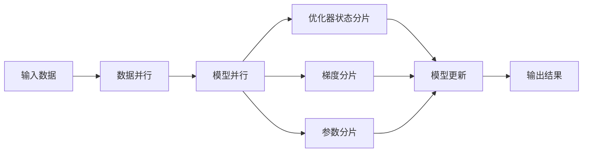

# 大语言模型原理与工程实践：ZeRO 并行

关键词：大语言模型, ZeRO, 数据并行, 模型并行, 分布式训练, 显存优化

## 1. 背景介绍

### 1.1 问题的由来
近年来，随着深度学习的飞速发展，大规模语言模型如 BERT、GPT-3 等在自然语言处理领域取得了巨大的成功。这些模型通过在海量文本数据上进行预训练，能够学习到丰富的语言知识，在下游任务上表现出色。然而，训练这些大规模语言模型需要消耗大量的计算资源和显存，对硬件提出了很高的要求。如何在有限的硬件条件下高效训练大规模语言模型，成为了一个亟待解决的问题。

### 1.2 研究现状
为了训练大规模语言模型，业界提出了多种并行训练的方法，包括数据并行、模型并行等。传统的数据并行方法通过将数据分片到多个设备上，每个设备保存一份完整的模型参数，同步更新梯度。但是当模型参数量非常大时，单个设备的显存难以承载，限制了模型的规模。模型并行通过将模型切分到多个设备，每个设备只保存部分参数，协同完成前向和反向传播。但是模型并行对设备间通信和带宽提出了更高的要求，实现难度大。

### 1.3 研究意义
ZeRO(Zero Redundancy Optimizer)[1]是一种用于大规模分布式训练的内存优化技术，通过减少参数、梯度、优化器状态的冗余来突破显存瓶颈，可以用更少的资源训练更大的模型。ZeRO结合了数据并行和模型并行的优点，在保证训练效果的同时，极大提升了训练效率。深入研究ZeRO的原理和实践，对于推动大语言模型的发展具有重要意义。

### 1.4 本文结构
本文将围绕ZeRO并行技术展开详细讨论。第2部分介绍ZeRO的核心概念。第3部分阐述ZeRO的核心算法原理和具体操作步骤。第4部分给出ZeRO的数学模型和公式推导。第5部分提供ZeRO的代码实例和详细解读。第6部分讨论ZeRO的实际应用场景。第7部分推荐ZeRO相关的工具和资源。第8部分总结全文并展望未来。第9部分是附录，解答一些常见问题。

## 2. 核心概念与联系

在探讨ZeRO的原理之前，我们首先来了解一些核心概念：

- **数据并行(Data Parallelism)**：将训练数据分片(shard)到多个设备上，每个设备保存一份完整的模型参数。前向和反向传播在各设备独立进行，梯度在设备间同步求平均。数据并行的优点是实现简单，但当模型参数量很大时，受限于单个设备的显存。

- **模型并行(Model Parallelism)**：将模型参数切分到多个设备，每个设备只保存和计算部分layers的参数。前向和反向传播需要在设备间传递中间激活(activation)。模型并行可以训练超大规模的模型，但实现复杂，对通信带宽要求高。

- **流水线并行(Pipeline Parallelism)**：将模型切分为多个阶段(stages)，每个阶段在一个设备上，设备间以流水线的方式并行计算。当一个stage完成计算后，将中间结果传递给下一个stage，同时接收上一个stage的输入，实现并行。

- **优化器状态分片(Optimizer State Sharding)**：将优化器状态(如动量、梯度平方和等)划分到多个设备，减少在单个设备上的内存占用。

- **梯度分片(Gradient Sharding)**：仅在用于更新的设备上聚合梯度，其他设备不保存冗余的梯度副本。

- **参数分片(Parameter Sharding)**：将模型参数划分到多个设备上，每个设备只保存部分参数。前向和反向传播时，根据需要将参数传输到对应设备。

ZeRO通过巧妙地结合数据并行、模型并行、优化器状态分片、梯度分片、参数分片等技术，最大化利用分布式资源，从而实现大规模模型训练。下图展示了ZeRO的总体架构：

## 3. 核心算法原理 & 具体操作步骤

### 3.1 算法原理概述
ZeRO的核心思想是通过消除参数、梯度、优化器状态的冗余，将它们划分到多个设备上，从而减少每个设备的内存占用。具体来说，ZeRO包含三个阶段：

- **ZeRO-1: 优化器状态分片**。将优化器状态划分到多个设备，每个设备只保存自己负责的部分，显著减少了优化器状态的内存占用。
  
- **ZeRO-2: 梯度分片**。在反向传播时，每个设备只为自己负责的模型参数计算梯度，然后在设备间进行梯度规约(reduce)，得到完整的梯度用于更新。这避免了在每个设备上保存整个模型梯度的开销。

- **ZeRO-3: 参数分片**。将模型参数划分到多个设备，每个设备只保存部分参数。在前向传播时，根据需要将参数传输到对应设备进行计算。ZeRO-3进一步减少了参数的冗余，但对通信带宽提出了更高要求。

### 3.2 算法步骤详解

下面我们详细讨论ZeRO的三个阶段。

**ZeRO-1: 优化器状态分片**

1. 将模型参数均匀划分到N个设备，每个设备负责更新1/N的参数。
2. 在每个设备上创建只包含自己负责的参数的优化器。
3. 在前向传播和反向传播时，所有设备独立计算，同步梯度。
4. 优化器只更新自己负责的参数，避免了在设备间传输完整的优化器状态。

优化器状态分片可以将优化器状态的内存占用减少N倍。

**ZeRO-2: 梯度分片**

1. 在前向传播时，每个设备独立计算，得到输出。
2. 在反向传播时，每个设备只为自己负责的参数计算梯度。
3. 各设备通过`all_reduce`操作聚合梯度，得到完整的模型梯度。
4. 每个设备利用聚合后的梯度，更新自己负责的参数。

梯度分片将梯度的内存占用减少了N倍，进一步减轻了显存压力。

**ZeRO-3: 参数分片**

1. 将模型参数划分到多个设备，每个设备只保存1/N的参数。
2. 在前向传播时，根据计算图将参数传输到需要的设备。
3. 在反向传播时，各设备计算自己负责的梯度，并进行`all_reduce`聚合。
4. 每个设备更新自己负责的参数。
5. 由于参数在设备间传输，需要仔细设计通信方案，如预取、重叠通信与计算等。

参数分片可以将参数的内存占用减少N倍，使得单机可以训练N倍大小的模型。但是参数分片对通信效率提出了更高要求，需要精心设计以避免通信成为瓶颈。

### 3.3 算法优缺点

ZeRO的优点包括：

1. 显著减少了每个设备的内存占用，可以用更少的资源训练更大的模型。
2. 通过结合数据并行和模型并行，兼顾了通信效率和内存效率。
3. 实现了三个层次的内存优化，可以根据需求灵活选择。
4. 与数据并行、模型并行等方法兼容，可以与其他并行策略组合使用。

ZeRO的缺点包括：

1. 对通信带宽和效率提出了更高的要求，需要仔细设计通信方案。
2. 实现复杂度高，需要深入理解并行机制和通信库。
3. 调试和优化难度大，出错时定位问题需要全局考虑。

### 3.4 算法应用领域
ZeRO主要应用于大规模分布式训练领域，尤其是在训练大语言模型如GPT-3、Megatron-LM等超大规模模型时。ZeRO可以帮助突破单机显存瓶颈，用更少的资源完成大模型训练。此外，ZeRO也可以用于其他需要大规模分布式训练的领域，如计算机视觉、推荐系统等。

## 4. 数学模型和公式 & 详细讲解 & 举例说明

### 4.1 数学模型构建
我们考虑一个有$L$层的序列到序列模型，第$l$层的前向传播可以表示为:

$$
h_l = f_l(h_{l-1}, \theta_l)
$$

其中$h_l$是第$l$层的隐藏状态，$\theta_l$是第$l$层的参数，$f_l$是第$l$层的前向传播函数。

假设我们有$N$个设备，ZeRO将模型划分为$N$个部分，每个设备负责其中一部分。设备$i$负责的层集合为$S_i$，则有:

$$
\bigcup_{i=1}^N S_i = \{1, 2, ..., L\}, \quad S_i \cap S_j = \emptyset, \forall i \neq j
$$

设备$i$上的前向传播可以写为:

$$
h_l = \begin{cases}
f_l(h_{l-1}, \theta_l), & l \in S_i \\
h_{l-1}, & l \notin S_i
\end{cases}
$$

反向传播时，设备$i$计算损失函数$\mathcal{L}$对$\theta_l (l \in S_i)$的梯度:

$$
g_{i,l} = \frac{\partial \mathcal{L}}{\partial \theta_l}, \quad l \in S_i
$$

然后通过`all_reduce`操作聚合各设备的梯度:

$$
g_l = \frac{1}{N} \sum_{i=1}^N g_{i,l}, \quad l = 1, 2, ..., L
$$

最后每个设备用聚合后的梯度更新自己负责的参数:

$$
\theta_l \leftarrow \theta_l - \eta g_l, \quad l \in S_i
$$

其中$\eta$是学习率。

### 4.2 公式推导过程
下面我们推导ZeRO的梯度计算和参数更新公式。

对于设备$i$，前向传播时，第$l$层的输出为:

$$
h_l = \begin{cases}
f_l(h_{l-1}, \theta_l), & l \in S_i \\
h_{l-1}, & l \notin S_i
\end{cases}
$$

反向传播时，设备$i$计算损失$\mathcal{L}$对第$l$层输入$h_{l-1}$的梯度:

$$
\frac{\partial \mathcal{L}}{\partial h_{l-1}} = \begin{cases}
\frac{\partial \mathcal{L}}{\partial h_l} \frac{\partial h_l}{\partial h_{l-1}}, & l \in S_i \\
\frac{\partial \mathcal{L}}{\partial h_l}, & l \notin S_i
\end{cases}
$$

其中$\frac{\partial h_l}{\partial h_{l-1}}$是第$l$层的Jacobian矩阵。

同时，设备$i$计算损失$\mathcal{L}$对第$l$层参数$\theta_l$的梯度:

$$
\frac{\partial \mathcal{L}}{\partial \theta_l} = \frac{\partial \mathcal{L}}{\partial h_l} \frac{\partial h_l}{\partial \theta_l}, \quad l \in S_i
$$

将各设备计算的梯度进行聚合:

$$
g_l = \frac{1}{N} \sum_{i=1}^N \frac{\partial \mathcal{L}}{\partial \theta_l}, \quad l = 1, 2, ..., L
$$

最后每个设备用聚合后的梯度更新自己负责的参数:

$$
\theta_l \leftarrow \theta_l - \eta g_l, \quad l \in S_i
$$

其中$\eta$是学习率。