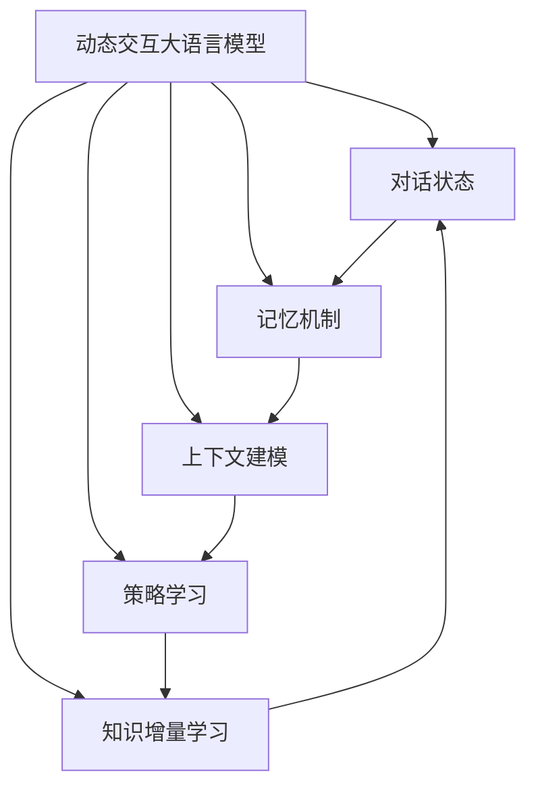

以下是根据您的要求撰写的技术博客文章正文部分：

# 大语言模型原理与工程实践：动态交互

## 1. 背景介绍

### 1.1 问题的由来

在过去的几年里,自然语言处理(NLP)领域取得了长足的进步,其中大语言模型(Large Language Model,LLM)的兴起成为了推动这一进步的核心动力。大语言模型通过在海量文本语料上进行预训练,学习到了丰富的语言知识和上下文信息,从而能够生成高质量、连贯的自然语言文本。

然而,传统的大语言模型通常被视为静态的文本生成器,它们缺乏与用户进行动态交互的能力。用户需要一次性输入完整的问题或指令,模型则生成相应的回复,无法根据用户的后续反馈进行调整和改进。这种单向的交互模式严重限制了大语言模型在实际应用中的效用和用户体验。

### 1.2 研究现状

为了解决这一问题,研究人员提出了动态交互大语言模型(Dynamic Interactive LLM)的概念。动态交互大语言模型旨在通过引入对话历史信息和上下文状态,实现与用户的多轮交互,从而提高语言生成的连贯性、相关性和个性化程度。

目前,已有多种动态交互大语言模型的方法被提出和探索,包括:

1. **基于记忆的方法**: 将对话历史信息作为额外的记忆,并与输入问题一起送入模型进行联合编码和生成。
2. **基于改编的方法**: 在模型的输入和输出中插入特殊的标记,用于指示对话状态的变化,从而实现动态交互。
3. **基于元学习的方法**: 通过元学习的范式,使模型能够快速适应新的对话场景,提高生成的个性化程度。

尽管取得了一定进展,但动态交互大语言模型仍然面临诸多挑战,如对话一致性的保持、知识的持续积累和更新、个性化和多样性的平衡等,都有待进一步的研究和探索。

### 1.3 研究意义

动态交互大语言模型的研究对于推动自然语言处理技术的发展具有重要意义:

1. **提升人机交互体验**: 动态交互能力使得大语言模型更加智能和人性化,能够像人一样进行自然的多轮对话,极大地提升了人机交互的质量和体验。

2. **拓展应用场景**: 动态交互大语言模型可以广泛应用于智能助手、客服系统、教育辅导等领域,为人类提供更加个性化和高效的服务。

3. **促进人工智能发展**: 动态交互是通向真正智能的关键一步,研究这一能力有助于探索人工智能系统更高层次的认知和推理能力。

4. **推动多模态融合**: 动态交互大语言模型为将视觉、语音等多模态信息融入对话过程奠定了基础,有望实现更加自然和多元的人机交互方式。

### 1.4 本文结构

本文将全面介绍动态交互大语言模型的原理与工程实践。我们将从核心概念出发,深入探讨算法原理和数学模型,并通过实际案例和代码实现,让读者对这一前沿技术有更加透彻的理解。最后,我们将总结未来发展趋势和面临的挑战,为读者提供全面的视角。

## 2. 核心概念与联系

动态交互大语言模型的核心概念包括:

1. **对话状态(Dialogue State)**: 描述当前对话的上下文信息,包括对话历史、参与者信息、任务目标等,是实现动态交互的关键。

2. **记忆机制(Memory Mechanism)**: 用于存储和更新对话状态,确保模型能够有效利用历史信息进行推理和生成。

3. **上下文建模(Context Modeling)**: 将对话状态和当前输入进行联合编码,捕获上下文语义,以生成相关且连贯的响应。

4. **策略学习(Policy Learning)**: 根据对话状态和目标,学习合理的对话策略,决定模型的下一步行为,实现有目标的交互。

5. **知识增量学习(Incremental Knowledge Learning)**: 在交互过程中持续学习新知识,不断丰富和更新模型的知识库,提高响应的信息量和准确性。

这些核心概念相互关联、环环相扣,共同构建了动态交互大语言模型的理论基础和技术框架。下面我们将详细介绍其中的核心算法原理和数学模型。

## 3. 核心算法原理 & 具体操作步骤

### 3.1 算法原理概述

动态交互大语言模型的核心算法原理可以概括为以下几个关键步骤:

1. **对话状态编码**: 将当前的对话历史和上下文信息编码为一个连续的向量表示,作为模型的输入之一。

2. **上下文融合**: 将对话状态向量与当前输入(如用户查询)进行融合,捕获上下文语义信息。

3. **记忆更新**: 根据上下文融合的结果,更新模型的内部记忆状态,以保留对话的连续性和一致性。

4. **响应生成**: 基于更新后的记忆状态和上下文语义,生成相关且连贯的自然语言响应。

5. **策略决策(可选)**: 如果模型需要执行特定任务或达成目标,则根据当前状态和策略,决定下一步的交互行为。

6. **知识学习(可选)**: 从生成的响应和用户反馈中提取新知识,并将其整合到模型的知识库中,实现增量学习。

该算法通过引入对话状态和记忆机制,实现了模型与用户的动态交互,同时保持了对话的连贯性和上下文相关性。下面我们将详细介绍其中的关键步骤。

### 3.2 算法步骤详解

#### 3.2.1 对话状态编码

对话状态编码的目标是将当前对话的历史信息和上下文信息编码为一个连续的向量表示,以便后续的上下文融合和记忆更新。常见的编码方法包括:

1. **序列编码**: 将对话历史视为一个文本序列,使用预训练的语言模型(如BERT、GPT)对其进行编码,得到一个固定长度的向量表示。

2. **图编码**: 将对话历史建模为一个异构图,其中节点表示utterance、speaker、topic等,边表示它们之间的关系。然后使用图神经网络对其进行编码。

3. **结构化编码**: 将对话历史中的结构化信息(如对话行为、情感等)显式编码为向量,与序列编码结果进行拼接或融合。

不同的编码方式各有优缺点,需要根据具体场景和任务进行选择和设计。

#### 3.2.2 上下文融合

上下文融合的目标是将对话状态向量与当前输入(如用户查询)进行融合,捕获上下文语义信息。常见的融合方法包括:

1. **序列拼接**: 将对话状态向量和当前输入序列拼接在一起,作为语言模型的输入进行联合编码。

2. **注意力融合**: 使用注意力机制,动态地融合对话状态向量和当前输入的不同部分,获得上下文语义表示。

3. **交互融合**: 在对话状态向量和当前输入之间引入交互项,捕获它们之间的高阶关系和语义依赖。

上下文融合是实现动态交互的关键步骤,直接影响了模型对上下文语义的捕获能力和响应的相关性。

#### 3.2.3 记忆更新

记忆更新的目标是根据上下文融合的结果,更新模型的内部记忆状态,以保留对话的连续性和一致性。常见的记忆更新方法包括:

1. **累加更新**: 将上下文融合的结果与当前记忆状态进行累加,实现记忆的持续积累。

2. **门控更新**: 使用门控机制,动态地控制新信息对记忆的影响程度,避免记忆的遗忘或污染。

3. **记忆写入**: 将上下文融合的结果写入到一个外部的记忆库中,作为对话历史的持久化存储。

记忆更新策略的设计直接关系到模型对长期对话信息的保留和利用能力,是实现高质量动态交互的关键。

#### 3.2.4 响应生成

响应生成的目标是基于更新后的记忆状态和上下文语义,生成相关且连贯的自然语言响应。常见的生成方法包括:

1. **语言模型解码**: 将记忆状态和上下文语义作为条件,使用预训练的语言模型(如GPT)进行自回归生成。

2. **序列到序列**: 将记忆状态和上下文语义编码为一个向量,作为序列到序列模型(如Transformer)的输入,生成目标响应序列。

3. **基于检索的生成**: 在一个候选响应库中检索与当前上下文最相关的响应,并根据需要进行微调和改写。

响应生成的质量直接决定了人机交互的体验,需要在相关性、连贯性和多样性之间进行权衡和优化。

#### 3.2.5 策略决策(可选)

如果模型需要执行特定任务或达成目标,则需要根据当前状态和策略,决定下一步的交互行为。常见的策略决策方法包括:

1. **规则策略**: 根据预定义的规则,映射当前状态到特定的行为,如询问、确认、执行等。

2. **强化学习策略**: 使用强化学习算法,根据当前状态和目标,学习一个最优的策略,决定下一步的行为。

3. **基于模型的策略**: 直接使用语言模型生成下一步的行为,并根据反馈进行优化和调整。

策略决策的设计需要结合具体的应用场景和任务目标,平衡探索和利用,以实现高效且符合预期的交互过程。

#### 3.2.6 知识学习(可选)

知识学习的目标是从生成的响应和用户反馈中提取新知识,并将其整合到模型的知识库中,实现增量学习。常见的知识学习方法包括:

1. **知识库更新**: 从响应和反馈中提取三元组(subject, relation, object)等结构化知识,并更新到知识库中。

2. **语料增量学习**: 将高质量的响应和反馈加入语料库,定期对语言模型进行增量训练。

3. **元学习**: 使用元学习的范式,让模型快速适应新的知识领域和对话场景,提高泛化能力。

知识学习能够不断丰富和更新模型的知识库,提高响应的信息量和准确性,是实现真正智能交互的关键。

### 3.3 算法优缺点

动态交互大语言模型算法的优点包括:

1. **连贯性和上下文相关性**: 通过引入对话状态和记忆机制,能够生成连贯且与上下文相关的响应。

2. **个性化和多样性**: 通过策略学习和知识增量学习,能够产生个性化且多样化的交互行为和响应。

3. **可解释性和可控性**: 算法的各个步骤都具有明确的语义解释,有利于模型的可解释性和可控性。

4. **模块化设计**: 算法采用模块化设计,各个模块相对独立,便于灵活组合和扩展。

其缺点和挑战包括:

1. **计算复杂度高**: 需要同时编码和融合对话历史、上下文信息和当前输入,计算开销较大。

2. **记忆容量有限**: 现有的记忆机制难以有效存储和利用长期的对话历史信息。

3. **一致性难以保证**: 在长期交互过程中,保持对话的一致性和连贯性仍然具有挑战。

4. **知识更新滞后**: 知识库的更新往往滞后于实际对话,导致响应的知识存在滞