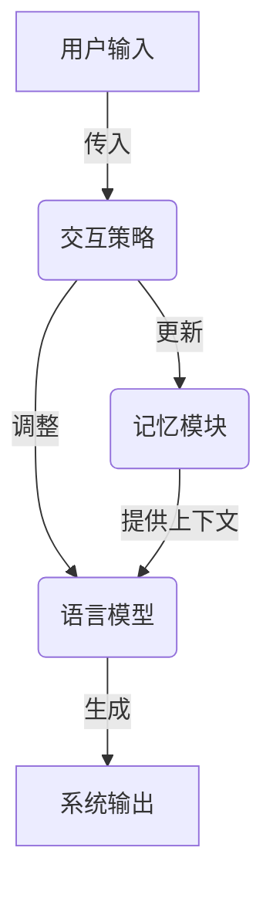
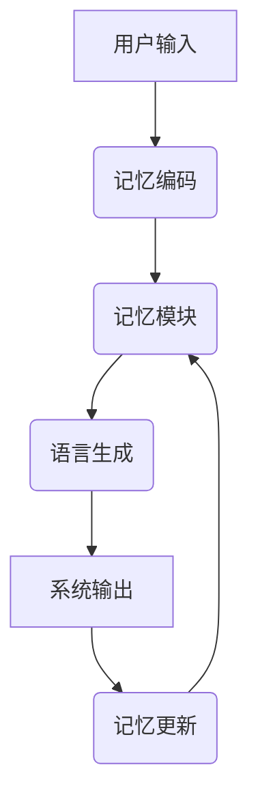

以下是《大语言模型原理与工程实践：动态交互》的正文内容：

# 大语言模型原理与工程实践：动态交互

## 1. 背景介绍

### 1.1 问题的由来

随着人工智能技术的不断发展,大型语言模型(Large Language Model, LLM)已经成为自然语言处理领域的关键技术之一。传统的语言模型通常基于n-gram统计或神经网络,但存在参数量有限、泛化能力较弱等缺陷。而大型语言模型通过预训练海量文本数据,学习丰富的语义和世界知识,能够生成高质量、多样化的自然语言内容,在机器翻译、对话系统、问答系统等领域展现出卓越的性能表现。

然而,现有的大型语言模型大多是静态的、单向的生成模型,缺乏与人类进行动态交互的能力。这种静态生成方式难以满足复杂场景下的语境理解和知识更新需求。因此,如何赋予大型语言模型动态交互的能力,成为当前研究的热点和挑战。

### 1.2 研究现状

目前,一些研究工作已经开始探索赋予大型语言模型动态交互能力的方法。例如,基于记忆增强的方法,通过外部记忆模块存储上下文信息,实现对话状态的跟踪和更新。另一种方法是引入知识库,将结构化知识与语言模型相结合,增强模型的知识理解和推理能力。

此外,一些工作尝试构建多模态语言模型,融合视觉、语音等多种模态信息,实现更丰富、自然的人机交互体验。但这些方法仍然存在一些局限性,如记忆容量和更新效率有限、知识库覆盖面不够全面、多模态融合的计算复杂度高等。

### 1.3 研究意义

赋予大型语言模型动态交互能力,不仅可以显著提升人机交互的自然性和智能水平,还能拓展语言模型在更多复杂场景下的应用前景。动态交互语言模型可应用于智能助手、客服机器人、教育辅导系统等领域,为用户提供个性化、高效的服务体验。

此外,动态交互语言模型还可以作为通用的人工智能基础架构,支持知识累积、推理决策等高级认知功能,为构建通用人工智能奠定基础。因此,研究动态交互语言模型原理与实现方法,具有重要的理论价值和应用前景。

### 1.4 本文结构

本文将系统介绍动态交互语言模型的原理、关键技术及工程实践。第2节阐述动态交互语言模型的核心概念及其与传统语言模型的区别;第3节详细解析动态交互语言模型的核心算法原理和具体实现步骤;第4节构建数学模型并推导公式,并通过案例分析加深理解;第5节提供完整的代码实现示例及解读;第6节列举动态交互语言模型在实际场景中的应用;第7节推荐相关学习资源和开发工具;第8节总结研究成果并展望未来发展趋势和面临的挑战;最后附录列出常见问题解答,以帮助读者更好地理解和掌握动态交互语言模型。

## 2. 核心概念与联系

动态交互语言模型(Dynamic Interactive Language Model, DILM)是一种新型的语言生成模型,它不仅能够生成高质量的自然语言内容,还能够根据用户的反馈动态调整生成策略,实现与用户的自然交互。

动态交互语言模型的核心思想是将传统的静态语言模型扩展为一个具有记忆和更新能力的动态系统。该系统由三个主要组件构成:

1. **语言模型(Language Model)**:基于深度学习的语言生成模型,负责根据上下文生成自然语言响应。

2. **记忆模块(Memory Module)**:用于存储交互过程中的上下文信息、知识库数据等,支持对话状态的跟踪和更新。

3. **交互策略(Interactive Strategy)**:根据用户反馈调整语言模型和记忆模块的状态,实现动态生成和记忆更新。

与传统的静态语言模型相比,动态交互语言模型具有以下优势:

1. **上下文理解能力更强**:通过记忆模块存储上下文信息,模型能够更好地理解对话语境。

2. **知识更新能力**:模型可以根据新的输入动态更新记忆模块中的知识库,实现持续学习。

3. **生成策略动态调整**:根据用户反馈,模型可以动态调整生成策略,提高响应的适当性和自然度。

4. **支持多轮交互**:模型能够跟踪对话状态,支持多轮交互和任务型对话。

动态交互语言模型为人机交互系统带来了全新的能力和体验,是实现通用人工智能的重要基础。

## 3. 核心算法原理与具体操作步骤

### 3.1 算法原理概述

动态交互语言模型的核心算法原理可以概括为以下三个主要步骤:

1. **记忆编码(Memory Encoding)**:将当前对话的上下文信息(如之前的utterance、知识库数据等)编码为记忆向量,存储在记忆模块中。

2. **语言生成(Language Generation)**:基于当前的记忆状态,语言模型生成自然语言响应。

3. **记忆更新(Memory Updating)**:根据用户的反馈(如续话、纠正等),更新记忆模块中的状态向量。

在具体实现中,这三个步骤通常是交替进行的,形成一个闭环的动态交互过程。其中记忆编码和更新模块负责管理对话状态,而语言生成模块则负责生成高质量的自然语言响应。

接下来,我们将详细介绍每个步骤的算法原理和实现细节。

### 3.2 算法步骤详解

#### 3.2.1 记忆编码

记忆编码的目标是将当前对话的上下文信息编码为一个固定维度的记忆向量,并存储在记忆模块中。常用的编码方法包括:

1. **序列编码(Sequence Encoding)**:使用Transformer等序列模型,将utterance序列编码为一个向量。

2. **知识库编码(Knowledge Encoding)**:将相关的知识库数据(如三元组、文本等)编码为向量。

3. **融合编码(Fusion Encoding)**:将上述两种编码方式融合,获得最终的记忆向量表示。

具体来说,给定当前utterance序列$X=\{x_1, x_2, \ldots, x_n\}$和相关知识库数据$K$,我们可以使用编码器模型(如BERT、RoBERTa等)分别对它们进行编码:

$$\boldsymbol{h}_X = \textrm{Encoder}_X(X)$$
$$\boldsymbol{h}_K = \textrm{Encoder}_K(K)$$

然后,通过融合函数$f$将两个向量融合为最终的记忆向量$\boldsymbol{m}$:

$$\boldsymbol{m} = f(\boldsymbol{h}_X, \boldsymbol{h}_K)$$

其中,$f$可以是简单的拼接或加权求和,也可以是更复杂的融合网络。最终的记忆向量$\boldsymbol{m}$被存储在记忆模块中,为后续的语言生成和记忆更新提供上下文信息。

#### 3.2.2 语言生成

语言生成模块的目标是根据当前的记忆状态,生成自然、流畅、与上下文相关的语言响应。常用的生成模型包括:

1. **Transformer解码器(Transformer Decoder)**:使用Transformer解码器模型,将记忆向量作为额外的上下文输入。

2. **Seq2Seq模型(Sequence-to-Sequence Model)**:将记忆向量与utterance序列拼接,输入到Seq2Seq模型中生成响应。

3. **前馈神经网络(Feed-Forward Network)**:使用前馈神经网络将记忆向量映射为词序列。

以Transformer解码器为例,给定当前的记忆向量$\boldsymbol{m}$,我们希望生成一个tokens序列$Y=\{y_1, y_2, \ldots, y_m\}$作为响应。解码器模型将$\boldsymbol{m}$作为额外的上下文输入,对每个目标token $y_t$的生成概率进行建模:

$$P(y_t | y_{<t}, \boldsymbol{m}) = \textrm{Decoder}(y_{<t}, \boldsymbol{m})$$

通过贪婪搜索或beam search等解码策略,我们可以生成最终的tokens序列作为模型的输出响应。

#### 3.2.3 记忆更新

记忆更新的目标是根据用户的反馈(如续话、纠正等),动态调整记忆模块中的状态向量,使其能够更好地表示当前对话的上下文信息。常用的更新方法包括:

1. **梯度更新(Gradient Updating)**:将用户反馈作为监督信号,通过反向传播调整记忆向量。

2. **注意力更新(Attention Updating)**:使用注意力机制,动态调整记忆向量中不同部分的权重。

3. **门控更新(Gated Updating)**:使用门控循环单元(如GRU、LSTM),递归地更新记忆向量。

以梯度更新为例,假设我们将用户的反馈utterance $X'$编码为向量$\boldsymbol{h}_{X'}$,目标是使用$\boldsymbol{h}_{X'}$来更新当前的记忆向量$\boldsymbol{m}$。我们可以定义一个更新函数$g$:

$$\boldsymbol{m}' = g(\boldsymbol{m}, \boldsymbol{h}_{X'})$$

其中,$g$可以是一个前馈神经网络或其他可微分函数。然后,我们将$\boldsymbol{m}'$输入到语言生成模块,生成新的响应$Y'$。根据$Y'$与真实响应之间的损失,我们可以通过反向传播的方式,对$g$的参数进行优化,从而获得更新后的记忆向量$\boldsymbol{m}'$。

通过上述三个步骤的交替执行,动态交互语言模型可以持续地更新记忆状态,并生成与当前对话上下文相关的自然语言响应,实现高效、自然的人机交互。

### 3.3 算法优缺点

动态交互语言模型相比于传统的静态语言模型,具有以下优点:

1. **上下文理解能力强**:通过记忆模块存储对话历史,模型能够更好地理解当前的语境。

2. **知识更新能力**:模型可以动态地更新记忆模块中的知识,实现持续学习。

3. **生成策略动态调整**:根据用户反馈,模型可以动态调整生成策略,提高响应质量。

4. **支持多轮交互**:模型能够跟踪对话状态,支持多轮任务型对话。

5. **泛化能力强**:预训练的语言模型具有强大的泛化能力,可以应对多种场景。

然而,动态交互语言模型也存在一些缺点和挑战:

1. **训练数据需求高**:需要大量的人机对话数据用于模型训练,获取高质量对话数据较为困难。

2. **记忆容量和更新效率**:如何高效地存储和更新大量的对话状态信息,是一个值得关注的问题。

3. **一致性和鲁棒性**:模型需要保证在长时间的交互过程中,输出的响应具有一致性和鲁棒性。

4. **知识质量和覆盖面**:如何获取高质量、全面的知识库数据,并与语言模型高效融合,也是一个挑战。

5. **可解释性和可控性**:动态交互语言模型的内部机理较为复杂,提高其可解释性和可控性也是一个重要方向。

### 