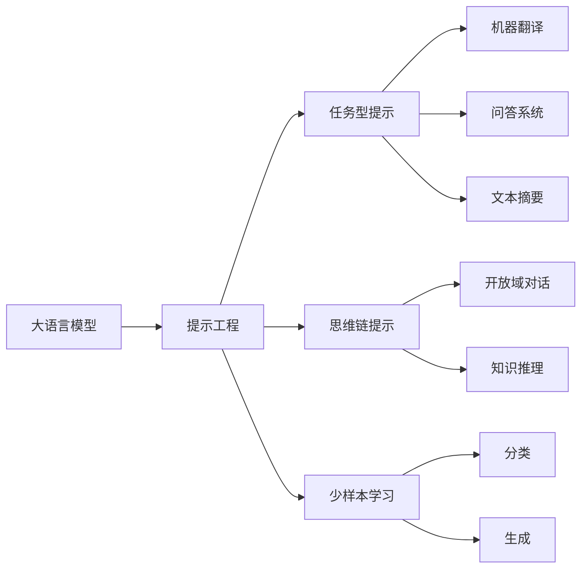

# 大语言模型原理与工程实践：大语言模型为什么需要提示工程

关键词：大语言模型、提示工程、自然语言处理、人工智能、深度学习

## 1. 背景介绍

### 1.1 问题的由来

近年来,随着深度学习技术的快速发展,大语言模型(Large Language Model,LLM)在自然语言处理(Natural Language Processing,NLP)领域取得了突破性进展。大语言模型能够从海量文本数据中学习语言知识和模式,生成流畅自然的文本,在机器翻译、问答系统、文本摘要等任务上表现出色。然而,大语言模型的训练和应用过程中仍面临诸多挑战,其中一个关键问题就是如何有效地引导模型生成符合特定需求的高质量文本。这就需要提示工程(Prompt Engineering)来帮助大语言模型更好地理解任务需求并控制输出结果。

### 1.2 研究现状

目前,学术界和工业界都在积极探索提示工程技术,以提升大语言模型的可用性和适用性。微软、谷歌、OpenAI等科技巨头纷纷推出了自己的大语言模型和相关开发平台,同时也在研究提示工程方法。一些研究者提出了任务型提示[1]、思维链提示[2]、少样本学习[3]等技术,用于指导模型完成特定任务。但总的来说,提示工程仍处于起步阶段,缺乏系统性的理论框架和工程实践指导。

### 1.3 研究意义 

深入研究大语言模型的提示工程,对于推动自然语言处理技术发展和拓展其应用领域具有重要意义:

1. 提高大语言模型的可用性,降低使用门槛,让更多非专业人士能够方便地使用大模型的能力。
2. 提升大语言模型执行任务的精准度和效率,减少试错成本,加速开发进度。
3. 扩大大语言模型的应用场景,促进其在更多领域发挥价值,如智能客服、内容创作、医疗健康等。
4. 探索自然语言理解和认知智能的奥秘,为通用人工智能的实现积累理论和技术基础。

### 1.4 本文结构

本文将系统阐述大语言模型提示工程的原理和实践,主要内容安排如下:

第2部分介绍大语言模型和提示工程的核心概念。第3部分详细讲解提示工程的算法原理和操作步骤。第4部分建立提示工程的数学模型并给出公式推导和案例分析。第5部分通过代码实例演示提示工程的项目实践。第6部分分析提示工程的应用场景和前景展望。第7部分推荐提示工程的学习资源和工具。第8部分总结全文,展望未来发展趋势和挑战。第9部分列举常见问题解答。

## 2. 核心概念与联系

大语言模型是以自然语言为建模对象,利用深度神经网络从海量文本语料中学习语言知识和生成规律的模型。其显著特点是参数量巨大(数十亿到上万亿),训练语料丰富(TB到PB级),能够生成流畅自然的文本。代表模型有GPT系列[4]、BERT系列[5]、XLNet[6]、ERNIE[7]等。

提示工程是一系列用于优化大语言模型输入和输出的技术方法,目的是引导模型按照人类意图生成高质量的目标文本。其核心思想是通过设计精巧的提示模板,将任务需求、上下文信息、格式要求等编码到输入文本中,启发模型进行推理和生成。

提示工程与大语言模型紧密相关又相对独立。一方面,提示工程是大语言模型应用过程中不可或缺的关键环节,直接影响模型的使用效果。另一方面,提示工程不局限于特定的模型结构,而是一种通用的范式,可用于优化各类生成式语言模型。二者的关系如下图所示:



## 3. 核心算法原理 & 具体操作步骤

### 3.1 算法原理概述

提示工程的核心是提示(Prompt),即输入给语言模型的一段启发性文本。提示的形式可以是自然语言句子、关键词、模板等。模型根据提示中蕴含的信息,在其语言知识的基础上进行文本生成。

形式化地,令 $P$ 表示提示, $C$ 表示上下文, $X$ 表示生成结果, $\theta$ 表示语言模型参数,则生成过程可描述为:

$$X = \arg\max_X P(X|P,C,\theta)$$

即在给定提示和上下文下,搜索可能性最大的生成结果。

### 3.2 算法步骤详解

提示工程的一般步骤如下:

1. 明确任务目标,分析输入和输出要求。
2. 收集和标注少量样本数据,揭示任务的语言模式。 
3. 设计提示模板,将任务信息编码为自然语言形式。
4. 将提示与输入拼接,喂入预训练好的语言模型。
5. 调节模型超参数,如温度系数、Beam Search宽度等。
6. 评估生成结果,分析可优化的地方,迭代步骤3-5。

以下是一个问答任务的样例:

提示模板:
```
问题:{}

答案:
```

输入文本:
```
地球到太阳的距离大约是多少?
```

拼接结果:
```
问题:地球到太阳的距离大约是多少?

答案:
```

生成结果:
```
地球到太阳的平均距离约为1.496亿公里(约9300万英里),这个距离也被称为1个天文单位(astronomical unit,AU)。

由于地球绕太阳公转的轨道是椭圆形的,因此地球与太阳之间的距离并不是恒定不变的,而是在一年中有所变化:
- 近日点(perihelion):1月初,地球距太阳最近,约1.47亿公里。
- 远日点(aphelion):7月初,地球距太阳最远,约1.52亿公里。

地球与太阳的距离是宇宙尺度的一个基本单位,也是研究太阳系天体运动规律的重要参数。
```

### 3.3 算法优缺点

提示工程的优点:
1. 可以显著提升语言模型执行任务的效果,尤其是小样本和零样本场景。
2. 可以引导模型进行可控、可解释的生成,提高结果的可读性和可用性。
3. 可以将复杂任务分解为简单的语言交互,降低使用门槛。

提示工程的缺点:
1. 对提示的设计和调优要求较高,需要一定的经验和技巧。
2. 提示的泛化能力有限,过拟合特定样本的风险较大。
3. 对语言模型的质量依赖较强,需要在海量高质量语料上进行预训练。

### 3.4 算法应用领域

提示工程可应用于自然语言处理的各个任务,目前已有的研究领域包括:

1. 机器翻译:将不同语言的句对作为样本,设计翻译提示模板。
2. 问答系统:将问题-答案对作为样本,设计问答提示模板。
3. 文本摘要:将文章-摘要对作为样本,设计摘要提示模板。
4. 开放域对话:将多轮对话历史作为上下文,设计对话提示模板。
5. 数据增强:用提示生成的样本数据对模型进行持续预训练。

未来,提示工程有望进一步拓展到更广阔的人工智能应用场景。

## 4. 数学模型和公式 & 详细讲解 & 举例说明

### 4.1 数学模型构建

大语言模型的数学基础是统计语言模型,其目标是学习文本序列的概率分布。给定文本序列 $X=(x_1,\cdots,x_T)$,语言模型的似然概率可分解为:

$$P(X)=\prod_{t=1}^T P(x_t|x_{<t})$$

其中 $x_t$ 为第 $t$ 个词, $x_{<t}$ 为之前的词序列。大语言模型用神经网络来参数化条件概率 $P(x_t|x_{<t})$。

引入提示 $P$ 后,优化目标变为最大化如下条件似然:

$$\mathcal{L}(\theta)=\sum_{i=1}^N \log P(X^{(i)}|P^{(i)},\theta)$$

其中 $N$ 为训练样本数, $X^{(i)},P^{(i)}$ 为第 $i$ 个样本的文本和提示。

### 4.2 公式推导过程

以Transformer[8]结构的GPT模型为例,详细推导提示学习的前向计算和梯度更新公式。

首先,将提示 $P$ 编码为嵌入向量序列 $H_P\in \mathbb{R}^{L_P\times D}$,其中 $L_P$ 为提示长度, $D$ 为嵌入维度。同理,也将文本 $X$ 编码为 $H_X\in \mathbb{R}^{L_X\times D}$。

然后,将提示和文本的嵌入向量拼接为 $H_{PX}\in \mathbb{R}^{(L_P+L_X)\times D}$,作为Transformer的输入。Transformer的第 $l$ 层计算如下:

$$\begin{aligned}
Q^l,K^l,V^l &= H^{l-1}W_Q^l,H^{l-1}W_K^l,H^{l-1}W_V^l \\
A^l &= \text{softmax}(\frac{Q^l(K^l)^T}{\sqrt{D}})V^l \\
H^l &= \text{LayerNorm}(A^l+\text{FFN}(A^l))
\end{aligned}$$

其中 $W_Q^l,W_K^l,W_V^l$ 为注意力机制的投影矩阵, $\text{FFN}$ 为前馈网络。

最后,基于Transformer的顶层输出 $H^L$,计算文本的条件概率:

$$P(x_t|x_{<t},P)=\text{softmax}(H^L_t W_E+b)$$

其中 $W_E,b$ 为输出嵌入矩阵和偏置项。

模型的参数 $\theta$ 包括Transformer各层的权重矩阵以及词嵌入矩阵。给定训练样本 $\{(P^{(i)},X^{(i)})\}_{i=1}^N$,通过随机梯度下降法最小化负对数似然损失:

$$\mathcal{L}(\theta)=-\sum_{i=1}^N \sum_{t=1}^{L_X} \log P(x_t^{(i)}|x_{<t}^{(i)},P^{(i)},\theta)$$

参数 $\theta$ 的梯度为:

$$\nabla_\theta \mathcal{L}=\sum_{i=1}^N \sum_{t=1}^{L_X} \nabla_\theta \log P(x_t^{(i)}|x_{<t}^{(i)},P^{(i)},\theta)$$

### 4.3 案例分析与讲解

下面以一个情感分类任务为例,说明提示学习的具体过程。

假设我们有5个样本,每个样本包含一段文本和对应的情感标签(正面/负面):

```
1. 这部电影很好看,演员演技在线,剧情也很吸引人。 [正面]
2. 手机质量不错,性价比很高,值得购买。 [正面]
3. 这家餐厅的服务态度太差了,味道也不怎么样,再也不会光顾了。 [负面]
4. 产品收到了,和描述不符,质量也不行,很失望。 [负面]
5. 环境不错,气氛很好,适合朋友聚会,下次还会来。 [正面]
```

我们设计如下两种提示模板:

```
模板1: 文本:{}。这段文本的情感是[{}]。
模板2: 请判断以下文本的情感倾向:
文