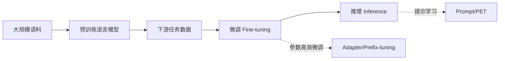

# 大语言模型原理与工程实践：大语言模型的微调和推理策略

关键词：大语言模型、微调、推理策略、预训练模型、自然语言处理

## 1. 背景介绍
### 1.1 问题的由来
近年来,随着深度学习技术的飞速发展,自然语言处理(NLP)领域取得了突破性的进展。其中,预训练语言模型(Pre-trained Language Models,PLMs)作为一种强大的语言表征学习范式,在多个NLP任务上取得了显著的性能提升。然而,如何有效地利用预训练语言模型进行下游任务的微调和推理,仍然是一个亟待解决的问题。

### 1.2 研究现状
目前,业界主流的做法是在特定领域数据上对预训练语言模型进行微调(Fine-tuning),以适应不同任务的需求。但是,这种做法存在一些局限性:
1. 微调过程需要大量的计算资源和时间成本。
2. 微调后的模型难以迁移到其他任务上。
3. 在低资源场景下,微调的效果往往不够理想。

因此,如何设计更加高效、灵活的微调和推理策略,成为了大语言模型落地应用的关键。

### 1.3 研究意义
探索大语言模型的微调和推理策略,具有重要的理论意义和实践价值:
1. 有助于提升大语言模型在下游任务中的性能表现。
2. 可以降低计算资源消耗,加速模型开发和迭代。
3. 为构建更加通用、鲁棒的NLP系统提供了新的思路。

### 1.4 本文结构
本文将围绕大语言模型的微调和推理策略展开深入探讨。内容安排如下:
- 第2部分介绍大语言模型微调和推理的核心概念。
- 第3部分重点阐述主流的微调和推理算法原理。
- 第4部分从数学角度对相关模型和公式进行详细推导。
- 第5部分通过代码实例演示微调和推理的具体实现。
- 第6部分总结大语言模型在实际应用场景中的案例。
- 第7部分推荐相关的学习资源、开发工具和文献。
- 第8部分对全文进行总结,并展望未来研究方向。
- 第9部分列举常见问题,并给出专业解答。

## 2. 核心概念与联系
在探讨大语言模型的微调和推理策略之前,我们有必要厘清一些核心概念:
- 大语言模型:以自监督学习方式在大规模无标注文本语料上预训练得到的语言模型,如BERT、GPT等。
- 微调:利用下游任务的标注数据,对预训练模型的参数进行二次训练,使其适应特定任务。
- 推理:利用微调后的模型对新样本进行预测,输出所需的结果。
- 参数高效微调:在微调阶段只更新部分参数,从而降低计算开销。代表方法有Adapter、Prefix-tuning等。 
- 提示学习:通过设计离散或连续的文本提示,引导语言模型进行特定任务的推理。代表方法有Prompt、PET等。

这些概念之间有着紧密的联系。下图展示了它们在大语言模型应用流程中的位置:



## 3. 核心算法原理 & 具体操作步骤
### 3.1 算法原理概述
大语言模型的微调和推理涉及多种算法,主要可分为以下三类:
1. 基于参数的微调方法:通过更新预训练模型的部分或全部参数,使其适应下游任务。
2. 基于提示的推理方法:通过设计输入文本的提示模板,引导模型进行特定任务的推理。
3. 基于Adapter的参数高效微调方法:在预训练模型中插入额外的Adapter模块,只训练Adapter参数。

### 3.2 算法步骤详解
#### 3.2.1 基于参数的微调
1. 在预训练模型的基础上,根据任务需求调整输入输出层。
2. 利用下游任务的标注数据,采用梯度下降等优化算法更新模型参数。
3. 进行推理时,利用微调后的模型对新样本进行预测。

#### 3.2.2 基于提示的推理
1. 将下游任务转化为语言建模任务,设计输入文本的提示模板。
2. 将提示文本与样本拼接,输入预训练模型。
3. 基于语言模型的输出概率,对不同标签进行打分,选择得分最高的作为预测结果。

#### 3.2.3 基于Adapter的参数高效微调
1. 在预训练模型的每个Transformer块中,插入Adapter模块。
2. 在微调阶段,冻结预训练模型参数,只更新Adapter模块参数。
3. 进行推理时,利用微调后的Adapter模型对新样本进行预测。

### 3.3 算法优缺点
- 基于参数微调的优点是效果好,但需要更多计算资源,并且不同任务间难以迁移。
- 基于提示推理的优点是可以不用微调,直接利用预训练模型进行推理,但对提示工程要求较高。
- 基于Adapter微调的优点是参数高效,不同任务间可以方便地迁移和组合,但效果可能不如全参数微调。

### 3.4 算法应用领域
大语言模型的微调和推理策略在NLP的各个领域都有广泛应用,如:
- 文本分类:情感分析、新闻分类等
- 序列标注:命名实体识别、词性标注等
- 阅读理解:问答、文本蕴含等
- 文本生成:摘要、对话、机器翻译等

## 4. 数学模型和公式 & 详细讲解 & 举例说明
### 4.1 数学模型构建
我们以基于参数的微调为例,介绍大语言模型微调的数学模型。设预训练模型为 $\mathcal{M}$,其参数为 $\theta$。给定下游任务的训练集 $\mathcal{D}=\{(x_i,y_i)\}_{i=1}^N$,其中 $x_i$ 为输入文本,$y_i$ 为对应标签。微调的目标是找到最优参数 $\theta^*$,使得模型在训练集上的损失最小:

$$
\theta^* = \arg\min_\theta \frac{1}{N} \sum_{i=1}^N \mathcal{L}(\mathcal{M}(x_i;\theta), y_i)
$$

其中, $\mathcal{L}$ 为损失函数,如交叉熵损失:

$$
\mathcal{L}(\mathcal{M}(x_i;\theta), y_i) = -\sum_{j=1}^C y_{ij} \log p(y_{ij}|x_i;\theta)
$$

$C$ 为标签类别数, $y_{ij}$ 为样本 $x_i$ 的真实标签的one-hot向量表示, $p(y_{ij}|x_i;\theta)$ 为模型预测样本 $x_i$ 属于类别 $j$ 的概率。

### 4.2 公式推导过程
求解最优参数 $\theta^*$ 的过程,就是最小化损失函数 $\mathcal{L}$ 的过程。常用的优化算法有随机梯度下降(SGD):

$$
\theta \leftarrow \theta - \eta \nabla_\theta \mathcal{L}(\mathcal{M}(x_i;\theta), y_i)
$$

其中, $\eta$ 为学习率, $\nabla_\theta$ 为损失函数对参数 $\theta$ 的梯度。

实际应用中,为了加速收敛和提高泛化性能,通常采用SGD的变种,如Adam、AdamW等。以Adam为例,其更新公式为:

$$
\begin{aligned}
m_t &\leftarrow \beta_1 m_{t-1} + (1-\beta_1) \nabla_\theta \mathcal{L}_t \\
v_t &\leftarrow \beta_2 v_{t-1} + (1-\beta_2) (\nabla_\theta \mathcal{L}_t)^2 \\
\hat{m}_t &\leftarrow m_t / (1-\beta_1^t) \\
\hat{v}_t &\leftarrow v_t / (1-\beta_2^t) \\
\theta_t &\leftarrow \theta_{t-1} - \eta \cdot \hat{m}_t / (\sqrt{\hat{v}_t}+\epsilon)
\end{aligned}
$$

其中, $m_t$ 和 $v_t$ 分别是梯度的一阶矩和二阶矩的指数加权平均, $\beta_1$ 和 $\beta_2$ 为衰减率, $\epsilon$ 为平滑项。

### 4.3 案例分析与讲解
我们以情感分类任务为例,展示如何利用BERT模型进行微调。设训练集为 $\mathcal{D}=\{(x_i,y_i)\}_{i=1}^N$,其中 $x_i$ 为评论文本, $y_i \in \{0,1\}$ 为情感标签(0表示负面,1表示正面)。微调步骤如下:

1. 在BERT模型的顶层添加一个线性分类器,将 $[CLS]$ 标记的表征映射到情感标签:

$$
p(y_i|x_i) = \mathrm{softmax}(W \cdot \mathrm{BERT}(x_i)_{[CLS]} + b)
$$

其中, $W$ 和 $b$ 为分类器的参数。

2. 计算交叉熵损失:

$$
\mathcal{L} = -\frac{1}{N} \sum_{i=1}^N [y_i \log p(y_i=1|x_i) + (1-y_i) \log p(y_i=0|x_i)]
$$

3. 利用Adam优化算法,更新BERT模型和分类器的参数,最小化损失函数。

4. 微调完成后,对新的评论文本 $x$ 进行推理:

$$
\hat{y} = \arg\max_{y \in \{0,1\}} p(y|x)
$$

其中, $\hat{y}$ 为预测的情感标签。

### 4.4 常见问题解答
Q: 微调大语言模型需要多大的数据量?
A: 这取决于任务的复杂度和模型的参数量。一般来说,数据量越大,微调效果越好。但在数据量有限的情况下,可以采用数据增强、半监督学习等技术来缓解过拟合问题。

Q: 微调时的超参数如何设置?
A: 常见的超参数包括学习率、批量大小、训练轮数等。学习率通常设置得比预训练阶段小,如1e-5至5e-5。批量大小根据显存限制而定,如16至64。训练轮数可以根据验证集性能来调整,如3至5轮。此外,还可以使用学习率衰减、梯度裁剪等技巧来优化训练过程。

## 5. 项目实践：代码实例和详细解释说明
### 5.1 开发环境搭建
首先,我们需要安装必要的软件包,包括PyTorch、Transformers等。可以使用pip命令进行安装:

```bash
pip install torch transformers datasets
```

### 5.2 源代码详细实现
以下是利用Hugging Face的Transformers库进行BERT微调的示例代码:

```python
from datasets import load_dataset
from transformers import BertTokenizer, BertForSequenceClassification, TrainingArguments, Trainer

# 加载IMDb情感分类数据集
imdb = load_dataset("imdb")

# 加载BERT分词器和模型
tokenizer = BertTokenizer.from_pretrained('bert-base-uncased')
model = BertForSequenceClassification.from_pretrained('bert-base-uncased', num_labels=2)

# 定义数据预处理函数
def preprocess_function(examples):
    return tokenizer(examples["text"], truncation=True, padding=True)

# 对数据集应用预处理函数
tokenized_imdb = imdb.map(preprocess_function, batched=True)

# 定义训练参数
training_args = TrainingArguments(
    output_dir='./results',
    num_train_epochs=3,
    per_device_train_batch_size=16,
    per_device_eval_batch_size=64,
    warmup_steps=500,
    weight_decay=0.01,
    logging_dir='./logs',
    logging_steps=10,
)

# 定