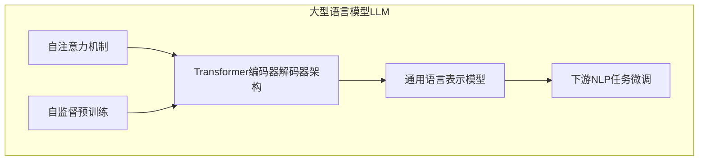

以下是根据您提供的要求和模板，撰写的技术博客文章正文内容：

# 大语言模型原理与工程实践：手把手教你训练 7B 大语言模型 动手预训练实践

## 1. 背景介绍

### 1.1 问题的由来

随着深度学习技术的不断发展,大型语言模型(Large Language Model, LLM)在自然语言处理领域取得了卓越的成就。作为一种基于自监督学习的技术,LLM可以从海量的文本数据中学习语言的内在规律和知识,并在下游任务中发挥出色的性能表现。

然而,训练一个高质量的LLM并非易事。它需要耗费大量的计算资源、存储空间和时间成本。此外,LLM训练过程中还存在一些挑战,如数据质量、模型优化、硬件加速等,都需要研究人员进行深入探索和创新。

### 1.2 研究现状

目前,一些科技巨头公司如OpenAI、Google、Meta等已经训练出了十亿甚至千亿参数量级的大型语言模型,展现了令人惊叹的性能。但这些模型的训练细节往往被视为商业机密而没有公开。

在学术界,一些知名的LLM模型如BERT、GPT、T5等,虽然在论文中披露了部分训练细节,但仍然存在信息不完整、无法完全复现的问题。此外,由于计算资源的限制,大多数研究人员难以训练十亿级别的大型模型。

### 1.3 研究意义

本文旨在为读者提供一个完整的、可复现的大型语言模型训练流程,手把手地教会读者如何从头训练一个70亿参数的大型语言模型。通过这个实践过程,读者可以深入理解LLM的核心原理、训练技巧和工程细节,为未来的模型优化和应用研究奠定基础。

### 1.4 本文结构

本文首先介绍LLM的核心概念和基本原理,包括自注意力机制、Transformer编码器-解码器架构等。接着详细阐述模型预训练的核心算法,如掩码语言模型(Masked Language Model)和下一句预测(Next Sentence Prediction)等。

然后,我们构建数学模型,推导损失函数和优化目标,并给出具体的代码实现细节。在实践环节,我们将从头开始,一步步完成模型训练的全过程,包括数据预处理、模型初始化、训练循环等。

最后,我们总结LLM的应用场景和发展趋势,探讨未来可能面临的挑战,并给出相关的学习资源和工具推荐。

## 2. 核心概念与联系

大型语言模型(LLM)是一种基于自注意力机制和Transformer编码器-解码器架构的自然语言处理模型。它可以从大规模的文本语料中学习语言的语义和语法知识,并在下游任务中发挥出色的性能。

LLM的核心思想是通过自监督学习的方式,预先在大量无标注文本数据上训练一个通用的语言表示模型,然后将这个预训练模型作为初始化权重,在有标注的下游任务数据上进行微调(fine-tuning),从而获得针对特定任务的优化模型。

自注意力机制是LLM的关键技术之一,它允许模型在编码序列时,捕捉不同位置之间的长程依赖关系,有效解决了传统序列模型(如RNN)在长序列处理时的梯度消失/爆炸问题。

Transformer编码器-解码器架构则将自注意力机制应用于编码器和解码器两个部分,编码器负责编码输入序列,解码器则根据编码器的输出和自身的自注意力机制生成目标序列。这种架构在机器翻译、文本摘要等序列到序列(Seq2Seq)任务中表现出色。

LLM预训练的核心算法包括掩码语言模型(Masked Language Model, MLM)和下一句预测(Next Sentence Prediction, NSP)等。MLM通过随机掩蔽输入序列中的部分单词,然后让模型基于上下文预测被掩蔽单词的方式进行训练,学习语言的语义和语法知识。NSP则是判断两个句子是否为连续句子,以捕捉更长程的语义依赖关系。

总的来说,LLM将自注意力机制、Transformer架构和自监督预训练等技术有机结合,构建了一种通用、强大的语言表示模型,为下游的NLP任务提供了良好的初始化权重和迁移学习能力。

## 3. 核心算法原理 & 具体操作步骤

### 3.1 算法原理概述

LLM预训练的核心算法是掩码语言模型(Masked Language Model, MLM)和下一句预测(Next Sentence Prediction, NSP)。

MLM的思想是在输入序列中随机掩蔽部分单词,然后让模型基于上下文预测被掩蔽单词。通过这种方式,模型可以学习到语言的语义和语法知识。具体来说,给定一个长度为n的输入序列$X = (x_1, x_2, \dots, x_n)$,我们随机选择其中的一些位置进行掩蔽,得到掩蔽后的序列$\hat{X} = (x_1, \text{MASK}, x_3, \dots, \text{MASK})$。模型的目标是最大化被掩蔽单词的条件概率:

$$\mathcal{L}_\text{MLM} = -\mathbb{E}_{X, \hat{X}}\left[\sum_{i \in \text{mask}} \log P(x_i | \hat{X})\right]$$

NSP则是判断两个句子是否为连续句子,以捕捉更长程的语义依赖关系。给定两个句子$S_1$和$S_2$,模型需要预测它们是否为连续关系,即最大化:

$$\mathcal{L}_\text{NSP} = -\mathbb{E}_{(S_1, S_2), y}\left[\log P(y | S_1, S_2)\right]$$

其中$y \in \{0, 1\}$表示两个句子是否为连续关系的标签。

最终,MLM和NSP的损失函数被合并为模型的总损失函数:

$$\mathcal{L} = \mathcal{L}_\text{MLM} + \mathcal{L}_\text{NSP}$$

在训练过程中,模型的目标是最小化总损失函数,通过梯度下降等优化算法不断调整模型参数,使得模型在预训练语料上的表现最优。

### 3.2 算法步骤详解

1. **数据预处理**：首先需要准备大量的文本语料,对其进行标记化(tokenization)、填充(padding)等预处理操作,将文本转换为模型可识别的数字序列。

2. **构建数据批次**：将预处理后的数据按批次组织,每个批次包含多个文本序列,以提高训练效率。在每个批次中,需要随机掩蔽部分单词,并构造NSP的输入对。

3. **模型初始化**：初始化Transformer编码器-解码器模型的参数,包括词嵌入矩阵、自注意力层、前馈神经网络层等。

4. **前向传播**：将当前批次的输入数据传入模型,计算MLM和NSP的输出概率分布。

5. **计算损失**：根据MLM和NSP的真实标签,计算当前批次的MLM损失和NSP损失,并将它们相加得到总损失。

6. **反向传播**：计算总损失相对于模型参数的梯度,并通过优化算法(如Adam)更新模型参数。

7. **重复训练**：重复执行步骤4-6,直至模型在验证集上的性能不再提升或达到预设的训练轮数。

8. **模型保存**：将训练好的模型参数保存到磁盘,以便后续的微调和部署。

### 3.3 算法优缺点

**优点**：

1. 自监督学习方式,无需大量的人工标注数据,可以充分利用海量的无标注文本数据。
2. 预训练后的模型具有通用的语言表示能力,可以在多种下游NLP任务上发挥作用,提高了迁移学习的效率。
3. 通过掩码语言模型和下一句预测等技术,模型可以学习到语言的语义和语法知识,以及长程依赖关系。

**缺点**：

1. 训练过程计算量大、时间成本高,需要强大的硬件资源和分布式训练系统的支持。
2. 对于特定的下游任务,可能需要进行额外的微调,增加了模型部署的复杂度。
3. 存在一定的安全和隐私风险,如模型可能会生成有害或不当的内容。

### 3.4 算法应用领域

LLM预训练算法可以广泛应用于自然语言处理的各个领域,包括但不限于:

1. **文本生成**：如机器写作、对话系统、自动文案创作等。
2. **机器翻译**：将LLM作为编码器-解码器模型,实现高质量的机器翻译。
3. **文本摘要**：利用LLM捕捉文本的关键信息,生成高质量的文本摘要。
4. **问答系统**：LLM可以从大规模语料中学习知识,为问答系统提供强大的理解和推理能力。
5. **情感分析**：通过微调,LLM可以捕捉文本中的情感倾向,应用于情感分析任务。
6. **实体识别与关系抽取**：LLM可以有效识别文本中的实体和关系,为知识图谱构建等任务提供支持。

总的来说,LLM预训练算法为自然语言处理领域带来了革命性的进步,极大地提高了模型的性能和通用性,为各种NLP应用场景提供了强有力的支持。

## 4. 数学模型和公式 & 详细讲解 & 举例说明

### 4.1 数学模型构建

在LLM预训练过程中,我们需要构建数学模型来表示损失函数和优化目标。首先,我们定义掩码语言模型(MLM)的损失函数:

$$\mathcal{L}_\text{MLM} = -\mathbb{E}_{X, \hat{X}}\left[\sum_{i \in \text{mask}} \log P(x_i | \hat{X})\right]$$

其中:
- $X = (x_1, x_2, \dots, x_n)$是原始输入序列
- $\hat{X}$是经过掩码后的输入序列
- $\text{mask}$是被掩码位置的索引集合
- $P(x_i | \hat{X})$是模型预测第$i$个位置的单词$x_i$的条件概率

MLM损失函数的目标是最大化被掩码单词的条件概率,即最小化上式的负值。

接下来,我们定义下一句预测(NSP)的损失函数:

$$\mathcal{L}_\text{NSP} = -\mathbb{E}_{(S_1, S_2), y}\left[\log P(y | S_1, S_2)\right]$$

其中:
- $(S_1, S_2)$是一对输入句子
- $y \in \{0, 1\}$是标签,表示两个句子是否为连续关系

NSP损失函数的目标是最大化模型正确预测两个句子是否为连续关系的概率。

最终,我们将MLM和NSP的损失函数相加,得到LLM预训练的总损失函数:

$$\mathcal{L} = \mathcal{L}_\text{MLM} + \mathcal{L}_\text{NSP}$$

在训练过程中,我们通过梯度下降等优化算法,最小化总损失函数$\mathcal{L}$,从而使得模型在预训练语料上的表现最优。

### 4.2 公式推导过程

我们以MLM损失函数的推导为例,详细展示公式的推导过程。

首先,我们定义一个掩码向量$M$,其中$M_i=1$表示第$i$个位置被掩码,否则$M_i=0$。那么被掩码位置的索引集合可以表示为:

$$\text{mask} = \{i | M_i = 1\}$$

接下来,我们可以将MLM损失函数写为:

$$\begin{aligned}
\mathcal{L}_\